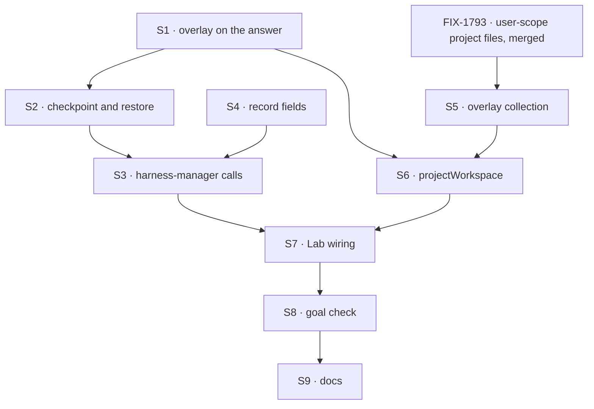

# FIX-1766 · Plan

[Spec](SPEC.md) · [Decisions](DECISIONS.md) · [Rules](BUSINESS-RULES.md) · **Plan** · [Docs](DOCS.md) · [Evolution](EVOLUTION.md)

Written for the implementing agent. IDs cross-reference [BUSINESS-RULES.md](BUSINESS-RULES.md)
(BR-n) and [DECISIONS.md](DECISIONS.md) (Dn, Q1). `tdd`. Four PRs. Slice 2 of the design in
[FIX-1762's EVOLUTION.md](../FIX-1762/EVOLUTION.md): fills the `checkpoint` and `restore` seams
FIX-1762 shipped as no-ops. One hold schedule: at the end of each attempt, Q1's recommendation.
The state words are [BUSINESS-RULES.md → The three state vocabularies](BUSINESS-RULES.md#the-three-state-vocabularies);
use them exactly.

## Surfaces

| ID | Package · role | Change | Rules |
|---|---|---|---|
| S1 | `workspace` · run source | Repo answers gain an optional `overlay: RunFiles` beside `files`, with the same `projectId` as key prefix. No `overlay`, no hold | BR-10 BR-12 BR-13 |
| S2 | `workspace` · checkpoint and restore | One feature of the local host, in this order: | BR-1–BR-7 BR-11 BR-15–BR-23 |
| | | **a · dirty-paths place.** A `Place` over a checkout whose `list` is git's dirty set (`--no-optional-locks status -z`, untracked not ignored), plus tombstones and one bundle path. Every listed path is `lstat`ed first; one over 10 MB, or a submodule, is reported as skipped and never read, so a 500 MB dirty file never enters memory. Binary content encoded so the utf-8 projection carries it byte for byte | BR-1–BR-5 |
| | | **b · `projection.adopt()`**, beside `hydrate`, `flush` and `put`: record the mounts' current collection entries as the baseline without writing anything to the place. A new process holding a live checkout calls it before its first hold, so that hold writes only what changed since the last one (O(changes), not every held row) and reads no row as someone else's | BR-2 BR-16 |
| | | **c · `checkpoint(place)`.** Flush (a) through a scoped mount of `overlay` at `<projectId>/<run>/<epoch>/`; return the manifest (base, head, path hashes, bundle hash, skipped paths). Writes nothing to a remote | BR-1–BR-7 BR-11 BR-15 |
| | | **d · place identity.** A host id kept at `<root>/.host-id`; hosts sharing a root share it | BR-16 BR-22 |
| | | **e · `provision` restores.** Takes the run's recorded place and manifest. Returns the place with `origin` (`new`, `live`, `held`, `base`), or rejects with `HeldWorkMismatchError` naming the field that disagreed, distinct from `WorkspaceRefusedError`. Moves a stale directory aside; clones, branches at base, applies bundle, lays down files and tombstones, verifies every field. After an owner's answer, lays the held work in `held/` | BR-16–BR-23 |
| S3 | `harness-manager` · callers | Hold beside every existing save: turn end, park, harness failure (BR-8 at completion). Provision passes the record's place and manifest, and writes `place.state` through the sequence in the rules. `HeldWorkMismatchError` parks the row through the existing ask, to the run's owner; operator log line without contents; `WorkspaceRefusedError` cancels as today. Prompt line on restore | BR-1 BR-7 BR-8 BR-9 BR-17–BR-20 BR-23 |
| S4 | `harness-manager` · run record | Two `.nullable().default(null)` roots, `place: { host, state }` and `held: { attempt, at, base, head, epoch, manifestHash, skipped, error }`, combined only as BR-27 allows. `held` written last, fenced. Status shows them | BR-6 BR-9 BR-24–BR-27 |
| S5 | `workforce` · overlay collection | `worktree-overlay/**`, declared at org and at user scope beside FIX-1793's two project-files declarations, same schema as project files, no browser read, lazy | BR-12–BR-14 |
| S6 | `workforce` · `projectWorkspace` | Repo answers carry `overlay`, picked by the project's visibility as FIX-1793 picks its files. Capability declares S5 | BR-12 BR-13 |
| S7 | DevTeam Lab · `packages/shift-manager/teams/devteam/host.mts` | A second host root for the goal check; `GOAL_CONTROL` hooks `no-checkpoint` (S2c a no-op) and `no-verify` (S2e skips its check) | goal |
| S8 | Goal check | `goals/devforce-lab/it-keeps-a-runs-work-when-its-machine-is-lost/`, legs a–c | goal |
| S9 | Docs | Per [DOCS.md](DOCS.md), including **removing** "One host's storage" from both harness-manager Limits; `minor` changesets for `workspace`, `harness-manager`, `workforce` | — |

## Sequence



### PR plan

| PR | Branch | Base | Deliverables | depends_on |
|---|---|---|---|---|
| 1 | `fix/FIX-1766-1-hold-and-restore` | `main` | S1 S2, workspace README | — |
| 2 | `fix/FIX-1766-2-overlay-collection` | PR 1, started only after FIX-1793's storage PR has merged to `main` | S5 S6, workforce README | 1 (and FIX-1793's storage, external) |
| 3 | `fix/FIX-1766-3-harness-manager` | PR 1 | S3 S4, harness-manager README | 1 |
| 4 | `fix/FIX-1766-4-lab-and-goal` | PR 3 | S7 S8, rest of S9; merges `main` after PR 2 | 2, 3 |

PRs 1 and 3 need nothing from FIX-1793 and go in parallel with it. **PR 2 does not start until
FIX-1793's user-scope project-files declarations have merged**; FIX-1793 is being built in the
projects code now, so expect rebases through `project-workspace.ts` and `collections.ts`. There
is no org-only ship.

## Checks

| ID | Runs after | Passes when |
|---|---|---|
| V1 | S2a | Listing equals git's dirty set, ignored excluded, deletions as tombstones; binary and nested paths round-trip; an over-cap file is skipped with no read of its content (BR-1–5) |
| V2 | S2b S2c | A second hold after commit removes the committed path's row (BR-2); after `adopt()` in a new process, a hold writes only the changed paths; nothing reaches the remote (BR-11, refs compared) |
| V3 | S2e | `origin` is `live` for a live recorded place, untouched (BR-16); `held` for a lost place rebuilt equal to the source checkout (BR-17, 18); `base` when nothing was held (BR-21); each mismatch kind rejects naming its field, nothing changed (BR-19); stale directory kept (BR-22) |
| V4 | S3 S4 | Hold at turn end, park and failure; completion fails on a failed hold (BR-8); displaced attempt refused (BR-9); `place.state` follows the sequence in the rules; mismatch: row `parked`, `place.state` `lost`, question to the owner, no harness ran (BR-19); answer lays out `held/` and a new epoch (BR-20); BR-27's impossible pair rejected; legacy record (BR-24) |
| V5 | S5 S6 | Private run held in owner scope only; shared in org; route read refused; another project's keys never listed (BR-12–15) |
| VG | S8 | [The goal](SPEC.md#the-goal-and-how-well-know-its-met): legs a–c PASS after leg a FAILED under `no-checkpoint` and leg b under `no-verify` |

Q1 is V4's hold points. D1 is V5, D2 is V4's park. Second path (BP-035): legacy record, displaced
attempt, failed hold, concurrent hold and save, first-turn crash, stale directory.

## Pinned names

| Where | Name | Why pinned |
|---|---|---|
| Collection | `worktree-overlay/**` | Public storage key; FIX-1762's design named it; FIX-1768 drops it |
| `place.state` | `provisioning` `ready` `refused` `lost` `restoring` | FIX-1767's host reports the same states |
| Provision `origin` | `new` `live` `held` `base` | Public on the host; FIX-1767 returns the same |
| Projection operation | `adopt` | Public on `@flow-state-dev/workspace` beside `hydrate`, `flush`, `put` |
| Directory | `held/` | The agent and the person read it |
| Controls | `no-checkpoint`, `no-verify` | The goal check |

## Guardrails

| Rule | Because |
|---|---|
| Every hold goes through the one projection and S2a's place; no direct row writes | The fence: no second sync machine; two writers get one set of outcomes |
| The record's `held` is written last and fenced; restore trusts nothing it does not match | A cut-off hold must read as a mismatch, never as the truth |
| Size is checked by `lstat` before any read | A large dirty file must cost a stat, not its size in memory |
| Git reads in a hold use `--no-optional-locks` and never write the index or a ref | The agent may be using the repository; a hold must not move it |
| Turn-end budget: a save point may now run two projection flushes (kept files, then held work), and every hold rebuilds the `base..head` bundle | Name the cost so nobody adds a third flush at a save point unawares; a long-lived branch makes the bundle grow |
| A live checkout is never fetched, reset or restored over | FIX-1762's lock: never discard work |
| Nothing deletes held rows or a stale directory | Slice 4 owns deletion, after a push |
| The workspace layer never says "project"; harness-manager never imports Workforce | FIX-1762 D2; Workforce fills the source |
| No change to worker, coordinator, mailbox or board code; no noun FIX-1796 retired | The Architect's fences |

## Docs

Publish [DOCS.md](DOCS.md) per PR: workspace with PR 1, workforce with PR 2, harness-manager and
the Limits removal with PR 3, the projects page with PR 4 after the goal check passes.

## Sketch · pseudocode, illustrative

```
at a save point:   manifest ← host.checkpoint(place)          dirty paths + bundle → overlay slice
                   record.held ← manifest   (fenced, last)
at provision:      rec ← record.place, record.held
                   live here and rec.host is us → origin live
                   else → aside(stale dir); clone; branch at rec.base
                          apply bundle; lay down files; tombstones
                          verify(rec) ? origin held : mismatch → row parked
```

**POC:** none. The two premises (git bundles carry `base..head` and the projection round-trips
encoded content) are standard behaviour, proven by V1 and V3 on the first PR. This spec rests on
no counted facts, so no factual-base checker.

## At implement time

- Re-read FIX-1793's storage surfaces as merged; S5 and S6 copy their shape, not this plan's.
- FIX-1767 builds a sandbox host on S1, S2e's `origin` and states, and the manifest; FIX-1768
  reads `held.head` to know what is unpushed and drops `worktree-overlay/<projectId>/<run>/`.
- Reuse `packages/shift-manager/teams/devteam/scratch-repo.mts` for the `file://` remote.

## Notes from review

- "Two independent `.nullable()` roots (`place`, `held`) multiply states… one optional object… not required if you document the cross-product explicitly." — Cursor ([thread](https://github.com/fixpoint-labs/flow-state-dev/pull/2878#discussion_r4222582709)). Kept as two roots; the cross-product is BR-27.

These are inputs, not instructions.

## Follow-ups

- A timed hold inside long attempts, only if Jake answers Q1 that way or attempts prove long. It
  would call the same `checkpoint` on a timer; nothing stored changes.
- Retention of frozen epochs and stale directories: FIX-1768.
