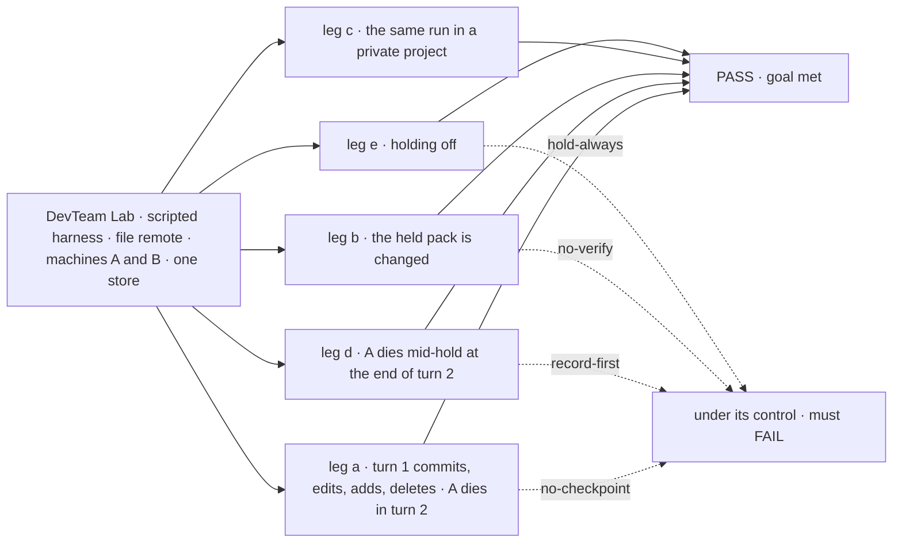
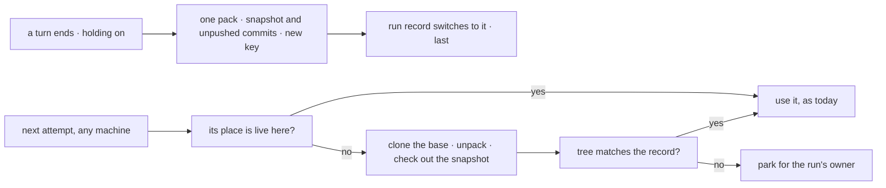

# FIX-1766 · A coding run's uncommitted work survives the loss of its machine

**Spec** · [Decisions](DECISIONS.md) · [Rules](BUSINESS-RULES.md) · [Plan](PLAN.md) · [Docs](DOCS.md) · [Evolution](EVOLUTION.md)

## Six people, before and after

| Someone who… | Today | After |
|---|---|---|
| **has a coding run on a repository project when its machine dies** | Loses every uncommitted edit and every commit the run made, and the next attempt starts from the base | The next attempt, on any machine, starts where the last finished turn left off: same commits, same edited, new and deleted files |
| **runs a Lab on more than one machine** | A retry on another machine finds nothing; the README says to keep one machine | Turns holding on for the host, once. Any machine with the store, the held-work store and the remote picks up a lost run |
| **runs on a disk that is kept: their own machine, or a sandbox that preserves its state** | Nothing is held, and nothing needs to be | The same. Holding is off unless the operator turns it on: nothing stored, no extra work at a turn's end |
| **owns a private project** | Its files sit in their own user scope ([FIX-1793 BR-33](../FIX-1793/BUSINESS-RULES.md#coding-runs)), and nothing else of the run is kept | The run's held work sits in the same place. Nobody else in the org can read it |
| **finds the held work does not match the run's record** | n/a | Gets a question in their inbox naming what disagreed. The row waits for them; nothing is overwritten |
| **owns the customer's git host** | Nothing is written there by FSD | Still nothing. Held work stays in the held-work store until slice 4 pushes it |

## The goal, and how we'll know it's met

**On a host whose operator turned holding on, when the machine a coding run works on is lost,
the run's next attempt continues on another machine from its last finished turn, with the same
commits and the same uncommitted files, without the repository being copied or anything written
to the git host; a machine that dies while holding costs that turn and no more; and held work
that does not match the run's record waits for the run's owner instead of being used. With
holding off, nothing is stored and runs behave as they do today.**

| Is it the right goal? | |
|---|---|
| **The real need** | "A person whose coding run was interrupted gets the work back where it stopped, on any host, instead of a lost day." "At most one turn of work is lost to a crash." ([FIX-1766](https://linear.app/fixpoint-labs/issue/FIX-1766)) |
| **Smaller, and rejected** | "A lost run restarts from its base." Met by today's code with a cleared directory, and loses the day. Or "work survives a restart on the same machine." Met today by the disk, and keeps a Lab on one machine |
| **Bigger, and not this issue's** | The vendor's own conversation surviving the machine: a coding agent's session lives on the machine it ran on, so the next attempt there starts a fresh conversation, told what was restored · a sandbox snapshot for fast resume ([FIX-1767](https://linear.app/fixpoint-labs/issue/FIX-1767)) · pushing and dropping the held work ([FIX-1768](https://linear.app/fixpoint-labs/issue/FIX-1768)) |
| **Not done if** | The second machine shares a disk with the first · the check restores only new files, not edits, deletions or commits · a crash mid-hold sends the run to its owner instead of to the last good turn · a mismatch is restored anyway · a private project's held work sits under the org · holding off stores anything |



The check reads machine B's checkout, the remote's refs, the held-work store's keys by prefix,
the run record and the row's status. Each control switches off exactly what its leg depends on.

| How we verify | |
|---|---|
| **Goal check** | `goals/devforce-lab/it-keeps-a-runs-work-when-its-machine-is-lost/` · model `n/a` (scripted harness: the property is where files come from) · run by the implementer at completion · verdict in the last implementation PR |
| **Signal** | **a**: B's checkout HEAD is turn 1's commit; turn 1's edited, new, deleted, executable and symlinked files are as turn 1 left them, unstaged; turn 2's edit is absent; the remote's refs are byte-identical to before; the store holds one pack for the run and the record names its snapshot; `place.state` is `ready` and names B. **b**: the row is `parked`, `place.state` is `lost`, a question for its owner names `pack`, no harness ran, the stored pack is unchanged. **c**: the run's pack sits under the owner's user prefix and nothing under the org's. **d**: B has turn 1's work, as in a, with no question asked; turn 2's pack is still in the store, unread. **e**: the held-work store is empty, the record has no `place` or `held`, and B starts from the base, as on `main` |
| **Input** | A `file://` bare repository the check makes with one marker commit; A and B are separate host roots, A's deleted before B starts; the held-work store is a folder outside both. A binary file, a nested path, a rename, an exec bit and a symlink must pass too. Leg d's crash: the Lab host kills A after turn 2's pack is written |
| **Anti-game** | No pack seeded by the check, except leg b's one change to the pack turn 1 wrote. No assertion on a host method's return. A and B never share a root |
| **Control that must fail** | `no-checkpoint`: leg a FAILS on *B has turn 1's work*. `no-verify`: leg b FAILS on *parked, nothing restored*. `record-first` (the record switched before the pack is written): leg d FAILS on *B has turn 1's work, no question*. `hold-always` (the default flipped to on: a host given no store holds into the leg's folder anyway): leg e FAILS on *the store is empty*. Each is `GOAL_CONTROL=<name>`. Today's `main` FAILS leg a |

## What changes


Left is today: the work exists only on A's disk. Right is after, with holding on: each finished
turn is one snapshot in the held-work store, and B rebuilds from the remote plus that snapshot.

**The Lab's operator, once, in its host**, to turn holding on (nothing else changes for them;
without the new line, nothing changes at all):

```diff
  workspace: localWorkspaceHost({
    root,
    remotes: { allow: ["github.com"] },
    source: projectWorkspace({ board: work }),   // now also names where the run's work is held
+   heldWork: fileHeldWorkStore({ dir: "/shared/held-work" }),
  }),
- // Limits: one host's storage. A retry on another machine finds nothing.
+ // Any host sharing the store and the held-work store picks up a lost run.
```

## How a lost run comes back



The workspace layer snapshots and rebuilds; harness-manager calls it at the save points it
already has; Workforce says where the held work lives, by the project's visibility; the operator
decides whether any of it happens.

## What stays as it is

- **FIX-1762's locks.** One optional remote per project, a worktree mapped from it, project
  files beside the checkout, no auto-commit as the user, a live checkout never fetched or reset.
- **No-repository projects.** Their files collection is already their record; nothing added.
- **A local repository** the operator names on the host: no held work; it lives on that disk.
- **Any host without a held-work store**, which is every host by default: no change at all.
- **Workforce workers, coordinators, mailboxes and boards.** Untouched; the parked question uses
  harness-manager's existing ask.

## Sign off

This set amends the spec Jake merged in [#2878](https://github.com/fixpoint-labs/flow-state-dev/pull/2878);
the change is in [EVOLUTION.md](EVOLUTION.md#the-2026-10-08-amendment).

**[The goal](#the-goal-and-how-well-know-its-met), at that size:** where an operator turns it on,
a lost machine costs at most the turn in flight, on any other machine, with nothing copied but the
run's own changes and nothing pushed; where they don't, nothing changes. If wrong: we ship a hold
that survives a restart but not a lost machine, and a Lab still runs on one.

**Open:**

1. **[D3](DECISIONS.md#d3) · The held snapshot's bytes: a blob store beside FSD's store, or text
   in FSD's store?** Recommended: a blob store, a two-method port on the workspace host with a
   folder as the default. If wrong: the bytes move from one place to another before any are
   stored; after, a sweep.

**Decided:**

2. **[The shape](DECISIONS.md#decided-not-asked) · one git snapshot per hold, under a new key,
   switched to last.** Jake, 2026-10-08. A crash mid-hold falls back to the previous turn.
3. **[Holding is optional, off by default](DECISIONS.md#opt-in)**, turned on per host. Jake,
   2026-10-08.
4. **[Q1](DECISIONS.md#q1) · One turn is one attempt**, held when it ends, parks or fails.
5. **[D1](DECISIONS.md#d1) · The held work is kept in the project's scope:** the owner's for a
   private project, the org's for a shared one.
6. **[D2](DECISIONS.md#d2) · A mismatch parks the row for the run's owner, not the operator.**

D3 is the one to weigh. The cases: [BUSINESS-RULES.md](BUSINESS-RULES.md).

Feature · `workspace` + `harness-manager` + `workforce` + DevTeam Lab · large · 4 PRs · epic
[FIX-1763](https://linear.app/fixpoint-labs/issue/FIX-1763), slice 2 of 4 · after
[FIX-1793](../FIX-1793/SPEC.md)'s storage
