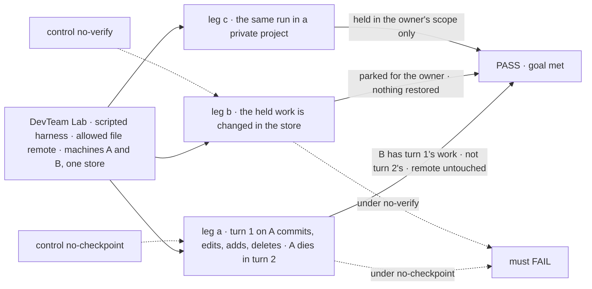
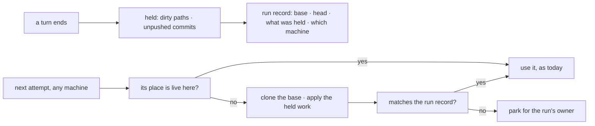

# FIX-1766 · A coding run's uncommitted work survives the loss of its machine

**Spec** · [Decisions](DECISIONS.md) · [Rules](BUSINESS-RULES.md) · [Plan](PLAN.md) · [Docs](DOCS.md) · [Evolution](EVOLUTION.md)

## Five people, before and after

| Someone who… | Today | After |
|---|---|---|
| **has a coding run on a repository project when its machine dies** | Loses every uncommitted edit and every commit the run made, and the next attempt starts from the base | The next attempt, on any machine, starts where the last finished turn left off: same commits, same edited, new and deleted files |
| **runs a Lab on more than one machine** | A retry on another machine finds nothing; the README says to keep one machine | Any machine with the store and the remote picks up a lost run |
| **owns a private project** | Its files sit in their own user scope ([FIX-1793 BR-33](../FIX-1793/BUSINESS-RULES.md#coding-runs)), and nothing else of the run is kept | The run's held work sits in the same place. Nobody else in the org can read it |
| **finds the held work does not match the run's record** | n/a | Gets a question in their inbox naming what disagreed. The row waits for them; nothing is overwritten |
| **owns the customer's git host** | Nothing is written there by FSD | Still nothing. Held work stays in FSD's store until slice 4 pushes it |

## The goal, and how we'll know it's met

**When the machine a coding run works on is lost, the run's next attempt continues on another
machine from its last finished turn, with the same commits and the same uncommitted files,
without the repository being copied into FSD's store or anything written to the git host; and
held work that does not match the run's record waits for the run's owner instead of being used.**

| Is it the right goal? | |
|---|---|
| **The real need** | "A person whose coding run was interrupted gets the work back where it stopped, on any host, instead of a lost day." "At most one turn of work is lost to a crash." ([FIX-1766](https://linear.app/fixpoint-labs/issue/FIX-1766)) |
| **Smaller, and rejected** | "A lost run restarts from its base." Met by today's code with a cleared directory, and loses the day. Or "work survives a restart on the same machine." Met today by the disk, and keeps a Lab on one machine |
| **Bigger, and not this issue's** | The vendor's own conversation surviving the machine: a coding agent's session lives on the machine it ran on, so the next attempt there starts a fresh conversation, told what was restored · a sandbox snapshot for fast resume ([FIX-1767](https://linear.app/fixpoint-labs/issue/FIX-1767)) · pushing and dropping the held work ([FIX-1768](https://linear.app/fixpoint-labs/issue/FIX-1768)) |
| **Not done if** | The second machine shares a disk with the first · the check restores only new files, not edits, deletions or commits · held work copies files git reports clean · a mismatch is restored anyway · a private project's held work is readable at org scope |



The check reads machine B's checkout, the remote's refs, the store's rows by scope, and the
row's status. Each control switches off exactly what its leg depends on.

| How we verify | |
|---|---|
| **Goal check** | `goals/devforce-lab/it-keeps-a-runs-work-when-its-machine-is-lost/` · model `n/a` (scripted harness: the property is where files come from) · run by the implementer at completion · verdict in the last implementation PR |
| **Signal** | **a**: B's checkout HEAD is turn 1's commit; turn 1's edited, new and deleted files are as turn 1 left them; turn 2's edit is absent; the remote's refs are byte-identical to before; the held rows are exactly turn 1's dirty paths plus one bundle; the run record's `place.state` is `ready` and names B. **b**: the run row's status is `parked` and `place.state` is `lost`, a question for its owner names the file that disagreed, no harness ran, the held rows are unchanged. **c**: held rows exist in the owner's user scope, none at org scope; another member's read is refused |
| **Input** | A `file://` bare repository the check makes with one marker commit; A and B are separate host roots, A's deleted before B starts. A binary file, a nested path or a rename must pass too |
| **Anti-game** | No held row seeded by the check, except leg b's one change to a row turn 1 wrote. No assertion on a host method's return. A and B never share a root |
| **Control that must fail** | `GOAL_CONTROL=no-checkpoint`: leg a FAILS on *B has turn 1's work*. `GOAL_CONTROL=no-verify`: leg b FAILS on *parked, nothing restored*. Today's `main` FAILS leg a |

## What changes


Left is today: the work exists only on A's disk. Right is after: each finished turn is held in
FSD's store, and B rebuilds from the remote plus what was held.

**The Lab's operator, once, in its host** (nothing else changes for them):

```diff
  workspace: localWorkspaceHost({
    root,
    remotes: { allow: ["github.com"] },
    source: projectWorkspace({ board: work }),   // now also names where the run's work is held
  }),
- // Limits: one host's storage. A retry on another machine finds nothing.
+ // Any host sharing the store picks up a lost run.
```

## How a lost run comes back



The workspace layer holds and rebuilds; harness-manager calls it at the save points it already
has; Workforce says where the held work lives, by the project's visibility.

## What stays as it is

- **FIX-1762's locks.** One optional remote per project, a worktree mapped from it, project
  files beside the checkout, no auto-commit as the user, a live checkout never fetched or reset.
- **No-repository projects.** Their files collection is already their record; nothing added.
- **A local repository** the operator names on the host: no held work; it lives on that disk.
- **Workforce workers, coordinators, mailboxes and boards.** Untouched; the parked question uses
  harness-manager's existing ask.

## Sign off

**[The goal](#the-goal-and-how-well-know-its-met), at that size:** a lost machine costs at most the
turn in flight, on any other machine, with nothing copied but dirty paths and nothing pushed. If
wrong: we ship a hold that survives a restart but not a lost machine, and a Lab still runs on one.

**Open:**

1. **[Q1](DECISIONS.md#q1) · What counts as "one turn" of lost work?** Recommended: one attempt
   of the run, held at the end of each attempt, when it parks and when it fails. If wrong: a crash
   in a long attempt loses that whole attempt; a timed hold is additive.

**Decided:**

2. **[D1](DECISIONS.md#d1) · The held work is a per-run slice of a `worktree-overlay` collection,
   kept in the project's scope: the owner's for a private project, the org's for a shared one.**
   If wrong: one more collection pair to migrate if FIX-1793 moves project storage.
3. **[D2](DECISIONS.md#d2) · A mismatch parks the row for the run's owner, not the operator.** If
   wrong: an owner who cannot fix a remote waits on someone they must find themselves.

Q1 is the one to weigh. The cases: [BUSINESS-RULES.md](BUSINESS-RULES.md).

Feature · `workspace` + `harness-manager` + `workforce` + DevTeam Lab · large · 4 PRs · epic
[FIX-1763](https://linear.app/fixpoint-labs/issue/FIX-1763), slice 2 of 4 · after
[FIX-1793](../FIX-1793/SPEC.md)'s storage
