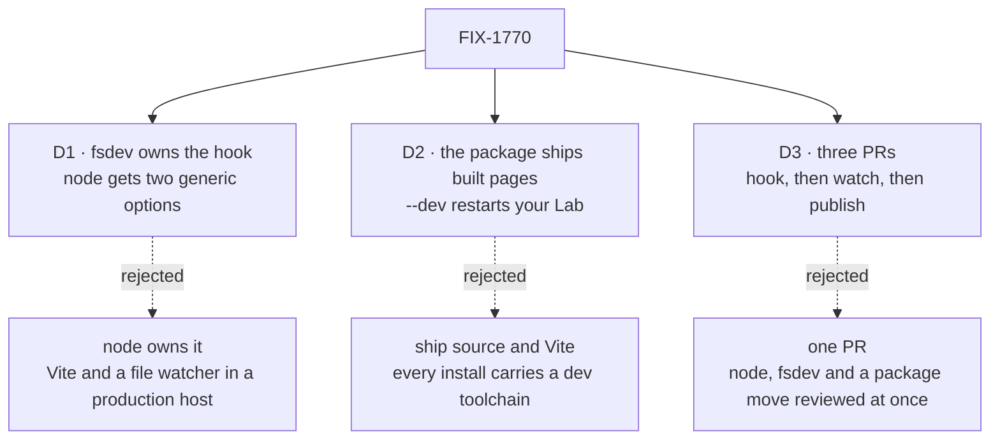
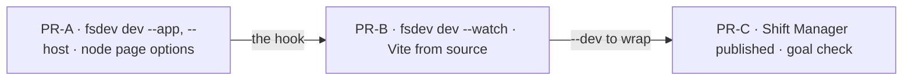

# FIX-1770 · Decisions

[Spec](SPEC.md) · **Decisions** · [Rules](BUSINESS-RULES.md) · [Plan](PLAN.md) · [Docs](DOCS.md) · [Evolution](EVOLUTION.md)

Jake chose the shape: publish Shift Manager, a real CLI with `--dev`, a generic hook in fsdev.
These three decisions are what that shape left open.

## The tree

Solid edges are what you're signing. Dashed edges lost, and the label says why.

## D1 · fsdev owns "serve this app's pages beside the Lab"; `@flow-state-dev/node` gains only two generic page-serving options

| | |
|---|---|
| **Instead of** | `@flow-state-dev/node`'s `serve()` learning about apps: resolving an app package, running Vite, watching files, serving the DevTool beside it |
| **Because** | Each package keeps its job. `node` is the production host: it serves files and writes the page's config into HTML today. `fsdev dev` is the dev loop: it loads the config, serves the DevTool, sets dev-only switches. The hook is a dev loop, so it goes in fsdev (tenet 5). `node` gains only what any host could use: extra `<meta>` tags, and a request handler before the static directory. Neither names a team or a worker (tenet 4) |
| **Locks in** | Three public fsdev flags, and an app contract of one export, `getAssetPath()`, as `@flow-state-dev/devtool` has. Production hosting of an app stays `serve()` with `staticDir` |

It comes down to what a production install carries: in `node`, Vite and a watcher ship to every server.

**What would change my mind:** a need to serve an app with the DevTool beside it in production.

## D2 · The published package ships built pages only; `--dev` restarts the user's Lab, and serves Shift Manager's pages from source only in a checkout

| | |
|---|---|
| **Instead of** | Publishing Shift Manager's source and Vite with it, so `--dev` live-reloads its pages in every install |
| **Because** | Someone with their own Lab edits their Lab, not Shift Manager, so `--dev` owes them a Lab that restarts on save. Live page reload is for Shift Manager's developers, who have a checkout. Shipping source puts Vite, React tooling and Tailwind in every install for a feature nobody there uses |
| **Locks in** | One flag, two meanings set by the install: in a checkout `--dev` also serves pages through Vite. Changing the screens means cloning |

It comes down to who edits what: outside users edit their Lab, so Vite in every install buys them nothing.

**What would change my mind:** outside users asking to customise the screens.

## D3 · Three PRs in order: fsdev's app hook, then `--watch`, then the published Shift Manager

| | |
|---|---|
| **Instead of** | One PR carrying the `node` options, three fsdev flags, the package move, the publish wiring and the goal check |
| **Because** | Each PR is usable when it merges and holds one idea: the hook, provable with no Shift Manager change; the restart supervisor, the riskiest part, alone; the package move and publish, which touch goals and CI |
| **Locks in** | Nothing installs, and the goal check can't run, until the third PR. The repository's Shift Manager works throughout |

It comes down to what one review has to hold: one PR mixes a host change, a supervisor and a package move.

## Decided, not asked

- **A Lab change restarts the whole process; the page reloads.** Node can't unload an imported
  flow ([Settled](#settled)). Keeping the page alive needs the Lab behind a proxy, today's setup.
- **A Lab change** is a module the Lab imported, or a file under the config's directory (trees
  are read from disk). Never page source, data files or `node_modules`.
- **A failed restart keeps watching.** `--dev` binds loopback only.
- **A non-loopback `--host` keeps the anonymous debug surface closed**, runs the `fsdev serve`
  guard, and refuses a Lab that hands its page a bearer.
- **The page gets the DevTool's address as one generic meta**, `fsdev-devtool-url`.
- **Vite loads from the app's own install**, never from fsdev's dependencies.
- **Shift Manager moves to `packages/shift-manager`**, where the publish guards look. Name unchanged.
- **Flags that leave:** `--team` (profiles import `goals/`, so can't ship), `--devtool`,
  `--devtool-assets`. `--assets` stays for goal controls.
- **The stale-build rebuild moves to the checkout's `start` script**; it reads repository paths.
- **The design-system package stays private**, bundled into the pages.

## Considered and dropped

| Alternative | Why not |
|---|---|
| Publish `start.mts` unchanged | Every other app copies it, temp-copy injection included |
| Keep the package in `labs/`, teach the guards a second root | Two homes for published packages, for one package |
| The Lab in a child process behind a proxy, page kept alive | The proxy Jake asked to remove, under every SSE stream |
| Reload the Lab in-process | Misses changed flow files ([Settled](#settled)) |

## Settled

- **Re-importing the config does not reload a flow file it imports** — **CONFIRMED** on Node
  22.22: after an edit, a cache-busted re-import still returns the old value. **`node --watch`
  restarts on an imported module's change and not on an unrelated file** — **CONFIRMED**.
  Evidence: [`poc/esm-reload/`](poc/esm-reload/README.md).

## How it got here

- **Draft** — distribute Shift Manager beyond the repository: a generic fsdev app hook with
  `--host` and `--watch`, two `node` page options, a published thin CLI; three PRs.

**Open: none.**
