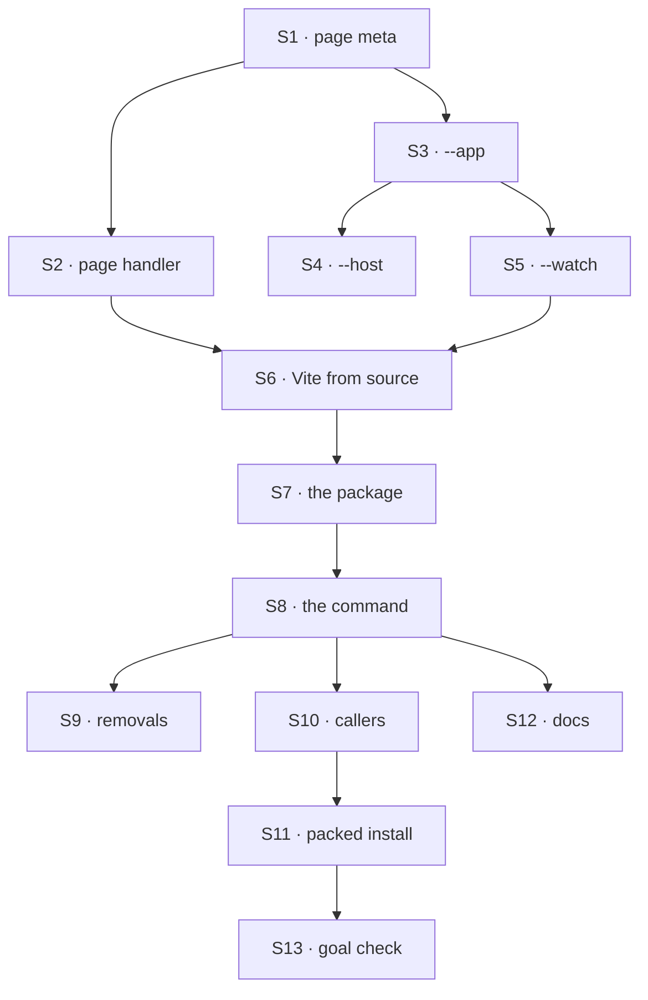

# FIX-1770 · Plan

[Spec](SPEC.md) · [Decisions](DECISIONS.md) · [Rules](BUSINESS-RULES.md) · **Plan** · [Docs](DOCS.md) · [Evolution](EVOLUTION.md)

Written for the implementing agent. IDs cross-reference [BUSINESS-RULES.md](BUSINESS-RULES.md)
(BR-n) and [DECISIONS.md](DECISIONS.md) (Dn). `tdd`. Three PRs ([D3](DECISIONS.md#d3)).

## Surfaces

| ID | Package · role | Change | Rules |
|---|---|---|---|
| S1 | `node` · `serve()` HTML injection | Page-meta option: `<meta>` tags in every HTML response (file and SPA fallback), any host; same injection path as the devtool config | BR-9 BR-11 |
| S2 | `node` · `serve()` page layer | A Connect-style handler for non-API GETs, tried after a real file and the dedicated-route dispatch, before the SPA fallback; S1's injection exposed as one function its index path calls | BR-21 |
| S3 | `fsdev` · `dev --app <package\|dir>` | Resolve the app (`getAssetPath()` or a directory with `index.html`); serve it at `--port`'s root; DevTool on port 0, its address as `fsdev-devtool-url`, degrading when missing. Programmatic: extra page meta | BR-1 BR-4–BR-10 |
| S4 | `fsdev` · `dev --host` | Default `127.0.0.1`. Non-loopback: `assertNetworkBindIsAuthenticated` with `--allow-unauthenticated` as `fsdev serve` has it, refuse a declared bearer, skip the debug env defaults | BR-12–BR-14 |
| S5 | `fsdev` · `dev --watch` | Re-runs the dev entry as a child under `node --watch`, the one watch authority (no watcher package), so a Lab change restarts it (DECISIONS → Decided, not asked); the parent resolves the port once (including `--port 0`) and hands it to every child; a dev-only page signal (boot id in a meta, a reconnecting stream) reloads an open page when a new child is up, with built pages too; survives a failed child; loopback only | BR-15–BR-19 |
| S6 | `fsdev` · `--watch` with an app that has source | Vite middleware mode at `getSourceRoot()`, resolved from there; index through Vite's transform then S2's injection; else built pages | BR-21 BR-22 |
| S7 | `shift-manager` · the package | Move to `packages/shift-manager`; drop `private`; `bin`, `files` (pages, profiles, command), `publishConfig`; page-only deps to dev; export `getAssetPath()`, `getSourceRoot()`; `prepublishOnly` check as the DevTool's; `patch` changesets for it, `fsdev`, `node` (additive, per AGENTS.md) | BR-24 BR-25 |
| S8 | `shift-manager` · the command | Thin wrapper over fsdev's dev entry with `app` set to itself; the shift becomes its scheme meta. The page reads `fsdev-devtool-url` | BR-1–BR-6 BR-11 BR-20 BR-26 |
| S9 | `shift-manager` · **removals** | **Remove** `bin/start.mts`, its temp-copy injection, the Vite `/api` proxy, `--team`, `--devtool`, `--devtool-assets`, the `shift-manager-devtool` meta. Rewrite `test/start.test.ts`; reword the trace-off line naming `--devtool` | — |
| S10 | repository · callers | Scripts `start` (after the build-if-stale step) and `dev` over `teams/devteam/fsdev.config.mts`. Re-point `goals/lib/shift-manager.mts`, `shell.mts` and three `run.mts` that spawn `bin/start.mts`, and `--team devteam` callers; every `labs/shift-manager` path in `goals/` (~20 files) and READMEs | BR-6 |
| S11 | CI · packed install | Pack it; a check runs the installed command over a fixture Lab and reads `/`, an asset, `/api/flows` | BR-1 BR-24 |
| S12 | Docs | Per [DOCS.md](DOCS.md) | — |
| S13 | `goals/shift-manager/it-runs-from-an-install/` | The goal check, with controls `no-page-config` and `no-watch` | Goal |

## Sequence



| PR | Deliverables | depends_on |
|---|---|---|
| PR-A | S1 S2 S3 S4, their docs, V1–V4 | — |
| PR-B | S5 S6, their docs, V5–V6 | PR-A |
| PR-C | S7–S13, V7–V10, VG | PR-B |

## Checks

| ID | Runs after | Passes when |
|---|---|---|
| V1 | S1 S2 | No new option: byte-identical (BP-030); meta on file and fallback HTML; handler sees non-API GETs only; a dedicated GET route such as an OAuth callback still wins over it, during cold start too |
| V2 | S3 | BR-1 BR-4–BR-10 on a fixture directory and package; BR-7 on the existing suite |
| V3 | S4 | BR-12–BR-14 by message; BR-14 reads the debug route anonymously and is refused |
| V4 | S3 | **D1:** a source check finds no Workforce or Shift Manager import or word in the hook modules (BR-23); a planted import turns it red |
| V5 | S5 | BR-16–BR-19 on a real child: save a module, a tree file, a page file, a data file; count restarts; an open built page reloads on its own and keeps the same origin under `--port 0` |
| V6 | S6 | BR-21 BR-22: the index carries Vite's client and the config; no Vite falls back |
| V7 | S7 | **D2:** tarball has pages, profiles, command; no `src/`, `teams/`, `test/`; publish without pages fails (BR-24 BR-25) |
| V8 | S8 S9 | BR-2 BR-3 BR-6 BR-11 BR-26 via the command; no `bin/start.mts` or `shift-manager-devtool` left |
| V9 | S10 | Every `goals/shift-manager/` goal passes as before, controls' FAILs included |
| V10 | S11 | Packed install passes; fails with `shift-manager` left out of the pack |
| VG | S13 | [The goal](SPEC.md#the-goal-and-how-well-know-its-met): `goals/shift-manager/it-runs-from-an-install/run.mts` PASSES after FAILing under each control. **D3:** each PR's checks pass on that PR alone |

## Pinned names

| Where | Name | Why pinned |
|---|---|---|
| Command | `shift-manager`, with `--config --port --host --shift --assets --dev --no-open` | Public. People type it |
| fsdev flags | `fsdev dev --app <package\|dir>`, `--host <host>`, `--allow-unauthenticated`, `--watch` | Public, and D1's contract |
| App contract | `getAssetPath()` (as `@flow-state-dev/devtool`), optional `getSourceRoot()` | What any app beside a Lab exports |
| Page meta | `fsdev-devtool-url` | A page reads it |
| Location | `packages/shift-manager`, name unchanged | Publish guards and packed install look there |

Everything else, including the two `node` option names, is yours.

## Guardrails

| Rule | Because |
|---|---|
| One HTML injection path in `node`, the Vite index included | Two writers drift, and the bearer's loopback rule lives there (tenet 5) |
| Nothing in fsdev or `node` names a team, worker, roster or shift | Jake's layer rule. Policy plugs in as page meta from the wrapper (tenet 4) |
| Debug surface and bearer are loopback-only, decided from the bound host | A network bind must stay authenticated (BP-031) |
| `fsdev dev` without `--app` and `serve()` without the new options behave byte for byte as today | Every current user runs those paths (BP-030) |
| `start.mts` and the proxy leave in PR-C, which replaces them | Old beside new is how incoherence starts (tenet 3) |
| Every restart case runs on a real child process and a real file save | A watcher that never fires passes every mocked test (tenet 7) |

## Docs

Publish [DOCS.md](DOCS.md) per its ownership section, each part after its PR's checks pass.

## Sketch · pseudocode, illustrative, react to the shape

```
shift-manager [flags]:
    scheme ← shift profile named by --shift or SHIFT_MANAGER_SHIFT
    fsdev dev entry(config, port, host, watch ← --dev,
                    app ← --assets or this package,
                    page meta ← { color scheme: scheme })

fsdev dev entry, with an app:
    if watch: supervisor runs this entry again as a child, restarts it on a Lab change
    lab ← load config
    guard the host
    devtool ← serve(lab, devtool pages, port 0)        page config only
    pages  ← app source under watch and Vite resolves ? Vite middleware : app's built pages
    serve(lab, pages, port, page meta + devtool url)
```

**POC:** [`poc/esm-reload/`](poc/esm-reload/README.md): a re-imported config keeps the old flow;
`node --watch` restarts on imported modules only. The restart premise held.

## At implement time

- `node --watch` may see Vite's temporary config bundle. If restarts loop, use an own watch list.
- PR #2715 edits `labs/shift-manager/README.md`. If it merges first, move its text with the package.
- DevTeam's tree is under `goals/devforce-lab/lab/`, outside its config's directory: a `WORKER.md`
  edit there is no Lab change (BR-17). Say so; don't special-case it.
- Check `release:build` builds Shift Manager's pages once it sits in `packages/`.

## Follow-ups

- `fsdev` already imports `@flow-state-dev/workforce` for `fsdev gen`, which the layer rule says
  L1 must not. Out of scope; file it.
