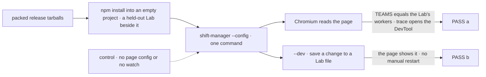
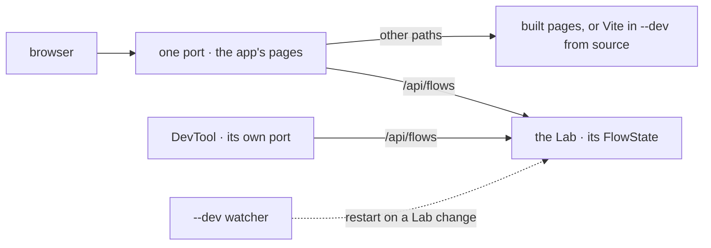

# FIX-1770 · Run Shift Manager against your own Lab with one command, with a dev mode

**Spec** · [Decisions](DECISIONS.md) · [Rules](BUSINESS-RULES.md) · [Plan](PLAN.md) · [Docs](DOCS.md) · [Evolution](EVOLUTION.md)

## Five people, before and after

| Someone who… | Today | After |
|---|---|---|
| **has their own Lab, outside this repository** | Can't run Shift Manager: it is private and starts only from a checkout | Installs it, runs `shift-manager --config ./fsdev.config.mts`. Nothing to build |
| **edits their Lab's flows while Shift Manager is open** | Restarts the process by hand after every change | Adds `--dev`: a save restarts the Lab and reloads the page |
| **works on Shift Manager's pages in this repository** | Runs Vite and the start script in two terminals; the Vite page misses the DevTool link, shift, user and token | One command with `--dev`: live pages, same config |
| **builds another app to sit beside a Lab** | Copies `start.mts` | Runs `fsdev dev --app <their package>`; fsdev knows nothing about the app |
| **binds Shift Manager to a network address** | Refused unless the Lab authenticates, and always when the page would get a bearer | The same refusals, now in fsdev, for every app |

Shift Manager is how people work a Workforce team. Today nobody outside this repository can run it.

## The goal, and how we'll know it's met

**Someone outside this repository installs Shift Manager, opens their own Lab in the browser with one command and no build, and with `--dev` sees a saved change to their Lab take effect without restarting anything by hand.**

| Is it the right goal? | |
|---|---|
| **The real need** | "A version that is going to be better to distribute once this is being used by others", plus "a dev mode that works like start, where you pass in a config for which team to run" (Jake, [FIX-1770](https://linear.app/fixpoint-labs/issue/FIX-1770)) |
| **Smaller, and rejected** | "`start.mts` gets a `--dev` flag." Fixes the two terminals and leaves every outside user unable to install it |
| **Bigger, and not this issue's** | Hosting Shift Manager as a deployed team service, with its own auth questions |
| **Not done if** | It passes only in a checkout, where workspace links hide a missing file · the page loads but can't read the Lab · `--dev` misses a flow edit · fsdev learns a Workforce word |



The check reads what a browser shows from an installed copy. Each control must turn its leg red.

| How we verify | |
|---|---|
| **Goal check** | `goals/shift-manager/it-runs-from-an-install/` · model n/a · the implementer, at completion · verdict in PR-C. Needs Chromium; hand to `fsd-qa` only if the implementer can't run it |
| **Signal** | **a:** the sidebar's TEAMS equals the held-out Lab's declared workers, and *Open trace* loads the DevTool on a session of that Lab. **b:** within 20 s of saving a change to the Lab, with no other input, the page shows it |
| **Input** | A small Lab (config and Workforce tree) importing only installed packages. Another tree, or another changed file, must pass too |
| **Anti-game** | No repository import, workspace link or `pnpm` filter. Read the page, never fsdev's log |
| **Control that must fail** | `GOAL_CONTROL=no-page-config` must FAIL **a:Open trace opens the Lab's session** and **b:the change shows**. TEAMS still draws under it: the page's reads don't need the page config. `GOAL_CONTROL=no-watch` must FAIL **b:the change shows**. Today's `main` fails at install: there is no `shift-manager` to install |

## What changes


Left, a lab script does it all. Right, fsdev owns the generic part, below the framework line.

**What an outside user types:**

```diff
- git clone … && pnpm install && pnpm --filter @flow-state-dev/shift-manager build
- pnpm --filter @flow-state-dev/shift-manager start --config ../my-lab/fsdev.config.mts
+ npm install @flow-state-dev/shift-manager
+ npx shift-manager --config ./fsdev.config.mts          # add --dev while you edit your flows
```

**What a Shift Manager developer types in this repository:**

```diff
- pnpm --filter @flow-state-dev/shift-manager start --team devteam   # terminal 1
- pnpm --filter @flow-state-dev/shift-manager dev                    # terminal 2, proxies /api to :4300
+ pnpm --filter @flow-state-dev/shift-manager dev                    # one process: Vite, the Lab, the DevTool
```

**What any other app beside a Lab types:**

```diff
  fsdev dev --config ./fsdev.config.mts
+ fsdev dev --config ./fsdev.config.mts --app @acme/ops-console --watch
```

## How a request reaches the Lab



Pages and Lab share one origin, so no proxy. The DevTool keeps its own port: its build loads from `/`.

## What stays as it is

- Shift Manager's screens, and the Lab's config, which is never edited or wrapped.
- `fsdev dev` with no `--app`: the DevTool at the root of port 4200, on loopback.
- `@flow-state-dev/node`'s production use: `serve()` with a static directory behaves byte for byte as today.
- The team profiles under `teams/`: repository only, not published.

## Sign off

**[The goal](#the-goal-and-how-well-know-its-met), at that size:** an install, one command, and `--dev` restarting on a Lab change. If wrong: we publish a package that works only in a checkout.

1. **[D1](DECISIONS.md#d1) · fsdev owns the "pages beside the Lab" hook; `@flow-state-dev/node` gets only two generic page-serving options.** If wrong: dev tooling in a production host, or a hook every app rewrites.
2. **[D2](DECISIONS.md#d2) · The published package ships built pages only. `--dev` restarts your Lab; live page editing needs a checkout.** If wrong: outside users can't change the screens without cloning.
3. **[D3](DECISIONS.md#d3) · Three PRs, in order: the fsdev hook, then `--watch`, then the published package.** If wrong: nothing installs until the third PR merges.

**Open: none.** D1 is the one to weigh. **News, hard to reverse:** the first npm publish of `@flow-state-dev/shift-manager`; an npm name is permanent. Reasoning: [DECISIONS.md](DECISIONS.md). Cases: [BUSINESS-RULES.md](BUSINESS-RULES.md).

Feature · `fsdev` + `node` + `shift-manager` · large (13 surfaces, 3 PRs) · project Workforce: Shift Manager · no epic
