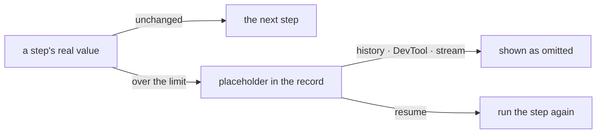

# FIX-1772 · Business rules

[Spec](SPEC.md) · [Decisions](DECISIONS.md) · **Rules** · [Plan](PLAN.md) · [Docs](DOCS.md)

The cases, written as rules. Each says what a step or the system does and what happens. *Proved
by* names the check the plan runs. "The limit" is 256 KiB of serialized UTF-8, or the server's
setting ([D2](DECISIONS.md#d2)).

## What is recorded

| # | When | Then | Proved by |
|---|---|---|---|
| BR-1 | A step returns a value at or under the limit | Its trace records it whole, exactly as today | CI, byte for byte against today's item |
| BR-2 | A step returns a value over the limit | Its trace records a placeholder: omitted, the size in bytes, the first 512 characters. The run goes on | CI · goal check |
| BR-3 | A tool returns a result over the limit (a generator's tool, `.asTool()`, or a coding-harness tool) | The tool result item records the placeholder instead of the result | CI, one per writer · goal check |
| BR-4 | A tool's model-facing text from `mapModelOutput` is over the limit | The tool result records neither value; it records the placeholder with the larger size | CI |
| BR-5 | A trace's inline input is over the limit (a request's entry input, a `forEach` element) | The trace records the placeholder for the input | CI |
| BR-6 | A value cannot be serialized (a cycle, a BigInt) | Recorded as a placeholder with size unknown. Never a thrown error from the record path | CI |
| BR-7 | A value is exactly at the limit | Recorded whole. Over means strictly greater | CI |
| BR-8 | Any value is replaced | One warning on the server log names the step, the item type and the size. Never the value | CI |

## What the run sees

| # | When | Then | Proved by |
|---|---|---|---|
| BR-9 | The next step, `ctx.getBlockOutput()`, or the generator that called a tool | Gets the real value, never the placeholder | CI |
| BR-10 | A model continues the same turn after an oversized tool result | Gets what it gets today: the real result, or the `mapModelOutput` text | CI |
| BR-11 | A later turn, or a later generator in the same request, reads history that includes an oversized tool result | The model sees a short line naming the tool and the size, not the placeholder object as JSON | CI |
| BR-12 | The server's limit is set higher or lower | That number replaces 256 KiB everywhere the limit applies | CI |

## Resuming a request

| # | When | Then | Proved by |
|---|---|---|---|
| BR-13 | A request resumes, and a step it already finished has a placeholder for its output | That step runs again. The later steps get the real value ([D1](DECISIONS.md#d1)) | CI · goal check |
| BR-14 | A generator resumes inside its turn, and a finished tool call has a placeholder | The tool runs again, and the model gets its real result | CI |
| BR-15 | A request resumes after an ordinary-sized step | Resume hands back the saved value and does not run the step again, as today | Existing suite |
| BR-16 | Items saved before this change (no placeholder anywhere) | Read and resumed exactly as today | CI, on a recorded legacy log |

The fence is the rule: nothing on the left changes, and only resume crosses back from right to
left, by running the step. The mermaid below lists the same paths by name.

## Failure taxonomy

Nothing in this change fails a run. An oversized or unserializable value degrades to a
placeholder and a warning. The only new cost is on resume: an oversized step runs again, with
its side effects, unless it guards them with `ctx.runOnce`. Nothing retries.

## Acceptance criteria this issue owns

- BP-042 is in `docs/contributing/best-practices/blocks.md`, indexed in `best-practices.md` and
  mirrored in `CLAUDE.md`. It ships in the spec PR.
- [The goal](SPEC.md#the-goal-and-how-well-know-its-met): on a real server with a SQLite store,
  no saved item holds the 1 MB marker, and the resumed request's result matches a run with no
  pause. The same run fails under each control. The plan runs it last.
