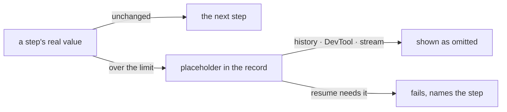

# FIX-1772 · Business rules

[Spec](SPEC.md) · [Decisions](DECISIONS.md) · **Rules** · [Plan](PLAN.md) · [Docs](DOCS.md)

The cases, written as rules. Each says what a step or the system does and what happens. *Proved
by* names the check the plan runs. "The limit" is `maxRecordedValueBytes`: 256 KiB of
serialized UTF-8 by default.

## What is recorded

| # | When | Then | Proved by |
|---|---|---|---|
| BR-1 | A step returns a value at or under the limit | Its trace records it whole, exactly as today | CI, byte for byte against today's item |
| BR-2 | A step returns a value over the limit | Its trace records the placeholder: omitted, the size in bytes, the first 512 characters. The run goes on | CI · goal check |
| BR-3 | A tool result is over the limit (a generator's tool, `.asTool()`, a coding-harness tool) | The tool result records the same placeholder | CI, one per writer · goal check |
| BR-4 | A tool's `mapModelOutput` text is over the limit | The tool result records the placeholder, sized by the larger of the two | CI |
| BR-5 | A sequencer's last step is `.map`, and its value is over the limit | The sequencer's own trace records the placeholder | CI |
| BR-6 | `.map` sits in the middle of a sequence | Nothing about its value is recorded, as today | Existing behaviour · goal check |
| BR-7 | A value cannot be serialized (a cycle, a BigInt) | The placeholder with size unknown. The record path never throws | CI |
| BR-8 | A value is exactly at the limit | Recorded whole. Over means strictly greater | CI |
| BR-9 | Any value is replaced | One server warning names the step, the item type and the size. Never the value | CI |
| BR-10 | The server sets the limit higher or lower | That number replaces 256 KiB everywhere the limit applies | CI |

Trace inputs are not limited in this issue ([decided](DECISIONS.md#decided-not-asked)).

## What the run sees

| # | When | Then | Proved by |
|---|---|---|---|
| BR-11 | The next step, `ctx.getBlockOutput()`, or the generator that called a tool | Gets the real value, never the placeholder | CI |
| BR-12 | A later turn, or a later generator in the same request, reads history with an oversized tool result | One text line naming the tool and the size | CI |

## Resuming a request

| # | When | Then | Proved by |
|---|---|---|---|
| BR-13 | A resumed request must hand on a step output recorded as a placeholder | The request fails with the omitted-value error, naming the step and the limit. Nothing after it runs ([D1](DECISIONS.md#d1)) | CI · goal check |
| BR-14 | A generator resumes in its turn, and a finished tool call's result is a placeholder | The same error. The model is never sent the placeholder | CI |
| BR-15 | A placeholder sits inside a finished parent whose own output is small | The parent replays whole; nothing fails | CI |
| BR-16 | A resumed sequence passed bulk data through a middle `.map` | The `.map` runs again from the replayed step before it, and the request completes correctly | Goal check |
| BR-17 | Items saved before this change | Read and resumed exactly as today | CI, on a recorded legacy log |

The fence is the rule: nothing on the left changes, and nothing crosses back from right to left
as data. The mermaid below lists the same paths by name.

## Failure taxonomy

Recording never fails a run: an oversized or unserializable value degrades to a placeholder and
a warning. The one new failure is BR-13 and BR-14: a resume that would hand a placeholder on
fails, with a named error and no retry. It is reachable only by breaking BP-042.

## Acceptance criteria this issue owns

- BP-042 is in `docs/contributing/best-practices/blocks.md`, indexed and mirrored in
  `CLAUDE.md`. It ships in the spec PR.
- [The goal](SPEC.md#the-goal-and-how-well-know-its-met), on a real server and SQLite store,
  with both controls failing first. The plan runs it last.
