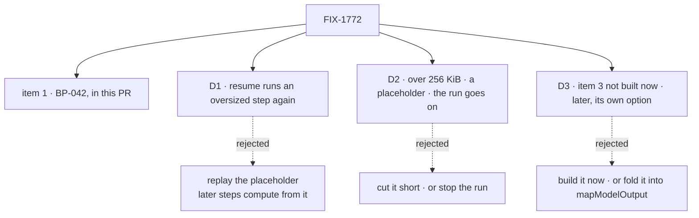

# FIX-1772 · Decisions

[Spec](SPEC.md) · **Decisions** · [Rules](BUSINESS-RULES.md) · [Plan](PLAN.md) · [Docs](DOCS.md)

The issue asks for three things: write the rule down, limit what is recorded, and let a step
record less than it returns. The rule ships in this PR as BP-042. Each card below is one ask,
with my recommendation; approval ratifies it.

## The tree

Solid edges are what you sign. Dashed edges lost, and the label says why.

## D1 · A resumed request runs an oversized step again; it never gets the placeholder

**The fork:** a request that resumes after a pause or a crash reuses what its finished steps
saved. For a step whose output was too big to save, do the later steps get the real value, by
running the step again, or the placeholder?

| | |
|---|---|
| **Instead of** | Replaying the placeholder: the smallest change, since resume stays as it is |
| **Because** | Resume hands a saved value to the later steps **as their input**, not only to a model. A placeholder there is a wrong answer with no error. Running a step again is what resume already does for a step that never finished, so nothing new is invented (tenet 1) |
| **Locks in** | A resumed request runs each oversized step a second time. Side effects that step doesn't guard with `ctx.runOnce` repeat. The cost lands on resume only, never on an ordinary run |

It comes down to the later steps: given the placeholder, they compute from it and nothing says so.

**What would change my mind, and it shrinks the work:** if D2 goes the other way and an
oversized output stops the run, nothing oversized is ever saved, and D1 has nothing to do: only
the limit is built. Accepting the placeholder on resume shrinks the work the same way, but I
don't recommend it: the resume path hands the placeholder to later steps as data, not only to a
model.

**If wrong:** side effects run twice on resume, for a step that already broke the rule.

## D2 · Over 256 KiB, the record keeps a placeholder, and the run goes on

**The fork:** a recorded value is over the limit. Save a placeholder and go on, save it cut
short, or stop the run? And where is the limit?

| | |
|---|---|
| **Instead of** | Cutting it short (half a value that looks whole, which resume would hand on), or stopping the run (a failed request in production over a logging limit) |
| **Because** | The issue asks the log to fail closed, not the run: "not stored whole". A placeholder with the size and a 512-character preview says what is missing. 256 KiB is far above an ordinary tool result or structured output, and a twentieth of the in-memory trace store's 5 MiB per-request budget |
| **Locks in** | 256 KiB becomes a documented number, with one server-wide setting. Lowering it later breaks nothing but makes more steps re-run on resume. Raising it is free |

It comes down to a 1 MB output in production: the run finishes, and the record says what it left out.

**What would change my mind:** you want an oversized return to be a bug that stops the run.
That is stricter, and it removes D1's resume work entirely.

**If wrong:** runs that should have stopped carry on, or a real flow needs more than 256 KiB
and its owner has to raise the setting.

## D3 · Item 3 is not built now. If it is built later, it is its own option, not part of `mapModelOutput`

**The fork:** do we give a step a way to record less than it returns, and is that the same idea
as `mapModelOutput`?

| | |
|---|---|
| **Instead of** | Building it now as its own option, or building it into `mapModelOutput` |
| **Because** | No step needs it: `readProjectFiles` now returns paths and sizes, and a step that must pass a large value on can keep it in a resource and return a reference. A step whose record differs from its return must re-run on resume (D1), a cost a logging option hides. Surface needs a present user (BP-038, tenet 3). And `mapModelOutput` is a different idea: it sets what a model is told, only for a tool, only as text. This would set what the log keeps, for every step |
| **Locks in** | No option to record less than the step returns. Large or secret data stays out of the return by the rule alone, and a small secret a step does return is still recorded |

It comes down to who needs it today: no one, so it would be surface with no user.

**Restraint, plainly:** items 1 and 2 close the issue. Item 3 does not earn its place yet.

**What would change my mind:** a second step that must pass a large or secret value on and
cannot keep it in a resource. Then build it, as its own option.

**If wrong:** an author who needs it restructures one step around a resource.

## Decided, not asked

- **The limit sits at the response emitter**, which every item passes on its way to the log, the
  stream and the history. One check covers step traces, tool results and coding-harness tool
  results (tenet 5; [the poc](PLAN.md#sketch--pseudocode-illustrative-react-to-the-shape)).
- **It covers every value copied into an item**: a trace's output and inline input, a tool
  result's output and model-facing text. Size is serialized UTF-8 bytes.
- **The placeholder carries the size and the first 512 characters**, and the server logs one
  warning naming the step and the size.
- **The request record's own input and result are not limited.** They are what the caller asked
  for.

## Considered and dropped

| Alternative | Why not |
|---|---|
| A second store for oversized values | The issue rules it out, and it keeps the payload we want gone |
| One check per writer | Four writers to keep in step. The emitter is where they meet |
| A limit set per step | A knob nobody asked for. One server-wide number is enough |
| Shorten the debug log line | It is already 240 characters, and the issue says it is not this limit |

## How it got here

- **Draft** — framed as a record limit behind a written rule; the limit at the response
  emitter, with a placeholder resume never replays; item 3 deferred. One PR.

**Open: none.**
