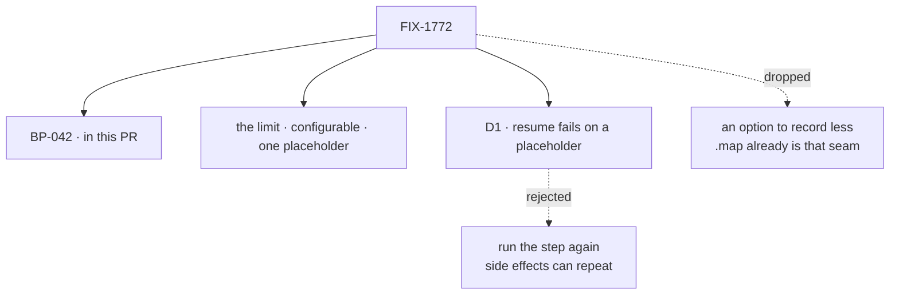

# FIX-1772 · Decisions

[Spec](SPEC.md) · **Decisions** · [Rules](BUSINESS-RULES.md) · [Plan](PLAN.md) · [Docs](DOCS.md)

The product owner set the direction on 2026-10-09: a configurable backstop limit, no new
record option, and BP-042. One call is left, D1, with my recommendation.

## The tree

Solid edges are what you sign. Dashed edges lost, and the label says why.

## Decided by the product owner

Binding, recorded so nobody re-derives them:

- **The limit is a backstop, configurable, with a default.** `maxRecordedValueBytes`, 256 KiB,
  wired like `maxResponseBufferSize` (BP-026). A fixed constant was considered and dropped.
- **It applies to step outputs and tool results alike.** A tool an agent reads gets the same
  limit.
- **Over the limit, one placeholder records the size and a prefix.** One shape, for a step's
  output and a tool's result.
- **No "not resumable" flag and no option to record less than a step returns.** Item 3 is
  dropped. Sequencer `.map` already is the seam for transient data: it is an operation, not a
  block, so it records nothing and simply runs again on resume.
- **BP-042:** a handler or action must not return an unbounded payload. Transient bulk data goes
  through `.map`; data meant for a person gets a proper read path, not an action's return.

## D1 · A resumed request that needs a placeholder's value fails, with an error naming the step

**The fork:** a request that resumes after a pause or a crash reuses what its finished steps
saved. If a value it must hand on was recorded only as a placeholder, does the resume fail, or
run that step again?

| | |
|---|---|
| **Instead of** | Running the step again |
| **Because** | With `.map` as the sanctioned seam, the limit only fires on misuse: a step that broke BP-042. A resume that needs that step's value is rarer still. Failing names the step, never repeats a side effect, and needs one check where resume reads a saved value. Running again repeats any write the step doesn't guard, and needs a new re-dispatch path for a generator's finished tool call, all to rescue a bug |
| **Locks in** | A resumed request never computes from a placeholder. When misuse meets a resume, that request fails and the user retries; the error points its owner at the step |

It comes down to side effects: failing never repeats one; running again repeats any unguarded write.

**What would change my mind:** a real flow that trips the limit often, so the limit stops being
a misuse backstop and recovering matters more than failing loudly. Then run the step again.

**If wrong:** a request that could have recovered is lost, and its user retries once the step is
fixed.

## Decided, not asked

- **Fail only where the placeholder would be handed on.** A finished parent whose own output is
  small replays whole; a placeholder inside it is never read and fails nothing.
- **The limit sits at the response emitter**, which every step output and tool result passes on
  its way to the record (tenet 5; the [poc](PLAN.md#at-implement-time) counts the writers).
- **Trace inputs are not limited in this issue** (review, BR-5). The incident and the goal are
  about returns, and an input is usually a ref to an output already limited. A follow-up.
- **One placeholder shape**, the same object for a block value and a tool result (review).

## Considered and dropped

| Alternative | Why not |
|---|---|
| A fixed 256 KiB constant (review) | The owner chose configurable |
| A second store for oversized values | The issue rules it out, and it keeps the payload we want gone |
| One check per writer | Four writers to keep in step. The emitter is where they meet |

## How it got here

- **Draft** — a record limit behind a written rule, a placeholder resume never replays, the record
  option deferred.
- **Owner direction, 2026-10-09** — the record option dropped (`.map` is the seam); the limit made a
  configurable backstop for outputs and tool results; resume narrowed to fail-or-re-run, now
  recommending fail, because the limit fires only on misuse.

**Open: none.**
