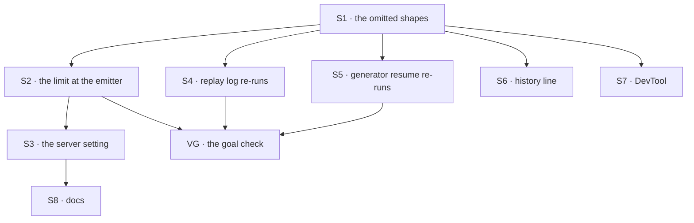

# FIX-1772 · Plan

[Spec](SPEC.md) · [Decisions](DECISIONS.md) · [Rules](BUSINESS-RULES.md) · **Plan** · [Docs](DOCS.md)

Written for the implementing agent. IDs cross-reference [BUSINESS-RULES.md](BUSINESS-RULES.md)
(BR-n) and [DECISIONS.md](DECISIONS.md) (Dn). `tdd`. One PR. Item 1 (BP-042) already shipped
in the spec PR; this plan builds item 2. Item 3 is not built ([D3](DECISIONS.md#d3)).

## Surfaces

| ID | Package · role | Change | Rules |
|---|---|---|---|
| S1 | `contracts` · item types and the value resolver | Add the `omitted` case to the block value union: `{ kind: "omitted", bytes, preview }`, `bytes` nullable when the value could not be serialized. Add nullable `outputOmitted: { bytes, preview }` to the tool result item. The resolver returns `undefined` for `omitted` | BR-2 BR-3 BR-6 BR-16 |
| S2 | `engine` · the response emitter, every item entry (`added`, `updated` patch, `done`, one-shot) | The one record seam. For a trace: the inline output (structure leaves too) and the inline input, raw and connected. For a tool result: `output` and `modelOutput` together. Over the limit → the placeholder plus one warning. Writes a **copy**; never mutates the caller's object | BR-1–BR-8 BR-9 |
| S3 | `engine` · `RuntimeConfig` and `createFlowApiRouter` (and `createFlowState` if it takes router options) | `maxRecordedValueBytes`, default 256 KiB, forwarded to the emitter. Same shape as `maxResponseBufferSize` (BP-026) | BR-12 |
| S4 | `core` · the replay log | A completed trace whose output, after ref resolution, is `omitted` or a tool result with `outputOmitted` is **not** a completed output: the step runs again (D1) | BR-13 BR-15 BR-16 |
| S5 | `core` · generator resume (and the canonical log's tool-result dedupe) | A completed tool result with `outputOmitted` is not settled: the call runs again. The re-run copy, not the placeholder, is the canonical one | BR-14 |
| S6 | `engine` · history | A tool result with `outputOmitted` replays as one text line naming the tool and the size | BR-11 |
| S7 | `devtool` · the value view and the tool result detail | Render `omitted` and `outputOmitted`: size and preview, marked as omitted | BR-2 |
| S8 | Docs | Per [DOCS.md](DOCS.md): `docs/architecture/items.md`, the streaming items page, the server API page, `packages/engine/README.md`. One `minor` changeset for `contracts`, `core`, `engine` | — |

## Sequence



## Checks

| ID | Runs after | Passes when |
|---|---|---|
| V1 | S2 | BR-1 byte for byte; BR-2, BR-5, BR-7 at the boundary (limit, limit + 1); BR-6 on a cycle and a BigInt; BR-8 logs a size and no value |
| V2 | S2 | BR-3 once per writer: a generator tool, `.asTool()`, and one coding-harness emitter. The poc's writer list is the list |
| V3 | S2 | BR-9: the next step and `getBlockOutput` see the full value while the stored item holds the placeholder. Assert on the store, not on the emitter's return |
| V4 | S3 | BR-12: a raised setting records a 300 KiB value whole; the default does not |
| V5 | S4 | BR-13 with a real side-effect counter: an oversized step runs twice across a suspend and resume, and the final output is correct. BR-15: an ordinary step runs once |
| V6 | S5 | BR-14: a suspended generator with a finished oversized tool call re-dispatches it, and the model's next message carries the real result |
| V7 | S6 | BR-11 on a two-turn session |
| V8 | S1 S4 | BR-16 on a recorded legacy log with no placeholders: the canonical log and resume are unchanged |
| VG | all | [The goal](SPEC.md#the-goal-and-how-well-know-its-met): `goals/oversized-output/stays-out-of-the-record/run.mts` PASSES on a real server and SQLite store, after the same run FAILED under `GOAL_CONTROL=no-limit` and `GOAL_CONTROL=replay-placeholder` |

## Pinned names

| Where | Name | Why pinned |
|---|---|---|
| Block value kind | `omitted` | Public: clients and DevTool switch on it |
| Tool result field | `outputOmitted` | Public: clients render it |
| Server option | `maxRecordedValueBytes` | Public: an owner types it |
| Default | 256 KiB (262,144 bytes) | D2 |
| Preview | first 512 characters of the serialized value | Documented, and it is all a reader gets |

Everything else is yours to name.

## Guardrails

| Rule | Because |
|---|---|
| The emitter is the only place the limit is applied (tenet 5) | The poc counts four writer files and ten sites. A check at each would drift, and the next harness would skip it |
| The emitter writes a copy; the live object keeps the real value | The tool helper and the trace hook keep references to the items they emit. Mutating them would hand the placeholder to the run |
| Resume never injects a placeholder (D1) | A placeholder handed on as input is a wrong result with no error |
| A value at or under the limit is recorded byte for byte as today (BP-030) | Almost every step is in that case, and stores diff items by content |
| Test the resume path, not only the first run (BP-035) | The re-run on resume is the only behaviour this adds to a run |

## Docs

Reconcile [DOCS.md](DOCS.md) against the shipped behaviour after VG passes, then publish it.
BP-042 already shipped in the spec PR; check its last bullet still matches the shipped limit.

## Sketch · pseudocode, illustrative, react to the shape

```
at the response emitter, for every item entering added / updated / done:
    copy ← shallow copy of the item
    for each recorded value slot in copy:            ← trace input, trace output, tool output
        size ← serialized byte length (unknown if it can't serialize)
        if size unknown or size > limit:
            replace the slot with { omitted, size, preview }
            warn once: step, item type, size
    store, stream and log the copy; return as today

at resume:
    a recorded output that is omitted counts as "not finished"   ← D1
    so the step (or the tool call) runs again, as an unfinished one does today
```

**POC:** [`poc/record-sites/check.mjs`](poc/record-sites/check.mjs) re-derives the counts this
plan rests on. Run `node specs/issues/FIX-1772/poc/record-sites/check.mjs` from the repo root.
It showed 4 writer files and 10 sites that build a tool result, all through `ctx.response.emit`,
and 7 files that read saved traces or tool results, of which 3 feed a saved value back into a
run (the replay log, generator resume, history). The premise held: one emitter seam covers every
writer. With `--plant`, an unclassified writer and reader are added and the check fails, as it
must.

## At implement time

- Re-run the poc. A new writer or reader since this was written must be classified first.
- Check every path that persists items goes through the emitter's item map: `runAction`'s
  incremental persistence, request continuation, scope and reactive emits.
- Check the canonical log's tool-result dedupe by call id picks the re-run copy over the
  placeholder (S5).
- `summarizeForLog` still stringifies the whole value. Leave it unless it is in the way.

## Follow-ups

- History replays a tool's raw `output` and ignores `modelOutput`, so a later turn never sees a
  tool's `mapModelOutput` text. Possibly a bug; file it on its own.
- `mapModelOutput`'s doc comment says history re-runs the mapper; tool results now persist its
  text. Doc drift.
- The request record's input and result are not limited. Out of scope by design; revisit if a
  caller's own result gets too big to store.
- Keeping secrets out of the record needs a content-aware filter, not a size limit.
