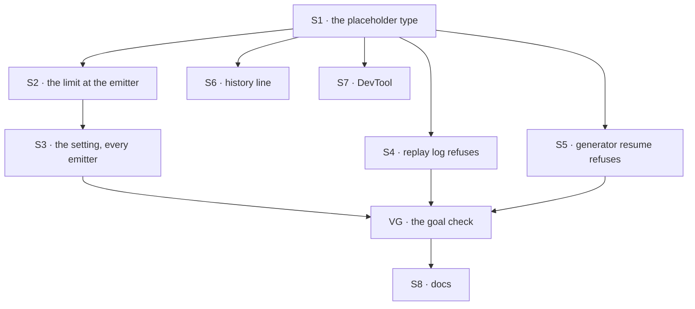

# FIX-1772 · Plan

[Spec](SPEC.md) · [Decisions](DECISIONS.md) · [Rules](BUSINESS-RULES.md) · **Plan** · [Docs](DOCS.md)

Written for the implementing agent. IDs cross-reference [BUSINESS-RULES.md](BUSINESS-RULES.md)
(BR-n) and [DECISIONS.md](DECISIONS.md) (Dn). `tdd`. One PR. BP-042 already shipped in the spec
PR; this plan builds the limit and the resume refusal.

## Surfaces

| ID | Package · role | Change | Rules |
|---|---|---|---|
| S1 | `contracts` · item types and the value resolver | **One** placeholder type, `{ kind: "omitted", bytes, preview }` (`bytes` nullable). It is a new case of the block value union, and the tool result carries the same object in one nullable field, with `output` and `modelOutput` absent. The resolver returns `undefined` for it | BR-2 BR-3 BR-7 BR-17 |
| S2 | `engine` · the response emitter: `emitItemAdded`, `emitItemUpdated` patches, `emitItemDone`, one-shot | The one record seam. Limits a trace's output (structure leaves too) and a tool result's `output` + `modelOutput`. Writes a **copy**; never mutates the caller's object | BR-1–BR-9 BR-11 |
| S3 | `engine` · `RuntimeConfig`, `createFlowApiRouter`, and every emitter construction: the host's live stream and its `createResponseEmitter({ requestId })` fallback, request continuation, request recovery | `maxRecordedValueBytes`, forwarded like `maxResponseBufferSize` (BP-026). The 256 KiB default lives in the emitter itself, so an emitter built without the option is still limited | BR-10 |
| S4 | `core` · the replay log | A completed trace whose resolved output is the placeholder is injected as a failure, not a value: the omitted-value error naming the step (D1) | BR-13 BR-15 BR-17 |
| S5 | `core` · generator resume | A finished tool call whose result is the placeholder raises the same error | BR-14 |
| S6 | `engine` · history | A placeholder tool result replays as one text line naming the tool and the size | BR-12 |
| S7 | `devtool` · the value view and the tool result detail | One renderer for the one placeholder: size, preview, marked omitted | BR-2 |
| S8 | Docs | Per [DOCS.md](DOCS.md). One `minor` changeset for `contracts`, `core`, `engine` | — |

## Sequence



## Checks

| ID | Runs after | Passes when |
|---|---|---|
| V1 | S2 | BR-1 byte for byte; BR-2, BR-8 at limit and limit + 1; BR-7 on a cycle and a BigInt; BR-9 logs a size, never a value |
| V2 | S2 | BR-3 once per writer in the poc's list, and once through `emitItemUpdated`, the path a tool's completion takes |
| V3 | S2 | BR-5 and BR-6: a final `.map` is limited on the sequencer's trace; a middle one leaves no trace of its value |
| V4 | S2 | BR-11: the next step and `getBlockOutput` see the full value while the **stored** item holds the placeholder |
| V5 | S3 | BR-10 through the router and through one fallback emitter path |
| V6 | S4 S5 | BR-13, BR-14 across a real suspend and resume; BR-15 with a small parent around a placeholder child |
| V7 | S6 S1 | BR-12 on a two-turn session; BR-17 on a recorded legacy log |
| VG | all | [The goal](SPEC.md#the-goal-and-how-well-know-its-met): `goals/oversized-output/stays-out-of-the-record/run.mts` (new in the implementation PR) PASSES on a real server and SQLite store, after FAILING under `GOAL_CONTROL=no-limit` and `GOAL_CONTROL=replay-placeholder` |

## Pinned names

| Where | Name | Why pinned |
|---|---|---|
| Placeholder | `{ kind: "omitted", bytes, preview }` | Public: clients and DevTool switch on it |
| Server option | `maxRecordedValueBytes`, default 262,144 | Public: an owner types it |
| Preview | first 512 characters of the serialized value | Documented |
| Error code | `RECORDED_VALUE_OMITTED` | Public: an owner searches for it |

The tool result's field name for the placeholder, and everything else, is yours.

## Guardrails

| Rule | Because |
|---|---|
| The emitter is the only place the limit is applied (tenet 5) | Four writer files and ten sites today. A check at each would drift, and the next harness would skip it |
| Every emitter gets a limit; a fallback emitter gets the default | An emitter built without the option would record unlimited values, silently |
| Write a copy; the live object keeps the real value | The tool helper and the trace hook keep references to what they emit |
| Count bytes with an early exit at the limit, measure once per value at its terminal state, and skip patches that touch no recorded field | Otherwise a multi-MB value pays a full stringify per emit, only to be dropped |
| At or under the limit, byte for byte as today (BP-030) | Almost every step is in that case, and stores diff items by content |
| Test the resume path, not only the first run (BP-035) | The refusal is the one new behaviour a run can see |

## Docs

Reconcile [DOCS.md](DOCS.md) with the shipped behaviour after VG passes, then publish it.

## Sketch · pseudocode, illustrative, react to the shape

```
at the response emitter, on added / done / one-shot, and on an updated patch that sets a recorded field:
    for each recorded slot:                       ← trace output, tool output + model text
        size ← byte count, stopping at limit + 1  (unknown if it can't serialize)
        if size unknown or size > limit:
            slot ← { omitted, size, preview }  on a copy
            warn once: step, item type, size
    store, stream and log the copy

at resume, where a saved value would be handed on:
    if it is omitted → fail: RECORDED_VALUE_OMITTED, the step, the limit      ← D1
```

**POC:** [`poc/record-sites/check.mjs`](poc/record-sites/check.mjs). It showed 4 writer files and
10 sites that build a tool result, all through `ctx.response.emit`, and 7 files that read saved
items, 3 of which hand a saved value back to a run. With `--plant` it fails, as it must.

## At implement time

- Re-run `node specs/issues/FIX-1772/poc/record-sites/check.mjs` before building, and again
  after touching any emit path. A writer or reader it doesn't know must be classified first.
- Find every emitter construction (today: the host's live stream and its request-id-only
  fallback, continuation, recovery) and forward the option to each.
- Check the canonical log keeps a placeholder tool result, so resume sees it and refuses.

## Follow-ups

- `readProjectFiles` still calls `readContent()` on every file only to compute its size
  (`project-files.ts:57`). A stat or a stored size would do.
- Limit trace inputs (a request's entry input, a `forEach` element). Deferred from this issue.
- History replays a tool's raw `output` and ignores `modelOutput`, so a later turn never sees a
  tool's `mapModelOutput` text; `connectors.md` says history re-runs the mapper. File it.
- Keeping secrets out of the record needs a content-aware filter, not a size limit.
