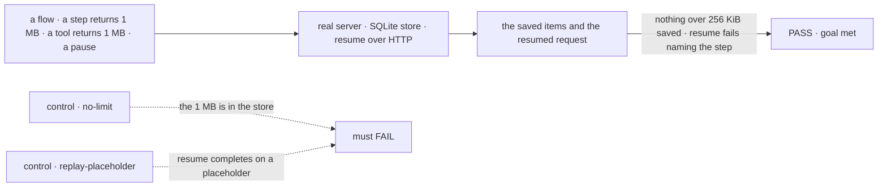
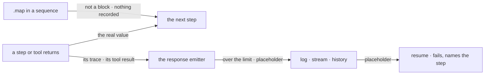

# FIX-1772 · A handler's logged output must not be its whole return

**Spec** · [Decisions](DECISIONS.md) · [Rules](BUSINESS-RULES.md) · [Plan](PLAN.md) · [Docs](DOCS.md)

## Five people, before and after

| Someone who… | Today | After |
|---|---|---|
| **writes an action that returns every file body for a person to read** | Nothing warns them. The whole return is recorded as the step's output and as the tool result, streamed, and sent to later prompts | A written rule says: give a person a read path, not an action return. If they miss it, the record keeps only the size and a preview |
| **passes bulk data between steps of a sequence** | `.map` already keeps it out of the record, but nothing says that is the way | The rule names `.map` as the seam for transient data. Nothing else changes |
| **chats with an agent whose tool returned 1 MB** | Every later turn resends the whole result | Later turns see one line naming the size |
| **has a request that resumes after such a step** | Resume hands the saved value on | The resume fails with an error naming the step, rather than compute from a placeholder ([D1](DECISIONS.md#d1)) |
| **returns small values** (almost every step) | Recorded whole | Byte for byte as today |

The case that prompted this was neither a resume nor a multi-step flow. `readProjectFiles` is a
standalone action a person calls to read a project's files, which have no browser read. Its
return was recorded as the tool result, so every body landed in the session log and the model's
context, and nothing used them. [#2738](https://github.com/fixpoint-labs/flow-state-dev/pull/2738)
fixed it with paths and sizes. This issue stops the next one.

## The goal, and how we'll know it's met

**No step's return or tool result can put more than the server's limit (256 KiB by default)
into the request log, the stream or a later prompt, and no resumed request ever computes from
what the limit left out.**

| Is it the right goal? | |
|---|---|
| **The real need** | *"This issue is so the next handler cannot do the same thing by accident"*, and *"fail closed when someone misses it"* ([FIX-1772](https://linear.app/fixpoint-labs/issue/FIX-1772)) |
| **Smaller, and rejected** | "Write the rule down." It ships in this PR, but alone it fails open: the next step that misses it still writes megabytes |
| **Bigger, and not this issue's** | Keeping secrets out of the record (a content filter, not a size limit) · limiting trace inputs ([follow-up](PLAN.md#follow-ups)) · a way to record less than a step returns (dropped: `.map` is that seam) |
| **Not done if** | Agent tool results or the sequencer output a final `.map` produces escape the limit · the check reads the emitter, not the store · resume "passes" because the test never uses the value |



The check reads the store and the resumed request, never memory. Each control removes one half
of the goal, and must fail.

| How we verify | |
|---|---|
| **Goal check** | `goals/oversized-output/stays-out-of-the-record/` · model `n/a` · run by the implementer at completion · verdict in the implementation PR |
| **Signal** | No saved item or stream event contains the payload's held-out marker; no saved item is over 300 KiB. The resumed request ends failed with the omitted-value error naming the step. A second flow that passes the same 1 MB through a middle `.map` saves no marker and resumes to the right result |
| **Input** | A held-out 1 MB value built at run time. Another size over the limit, or the pause in another later step, must pass too |
| **Anti-game** | No assertion on the emitter's return or on a mocked store. The later step computes from what it receives, so a placeholder cannot pass as data |
| **Control that must fail** | `GOAL_CONTROL=no-limit`: FAILS on *no saved item contains the marker*. `GOAL_CONTROL=replay-placeholder`: FAILS on *the resumed request ends failed*. Today's `main` fails the first |

## What changes


Left of the fence nothing changes. Right of it, an oversized value becomes a placeholder, and
resume refuses rather than guess.

**What a step author writes** ([BP-042](../../../docs/contributing/best-practices/blocks.md#bp-042-a-handlers-or-actions-return-is-recorded--never-return-an-unbounded-payload)):

```diff
  const pipeline = sequencer({ name: "summarize-repo" })
-   .step(readAllFiles)                                   // returns every body: recorded whole
-   .step(summarize)
+   .step(listFiles)                                      // returns paths and sizes
+   .map(async (list, ctx) => loadBodies(list, ctx))      // transient: .map records nothing
+   .step(summarize)                                      // returns a small summary
```

**What a server owner can change** (optional, like `maxResponseBufferSize`):

```diff
  createFlowApiRouter({
    registry,
+   maxRecordedValueBytes: 1024 * 1024,   // default 256 KiB
  })
```

## How a value reaches the record



`.map` is an operation, not a block: it records nothing and re-runs on resume. Every step
output and tool result passes one emitter, so the limit sits there, once. A `.map` that is a
sequencer's last step becomes the sequencer's recorded output; the limit covers that too.

## What stays as it is

- The value in memory: the next step, `ctx.getBlockOutput()` and a tool's caller get it whole.
- `.map`, and `mapModelOutput` and what a model is told in the turn that called the tool.
- Trace inputs, the request record's own input and result, and the 240-character debug line.

## Sign off

**[The goal](#the-goal-and-how-well-know-its-met), at that size:** nothing over the limit in the
record, and no resumed request built on a placeholder. If wrong: a backstop with a hole in it,
or one that corrupts resumed runs.

1. **[D1](DECISIONS.md#d1) · A resumed request that needs a value recorded only as a
   placeholder fails, with an error naming the step.** If wrong: a request that could have
   recovered by running the step again is lost, and the user retries.

**Decided by the product owner** ([record](DECISIONS.md#decided-by-the-product-owner)): the
limit is a configurable backstop, 256 KiB by default, the same for step outputs and agent tool
results, recorded as one placeholder of size and prefix · no option to record less than a step
returns; `.map` is that seam · BP-042 as worded.

**Open: none.** Reasoning and what lost: [DECISIONS.md](DECISIONS.md). The cases:
[BUSINESS-RULES.md](BUSINESS-RULES.md).

Feature · `contracts` + `core` + `engine` + `devtool` · medium · 1 PR · no epic
