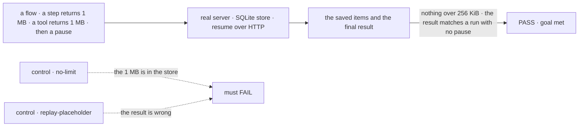
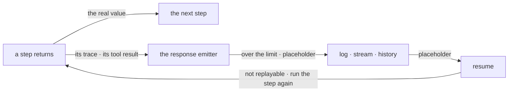

# FIX-1772 · A handler's logged output must not be its whole return

**Spec** · [Decisions](DECISIONS.md) · [Rules](BUSINESS-RULES.md) · [Plan](PLAN.md) · [Docs](DOCS.md)

## Six people, before and after

| Someone who… | Today | After |
|---|---|---|
| **writes a step that returns every file body** | Nothing warns them. The whole return goes into the log, the stream and, for a tool, later prompts | A written rule says return paths and sizes. If they miss it, the log keeps only the size and a preview; the run still gets the full value |
| **reads a run in DevTool** | One trace row can hold megabytes | Sees "omitted", the size and the first 512 characters |
| **has a request that resumes after such a step** | Resume hands the saved value to the later steps | That step runs again, and the later steps get the real value |
| **chats with a model whose tool returned 1 MB** | Every later turn resends the whole result | Later turns send one line naming the size |
| **returns small values** (almost every step) | Recorded whole | Byte for byte as today |
| **returns a secret** | Recorded | Still recorded: a size limit never catches a small value. The written rule is the only guard ([D3](DECISIONS.md#d3)) |

`readProjectFiles` on [#2738](https://github.com/fixpoint-labs/flow-state-dev/pull/2738) showed
this, and was fixed there. This issue stops the next step doing it by accident.

## The goal, and how we'll know it's met

**No step's return can put more than 256 KiB into the request log, the stream or a later
prompt, and a request that resumes after such a step still ends with the result it would have
had.**

| Is it the right goal? | |
|---|---|
| **The real need** | *"This issue is so the next handler cannot do the same thing by accident"*, and *"fail closed when someone misses it"* ([FIX-1772](https://linear.app/fixpoint-labs/issue/FIX-1772)) |
| **Smaller, and rejected** | "Write the rule down." Item 1 ships in this PR, but alone it fails open: the next step that misses it still writes megabytes |
| **Bigger, and not this issue's** | Keeping secrets out of the record (a content filter, not a size limit) · a second store for large values (ruled out) · later turns ignoring `mapModelOutput` ([follow-up](PLAN.md#follow-ups)) |
| **Not done if** | Tool results or coding-harness tool results escape the limit · the check reads the emitter, not the store · resume passes only because the test never uses the value |



The check reads the store and the final result, never memory. Each control removes one half of
the goal, and must fail.

| How we verify | |
|---|---|
| **Goal check** | `goals/oversized-output/stays-out-of-the-record/` · model `n/a` · run by the implementer at completion · verdict in the implementation PR |
| **Signal** | No saved item or stream event contains the payload's held-out marker string; no saved item is over 300 KiB. The resumed request's result equals the hash of the full 1 MB value, the same as a run with no pause |
| **Input** | A held-out 1 MB value built at run time. A different size over the limit, or the pause in a different later step, must pass too |
| **Anti-game** | No assertion on the emitter's return value or on a mocked store. The later step must compute from the value it receives, so a placeholder can't pass as data |
| **Control that must fail** | `GOAL_CONTROL=no-limit`: FAILS on *no saved item contains the marker*. `GOAL_CONTROL=replay-placeholder`: FAILS on *the result equals the full hash*. Today's `main` fails the first |

## What changes


Left of the fence nothing changes. Right of it, an oversized value becomes a placeholder, and
resume, the one reader that needs the real value, gets it by running the step again.

**What a step author writes** (the rule, [BP-042](../../../docs/contributing/best-practices/blocks.md#bp-042-a-blocks-return-is-recorded--never-return-an-unbounded-payload)):

```diff
  execute: async (_input, ctx) => {
-   return { files: await readAllFiles(ctx) }                                   // every body, recorded whole
+   return { files: (await listFiles(ctx)).map(({ path, size }) => ({ path, size })) }
  }
```

**What a server owner can change** (optional):

```diff
  createFlowApiRouter({
    registry,
+   maxRecordedValueBytes: 1024 * 1024,   // default 256 KiB
  })
```

## How a value reaches the record



Every item passes one emitter on its way to the record, so the limit sits there, once.

## What stays as it is

- The value in memory: the next step, `ctx.getBlockOutput()` and a tool's caller get it whole.
- `mapModelOutput`, and what a model is told in the turn that called the tool.
- The 240-character debug log line, which is not this limit.
- The request record's own input and result, and the opt-in tool cache.

## Sign off

**[The goal](#the-goal-and-how-well-know-its-met), at that size:** nothing over the limit in the
record, and a resumed request still correct. If wrong: a limit that corrupts resumed runs, or a
rule with nothing behind it.

1. **[D1](DECISIONS.md#d1) · A resumed request runs an oversized step again; it never gets the
   placeholder.** **The one to weigh.** If wrong: that step's side effects run twice on resume,
   or, the other way, later steps compute from a placeholder with no error.
2. **[D2](DECISIONS.md#d2) · Over 256 KiB, the record keeps a placeholder and the run goes on.**
   If wrong: we keep runs alive that should have stopped, or stop runs over a logging limit.
3. **[D3](DECISIONS.md#d3) · Item 3, an option to record less than the step returns, is not
   built. If it is built later, it is its own option, not part of `mapModelOutput`.** If wrong:
   a step that must pass a large value on has to keep it in a resource.

**Open: none.** Reasoning and what lost: [DECISIONS.md](DECISIONS.md). The cases:
[BUSINESS-RULES.md](BUSINESS-RULES.md).

Feature · `contracts` + `core` + `engine` + `devtool` · medium · 1 PR · no epic
