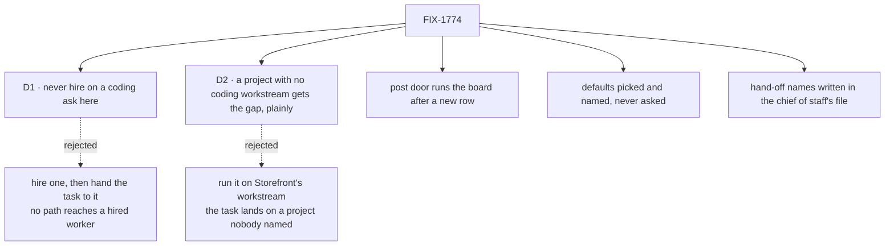

# FIX-1774 · Decisions

[Spec](SPEC.md) · **Decisions** · [Rules](BUSINESS-RULES.md) · [Plan](PLAN.md) · [Docs](DOCS.md)

Two calls shape what a person sees. Both narrow Jake's issue text to what the DevTeam Lab can
actually do today, so both are on the sign-off.

## The tree

Solid edges are this spec's calls. Dashed edges lost, and the label says why.

## D1 · On a coding ask the chief of staff never hires in this Lab; with no coding worker, it says so

| | |
|---|---|
| **Instead of** | Jake's literal bullet: hire when no suitable worker exists, then hand the task to the hire |
| **Because** | A hire cannot be given the work. A hired worker is on no workstream, the feature mailbox wakes only the EM, and the board hands rows only to the coder the tree declares ([POC finding 2](poc/the-dogfood-turn/README.md)). So "hire, then hand over" is exactly the hire-and-stop bullet 4 forbids. DevTeam already has `eng.coder`, so the case is moot here; the rule is for a Lab without one |
| **Locks in** | A coding ask is never a reason to hire until a hired worker can join a workstream. An explicit request to hire still hires |

It comes down to whether a hire can be given the work: today it can't, so a hire starts nothing.

## D2 · A project with no coding workstream gets "not yet, and here is why", not a task elsewhere

| | |
|---|---|
| **Instead of** | Posting the ask on `eng.feature` anyway and telling the person the task landed on Storefront |
| **Because** | Jake: "the coordinator's next step is the task *on that project*". A task on Storefront is not on Platform, and once [FIX-1762](https://linear.app/fixpoint-labs/issue/FIX-1762) lands it would run in Storefront's repository. A workstream belongs to one project at most, so the chief of staff can't borrow `eng.feature` either. Saying the gap is bullet 4 |
| **Locks in** | Until a project can take coding work of its own ([FIX-1763](https://linear.app/fixpoint-labs/issue/FIX-1763)), asking for code in Platform or a new project gets a sentence, not a run. An ask that names no project goes to `eng.feature` and the reply names Storefront |

It comes down to which project the task lands on: elsewhere is the wrong project's code.

## Decided, not asked

- **The post door runs the board after it files a new row.** The Shift Manager README already
  says a posted `slug: what to build` is picked up by the coder; today it isn't
  ([POC finding 3](poc/the-dogfood-turn/README.md)). Same shape as the Inbox ask's approve branch.
  A repeated slug files nothing and runs nothing new. The run belongs to whoever posted.
- **Waived choices get plain defaults, named in the line.** Vite, React and TypeScript, plain CSS,
  for a React ask. The person sees them in the reply and can change them by asking.
- **The hand-off names are written in the chief of staff's file.** `discover` lists workers and
  mailboxes but not which board a worker drains or the line shape a workstream files from, so the
  file states `eng.coder`, `eng.feature` and the `slug: what` shape. The file is the Lab's own,
  beside the folders it names.
- **The chief of staff reads the projects each turn.** It needs which project holds which
  workstream for BR-4 and BR-5, and today it can only write projects. A read from the stored rows,
  not a list in its file, because projects are the app's data and change at run time.
- **"With Claude Code" picks no harness.** Which harness a run uses is the Lab operator's
  setting. The chief of staff neither hires a worker named for a harness nor claims one.
- **The reply after a hand-off names the task, not a run result.** `post-to-mailbox` reports a
  hand-off, not the row, so the chief of staff says where to follow it. It does not claim the run
  succeeded.

## Considered and dropped

- **A tool that files a row on a board for a named worker.** A new dispatch verb next to routing
  that already exists. The Architect's fence invent-kills it, and the post door is that path.
- **Teaching `discover` to return a mailbox's charter and boards**, so the chief of staff learns
  the hand-off from the tree. Right direction, but a Workforce change for one caller. A
  [follow-up](PLAN.md#follow-ups).
- **Making `hire` refuse a kind no board or mailbox can reach.** `hire` already warns, and the
  model ignored it. Refusing is a Workforce policy change wider than this issue.
- **Instructions only.** The POC showed a correct post still starts nothing.

## Open

None.

## Settled

- **Hired workers have no way in** (the Architect's hunch). Confirmed by the POC: inventory and
  host wiring show no mailbox address and no board hand-off for any hired worker.
- **A shaped post files a row and nothing runs it.** Confirmed: `{"filed":true}` and no claim.
- **Running the board after the file starts the coder.** Confirmed with a local, uncommitted
  change: claim, hand-off, `harness-manager` prompt carrying the task.

## How it got here

- **Draft** — The dogfood failure is two gaps, not one: the chief of staff was never told how to
  hand off coding work, and the hand-off it should use files a task nobody runs. One PR fixes
  both in the DevTeam Lab, with no package change.
- **Round 1** — Codex found the chief of staff can't read projects, so it could not name Storefront
  or the Platform gap without guessing. Added a read of the stored projects (S6).
