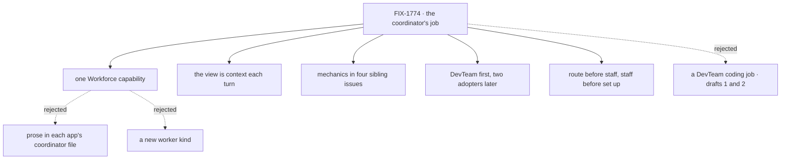

# FIX-1774 · Decisions

[Spec](SPEC.md) · **Decisions** · [Rules](BUSINESS-RULES.md) · [Plan](PLAN.md) · [Docs](DOCS.md)

Nothing here needs a sign-off. The job (route, hire as needed, set up mailboxes, get work
flowing) is Jake's. These are the calls that give it a shape.

## The tree

Solid edges are this spec's calls. Dashed edges lost.

## Decided, not asked

- **One capability, `createCoordinatorCapability(options)`, in `@flow-state-dev/workforce`.** A
  coordinator is any worker that composes it. It bundles the coordinator's tools, a view, and the
  job as instructions. A capability, because that is how the codebase hands a worker a
  self-contained bundle of tools, context and resources (CLAUDE.md, *Capabilities*), and because
  any kind can compose it: DevTeam's `agent` kind, kitchen-sink's specialists, a lab's
  `coordinator` kind.
- **Not a new worker kind.** A kind fixes a flow; apps already have coordinators on different
  kinds. A kind would make each rebuild on it or lose it.
- **The view is context on every turn, not tools to call.** Projects, mailboxes with their
  descriptions, task lists and who works each one, and the status of tasks this coordinator filed.
  The model can't route to what it can't see, and the survey found every coordinator today guesses
  from names. It is bounded to the organization's mailboxes and the coordinator's own tasks, so it
  stays small.
- **The job is instructions the capability carries, as a preset.** An app can turn it off
  (`presets({ job: false })`) and write its own. The app's file adds the kinds it may hire and its
  house rules.
- **The tools' mechanics are the sibling issues'.** FIX-1777 makes a task start its worker
  however it landed; FIX-1778 makes an assignee a worker's name, found at hand-over, gives `agent`
  hires a task door and lets any worker claim from any list; FIX-1779 sets up and subscribes
  mailboxes and adds the filing tool and the "who works this list" read; FIX-1780 tells the filer
  how a task ended and adds reassign. This issue composes them and owns the job.
- **Route before staff, staff before set up.** Jake's order. The cheapest lasting change goes
  first: a task changes nothing about who works here; a hire does; a mailbox changes where work
  lives.
- **Hire gains an optional `description`.** Purpose routing and the view both read a worker's
  description, and a hire has none today, so it can only ever be a fallback.
- **Overload hiring is in the job; the app prices it.** A second worker of the same kind when a
  list backs up behind a busy one. An app that wants a person to approve hires lists `hire` in
  `askBefore`, which exists. Not graded here: a backlog needs a slow harness to be real.
- **No twin for a worker that didn't start.** A worker that never starts is a missing floor. The
  coordinator says so. (The Architect's fence.)
- **DevTeam is the proving ground; kitchen-sink and the manager-queue lab adopt later.** Each has a
  coordinator-shaped hole today (an escalations list nobody works; desks hard-coded in a prompt).
  Naming them as follow-ups keeps this PR to one adopter and one check.
- **The control is "without the capability", not "today's file".** It changes one thing: whether
  the chief of staff composes the capability.

## Considered and dropped

- **A DevTeam coding job in the chief of staff's file.** Drafts 1 and 2. One flow, one Lab, and
  every other coordinator left to copy it.
- **Posting a shaped line to hand work over.** A post leaves the outcome to whoever reads it; a
  filed task is the coordinator's own and FIX-1780 can report on it.
- **A routing skill.** Skills load on demand; routing is the coordinator's every turn.
- **Cross-organization coordination.** One coordinator, one organization.

## Open

None.

## Settled

- **Hires can't be given work today; a post files a task nobody runs.** Confirmed by the
  [POC](poc/the-dogfood-turn/README.md). FIX-1777 and FIX-1778 own the fixes.
- **No coordinator today can create a mailbox, see who works a list, or hear how a task ended.**
  Confirmed by survey of DevTeam, kitchen-sink, the manager-queue lab and the pentest lab.

## How it got here

- **Draft** — Never hire; post the ask on `eng.feature`; make the post door run the board.
- **Round 1** — Codex: the chief of staff can't read projects. Added a project read.
- **Round 2** — Jake: break it into parts; hire, assign, set up mailboxes. Split out FIX-1777,
  FIX-1778, FIX-1779; this became the chief of staff's instructions.
- **Round 3** — Jake: step back; the coordinator's job across use cases. This became the
  coordinator capability, with FIX-1780 for follow-through.
