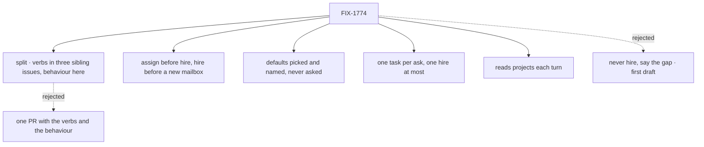

# FIX-1774 · Decisions

[Spec](SPEC.md) · **Decisions** · [Rules](BUSINESS-RULES.md) · [Plan](PLAN.md) · [Docs](DOCS.md)

Nothing here needs a sign-off. The shape (assign first, hire when nothing fits, set up a mailbox
when nothing can hold the task) is Jake's, from his comment on this spec. What follows are the
calls that fill it in.

## The tree

Solid edges are this spec's calls. Dashed edges lost.

## Decided, not asked

- **The verbs live in three sibling issues; this one is behaviour.** Assigning a task to a named
  worker ([FIX-1778](https://linear.app/fixpoint-labs/issue/FIX-1778)) and setting up a mailbox
  ([FIX-1779](https://linear.app/fixpoint-labs/issue/FIX-1779)) are Workforce capabilities any
  coordinator can use, each with its own design and its own reversal of a documented rule. A post
  that starts its worker ([FIX-1777](https://linear.app/fixpoint-labs/issue/FIX-1777)) is a Lab fix
  people hit without a coordinator. Folding them in would make one PR carry three designs.
- **Assign before hire, hire before a new mailbox.** Jake's order. A hire is a lasting change to
  who works here, and a mailbox a lasting change to where work lives; the cheapest change that
  gets the work done goes first.
- **"Fits" is the worker's kind and its file**, as `discover` returns them. The chief of staff
  judges the fit; the check grades the outcome (no hire while the coder exists).
- **One task per ask, one hire at most.** "Just do it" again changes nothing. A hire that didn't
  start is a missing floor to report, never a reason to hire its twin (the Architect's fence).
- **A task, not a post.** The chief of staff creates the task for the worker rather than posting
  a line for another worker to file, because Jake asked it to prioritize assigning tasks and a
  post leaves the outcome to someone else. Posting stays a way for people to file work
  (FIX-1777).
- **Waived choices get plain defaults, named in the task and the reply.** Vite, React,
  TypeScript, plain CSS for a React ask.
- **The chief of staff reads the projects each turn**, from the stored rows, because projects
  are the app's data and change at run time. Its file names no project.
- **"With Claude Code" picks no harness.** Which harness a run uses is the Lab operator's setting.
- **The reply names where the task is, not a run result.** The chief of staff does not claim the
  run succeeded.

## Considered and dropped

- **Never hire for a coding ask; say the gap instead.** The first draft, because in this Lab a hire
  can't be given work today. Jake rejected it: the coordinator should hire and assign. FIX-1778
  makes that possible.
- **Run the ask on another project's mailbox** when the named one has none. The task would land
  on a project nobody named. FIX-1779 lets the chief of staff set one up instead.
- **A routing skill or a dispatch tool in this issue.** The verbs come from FIX-1778 and FIX-1779,
  which are Workforce's; nothing is invented here.
- **Instructions only, on today's tools.** The POC showed hires can't be given work and a post
  starts nothing.

## Open

None.

## Settled

- **Hired workers have no way in today.** Confirmed by the POC: no mailbox address and no board
  hand-off for any hired worker. FIX-1778 and FIX-1779 own that.
- **A shaped post files a task and nothing runs it.** Confirmed. FIX-1777 owns it.
- **Running the board after filing starts the coder.** Confirmed with a local, uncommitted change.

## How it got here

- **Draft** — Two gaps: the chief of staff wasn't told how to hand off coding work, and the
  hand-off it should use files a task nobody runs. Never hire; post on `eng.feature`.
- **Round 1** — Codex found the chief of staff can't read projects. Added the project read.
- **Round 2** — Jake: break it into parts; the coordinator should hire, assign, and set up a
  mailbox when needed. The verbs split into FIX-1777, FIX-1778 and FIX-1779; this spec became
  the coordinator's behaviour, built after them.
