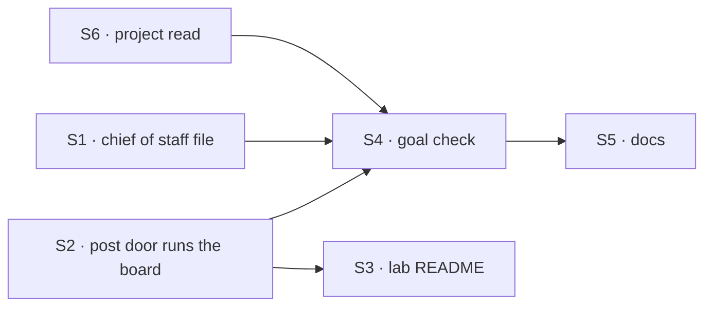

# FIX-1774 · Plan

[Spec](SPEC.md) · [Decisions](DECISIONS.md) · [Rules](BUSINESS-RULES.md) · **Plan** · [Docs](DOCS.md)

Written for the implementing agent. Directional: shape and sequence, not finished code.

## Surfaces

| ID | Where | What | Rules |
|---|---|---|---|
| S1 | `goals/devforce-lab/lab/workforce/org/workers/chief-of-staff/WORKER.md` | A fourth job, *Get coding work done*, per [SPEC.md](SPEC.md#what-changes). The opening line says four jobs. Keep the explicit-hire text as it is | BR-1–BR-9 |
| S2 | `goals/devforce-lab/lab/workforce/flows/workers/em.mts` | The post door files, then runs the board when the row is new. Reuse `board.drain`, as `askToFile` does. The module header and the `POST_ENTRY` doc say so | BR-10–BR-13 |
| S3 | `goals/devforce-lab/lab/README.md` | *The ask* and the board-check row: a posted line now starts the coder | — |
| S4 | `goals/shift-manager/it-hands-a-coding-ask-to-one-worker/` | The goal check, `goal.md` + `run.mts`, per [SPEC.md](SPEC.md#the-goal-and-how-well-know-its-met). Reuse `goals/lib/shift-manager.mts` | goal |
| S6 | `goals/devforce-lab/lab/host.mts` (the `agent` kind's `uses`) | A read of the organization's projects (id, title, workstreams) from the stored `projects` collection, for the chief of staff each turn. A context entry on a small lab capability, or a read-only tool; the implementer picks. Never a project id or workstream written in a file | BR-4 BR-5 |
| S5 | Docs, per [DOCS.md](DOCS.md) | Shift Manager README, the chief of staff page, the Shift Manager overview | — |

**Removed:** nothing. **Not touched:** any package under `packages/`.

## Sequence



One PR. S2 first, with its lab test red then green; S1 next; then the goal check, its controls
red, and the docs.

## Checks

| ID | What | Pass |
|---|---|---|
| VG | The goal check, all three legs, plus both controls | Legs green on the branch; `main-instructions` red on leg a (a hire or no row); `file-only` red on leg a (*pending*) |
| V1 | Lab test on the post door: shaped line → row filed and claimed by the coder; same slug again, with another row left *pending* on the board → no new row, and that other row is still *pending* (so an extra board run is seen); unshaped line → nothing | Red on `main` for the first case (row stays *pending*) |
| V2 | The existing DevForce checks still pass: `it-keeps-its-rows-on-the-mailboxes-board`, `it-waits-for-a-person-before-it-files`, `it-wakes-the-seat-a-file-declared` | Green |
| V3 | `goals/org-seats/cos-changes-the-roster` still passes (explicit hire, fire, discover) | Green |
| V4 | `pnpm --filter @flow-state-dev/shift-manager test` and typecheck | Green |

**Controls' seam.** Both controls must change exactly one thing. `main-instructions`: the check
serves a scratch copy of the tree with the chief of staff's file as on `main`, so the profile
needs a way to point at another tree (an env the DevTeam config reads is fine; it already reads
`DEVTEAM_STORE`). `file-only`: an `openLab` option the profile maps from an env, off by default,
that keeps the post door from running the board. Neither may exist only for the check's
convenience in a way that changes default behaviour.

## Pinned

- The check's folder name: `it-hands-a-coding-ask-to-one-worker`.
- The line shape stays `<slug>: <what>` (`POST_SHAPE` in `em.mts`). The README and the chief of
  staff's file both name it.

## Guardrails

- **No package change.** Because the fix is the Lab's wiring and its coordinator's file
  (Architect fence: "behavior and instructions on the existing coordinator path"; Jake's layer
  rule keeps Workforce policy out of core and engine).
- **No new write or routing tool, noun or kind.** Because routing exists, and a dispatch verb is
  invent-killed. S6's project read is the one addition, and it only reads.
- **Say "worker", never "seat", in every line of prose you write**, including the chief of
  staff's file, the README, docs and the PR. Code names like `seatId` stay. Because Jake is
  retiring the word.
- **Grade on stores first, then the reply.** Because a model can say "I handed it over" without
  doing it. The reply checks are on top of the store checks, never instead: leg a's reply names
  `eng.feature` and Storefront, holds no question mark, offers no spec and doesn't say it can't
  route or hand off work; leg c's names Platform and where coding work can go.
- **The post door runs the board only for a row it just filed.** Because a repeated line must
  not start a second coding run, and a run may cost money under a real harness.

## Docs

The draft is [DOCS.md](DOCS.md): three updates, no new page.

## Sketch

```text
post door:
  filed = file the row from the line          // as today
  if filed is new: run the board              // same block the Inbox ask runs
  return filed
```

## POC

[`poc/the-dogfood-turn/`](poc/the-dogfood-turn/README.md) reproduced the dogfood turn (two hires,
no row), confirmed hired workers have no way in, showed a shaped post files a row that never runs,
and showed running the board after the file starts the coder. All four premises held as the
design assumes.

## At implement time

- [FIX-1762](https://linear.app/fixpoint-labs/issue/FIX-1762) PR 4 also edits the chief of
  staff's file (repository tools). Whichever lands second merges both texts; no logic conflict.
- After FIX-1762, the task runs in Storefront's repository or files. Nothing here changes.
- Check the board's run owner: the delivery runs as the poster's principal. V1 should assert
  the claim is not refused as another member's.

## Follow-ups

- `discover` could return a mailbox's charter and boards, so a coordinator learns the hand-off
  from the tree rather than its own file.
- A hired worker could join a workstream at hire, so a hire can be given work. That reopens
  [D1](DECISIONS.md#d1).
- `post-to-mailbox` reports a hand-off but not what the mailbox's members did with it.

## Notes from review

Recorded verbatim for the implementer, from cursor[bot] on #2747 (round 1):

- PLAN V1: "V1 overlaps `goals/devforce-lab/it-keeps-its-rows-on-the-mailboxes-board`, which today calls `lab.drain` while the row is still `pending` precisely because the post door does not drain. After S2, consider **tightening that existing goal** (pass without external drain) instead of adding a third post-focused runner — unless you want a deliberately narrow BR-10 file separate from FIX-1667's \"where the row lives\" story."
- PLAN controls: "`main-instructions` may not need a full scratch copy of the workforce tree. `openLab` already supports `root` and `documentOverrides` (see `host.mts`, used in `it-wakes-the-seat-a-file-declared`). Swapping only `chief-of-staff/WORKER.md` from `main` via override + `GOAL_CONTROL` in a goal-local `fsdev.config.mts` is less machinery than \"another tree\" env — *if* that still changes exactly one thing for the control." Also: "`file-only` as named `openLab` EM option (sibling to `fileBeforeAsking`)."
- PLAN sketch: "treat `if filed is new` as **`filed: true` from `!existed`** in `addRow` output (same idempotency gate as BR-11), and wire drain on the **`onPosted` delivery** request — not inside the CoS tool return path (mailbox fan-out is already async)."
