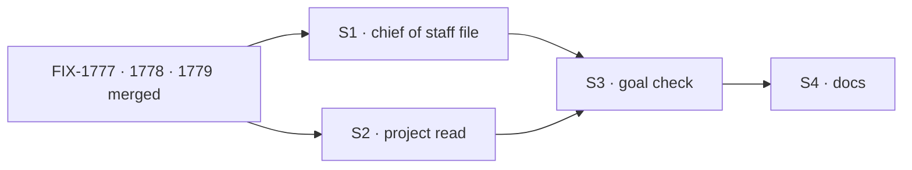

# FIX-1774 · Plan

[Spec](SPEC.md) · [Decisions](DECISIONS.md) · [Rules](BUSINESS-RULES.md) · **Plan** · [Docs](DOCS.md)

Written for the implementing agent. Directional: shape and sequence, not finished code.

## Depends on

Build after these merge. Read their specs first: the tool names below are placeholders until
they pin them.

| Issue | Gives this issue |
|---|---|
| [FIX-1777](https://linear.app/fixpoint-labs/issue/FIX-1777) | A task filed on a mailbox's board reaches its worker in the same delivery |
| [FIX-1778](https://linear.app/fixpoint-labs/issue/FIX-1778) | A coordinator tool that creates a task assigned to a named worker, a fresh hire included, and the hand-off that starts it |
| [FIX-1779](https://linear.app/fixpoint-labs/issue/FIX-1779) | Coordinator tools that set up a mailbox with a task list, subscribe workers, and attach it to a project |

If one of them lands a different shape than this plan assumes, re-draft the affected rows here
and in [BUSINESS-RULES.md](BUSINESS-RULES.md) before building.

## Surfaces

| ID | Where | What | Rules |
|---|---|---|---|
| S1 | `goals/devforce-lab/lab/workforce/org/workers/chief-of-staff/WORKER.md` | The new first job, per [SPEC.md](SPEC.md#what-changes). The opening line counts four jobs. `tools:` gains the FIX-1778 and FIX-1779 verbs. Keep the explicit-hire text | BR-1–BR-11 |
| S2 | `goals/devforce-lab/lab/host.mts` (the `agent` kind's `uses`) | A read of the organization's projects (id, title, mailboxes) from the stored `projects` collection, each turn. A context entry on a small lab capability, or a read-only tool; the implementer picks. Never a project id written in a file | BR-6 BR-7 |
| S3 | `goals/shift-manager/it-gets-the-ask-done/` | The goal check, `goal.md` + `run.mts`, per [SPEC.md](SPEC.md#the-goal-and-how-well-know-its-met). Reuse `goals/lib/shift-manager.mts` | goal |
| S4 | Docs, per [DOCS.md](DOCS.md) | The chief of staff page, the Shift Manager README and overview | — |

**Not touched:** any package under `packages/`. The verbs are the sibling issues'.

## Sequence

One PR. The control goes red before the legs go green.

## Checks

| ID | What | Pass |
|---|---|---|
| VG | The goal check, four legs, plus the control | Legs green on the branch; `main-instructions` red on leg a, c or d |
| V1 | The existing DevForce checks: `it-keeps-its-rows-on-the-mailboxes-board`, `it-waits-for-a-person-before-it-files`, `it-wakes-the-seat-a-file-declared` | Green |
| V2 | `goals/org-seats/cos-changes-the-roster` (explicit hire, fire, discover) | Green |
| V3 | `pnpm --filter @flow-state-dev/shift-manager test` and typecheck | Green |

**Leg c's tree.** Leg c needs the DevTeam tree with `eng.coder` not declared. `openLab` takes
`root` and `documentOverrides`; serve a goal-local copy of the tree without the coder's folder,
pointed at by an env the DevTeam config reads (it already reads `DEVTEAM_STORE`). The copy must
differ from the real tree by that folder only.

**The control's seam.** `main-instructions` swaps only the chief of staff's `WORKER.md` for the
one on `main`, through `documentOverrides`, and changes nothing else. Under it the chief of staff
lacks the new verbs in `tools:` too, which is part of what `main` is.

## Pinned

- The check's folder name: `it-gets-the-ask-done`.

## Guardrails

- **No package change.** Because the verbs are FIX-1778 and FIX-1779's, and Jake's layer rule
  keeps Workforce policy out of core and engine.
- **No new tool, noun or kind in this issue.** S2's project read only reads.
- **Say "worker", never "seat", in every line of prose you write**, including the chief of staff's
  file, the README, docs and the PR. Code names like `seatId` stay. Because Jake is retiring the
  word.
- **Grade on stores first, then the reply.** Because a model can say "I handed it over" without
  doing it. The reply checks sit on top of the store checks, never instead.
- **No retries in the check.** One turn per leg. A flaky pass hides a hire-and-stop.

## Docs

The draft is [DOCS.md](DOCS.md): three updates, no new page.

## POC

[`poc/the-dogfood-turn/`](poc/the-dogfood-turn/README.md) reproduced the dogfood turn on `main`
(two hires, no task), confirmed hired workers have no way in, showed a shaped post files a task
that never runs, and showed running the board after filing starts the coder. Its run script is a
starting point for S3.

## At implement time

- [FIX-1762](https://linear.app/fixpoint-labs/issue/FIX-1762) also edits the chief of staff's file
  (repository tools). Whichever lands second merges both texts.
- If FIX-1779 attaches a new mailbox to a project through `setWorkstreams`, the chief of staff's
  existing *Start projects* job already covers the call; don't describe it twice.

## Follow-ups

- `discover` could return a mailbox's charter and task lists, so a coordinator judges fit from
  the tree rather than names.
- A coordinator could be told when a task it created fails.

## Notes from review

Recorded verbatim for the implementer, from cursor[bot] on #2747 (round 1), where they still
apply after round 2:

- PLAN controls: "`main-instructions` may not need a full scratch copy of the workforce tree. `openLab` already supports `root` and `documentOverrides` (see `host.mts`, used in `it-wakes-the-seat-a-file-declared`). Swapping only `chief-of-staff/WORKER.md` from `main` via override + `GOAL_CONTROL` in a goal-local `fsdev.config.mts` is less machinery than \"another tree\" env — *if* that still changes exactly one thing for the control."
