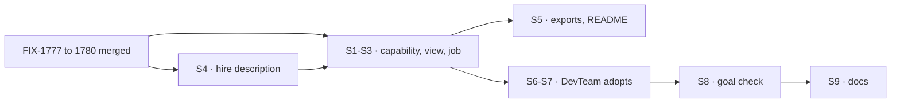

# FIX-1774 · Plan

[Spec](SPEC.md) · [Decisions](DECISIONS.md) · [Rules](BUSINESS-RULES.md) · **Plan** · [Docs](DOCS.md)

Written for the implementing agent. Directional: shape and sequence, not finished code.

## Depends on

Build after these merge, in this order (FIX-1778's lookup, FIX-1777, FIX-1779; FIX-1780 after
FIX-1777). Read their specs first. If one lands a different surface than this table, re-draft the
affected rows here and in [BUSINESS-RULES.md](BUSINESS-RULES.md) before building.

| Issue | Gives the coordinator | Names pinned there |
|---|---|---|
| [FIX-1778](https://linear.app/fixpoint-labs/issue/FIX-1778) | An assignee is a worker's name in the organization, found at hand-over, so a fresh hire gets its task. `agent` hires get a task door; any worker can claim from any mailbox's list | per its spec |
| [FIX-1777](https://linear.app/fixpoint-labs/issue/FIX-1777) | A task that lands on any list starts the workers who work it, however it got there | per its spec (#2753) |
| [FIX-1779](https://linear.app/fixpoint-labs/issue/FIX-1779) | `createMailboxSetupCapability({ open })` with the tools `setUpMailbox`, `subscribeWorkers` (opt-in `worksTaskList`), `unsubscribeWorkers`, `fileTask`; the read `taskListWorkers(ctx, mailboxId, list)` | as listed |
| [FIX-1780](https://linear.app/fixpoint-labs/issue/FIX-1780) | When a task completes, fails for good or parks, its list wakes the filing worker in the conversation it filed from (generic hook `onTaskSettled`). Reassigning a task that hasn't ended moves it in place and keeps its id; a failed task is carried on by a new task for the new worker; a running task is refused; a task moves at most three times | `reassignTask`, `cancelTask`, `onTaskSettled` |

## Surfaces

| ID | Where | What | Rules |
|---|---|---|---|
| S1 | `packages/workforce/src/coordinator-capability.ts` (new) | `createCoordinatorCapability(options)`: composes `createWorkforceCapability` (discover), `createSeatHireCapability`, `mailboxPostCapability`, `createMailboxSetupCapability`, the project writes as tools (moved from the Lab's `chiefOfStaffProjectTools`), and FIX-1780's `reassignTask` and `cancelTask`. Options carry what each needs (`roster`, `inventory`, `hire`, `open`, project blocks). A worker still names each tool in `tools:`; an empty list stays empty | BR-1–BR-3 |
| S2 | same file, a context entry | **The view**, each turn: projects (id, title, mailboxes); mailboxes (id, description, task lists, `taskListWorkers` for each); this coordinator's filed tasks and their status. Organization-scoped; capped and summarized past a size the implementer picks, with the cap named in the entry | BR-9 |
| S3 | same file, a preset `job` | The coordinator's job as instructions: the five responsibilities in [SPEC.md](SPEC.md#what-changes), the throughout rules, what to say when nothing would start the work, and what to do when a task notice arrives: completed, tell the person if they asked for it; failed or parked, reassign to another fitting worker (hiring if none), cancel, or tell the person what is stuck, and after the third move always tell the person. `presets({ job: false })` drops it | BR-4–BR-8, BR-10, BR-13 |
| S4 | `packages/workforce/src/seat-hire-blocks.ts` | `hire` input gains optional `description`, stored on the hired roster row and the seat inventory row, read by `discover`, the view and purpose routing | BR-11 |
| S5 | `packages/workforce/src/index.ts`, README | Export S1 and its options type; README section | — |
| S6 | `goals/devforce-lab/lab/host.mts` | The `agent` kind composes `createCoordinatorCapability` instead of its four separate entries; `chiefOfStaffProjectTools` moves into S1 | — |
| S7 | `goals/devforce-lab/lab/workforce/org/workers/chief-of-staff/WORKER.md` | Short: who it is, kinds it may hire (`coder`, `agent`) and what each is for, house rules. `tools:` adds the FIX-1779 and FIX-1780 tools. The mechanics paragraphs go | — |
| S8 | `goals/shift-manager/the-coordinator-gets-work-done/` | The goal check, five legs plus the control, per [SPEC.md](SPEC.md#the-goal-and-how-well-know-its-met). Reuse `goals/lib/shift-manager.mts` | goal |
| S9 | Docs, per [DOCS.md](DOCS.md) | New page `workforce/coordinator.md`; chief of staff page; Shift Manager README and overview | — |

**Not touched:** `packages/core`, `packages/engine`.

## Sequence

One PR. Package tests first (red, then green), then the Lab, then the check with its control red.

## Checks

| ID | What | Pass |
|---|---|---|
| VG | The goal check, five legs, plus `GOAL_CONTROL=no-capability` | Legs green; the control red on a, c and d |
| V1 | Package tests: the view lists exactly the organization's projects, mailboxes, task lists, workers per list and the coordinator's own tasks, and nothing from another org; `job: false` drops the instructions and keeps tools and view; a hire's description reaches the view and purpose routing; a worker that doesn't name a tool doesn't get it | Green; each fails with its piece removed |
| V2 | The existing DevForce checks: `it-keeps-its-rows-on-the-mailboxes-board`, `it-waits-for-a-person-before-it-files`, `it-wakes-the-seat-a-file-declared` | Green |
| V3 | `goals/org-seats/cos-changes-the-roster` | Green |
| V4 | `pnpm --filter @flow-state-dev/workforce test`, `pnpm --filter @flow-state-dev/shift-manager test`, `pnpm typecheck` | Green |

**Leg e's failure.** The scripted harness fails the first run for leg e's task. The coordinator's
next turn comes from FIX-1780's settle wake, not from the check prompting it.

**The control's seam.** `no-capability` serves the `agent` kind with the four entries it composes
on `main` and the chief of staff's file as on `main`. One env, read by the DevTeam config, off by
default.

## Pinned

- `createCoordinatorCapability`, `CoordinatorCapabilityOptions`, preset `job`.
- The check's folder: `the-coordinator-gets-work-done`.

## Guardrails

- **Layer 2 only.** Because Jake's layer rule keeps workers, hiring and rosters out of core and
  engine.
- **Compose the sibling issues' tools; don't re-implement them.** Because each owns its mechanism
  and its tests.
- **The view only reads, and only the organization's.** Because it is context every turn, and a
  member's private roster is theirs (`refuseRosterAdmin`).
- **Say "worker", never "seat", in every line of prose you write**, docs, files and PR alike. Code
  names like `seatId` stay. Because Jake is retiring the word.
- **Grade on stores first, then the reply.** Because a model can say it handed work over without
  doing it.
- **No retries in the check.** One turn per leg, plus leg e's settle wake.

## Docs

The draft is [DOCS.md](DOCS.md): one new page, three updates.

## POC

[`poc/the-dogfood-turn/`](poc/the-dogfood-turn/README.md) reproduced the dogfood turn on `main`:
two hires, no task, hires unreachable, a post filing a task nobody runs. Its run script is a
starting point for S8.

## At implement time

- [FIX-1762](https://linear.app/fixpoint-labs/issue/FIX-1762) also edits the chief of staff's file.
  Whichever lands second merges both.
- `mailboxPostCapability` stays in the bundle: posting is still how a coordinator talks in a
  mailbox, just not how it hands work over.

## Follow-ups

- Kitchen-sink support adopts the capability for its escalations list (U5).
- The manager-queue lab's manager adopts it instead of desks hard-coded in its prompt (U6).
- A coordinator could ask the person before a hire past a cost the app sets.
