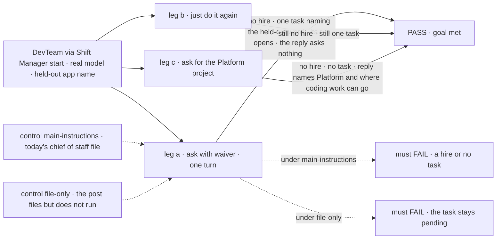
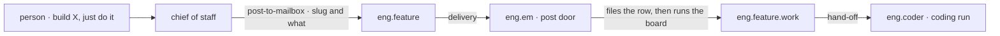

# FIX-1774 · Shift Coordinator hands a coding ask to one specialist and does not stop

**Spec** · [Decisions](DECISIONS.md) · [Rules](BUSINESS-RULES.md) · [Plan](PLAN.md) · [Docs](DOCS.md)

## Five people, before and after

| Someone who… | Today | After |
|---|---|---|
| **asks the chief of staff for a small app and says "just do it"** | It hires a worker, then a second one, asks which stack to use, and says it has no way to route work. No task exists | It hands the ask to the team's coder in one line, with the stack picked and named, and a coding run starts |
| **says "just do it" again after the hand-off** | Another hire | No hire and no second task. It says the task is already with the coder |
| **asks for coding work in a project that has no coding workstream** | A hire that nothing ever runs | It says that project has nowhere to run coding work yet, and which project does. Nothing is hired |
| **posts `slug: what to build` on the feature workstream themselves** | A task is filed and sits in *pending* for good | The coder starts on it, as the README already says it does |
| **asks the chief of staff to hire a worker by name** | It hires one | The same |

## The goal, and how we'll know it's met

**When a person asks the chief of staff for coding work, it hands that work to the one existing
worker who does coding, in the same turn, and that worker's coding run opens on the harness the
Lab already runs; and when no such hand-off can reach the person's project, it says what is
missing instead of hiring.**

| Is it the right goal? | |
|---|---|
| **The real need** | Jake, after a dogfood run: "A coding ask is handed to one specialist … After the handoff, the coordinator's next step is the task on that project, not a stop and not a menu of stack choices the person already waived … If the coding run cannot start because the repo or harness floor is missing, say that gap. Do not imitate it by hiring and stopping" ([FIX-1774](https://linear.app/fixpoint-labs/issue/FIX-1774)) |
| **Smaller, and rejected** | "The chief of staff's instructions say not to hire twice." The [POC](poc/the-dogfood-turn/README.md) showed a correct hand-off still starts nothing: the task is filed and never run. Instructions alone would move the stop one step later |
| **Narrowed, and why** | Jake's text allows a hire when no suitable worker exists. In this Lab a hired worker can't be given work at all ([POC finding 2](poc/the-dogfood-turn/README.md)), so a hire there is the hire-and-stop bullet 4 forbids. The goal says "say what is missing" for that case; [D1](DECISIONS.md#d1) is the sign-off on it |
| **Where the boundary sits** | "The run opens" means the board hands the task to `eng.coder` and `harness-manager` opens its run, on whatever harness the operator set. Which repository or files that run works in is [FIX-1762](https://linear.app/fixpoint-labs/issue/FIX-1762); this issue changes nothing about the harness |
| **Bigger, and not this issue's** | A project that records its repository and runs there ([FIX-1762](https://linear.app/fixpoint-labs/issue/FIX-1762)); any project taking coding work ([FIX-1763](https://linear.app/fixpoint-labs/issue/FIX-1763)); a hired worker joining a workstream so work can reach it ([follow-up](PLAN.md#follow-ups)) |
| **Not done if** | A hire happens on a coding ask while `eng.coder` exists · a second task or a clone appears after "just do it" · the turn ends on a stack question the person waived, or files the task and still asks "shall I go ahead?" · the task is filed and stays *pending* · the reply says it can't direct work, or offers to write a spec instead · a project with no coding workstream gets a hire, or a task on another project |



The check reads the roster, the feature board and the board's run through the Lab's routes, never
the model's words, except two reply reads: leg a's reply asks nothing, and leg c's names the gap.

| How we verify | |
|---|---|
| **Goal check** | `goals/shift-manager/it-hands-a-coding-ask-to-one-worker/` · `openai/gpt-5.4-mini` for the chief of staff, scripted harness for the run · run by the implementer at completion · verdict in the implementation PR |
| **Signal** | Leg a: zero new roster rows; exactly one row on the feature board, filed from a post by `chief-of-staff`, whose goal contains the held-out word; within 120 seconds that row is claimed by `eng.coder` and a `harness-manager` run record exists for it; the turn did not suspend, and its reply holds no question mark and does not offer a spec. Leg b: still zero hires, still one row. Leg c: zero hires, zero new rows, and the reply names Platform and names `eng.feature` or Storefront as where coding work can go |
| **Input** | Legs a then b in one chief of staff session; leg c in a fresh one. Leg a: "Build a simple hello-world React app that shows the word `<held-out>`. Use Claude Code. Hire a worker if you need to. Just do it, I don't care how." Leg b: "Just do it." Leg c: "Build a hello-world page that shows the word `<held-out>` in the Platform project. Just do it." The word is random hex picked at run time. Run: `pnpm tsx goals/shift-manager/it-hands-a-coding-ask-to-one-worker/run.mts`, with a model key set |
| **Anti-game** | No hire, file or drain block called by the check. No row seeded. Grades read off the stores through routes |
| **Control that must fail** | `GOAL_CONTROL=main-instructions` (the chief of staff's file as on `main`): leg a FAILS: the roster gains a hire, or no row is filed. `GOAL_CONTROL=file-only` (the post door files without running the board): leg a FAILS: the row stays *pending* and no run record exists. Today's `main` FAILS leg a, as the [POC](poc/the-dogfood-turn/README.md) recorded |

## What changes


Top is today: two dead ends. Bottom is after: one post, one task, one run.

**The chief of staff's file** (`goals/devforce-lab/lab/workforce/org/workers/chief-of-staff/WORKER.md`), one new job:

```diff
  **Start projects.** …

+ **Get coding work done.** When the person asks for code to be written, hand
+ it to the worker who already does coding: `eng.coder` runs every task filed
+ on `eng.feature`. Do not hire for it.
+
+ - Post one line on `eng.feature` with `post-to-mailbox`, shaped
+   `<short-slug>: <what to build>`. The EM files it and the coder starts.
+ - If the person left choices to you, pick plain defaults and put them in
+   the line. Do not ask about them.
+ - Then tell the person the task is with `eng.coder` on `eng.feature`, which
+   project holds it, and the defaults you picked.
+ - Asked again, do not post again, hire, or add a second worker for it.
+ - If they name a project whose workstreams include none the coder works
+   from, say so and name the project that has one. Start nothing.
```

**The EM's post door** (`goals/devforce-lab/lab/workforce/flows/workers/em.mts`):

```diff
- [POST_ENTRY]: { block: fileFromPost, … }                 // a handler: files, nothing more
+ [POST_ENTRY]: { block: postToFile, … }                   // composed like askToFile: file, then
+                                                          // board.drain only when the row is new
```

## How a coding ask moves



Every arrow already exists except the last step of the post door. No new tool, noun or kind.

## What stays as it is

- **Workforce, core and engine.** No package change. Routing and the hire tool stay as they are.
- **An explicit hire.** "Hire a coder named X" still hires, at once.
- **The EM's Inbox ask.** Still asks first; Approve still files and runs.
- **A line that doesn't name a feature.** Still files nothing.
- **Which harness runs.** Still the Lab operator's choice. The chief of staff promises none.

## Sign off

**[The goal](#the-goal-and-how-well-know-its-met), at that size:** a coding ask ends in a running
task on the existing coder, or in a plain statement of what is missing.

1. **[D1](DECISIONS.md#d1) · On a coding ask the chief of staff never hires in this Lab, because
   a hired worker can't be given the work.** If wrong: a person who wants a fresh specialist for a
   job gets the team's coder instead.
2. **[D2](DECISIONS.md#d2) · A project with no coding workstream gets "not yet, and here is why",
   not a task on another project.** If wrong: the person waits for FIX-1763 when a run on
   Storefront's workstream would have done.

**Open: none.** The calls made without asking, and what was dropped, are in
[DECISIONS.md](DECISIONS.md). The cases: [BUSINESS-RULES.md](BUSINESS-RULES.md).

Enhancement · DevTeam Lab (`goals/devforce-lab/lab/`) + Shift Manager docs · small · 1 PR · epic
[FIX-1763](https://linear.app/fixpoint-labs/issue/FIX-1763) · composes with
[FIX-1762](https://linear.app/fixpoint-labs/issue/FIX-1762), [FIX-1761](https://linear.app/fixpoint-labs/issue/FIX-1761),
[FIX-1732](https://linear.app/fixpoint-labs/issue/FIX-1732)
