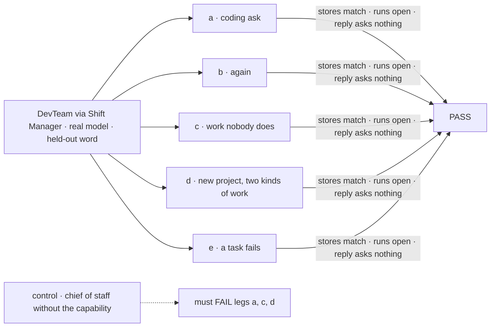
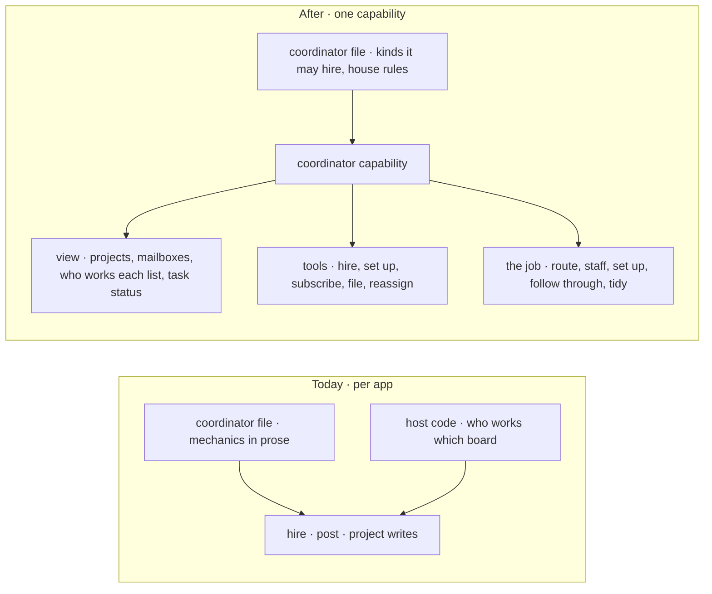

# FIX-1774 · The coordinator routes work, hires as needed, sets up mailboxes, and follows work through

**Spec** · [Decisions](DECISIONS.md) · [Rules](BUSINESS-RULES.md) · [Plan](PLAN.md) · [Docs](DOCS.md)

## Six people, before and after

| Someone who… | Today | After |
|---|---|---|
| **asks the coordinator to build a small app and says "just do it"** | It hires a worker, then a second one, asks which stack to use, and says it can't route work. No task exists | It files a task for the team's coder, with the stack picked and named, and the coder starts |
| **says "just do it" again** | Another hire | Nothing new. It says where the task is |
| **asks for work nobody on the team does** | A hire that nothing ever reaches | It hires one worker for it, puts that worker on a mailbox, files the task for it, and the worker starts |
| **starts a project that needs several kinds of work** | A project with no place for the work | It sets up a mailbox with a task list for each kind of work, staffs each one, and files the first tasks |
| **has a task fail** | Nobody hears | The coordinator hears, reassigns the task or tells the person what is stuck |
| **builds their own app with a coordinator** | Writes the routing, staffing and set-up mechanics into the worker's file and its host | Adds the coordinator capability, names the kinds it may hire, and writes only house rules |

## The goal, and how we'll know it's met

**A coordinator gets a person's request done: it routes the work to the right mailbox's task list
for the right worker, hires and sets up mailboxes when nothing fits, follows the task through, and
says what is missing when it can't. It works this way in any Workforce app, through one
capability, and DevTeam's chief of staff is the first to use it.**

| Is it the right goal? | |
|---|---|
| **The real need** | Jake, on this spec: "The coordinator has a responsibility to route work, hire the workforce as needed, setup mailboxes, and get the work flowing to the right places … Imagine other use cases, not just this very specific flow." And: "If that means hiring and then routing a task to that new hire, thats what it should do." On [FIX-1774](https://linear.app/fixpoint-labs/issue/FIX-1774): "If the coding run cannot start because the repo or harness floor is missing, say that gap. Do not imitate it by hiring and stopping" |
| **Smaller, and rejected** | "Give DevTeam's chief of staff a coding job." The first two drafts. It fixed one flow, in one Lab's prose, and left every other coordinator to rebuild the same mechanics |
| **Where the boundary sits** | This issue is the coordinator's job as a capability: its view, its instructions, the tools bundled. The tools' mechanics are four sibling issues, built first: a task that lands starts its worker ([FIX-1777](https://linear.app/fixpoint-labs/issue/FIX-1777)), an assignee names a worker, found at hand-over ([FIX-1778](https://linear.app/fixpoint-labs/issue/FIX-1778)), mailboxes set up and subscribed at run time with a filing tool ([FIX-1779](https://linear.app/fixpoint-labs/issue/FIX-1779)), and hearing how a task ended ([FIX-1780](https://linear.app/fixpoint-labs/issue/FIX-1780)) |
| **Bigger, and not this issue's** | Kitchen-sink support and the manager-queue lab adopting the capability ([follow-ups](PLAN.md#follow-ups)); project repositories ([FIX-1762](https://linear.app/fixpoint-labs/issue/FIX-1762)); where a run's files live and how its branch lands (FIX-1766 to FIX-1768) |
| **Not done if** | A hire happens while a fitting worker exists · a hire never gets its task · a clone appears because a worker didn't start · the turn ends on a question the person waived · a task is filed and nobody starts it · a failed task goes unheard · the reply says it can't route, or offers a spec instead · the capability only works in DevTeam |

The check grades the roster, mailboxes, task lists, run records and settle records through the
Lab's routes. It reads the reply only to confirm it asks nothing and says where the work is.

| How we verify | |
|---|---|
| **Goal check** | `goals/shift-manager/the-coordinator-gets-work-done/` · `openai/gpt-5.4-mini` for the coordinator, scripted harness for runs · run by the implementer at completion · verdict in the implementation PR |
| **Signal** | **a**: zero hires; one task for `eng.coder` holding the held-out word; its run opens within 120 s; no suspension; the reply has no question mark and names where the task is. **b**: still one task, zero hires. **c** ("audit our dependencies' licenses"): one hire, with a description; it works a task list; one task for it; its run opens. **d** ("start a project called `<held-out>` that needs an API and its docs"): one project; two new mailboxes on it, each with a task list and at least one worker; one task on each; both runs open. **e**: a task whose scripted run fails; the coordinator's next turn reassigns or cancels it, and its reply names the task and what failed |
| **Input** | a then b in one session; c, d, e each fresh. Words in each ask are held out at run time |
| **Anti-game** | The check calls no hire, mailbox, file or settle block. Nothing seeded beyond e's scripted failure |
| **Control that must fail** | `GOAL_CONTROL=no-capability`: the chief of staff as on `main`, without the coordinator capability. Legs a, c and d FAIL, with a hire and no task or with no task, as the [POC](poc/the-dogfood-turn/README.md) recorded on `main` |

## What changes

Today every app teaches its coordinator the mechanics. After, the capability carries them and the
file carries only what is the app's own.

**The job the capability teaches, in order:**

1. **Route.** Turn the ask into tasks. File each on the task list of the mailbox where it belongs,
   for the worker who should do it.
2. **Staff.** If no worker fits, hire one with a description of the work, and subscribe it. If a
   list backs up behind a busy worker, add one. Never hire a twin because a worker didn't start.
3. **Set up.** If no mailbox fits, set one up with a task list on the person's project, and
   subscribe the workers.
4. **Follow through.** When a task it filed fails or blocks, reassign it, re-staff it, or tell the
   person.
5. **Tidy.** Repair broken workers; when work ends, unsubscribe and let idle hires go. Firing still
   asks the person.

Throughout: pick plain defaults for choices the person waived and name them; ask again changes
nothing; say what is missing instead of hiring and stopping.

**DevTeam's chief of staff** keeps its file short: who it is, the kinds it may hire, and house
rules. The mechanics come from the capability.

## What stays as it is

- **Hire, fire, rehire.** Same tools; hire gains an optional description. Fire and rehire still ask.
- **An explicit hire.** "Hire a coder named X" still hires, at once, and files nothing.
- **Purpose routing and the EM.** A mailbox that routes by purpose, and the EM's Inbox ask, behave
  as today.
- **Core and engine.** No change. The capability is Workforce's.
- **Which harness runs.** The app operator's choice. The coordinator promises none.

## Sign off

**[The goal](#the-goal-and-how-well-know-its-met), at that size:** one Workforce capability that
makes any coordinator route, staff, set up and follow through, proved on DevTeam across five legs.

**Open: none.** The job is Jake's. Calls made without asking are in [DECISIONS.md](DECISIONS.md);
the cases in [BUSINESS-RULES.md](BUSINESS-RULES.md).

Enhancement · `packages/workforce` + DevTeam Lab + docs · medium · 1 PR, after FIX-1777 to
FIX-1780 · epic [FIX-1763](https://linear.app/fixpoint-labs/issue/FIX-1763) · composes with
[FIX-1762](https://linear.app/fixpoint-labs/issue/FIX-1762), [FIX-1761](https://linear.app/fixpoint-labs/issue/FIX-1761),
[FIX-1732](https://linear.app/fixpoint-labs/issue/FIX-1732)
