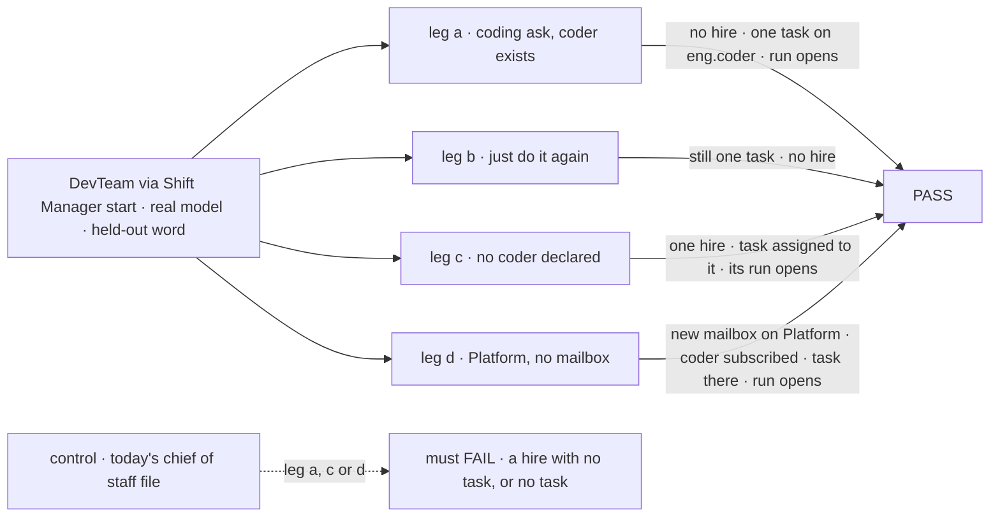
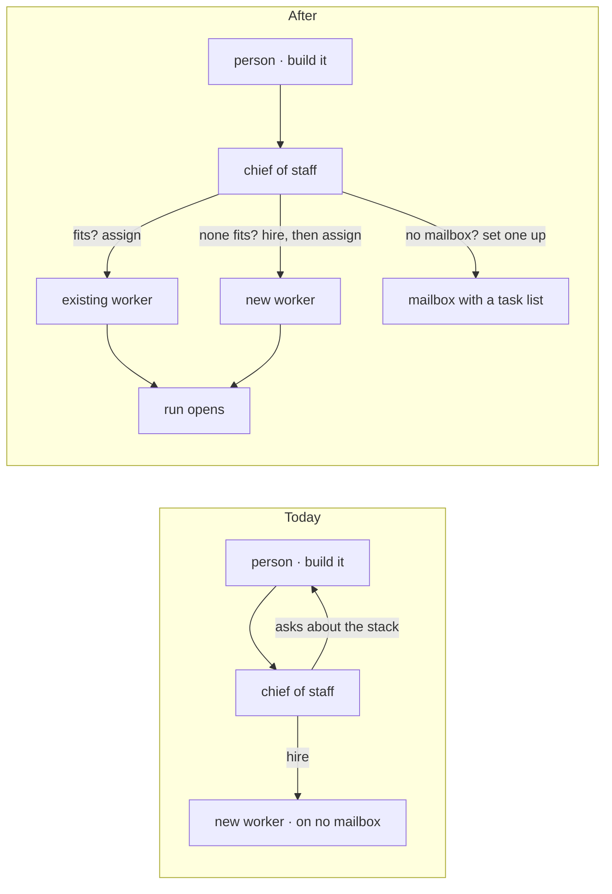

# FIX-1774 · Shift Coordinator hands a coding ask to one specialist and does not stop

**Spec** · [Decisions](DECISIONS.md) · [Rules](BUSINESS-RULES.md) · [Plan](PLAN.md) · [Docs](DOCS.md)

## Five people, before and after

| Someone who… | Today | After |
|---|---|---|
| **asks the chief of staff for a small app and says "just do it"** | It hires a worker, then a second one, asks which stack to use, and says it has no way to route work. No task exists | It assigns a task to the team's coder, with the stack picked and named, and the coder's run opens |
| **says "just do it" again after the hand-off** | Another hire | No hire and no second task. It says the task is already with the coder |
| **asks for work no worker here can do** | A hire that nothing ever runs | It hires one worker of a kind that can, assigns the task to that worker, and the worker starts |
| **asks for coding work in a project with no mailbox for it** | A hire that nothing ever runs | It sets up a mailbox with a task list on that project, subscribes the worker, and files the task there |
| **asks the chief of staff to hire a worker by name** | It hires one | The same |

## The goal, and how we'll know it's met

**When a person asks the chief of staff for work, it gets that work assigned to a worker who
can do it, in the same turn, and that worker starts: an existing worker if one fits, otherwise a
worker it hires, on a mailbox it sets up if none can hold the task; and when nothing it can do
would start the work, it says what is missing instead of hiring and stopping.**

| Is it the right goal? | |
|---|---|
| **The real need** | Jake, on this spec: "It should be instructed to get the user request accomplished. If that means hiring and then routing a task to that new hire, thats what it should do. The coordinator should prioritize assigning tasks … It might be that the appropriate mailbox needs to be setup … subscribe the appropriate workers so that it can create the task in the mailbox's task list." And on [FIX-1774](https://linear.app/fixpoint-labs/issue/FIX-1774): "If the coding run cannot start because the repo or harness floor is missing, say that gap. Do not imitate it by hiring and stopping" |
| **Smaller, and rejected** | "Never hire for a coding ask; hand it to the declared coder or say the gap." This spec's first draft. It works only where a coder is already declared, and turns every other ask into a refusal |
| **Where the boundary sits** | This issue is the coordinator's behaviour: its instructions, a read of the projects, and the check. The verbs it needs are three sibling issues, each its own spec: a post that files a task starts its worker ([FIX-1777](https://linear.app/fixpoint-labs/issue/FIX-1777)), assigning a task to a named worker, a fresh hire included ([FIX-1778](https://linear.app/fixpoint-labs/issue/FIX-1778)), and setting up a mailbox with workers and a task list ([FIX-1779](https://linear.app/fixpoint-labs/issue/FIX-1779)). This issue builds after them |
| **Bigger, and not this issue's** | A project that records its repository and runs there ([FIX-1762](https://linear.app/fixpoint-labs/issue/FIX-1762)); where a run's files live and how its branch lands (FIX-1766 to FIX-1768) |
| **Not done if** | A hire happens while a fitting worker exists · a hire is never given the task · a second task or a clone appears after "just do it" · the turn ends on a stack question the person waived, or on "shall I go ahead?" · the task is filed and nobody starts it · the reply says it can't direct work, or offers a spec instead · a project with no mailbox for the work gets a task on another project |



The check grades the roster, the boards, the mailboxes and the run records through the Lab's
routes. It reads the model's reply only to confirm it asks nothing and names where the task is.

| How we verify | |
|---|---|
| **Goal check** | `goals/shift-manager/it-gets-the-ask-done/` · `openai/gpt-5.4-mini` for the chief of staff, scripted harness for the run · run by the implementer at completion · verdict in the implementation PR |
| **Signal** | Leg a: zero new roster rows; exactly one new task, assigned to `eng.coder`, whose goal holds the held-out word; within 120 seconds a `harness-manager` run record exists for it; the turn did not suspend; the reply has no question mark, offers no spec, and names where the task is. Leg b: still one task, zero hires. Leg c (a tree with no coder declared): exactly one hire, of the coder kind; the task is assigned to that hire and its run opens. Leg d: exactly one new mailbox, attached to Platform, with a task list and the coder as a member; the task is on it and its run opens; no task on `eng.feature` |
| **Input** | Legs a then b in one session; c and d each fresh. Leg a: "Build a simple hello-world React app that shows the word `<held-out>`. Use Claude Code. Hire a worker if you need to. Just do it, I don't care how." Leg b: "Just do it." Leg c: leg a's text against the no-coder tree. Leg d: "Build a hello-world page that shows the word `<held-out>` in the Platform project. Just do it." The word is random hex picked at run time |
| **Anti-game** | No hire, assign, mailbox or file block called by the check. Nothing seeded. Grades read off the stores |
| **Control that must fail** | `GOAL_CONTROL=main-instructions` (the chief of staff's file as on `main`): leg a, c or d FAILS, with a hire and no task or with no task at all, as the [POC](poc/the-dogfood-turn/README.md) recorded on `main` |

## What changes



Today the turn ends on a worker nothing reaches. After, every branch ends on a task a worker is
running.

**The chief of staff's file** (`goals/devforce-lab/lab/workforce/org/workers/chief-of-staff/WORKER.md`)
gets one new job, first in the file, and its tools grow by the verbs the three sibling issues add:

```diff
+ **Get the person's request done.** When the person asks for work, get it
+ assigned to a worker who will do it, in this turn.
+
+ 1. Find a worker who does this kind of work (`discover`). If one fits,
+    create the task for that worker.
+ 2. If none fits, hire one of a kind you may hire, then create the task for
+    the worker you hired. Hire once.
+ 3. A task lives on a mailbox's task list. If no mailbox in the person's
+    project can hold it, set one up there with a task list, subscribe the
+    worker, then create the task on it.
+
+ - If the person left choices to you, pick plain defaults, put them in the
+   task, and name them in your reply. Do not ask about them.
+ - Asked again, do not create a second task or hire again. Say where the
+   task is.
+ - If nothing you can do would start the work, say what is missing. Do not
+   hire a worker and stop.
```

**The chief of staff also sees the projects.** To find the person's project and its mailboxes it
needs which project holds which mailbox. Today `discover` has no projects and its project tools
only write. The Lab gives it a read of the organization's projects each turn.

## What stays as it is

- **An explicit hire.** "Hire a coder named X" still hires, at once, and creates no task.
- **Fire and rehire.** Still wait for the person's approval in Inbox.
- **The EM's Inbox ask.** Still asks first.
- **Projects as data.** The chief of staff's file names no project.
- **Which harness runs.** Still the Lab operator's choice. The chief of staff promises none.

## Sign off

**[The goal](#the-goal-and-how-well-know-its-met), at that size:** a request ends with a worker
running its task, or a plain statement of what is missing.

**Open: none.** The order (assign, then hire, then set up a mailbox) is Jake's. The calls made
without asking are in [DECISIONS.md](DECISIONS.md); the cases in
[BUSINESS-RULES.md](BUSINESS-RULES.md).

Enhancement · DevTeam Lab (`goals/devforce-lab/lab/`) + Shift Manager docs · small · 1 PR, after
FIX-1777, FIX-1778 and FIX-1779 · epic [FIX-1763](https://linear.app/fixpoint-labs/issue/FIX-1763)
· composes with [FIX-1762](https://linear.app/fixpoint-labs/issue/FIX-1762),
[FIX-1761](https://linear.app/fixpoint-labs/issue/FIX-1761), [FIX-1732](https://linear.app/fixpoint-labs/issue/FIX-1732)
