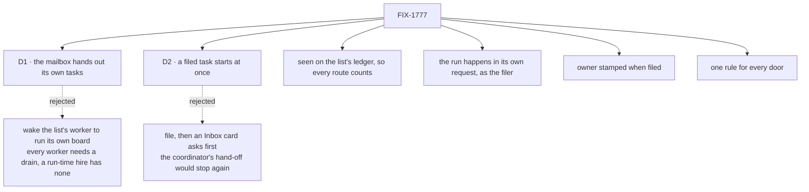

# FIX-1777 · Decisions

[Spec](SPEC.md) · **Decisions** · [Rules](BUSINESS-RULES.md) · [Plan](PLAN.md) · [Docs](DOCS.md)

Two calls shape what a person sees: who runs a mailbox's task list, and that filing spends money
without asking.

## The tree

Solid edges are this spec's calls. Dashed edges lost, and the label says why.

## D1 · The mailbox hands out its own tasks; a worker no longer runs a list

| | |
|---|---|
| **Instead of** | Waking the worker that works the list, which then runs its own copy of the board (the shape the docs teach today, and this spec's first draft) |
| **Because** | A list's task goes to a worker by name ([FIX-1778](https://linear.app/fixpoint-labs/issue/FIX-1778)), and a coordinator can make a list and put a fresh hire on it at run time ([FIX-1779](https://linear.app/fixpoint-labs/issue/FIX-1779)). A fresh hire has a task door and no board of its own, so "the worker runs its list" has nobody to run it. The mailbox already holds the list; handing its tasks out is the one place every route meets. Jake: the work has to get "flowing to the right places", and the layer rule keeps that in Workforce |
| **Locks in** | A worker on a mailbox's list needs only a task door. The docs' "the mailbox runs nothing; a worker declares the board and drains it" is replaced. A Lab can still keep a private board a worker runs itself; it just isn't a mailbox's list |

It comes down to the fresh hire: it has a task door and no board, so only the mailbox can hand it work.

## D2 · A filed task starts at once, with no approval first

| | |
|---|---|
| **Instead of** | Filing the task, then raising an Inbox card, and starting on Approve |
| **Because** | Filing is how the coordinator hands work over ([FIX-1774](https://linear.app/fixpoint-labs/issue/FIX-1774)), and Jake's rule is that it gets the request done. A card after "just do it" is the stop that issue removes. The Inbox ask stays the door that asks first, for anyone who wants that ([FIX-1666](https://linear.app/fixpoint-labs/issue/FIX-1666) D1) |
| **Locks in** | Anyone who can file on a list can start a run, and with a real harness every new task costs one. Guards that stay: one run per task, the run belongs to the filer, nothing starts for a task that already existed |

It comes down to whether a hand-off finishes in one turn: a card would stop it again.

## Decided, not asked

- **The add is seen on the list's ledger, not at each door.** Every route (a post door, `fileTask`,
  the board actions, a worker's board tools, a worker's own board capability) writes the same
  ledger declaration, so a hook on that declaration sees them all. A hook per door is how
  four doors came to have three rules (the FSD Architect, on #2753).
- **The run happens in a request of its own.** The hook runs inside the filer's write; running the
  list there would hold the coordinator's turn for a whole coding run. It hands off, as a post's
  fan-out already does.
- **The run belongs to whoever filed the task, fixed when it is filed.** Today a task has no owner
  until its first run, so anyone's run of the list can claim it (Codex, on #2753). The owner is
  stamped from the filer's resolved identity, never from input, and a run started by one
  filer claims only that filer's tasks.
- **One rule for every door.** File it, and the list runs. DevTeam's Approve and post doors drop
  their own drains. Approve used to drain on every approval, even for a task that already existed;
  under this rule only an add starts anything.
- **A task that already existed starts nothing.** Nothing was added, so nothing is seen.
- **Who works a list is named by the mailbox, never inferred.** `workedBy:` in its `MAILBOX.md`,
  or `worksTaskList` when a worker is subscribed at run time (FIX-1779), one meaning on both
  sides. A worker that only declares the ledger, to read it or file on it, is not handed tasks
  (the FSD Architect, on #2753).
- **More than one worker and no assignee: the task waits and the answer says to assign it.** An
  order would quietly pick who spends the run; the coordinator assigns by name anyway (FIX-1778).
- **A list with no worker for a task.** The task is filed and waits, and the filing's answer says
  no worker works it. Same as hire's unattended-board warning, now at the moment it matters.

## Considered and dropped

- **Keep it in the Lab: DevTeam's post door drains after a new row** (the first draft). Leaves
  every other route and every run-time list starting nothing; Jake asked for the general case.
- **Hook `fileTask` only, the way a post wakes its members.** Misses the board tools and a worker's
  own board, which are how a worker adds follow-up tasks.
- **A periodic run of every list.** Starts work late and costs a timer in an event-driven system.
- **Infer the worker from who declares the ledger.** A declaring worker may only read it or only
  file on it (DevTeam's EM files, its coder works), so declaring proves nothing. The mailbox names
  its list's workers instead.
- **Pick the first of several workers by a stated order.** Works, but which worker pays for a run
  turns on file order nobody reads as a choice.

## Open

None.

## Settled

- **A shaped post files a row and nothing runs it.** FIX-1774 POC, finding 3
  (`specs/issues/FIX-1774/poc/the-dogfood-turn/` on [#2747](https://github.com/fixpoint-labs/flow-state-dev/pull/2747)).
- **Running the list from inside a delivery starts the coder.** Same POC, finding 4.
- **No wake on add exists today, and every check drains by hand.** Research for this spec: the
  board exposes `drain` and nothing that runs on its own; `goals/mailbox-boards/…` and
  `goals/workforce-conventions/a-mailbox-holds-the-work-a-seat-drains` both drain after filing.
- **The resource layer can see every add.** A collection's `reactTo.created` fires in the writer's
  request for any write to that declaration; `defineTaskCollection` does not pass it through yet.

## How it got here

- **Draft** — framed as DevTeam's post door missing a board run; one Lab change, one PR.
- **Re-scope to the general case** — Jake asked for the coordinator's whole job, not one flow, and
  the FSD Architect showed FIX-1779's run-time lists would start nothing. Now: any add to any
  mailbox's list starts the worker it's for, as the filer; two stacked PRs on FIX-1778's routing.
- **Who works a list** — the FSD Architect showed the default worker still came from declaring the
  ledger, through FIX-1779's read. Now the mailbox names its list's workers, and several with no
  assignee waits.
