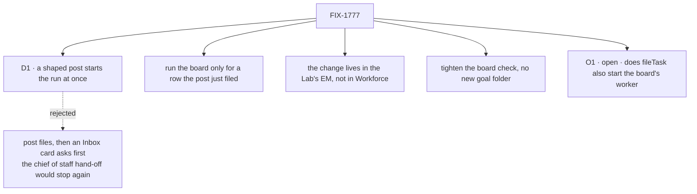

# FIX-1777 · Decisions

[Spec](SPEC.md) · **Decisions** · [Rules](BUSINESS-RULES.md) · [Plan](PLAN.md) · [Docs](DOCS.md)

One call shapes what a person sees: a post now spends money without asking. The rest follows from
the issue's own outcome.

## The tree

Solid edges are this spec's calls. Dashed edges lost, and the label says why.

## D1 · A shaped post starts the coding run at once, with no approval first

| | |
|---|---|
| **Instead of** | The post files the task and raises an Inbox card, and the run starts on Approve |
| **Because** | The post is how [FIX-1774](https://linear.app/fixpoint-labs/issue/FIX-1774)'s chief of staff hands coding work over, and Jake's rule is that it gets the request done. A card after "just do it" is the stop that issue removes. The Shift Manager README already promises that a posted line is picked up. Inbox stays the door that asks first, for a person who wants that ([FIX-1666](https://linear.app/fixpoint-labs/issue/FIX-1666) D1) |
| **Locks in** | Anyone who can post on the feature workstream can start a coding run, and with a real harness every new slug costs a run. Guards that stay: only a shaped line files, one run per slug, the run belongs to the poster |

It comes down to whether a hand-off finishes in one turn: a card would stop it again.

## Decided, not asked

- **The board runs only for a row the post just filed.** The issue's outcome: a repeated slug
  files nothing and runs nothing. A board run also starts the poster's other waiting rows, so
  running it on a repeat would start work nobody just asked for. Same gate as Approve's
  "already existed" message.
- **The board runs inside the delivery, not in the poster's request.** The mailbox already hands
  each delivery to a request of its own, so the person or the chief of staff gets their post back
  at once, and the run lands under the EM's own session as Approve's does.
- **The change lives in the Lab's EM.** The EM is the worker that holds this board's hand-off to
  `eng.coder`. Workforce is not touched (the layer rule: a mailbox kind carries no policy about
  who works its boards).
- **The goal check tightens the existing board check** rather than adding a folder. That check
  calls `drain` after its post only because the post did not run the board; removing the call is
  the proof (a review note on [#2747](https://github.com/fixpoint-labs/flow-state-dev/pull/2747)
  suggested the same).
- **One control option, `file-only`, off by default.** It is the one switch that degrades exactly
  the behaviour the goal rests on, and [FIX-1774](https://linear.app/fixpoint-labs/issue/FIX-1774)'s
  goal check names the same control. Precedent: the EM's `fileBeforeAsking`.

## Considered and dropped

- **Run the board on every shaped post.** Would also restart a stuck *pending* row on a repeat
  post, but breaks the issue's "a repeated slug runs nothing" and starts unrelated waiting rows.
- **A periodic board run.** Starts posted work late, and costs a timer for a Lab that is
  event-driven everywhere else.

## Open

- **O1 · Does a task filed through a mailbox's own `fileTask` start the worker that drains that
  board too?** Raised by the FSD Architect on [#2753](https://github.com/fixpoint-labs/flow-state-dev/pull/2753):
  [FIX-1779](https://linear.app/fixpoint-labs/issue/FIX-1779) and FIX-1774's leg d hand work over
  by filing on a mailbox created at run time, which has no EM post door, so with this spec as
  drafted that filed task starts nothing and no spec owns the run. (a) Keep this change in the
  Lab; the coordinator always posts on a workstream with a door like this one, and FIX-1779 and
  leg d change to match. (b) Also do the general version here: a task filed on a mailbox's board,
  by a post or by `fileTask`, starts the worker that drains that board, found from the hired
  worker's own board declaration. Put to Jake; this spec does not settle it.

## Settled

- **A shaped post files a row and nothing runs it.** Confirmed by the FIX-1774 POC, finding 3
  (`specs/issues/FIX-1774/poc/the-dogfood-turn/` on [#2747](https://github.com/fixpoint-labs/flow-state-dev/pull/2747)):
  `{"filed":true}` and no claim.
- **Running the board after a new row starts the coder from inside the delivery.** Confirmed by the
  same POC, finding 4: a local change to the post door led to a claim, the hand-off to `eng.coder`
  and a `harness-manager` run on the scripted harness.

## How it got here

- **Draft** — framed as the post door's missing board run, split out of FIX-1774; build is one
  composed door in the Lab's EM plus a tightened board check, one PR.
