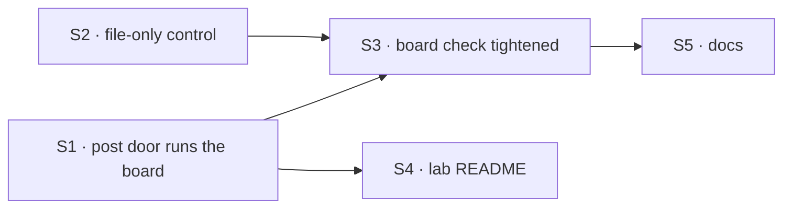

# FIX-1777 · Plan

[Spec](SPEC.md) · [Decisions](DECISIONS.md) · [Rules](BUSINESS-RULES.md) · **Plan** · [Docs](DOCS.md)

Directional. Shape and sequence are fixed; names and local structure are the implementer's.

## Surfaces

| ID | Where | What | Rules |
|---|---|---|---|
| S1 | `goals/devforce-lab/lab/workforce/flows/workers/em.mts` | The post door becomes a sequencer: file from the line through `addRow` (as `fileFromPost` does), then `board.drain` only when the row is new. Same `tapIf` shape as `askToFile`. The module header and the `POST_ENTRY` doc say the door runs the board | BR-1–BR-5, BR-8 |
| S2 | same file + `goals/devforce-lab/lab/host.mts` | An EM option that keeps the post door from running the board (the `file-only` control), off by default, beside `fileBeforeAsking`; `openLab` passes it through | BR-9 |
| S3 | `goals/devforce-lab/it-keeps-its-rows-on-the-mailboxes-board/` | Remove the check's own `drain`; add legs 6, 7 and 8 and the `file-only` control, per [SPEC.md](SPEC.md#the-goal-and-how-well-know-its-met). `goal.md` gains the legs, the control and the verdict rows | goal |
| S4 | `goals/devforce-lab/lab/README.md` | The ask section and the board-check row: a post now runs the board | — |
| S5 | Docs, per [DOCS.md](DOCS.md) | Shift Manager README and the Shift Manager overview: posting starts the run, and costs one with a real harness | — |

**Removed:** the board check's outside `drain` call. **Not touched:** any package under
`packages/`; `it-ships-an-artifact-a-person-can-open` (its outside drain becomes a harmless race, BR-6).

## Sequence



One PR. No stack.

## Checks

| ID | What | Pass |
|---|---|---|
| VG | The tightened board check, legs 0 to 8, then `GOAL_CONTROL=file-only` | Green on the branch; red under `file-only` on leg 6 (row *pending*); red against `origin/main`'s lab on leg 6. The leg-7 control is a one-off local edit that runs the board on every post: leg 7 must go red (the parked row is claimed). Recorded in the verdict log, not shipped |
| V1 | `it-waits-for-a-person-before-it-files`, `it-wakes-the-seat-a-file-declared`, `it-ships-an-artifact-a-person-can-open`, `it-commits-from-the-seats-own-file` (the last needs a model; run it if a key is set, else say so) | Green |
| V2 | `goals/workforce-conventions/a-mailbox-holds-the-work-a-seat-drains` and `goals/shift-manager/a-lab-is-worked-through-one-skinned-shell` | Green |
| V3 | `pnpm typecheck` on the touched workspace, and `pnpm --filter @flow-state-dev/shift-manager test` | Green |

## Pinned

- The control's name: `GOAL_CONTROL=file-only`. FIX-1774's goal check names the same one.
- The line shape stays `<slug>: <what>` (`POST_SHAPE`).

## Guardrails

- **One row writer.** The post door files through `addRow`, because a second copy is how two doors
  come to file different rows.
- **Run the board only for a row the post just filed.** Because a repeat must not start a second
  paid run, or someone's other waiting rows.
- **Workforce stays as it is.** Because who works a mailbox's board is the worker flow's
  declaration, and a mailbox kind holding that policy is the layer leak the project's rules forbid.
- **The control changes one thing.** Because a control that also changes filing proves nothing
  about the run.
- **Write "worker", never "seat", in any sentence added**, docs and comments alike. Existing
  wording stays.

## Sketch

```text
post door:
  filed = file the row from the line          // as today, through addRow
  if filed is new and not file-only:
    run the board                             // the block Approve runs
  return filed                                // same output shape as today
```

## POC

None of its own. The premises rest on the FIX-1774 POC, findings 3 and 4
([DECISIONS.md → Settled](DECISIONS.md#settled)).

## At implement time

- Confirm the output the post door returns keeps its shape (`filed`, `taskId`, `reason`), since
  the delivery and any caller read it.
- With a real harness, the delivery request stays open for the run's length, as the Approve request
  does. Check that nothing in the mailbox delivery cuts it short; if something does, raise it
  before working around it.
- BR-8: decide whether a lab-level test or a note in the goal is the cheaper proof that a thrown
  board run leaves the row *pending* and the delivery recorded as refused.

## Follow-ups

- **Workforce's `fileTask` on a mailbox board starts nothing.** Open as [O1](DECISIONS.md#o1); if Jake picks (b), it joins this issue as a second PR stacked on this one.
- **A failed attempt waits for the next board run, on every door.** Nothing retries it on its own.
  Worth an issue once real-harness posts are common.

## Notes from review

None yet.
