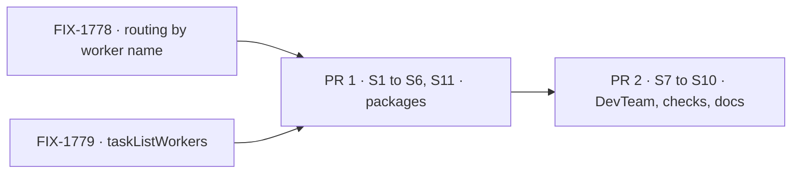

# FIX-1777 · Plan

[Spec](SPEC.md) · [Decisions](DECISIONS.md) · [Rules](BUSINESS-RULES.md) · **Plan** · [Docs](DOCS.md)

Directional. Shape and sequence are fixed; names and local structure are the implementer's.

## Surfaces

| ID | Where | What | Rules |
|---|---|---|---|
| S1 | `packages/orchestration` (`defineTaskCollection`) | Pass a collection's `reactTo` through to the resource declaration, so a task list can be watched for adds. No behaviour change for a collection that sets none | BR-1 |
| S2 | `packages/orchestration` (the task ledger's add) | Record the filer on a new task from the request's resolved identity, beside the task's own fields, never from input. A claim with an owner policy reads it | BR-8–BR-10 |
| S3 | `packages/workforce` (the mailbox's task-list ledger) | Bind `reactTo.created` on the one ledger every route writes: today the per-list declaration `mailboxBoard` mints; after FIX-1779, the mailbox kind's single collection. On an add, hand off a "run this list" request to the mailbox's own session, rescued so the add never fails | BR-1, BR-2, BR-6, BR-7, BR-11 |
| S4 | `packages/workforce` (the mailbox kind) | An internal entry that runs one pass over the named list, as the filer: claims only that filer's tasks (and unowned legacy ones), and hands each to its worker through FIX-1778's routing, and an unassigned task to the one worker `taskListWorkers(ctx, mailboxId, list)` returns; none or several, and it waits (BR-5, BR-19). Takes the app's claim policy (DevTeam passes `runOwnerDispatcher`) | BR-3–BR-5, BR-9, BR-13, BR-17, BR-19 |
| S5 | `packages/workforce` (`fileTask` and the board tools' answer) | Say when no worker works the list, or the named one doesn't exist, in the filing's answer | BR-5 |
| S6 | `packages/workforce` (hire) | The unattended-board warning reads `taskListWorkers` instead of "who declares the ledger" | BR-5 |
| S11 | `packages/workforce` (the `MAILBOX.md` binder) | Read an optional `workedBy:` map, list name to worker addresses, beside `boards:`; refuse a name that isn't a declared list or a member. `taskListWorkers` (FIX-1779) returns these plus run-time `worksTaskList` workers, minus FIX-1779's recorded removals (applied to the file term too), and nothing for declaring the ledger | BR-18 |
| S7 | `goals/devforce-lab/lab/` | `eng/mailboxes/feature/MAILBOX.md` gains `workedBy: { work: [eng.coder] }`. The EM files on Approve and on post and drains nowhere; its `coordinatorBoard` is dropped for the mailbox's run. The coder keeps its task door. Header comments say so | BR-15–BR-17 |
| S8 | `goals/workforce-conventions/a-filed-task-starts-its-worker/` (new) | Legs a and b, the `no-wake` control | goal |
| S9 | `goals/devforce-lab/it-keeps-its-rows-on-the-mailboxes-board/` and the other checks that drain by hand | Remove the hand drains; add leg c | goal |
| S10 | Docs, per [DOCS.md](DOCS.md) | Mailboxes page, Workforce README, Shift Manager README and overview | — |

**Removed:** the docs' "the mailbox runs nothing; a worker declares the board and drains it"; the
EM's two drains and its coordinator board; the hand drains in the checks that file on a mailbox list.

## Sequence and PR plan



| PR | Deliverables | Depends on |
|---|---|---|
| PR 1 | S1–S6 and S11, with Workforce and orchestration unit tests for BR-5–BR-11, BR-18, BR-19 | FIX-1778's routing and FIX-1779's `taskListWorkers` (stacked on their PRs if still open) |
| PR 2 | S7–S10, the goal checks with their control | PR 1, as a GitHub stack |

**Order with FIX-1779 for who works a list.** FIX-1779 lands `taskListWorkers` first, returning
run-time `worksTaskList` workers only, never the declarers. This issue's PR 1 then adds S11's
`workedBy:` file field to that read and applies FIX-1779's recorded removals to it, so a worker the
file names stops getting tasks once a coordinator unsubscribes it. PR 1 needs the read, so if FIX-1779 hasn't merged
when PR 1 opens, PR 1 stacks on it as well as on FIX-1778.

If FIX-1779's single collection lands first, S3 binds there; if after, FIX-1779 moves the binding
with the ledger. Either way the goal check's four routes prove it.

## Checks

| ID | What | Pass |
|---|---|---|
| VG | `a-filed-task-starts-its-worker` legs a and b, then `GOAL_CONTROL=no-wake`; the DevTeam board check with leg c | Green on the branch; red under `no-wake` (tasks *pending*); red against `origin/main` |
| V1 | Workforce and orchestration unit tests for BR-5, BR-6, BR-7, BR-10, BR-11, BR-18, BR-19 | Green; each red with S3 removed |
| V2 | `it-waits-for-a-person-before-it-files`, `it-wakes-the-seat-a-file-declared`, `it-ships-an-artifact-a-person-can-open`, `goals/mailbox-boards/it-runs-a-row-a-file-declared-board-holds`, `a-mailbox-holds-the-work-a-seat-drains` (each with its hand drain removed) | Green |
| V3 | `pnpm typecheck`, `pnpm --filter @flow-state-dev/workforce test`, `… orchestration test`, `… harness-manager test`, `… shift-manager test` | Green |

## Pinned

- The control's name: `GOAL_CONTROL=no-wake`.
- The read: `taskListWorkers(ctx, mailboxId, list)` (FIX-1779); an unassigned task goes to its only entry, and waits when it has none or several.
- The file field: `workedBy:` in `MAILBOX.md`, a map from list name to workers, the file twin of FIX-1779's run-time `worksTaskList`.
- The new check's folder: `goals/workforce-conventions/a-filed-task-starts-its-worker/`.

## Guardrails

- **One convergence point.** The start hangs off the ledger every route writes, not off any door,
  because four doors with their own "file, then maybe run" is the incoherence this issue exists to
  remove. A route that writes a mailbox list some other way is a bug the goal check must catch.
- **Never in the filer's turn.** Hand off before running, because a coding run inside a tool call
  holds the coordinator for its whole length.
- **The add never fails because the start did.** Rescue the hand-off, because a stored task that
  reports failure invites a second filing.
- **Owner from identity only.** Because the owner decides whose run and whose bill (BP-031).
- **Core and Engine untouched.** Because what a mailbox does with its list is Workforce policy.
- **Write "worker", never "seat", in any sentence added.**

## Sketch

```text
on a task added to a mailbox's list (any writer):
  hand off "run list L" to the mailbox, as the filer          // own request
run list L, as P:
  for each claimable task filed by P (or unowned):
    workers = taskListWorkers(L)          // MAILBOX.md workedBy + run-time worksTaskList
    worker = assignee ? lookup(assignee) : (workers.length == 1 ? workers[0] : wait)
    hand the task to worker                                    // FIX-1778's hand-off
```

## POC

None of its own. The premises rest on the FIX-1774 POC (findings 3 and 4) and this spec's
research ([DECISIONS.md → Settled](DECISIONS.md#settled)). The one premise worth a spike at
implement time: `reactTo.created` firing for a task list written from another flow's capability.
If it doesn't, stop and raise it; don't add per-door hooks.

## At implement time

- Route through FIX-1778's pins ([#2757](https://github.com/fixpoint-labs/flow-state-dev/pull/2757)): its one worker lookup (name to flow id, board aliases win), the `task` dispatcher's per-task `flowKind` at `defaultWorker`, and the task door `work`. Whichever of the two PRs lands first builds the lookup.
- Confirm the hand-off from the hook lands as its own request under the filer's identity
  (dispatch inherits the sender's principal).
- Confirm a run started by the hook doesn't re-trigger itself on its own writes beyond the adds it
  makes (re-pend is an update, not an add).
- With a real harness the run's request stays open for the run's length, as Approve's does today.

## Follow-ups

- **A failed attempt waits for the next run of its list.** Nothing retries it on its own. Telling
  the coordinator a task settled is [FIX-1780](https://linear.app/fixpoint-labs/issue/FIX-1780).

## Notes from review

Recorded from round 1 on [#2753](https://github.com/fixpoint-labs/flow-state-dev/pull/2753), for the first draft's scope; kept where they still apply:

- cursor[bot]: "Approve runs `board.drain` on **every** approval … The post door is **stricter**." (Now moot: neither door drains.)
- cursor[bot]: "pick one proof artifact for a thrown board run." (BR-11 names a unit test.)
- cursor[bot]: "consider a shipped negative control." (The `no-wake` control ships.)
- Codex: "Put failure reporting on an observable request … an accepted task dispatch returns before the child runs." (BR-11 now records the failure on the run's own request, not the filer's.)
- Codex: "Bind each new row to its poster before draining." (Folded: D-level, BR-8–BR-10, S2.)

Round 2, FSD Architect on #2753 (checked ff8d1ff6):

- "for every file-declared list, the default worker *is* the declaration inference this spec dropped … say what a file worker must do to count as working a list … and what happens when more than one worker qualifies." (Folded: BR-18, BR-19, S11. A list's workers are named by the mailbox, `workedBy:` in its file or `worksTaskList` at run time; several and no assignee waits.)
