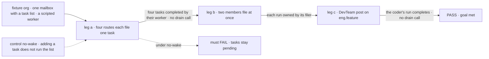
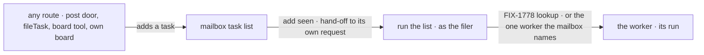

# FIX-1777 · A task filed on a mailbox's task list starts the worker it's for

**Spec** · [Decisions](DECISIONS.md) · [Rules](BUSINESS-RULES.md) · [Plan](PLAN.md) · [Docs](DOCS.md)

## Five people, before and after

| Someone who… | Today | After |
|---|---|---|
| **files a task on a mailbox's task list**, by any route: a post a worker turns into a task, `fileTask`, a board tool, or a worker adding to its own list | The task waits in *pending* until something runs the list by hand | The worker it's for starts on it, in a request of its own, and the run shows under Tasks |
| **is a coordinator handing work to a worker it just hired** (FIX-1778, FIX-1779) | Filing the task starts nothing | Filing the task is the hand-off: the worker starts |
| **files the same task twice, or adds nothing** | Nothing new | Nothing new: no second run |
| **files a task while a colleague's task is waiting on the same list** | Whoever runs the list next can end up running the colleague's task as their own | Each run belongs to whoever filed its task; a filing never starts someone else's |
| **approves a feature in DevTeam's Inbox** | Filed and started | The same, through the same rule as every other filing |

## The goal, and how we'll know it's met

**A task added to any mailbox's task list, by any route, ends with the worker it's for running it,
as the person who filed it, with nobody running the list by hand.**

| Is it the right goal? | |
|---|---|
| **The real need** | Jake: "The coordinator has a responsibility to route work, hire the workforce as needed, setup mailboxes, and get the work flowing to the right places … Imagine other use cases, not just this very specific flow" (FIX-1774 thread, 2026-10-04). And: "the coordinator should be able to setup the mailbox and subscribe the appropriate workers so that it can create the task in the mailbox's task list" ([FIX-1779](https://linear.app/fixpoint-labs/issue/FIX-1779)). Filing is the hand-off, so filing has to start the work |
| **Smaller, and rejected** | "A post on DevTeam's feature workstream starts the coder" (this spec's first draft). It leaves `fileTask`, the board tools and every run-time mailbox starting nothing, so the coordinator's hand-off in FIX-1774 and FIX-1779 would still stop at a pending task |
| **Where the boundary sits** | This issue owns the start: a task added to a list makes the list run, and each task reaches its worker. Who a task is for (assignee name to worker) is [FIX-1778](https://linear.app/fixpoint-labs/issue/FIX-1778). Mailboxes made at run time and a list's default worker are [FIX-1779](https://linear.app/fixpoint-labs/issue/FIX-1779). Running the list again when an attempt goes back to *pending* is [FIX-1780](https://linear.app/fixpoint-labs/issue/FIX-1780) BR-6a ([follow-up](PLAN.md#follow-ups)) |
| **Not done if** | A task filed by any of the four routes is still *pending* with no hand drain · the filer's own turn waits for the run · one person's filing starts another person's task · a repeat filing starts a second run · DevTeam's Approve or post needs its own drain to start work |



The checks file and then only read. They never call a drain, so a completed task was started by
the filing. Under the control the same filings must leave every task *pending*.

| How we verify | |
|---|---|
| **Goal check** | `goals/workforce-conventions/a-filed-task-starts-its-worker/` (new, legs a and b) and `goals/devforce-lab/it-keeps-its-rows-on-the-mailboxes-board/` tightened (leg c: its own `drain` call removed) · no model · run by the implementer · verdicts in the implementation PRs |
| **Signal** | Leg a: one task each through a post door, the mailbox's `fileTask`, the mailbox's board action, and a worker's own board tool; within the settle budget all four are `completed` by the named worker and the check called no drain; the filer's call returned before the run finished. Leg b: two members each file a task on the same list at once; each task's run is recorded as its filer's, and neither member's request claimed the other's task. Leg c: DevTeam's shaped post ends as a completed row, assignee the coder |
| **Input** | A fixture worker tree with one mailbox, one task list and one scripted worker that completes a task; DevTeam as it stands for leg c. Run: `pnpm tsx goals/workforce-conventions/a-filed-task-starts-its-worker/run.mts` and the board check's `run.mts` |
| **Anti-game** | No drain from either check, no task seeded. Tasks read through the mailbox's `readBoard`, where Shift Manager reads them. Leg b reads the run owner off the stored task, not off the worker's output |
| **Control that must fail** | `GOAL_CONTROL=no-wake` turns off only the start on add: leg a FAILS, all four tasks stay *pending*; leg c FAILS the same way. Against `origin/main` both checks FAIL leg a / leg c |

## What changes


Top is today: four routes in, one manual drain out. Bottom is after: four routes in, the list runs itself.

**A worker's file stops wiring a drain.** Today the docs tell a worker that claims rows to declare
the board and drain it. After, the mailbox does that:

```diff
  // a worker that works a mailbox's task list
  defineFlow({
    kind: "builder",
-   resources: { [board.id]: board },
-   actions: { drain: { block: board.drain } },   // someone has to call this
    task: { work: { block: doTheWork } },         // the task door (FIX-1778)
  });
```

**The mailbox names who works its list.** Declaring the list's ledger no longer counts; the
mailbox's file says it, as `worksTaskList` does for a list made at run time (FIX-1779):

```diff
  # teams/eng/mailboxes/feature/MAILBOX.md
  members: [eng.em, eng.coder, eng.reviewer, chief-of-staff]
  boards: [work]
+ workedBy: { work: [eng.coder] }
```

A task with no assignee goes to the list's one worker. With none, or several, it waits and the
filing's answer says why.

**DevTeam's EM files and stops.** Approve and the post door both just file; the list runs itself.

```diff
  askToFile:  prepare → gate → file
-             → board.drain                          // removed: one rule for every door
  onPost:     file from "slug: what"                 // starts the coder now
```

## How a filed task moves



The filer gets their answer as soon as the task is stored. The run happens in a separate request,
under the filer's identity, so it is theirs and is charged to them.

## What stays as it is

- **Core and Engine.** No change. The add is seen through the resource layer's existing
  `reactTo` hook, which Workforce binds on the mailbox's task list. Orchestration passes it through.
- **Task lists that are not a mailbox's.** A worker's private board behaves as today.
- **The Inbox ask.** Still asks first. Approve files; Deny files nothing.
- **Retries.** A failed attempt goes back to *pending* and waits for the next run of the list.
- **Which harness runs.** Still the operator's setting.

## Sign off

**[The goal](#the-goal-and-how-well-know-its-met), at that size:** filing on any mailbox's task list is the
hand-off, and the work starts as the filer's.

1. **[D1](DECISIONS.md#d1) · The mailbox hands out its own tasks; a worker no longer runs a list.**
   If wrong: Labs that wanted a worker to batch or pace its own list lose that control.
2. **[D2](DECISIONS.md#d2) · A filed task starts at once, with no approval first.** If wrong: a stray
   or mistaken filing spends a paid run before anyone sees it.

**Open: none.** The calls made without asking, and what was dropped, are in
[DECISIONS.md](DECISIONS.md). The cases: [BUSINESS-RULES.md](BUSINESS-RULES.md).

Enhancement · `@flow-state-dev/workforce` + `@flow-state-dev/orchestration` + DevTeam Lab + docs ·
medium · 2 PRs, stacked on FIX-1778's routing · epic [FIX-1763](https://linear.app/fixpoint-labs/issue/FIX-1763) ·
blocks [FIX-1774](https://linear.app/fixpoint-labs/issue/FIX-1774) · composes with
[FIX-1778](https://linear.app/fixpoint-labs/issue/FIX-1778), [FIX-1779](https://linear.app/fixpoint-labs/issue/FIX-1779)
