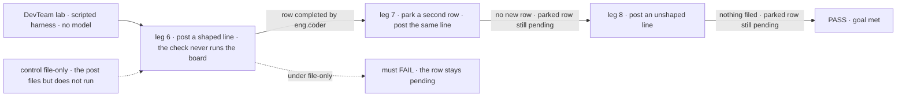
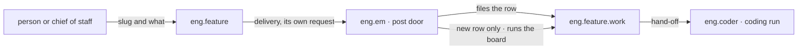

# FIX-1777 · A post that files a task on a mailbox's board starts the worker it's for

**Spec** · [Decisions](DECISIONS.md) · [Rules](BUSINESS-RULES.md) · [Plan](PLAN.md) · [Docs](DOCS.md)

## Four people, before and after

| Someone who… | Today | After |
|---|---|---|
| **posts `slug: what to build` on the DevTeam feature workstream** | A task is filed and sits in *pending* for good | The coder starts on it in the same delivery, and the run shows under Tasks |
| **posts the same slug again** | Nothing new | Nothing new: no second task, no second run, and no other waiting task is started |
| **posts a line that doesn't name a feature** | Nothing filed | The same |
| **approves a feature in Inbox** | Filed and started | The same |

## The goal, and how we'll know it's met

**A line posted on the feature workstream that files a new task ends with the coder's run on that
task, with nobody running the board by hand; a line that files nothing starts nothing.**

| Is it the right goal? | |
|---|---|
| **The real need** | "When a post files a new task, the board runs in the same delivery and the task reaches its worker. A repeated slug files nothing and runs nothing. An unshaped line still files nothing" ([FIX-1777](https://linear.app/fixpoint-labs/issue/FIX-1777)). It unblocks [FIX-1774](https://linear.app/fixpoint-labs/issue/FIX-1774), where the chief of staff hands coding work over by exactly this post |
| **Smaller, and rejected** | "The task reaches the board." It already does; that is the bug. The goal is graded on the run, not the row |
| **Where the boundary sits** | "Starts" means the board hands the task to `eng.coder` and its run opens and settles, on whatever harness the Lab runs. A failed attempt waiting for another board run is today's behaviour on every door, and stays so ([follow-up](PLAN.md#follow-ups)) |
| **Bigger, and open** | Any mailbox board in Workforce starting the worker that drains it when a task is filed through the mailbox's own `fileTask`: [O1](DECISIONS.md#o1), put to Jake. The chief of staff routing coding work ([FIX-1774](https://linear.app/fixpoint-labs/issue/FIX-1774)) |
| **Not done if** | The posted task is still *pending* until something else runs the board · a repeat post starts a second run, or starts some other waiting task · an unshaped line files or runs anything · the Inbox ask changes |



The check posts and then only reads. It never calls `drain`, so a row that completes was run by
the post. Under the control the same post must leave the row *pending*.

| How we verify | |
|---|---|
| **Goal check** | `goals/devforce-lab/it-keeps-its-rows-on-the-mailboxes-board/`, tightened: its own `drain` call removed and three legs added · no model · run by the implementer · verdict in the implementation PR |
| **Signal** | Leg 6: within the settle budget the posted row is `completed`, assignee `coder`, and the check called no `drain`. Leg 7: after a row is filed through `file` and left *pending*, the same line posted again leaves one row for the slug and that parked row still *pending* once the delivery has settled. Leg 8: an unshaped line adds no row and the parked row is still *pending*. Legs 0 to 5 as today |
| **Input** | The DevTeam tree as it stands, scripted harness. Run: `pnpm tsx goals/devforce-lab/it-keeps-its-rows-on-the-mailboxes-board/run.mts` |
| **Anti-game** | No `drain` from the check, no row seeded for leg 6. Rows read where Shift Manager reads them. Leg 7 waits for the delivery to finish, not a bare sleep, so "nothing ran" is not "nothing ran yet" |
| **Control that must fail** | `GOAL_CONTROL=file-only` turns off the post's board run and nothing else: leg 6 FAILS, the row stays *pending*. Against `origin/main`'s lab the check FAILS the same way |

## What changes


Top is today: the post stops at the row. Bottom is after: the post runs the board when the row is new.

**The EM's post door** (`goals/devforce-lab/lab/workforce/flows/workers/em.mts`):

```diff
- [POST_ENTRY]: { block: fileFromPost, … }     // files the row, nothing more
+ [POST_ENTRY]: { block: postToFile, … }       // files the row, then runs the board
+                                              // only when the row is new, as Approve does
```

**What a person sees.** Nothing new to write: the post they already make now starts the work.
With `DEVFORCE_LAB_HARNESS=claude-code`, that means **a post now spends model time on its own,
with no approval card first.** The Inbox ask stays the door that asks first.

## How a post moves



The delivery is already its own request, so the poster's post returns at once. The run belongs to
whoever posted, as runs started from Inbox belong to whoever approved.

## What stays as it is

- **Workforce, core and engine.** No package change. The mailbox, its delivery and the board are
  used as they are.
- **The Inbox ask.** Still asks first; Approve files and runs; Deny files nothing.
- **The `file` and `drain` actions.** `file` still files only. A check or host that files directly
  still runs the board itself.
- **The line shape.** `<slug>: <what>`, as today.
- **Retries.** A failed attempt goes back to *pending* and waits for the board to run again, on
  every door, as today.

## Sign off

**[The goal](#the-goal-and-how-well-know-its-met), at that size:** a new task posted on the
workstream ends in the coder's run; anything else posted starts nothing.

1. **[D1](DECISIONS.md#d1) · A shaped post starts the coding run at once, with no approval
   first.** If wrong: a stray or mistaken post spends a paid run before anyone sees it.

**Open: [O1](DECISIONS.md#o1)** · does a task filed through a mailbox's own `fileTask` also start
the worker that drains that board, or does the coordinator always post? Put to Jake. The calls made without asking, and what was dropped, are in
[DECISIONS.md](DECISIONS.md). The cases: [BUSINESS-RULES.md](BUSINESS-RULES.md).

Enhancement · DevTeam Lab (`goals/devforce-lab/lab/`) + Shift Manager docs · small · 1 PR · epic
[FIX-1763](https://linear.app/fixpoint-labs/issue/FIX-1763) · blocks
[FIX-1774](https://linear.app/fixpoint-labs/issue/FIX-1774)
