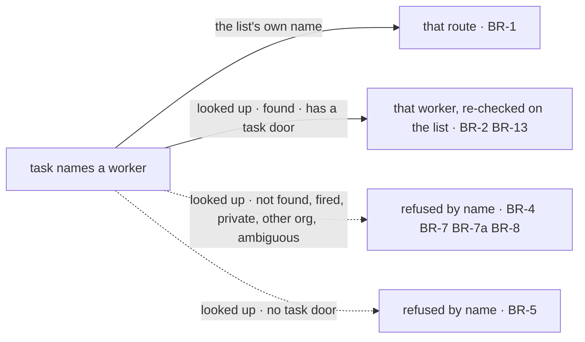

# FIX-1778 · Business rules

[Spec](SPEC.md) · [Decisions](DECISIONS.md) · **Rules** · [Plan](PLAN.md) · [Docs](DOCS.md) · [Evolution](EVOLUTION.md)

The cases, written as rules. Each says what a person or the system does and what happens. The
*proved by* column is the check the plan runs.

## Who a name reaches

| # | When | Then | Proved by |
|---|---|---|---|
| BR-1 | A task names a worker the list's board declares a route for (`coder`) | That route runs it, as today. The lookup is not asked | CI · existing DevTeam checks unchanged |
| BR-2 | A task names a worker the organization has (declared in files, hired before start, or hired mid-conversation) | The list hands the task to that worker's own flow, in a session of its own for that task | CI · goal check legs a, b, c |
| BR-3 | Two tasks name the same worker | Each runs in its own session | CI |
| BR-4 | A task names a worker that was fired after it was filed | The hand-over is refused, naming the worker. The attempt fails through the list's normal error path and its attempt budget applies. No other worker runs it, and the task does not wait (FIX-1777's BR-5 "waits" covers only an unnamed task on a list with no worker) | CI |
| BR-5 | A task names a worker whose kind has no task door (an app's own kind that declares none) | The hand-over is refused, naming the worker and that it takes no tasks. The attempt fails as in BR-4 | CI |
| BR-6 | A task names no worker, and its list hands names to the lookup | Refused by name: there is nothing to look up. Which worker takes unnamed tasks is the wake's rule (FIX-1777) | CI |
| BR-7 | A task names a worker another member hired for themselves | Not found, unless the task was filed by that member | CI · hire-plane suite |
| BR-7a | A name is held by both an organization worker and the filer's own worker | Ambiguous: refused at filing, and at hand-over if the second worker was hired after filing, naming both. Never resolved by precedence | CI |
| BR-8 | A task names a worker in another organization | Not found. The lookup reads only the organization of the run | CI |
| BR-9 | A list's board has no fallback, or one that runs inline | As today: an undeclared name fails the task, or runs inline | Existing suite |

## Filing a task for a worker

| # | When | Then | Proved by |
|---|---|---|---|
| BR-10 | A door files a task for a name the organization has | Filed, as today | CI |
| BR-11 | A door files a task for a name nobody holds (for the filer) | Nothing is filed. The answer names the worker and says no worker has that name. Every door asks the same check: FIX-1779's tool and the mailbox's `fileTask` | CI · goal check leg d |
| BR-11a | Under D3 (ii): a door files a task for a worker the list does not name ([Open](DECISIONS.md#open)) | Nothing is filed. The answer names the list's workers. Checked in the filing door against FIX-1779's read of the list's workers, not in this issue's lookup | CI · FIX-1779 |
| BR-12 | A worker is renamed, fired, or re-hired under the same name after a task was filed | Fired: BR-4. Re-hired under the same name: the new worker gets the task (D2) | CI |

## Taking a task from any list

| # | When | Then | Proved by |
|---|---|---|---|
| BR-13 | A worker is handed a task from a list its kind never declared, in its own organization (a list that names it, under D3 (ii)) | It re-reads the task on that list and runs it, if the claim is still current: same attempt, same row, still in progress, still for this worker | CI · goal check |
| BR-14 | The task was cancelled, reclaimed or re-filed between hand-over and arrival | Nothing runs and nothing is written, as today (`stale-task-claim`) | CI |
| BR-15 | A hand-over names a list the worker's organization does not have | Refused before anything runs; nothing is written. The list id in a hand-over is treated as untrusted: it resolves only inside the run's organization, and the row re-read on that list is the authorization | CI |
| BR-16 | An `agent` worker is handed a task | It runs one turn with its own instructions and tools, the task's goal and context as the message. The answer is the task's result and the task completes. A turn that fails fails the attempt | CI · goal check leg a |
| BR-17 | An `agent` worker is handed a second task while a turn runs | Each task runs in its own session; the worker's conversation sessions are untouched | CI |

## Layers

| # | When | Then | Proved by |
|---|---|---|---|
| BR-18 | Any change in this issue lands in `core`, `engine` or `orchestration` | It names no worker, hire, roster or mailbox concept. Those packages see a task, its name, a flow to send it to, and a list to read it from | CI · vocabulary guard on the added lines |

Solid paths run the task. Dashed paths fail the attempt with the worker named.

## Failure taxonomy

Every lookup failure is a refused hand-over: decided before anything runs, so no child session
exists and nothing half-ran. The attempt fails through the list's ordinary error path, and the
task's attempt budget decides whether it retries or settles as errored. At filing, an unknown name
files nothing and says why. A stale claim on arrival writes nothing. Nothing is fatal to the list:
other tasks keep going.

## Acceptance criteria this issue owns

[The goal](SPEC.md#the-goal-and-how-well-know-its-met): an `agent` worker hired after start, a
worker hired before a restart, and a declared worker on a list no code wired it to each receive a
task filed for them by name and complete it on a real model, and leg a fails under both controls.
The plan runs it last.
