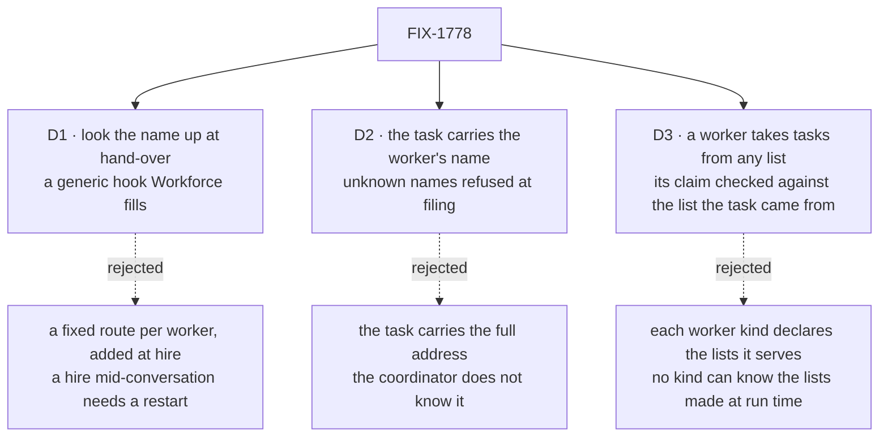

# FIX-1778 · Decisions

[Spec](SPEC.md) · **Decisions** · [Rules](BUSINESS-RULES.md) · [Plan](PLAN.md) · [Docs](DOCS.md) · [Evolution](EVOLUTION.md)

What was considered, what was chosen, why, and what each choice locks in. Three decisions are the
sign-off surface. Reversing "a task's assignee never names a hired worker" is not one of them:
Jake made that call on FIX-1774, and [EVOLUTION.md](EVOLUTION.md) records it.

## The tree

Solid edges are what you're signing. Dashed edges lost, and the label says why.

## D1 · Which worker a name reaches is looked up when the task is handed over, through a generic hook that Workforce fills

| | |
|---|---|
| **Instead of** | Giving each list a fixed route per worker when it is built, and adding one at each hire |
| **Because** | A hire happens mid-conversation and lists are built when the app starts. A route fixed at start can't reach a worker that did not exist then, and rebuilding a running flow per hire is not something the framework does. The hook asks only "which flow does this task go to", so Core and the board learn no worker words, and Workforce plugs its lookup in (Jake's layer rule, 2026-09-24; tenet 5). FIX-1777's wake uses the same lookup, so filing, waking and handing over agree on who a name means |
| **Locks in** | Where a list's fallback sends a task is decided per task, at run time, so nobody can list every worker a list may reach. A wrong name, a fired worker or a kind with no task door fails the task with the name in the error. Any cross-flow route already behaved this way: it is checked only when the task runs |

![D1: when a list hands a task over, how is its worker found? Chosen: look the name up at hand-over, through a generic hook Workforce fills. Instead of: a fixed route per worker, added at each hire. It comes down to a worker hired mid-conversation: a fixed route can't reach it until the app restarts. The price: nobody can list every worker a list may reach. Declared routes are a tie. Locks in: the fallback's target is decided per task. Flips if: hires only took effect at restart, so fixed routes could list every worker.](figures/d1-look-up-at-hand-off.svg)

It comes down to a worker hired mid-conversation: a fixed route can't reach it until a restart.

**What would change my mind:** if hires only took effect at the next start. Then fixed routes,
built at start, could list every worker, and nothing would need the lookup.

## D2 · A task names its worker by the worker's name, and a name nobody holds is refused when the task is filed

| | |
|---|---|
| **Instead of** | Writing the worker's full address on the task (organization, owner and name) |
| **Because** | The coordinator knows workers by name: `discover` lists `eng.coder`, and `hire` is called with `frontend`. The address carries the organization and, for a member's own worker, the member; the lookup derives both from whoever's run hands the task over, so a task can't name its way into another organization. A name nobody holds is refused at filing, so the coordinator hears about a typo in the same turn |
| **Locks in** | Worker names are the routing key on tasks, and the organization and member come from the run, not from the task. A worker fired and re-hired under the same name gets the old name's open tasks. A worker's open tasks can't follow it to a new name |

It comes down to what the coordinator can write: it knows names, not addresses.

## D3 · Every worker takes tasks from any list in its organization, and its claim is checked against the list the task came from

| | |
|---|---|
| **Instead of** | Each worker kind declaring the lists it serves, as DevTeam's coder does today by re-declaring the feature board so its task door has a claim check to run |
| **Because** | Mailboxes and their lists are made at run time (FIX-1779), and a hire can be named on any of them. A kind can't declare lists that don't exist yet. So the task door asks, per task, which list sent it, re-reads the task there, and runs the same claim checks as today. The `agent` kind, which most hires are, gets a task door: the task becomes one turn, and the answer is the result |
| **Locks in** | Any worker in an organization can be handed a task from any of its lists. Who may file onto a list, and for whom, is the only fence, and it belongs to the filing door (FIX-1779, the mailbox's `fileTask`). A list that must reach only certain workers says so where tasks are filed |

It comes down to lists made at run time: a kind can't declare a list that doesn't exist yet.

**What would change my mind:** a list that must never reach some workers whatever is filed on it,
such as a list with private data. Then the list, not the worker, would carry an allow-list, and D3
would gain that check rather than reverse.

## Decided, not asked

- **A list's own names win.** A name the list's board declares (`coder`) uses its route; only
  other names reach the lookup. Every existing DevTeam check grades on `coder`.
- **The lookup sits on the board's existing fallback** (`defaultWorker`), not a new option. Today
  the fallback runs undeclared names inline and is refused as a hand-off; that refusal lifts. A
  uniform `workers` block still can't hand off.
- **The hook lives on the task dispatcher**, beside its per-task `session` key function: a value
  computed from the task and the run. Only `task` dispatchers get it.
- **An unknown name at hand-over reuses `flow-not-found`**, with the name in the detail. No new
  refusal code.
- **The lookup reads the host's live worker list**, not the list it booted with, so a hire is
  found the moment it registers, by filing, waking and hand-over alike.
- **The hand-over reads the task's worker from the claim**, which the board writes from the row it
  claimed. Never from the task's input.
- **An `agent` worker's task turn runs with its own instructions and tools**, and the task's goal
  and context as the message. It writes nothing to a mailbox unless its tools do.
- **A member's own worker resolves only for that member**; the run's member is whoever filed the
  task (FIX-1777 stamps it).
- **DevTeam's coder drops its re-declared board.** The tax goes in the same change (tenet 3).
- **The `<slug> @<name>: <what>` post line from the first draft is dropped.** The coordinator files
  through FIX-1779's tool, which takes the name.

## Considered and dropped

| Alternative | Why not |
|---|---|
| A fixed route per worker, added when it is hired | Lists are built at start. A hire mid-conversation would need the flow rebuilt, which is a restart |
| Workforce runs its own drain for hired workers | A second drain over one ledger. FIX-1777's wake runs the list; it only needs to know where to send |
| Name the hire after the list's slot (`coder`) | Breaks on the second hire, and makes the name a slot, not a worker. Jake asked for a named worker |
| Only `coder`-kind workers take tasks | Every hire for a non-coding skill would still idle (U3 and U5 in FIX-1774's design) |
| A task door that accepts any list without a claim check | A dispatched task would run without proving it is still the row's current claim; cancels and reclaims would race it |
| A post-line convention for naming the worker | One lab's syntax. FIX-1779's filing tool serves every list |

## Settled

- **A hired worker is reachable by address in the same process, at once.** Hiring registers the
  flow under its address, and the dispatch seam resolves any registered address under the
  owner's pin. Read off `packages/workforce/src/seat-hire-blocks.ts`, the registry lookup in
  `packages/engine/src/flowstate/createFlowState.ts`, and `packages/engine/src/context/create-request-host.ts`.
- **A hire is not given work today, whatever its kind**: [FIX-1774's POC, finding 2](https://github.com/fixpoint-labs/flow-state-dev/blob/spec/FIX-1774/specs/issues/FIX-1774/poc/the-dogfood-turn/README.md).
- **A task door is tied to one board today.** The gate reads the ledger its board was built with
  and refuses another `boardId` (`packages/orchestration/src/task-board/task-entry.ts`), which is
  why DevTeam's coder re-declares the board (`goals/devforce-lab/lab/board.mts`, "the framework's
  tax").

## How it got here

- **Draft** — framed on the DevTeam feature board: a lookup at hand-over on the board's fallback,
  and a `<slug> @<name>: <what>` post line for the coordinator.
- **Widened before review** — Jake, on FIX-1774: "Imagine other use cases." Any list and any
  worker: D3 added (every worker takes tasks from any list, `agent` included), the post line
  dropped for FIX-1779's filing tool, and the wake left to FIX-1777, which reuses D1's lookup.

**Open: none.**
