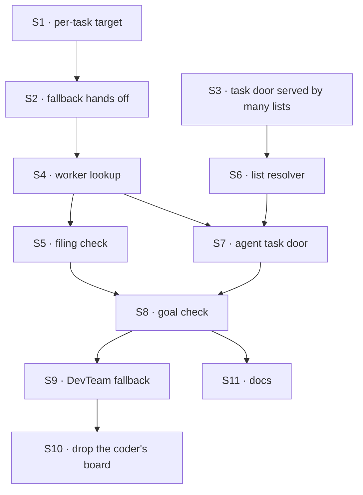

# FIX-1778 · Plan

[Spec](SPEC.md) · [Decisions](DECISIONS.md) · [Rules](BUSINESS-RULES.md) · **Plan** · [Docs](DOCS.md) · [Evolution](EVOLUTION.md)

Written for the implementing agent. IDs cross-reference [BUSINESS-RULES.md](BUSINESS-RULES.md)
(BR-n) and [DECISIONS.md](DECISIONS.md) (D-n). `tdd`. Two PRs in a GitHub stack (below).

## Surfaces

| ID | Package · role | Change | Rules |
|---|---|---|---|
| S1 | `core` · the task dispatch address, `dispatcher()`, the seam | A `task` dispatcher's `flowKind` may be `(task, ctx) => string \| undefined \| Promise<…>`, where `task` is the assignee, id and input being handed over. Resolved once per dispatch; nothing means `flow-not-found` naming the assignee (D1). `internal` keeps a string. Every reader of `address.flowKind` handles the function: `defineFlow`'s walk (cross-flow skip), `runAction`'s cross-flow test, refusal details | BR-2 BR-4 BR-8 |
| S2 | `orchestration` · the claim and the fallback | The claim ticket carries the claimed row's assignee (server-derived, like `attempt`). `defaultWorker` may be a task dispatcher; its hand-over uses the ticket's assignee as the envelope's worker name, so the arrival check `row.assignee === seat` holds. No assignee: refused by name. The handed-off test counts undeclared assignees when the fallback hands off; `board.handedOff` lists it as `floor`. **Remove** the "only a named seat can hand off" refusal for the fallback | BR-2 BR-3 BR-6 BR-9 |
| S3 | `orchestration` · a task door served by many lists | A task entry may declare where its tasks come from instead of being reached by one board: a resolver from list id to ledger (`(listId, ctx) => ledger \| undefined`). Its gate reads the envelope's list id through the resolver, refuses an unknown one before any read, then runs today's checks (attempt, row, status, assignee, lease takeover, run link, renewal) on that ledger. `defineFlow` accepts such an entry with no board reaching it; the gate identity check in `runAction` accepts it. Boards that hand off to a same-flow entry keep today's binding | BR-13 BR-14 BR-15 |
| S4 | `workforce` · the worker lookup | Exported. Name → the flow id of the worker the run's organization holds under that name, else the run member's own worker under that name, else nothing. Reads the host's **live** worker registry (its getter, not the boot list) and the hired roster. One implementation serves the S1 hook, the filing check, and FIX-1777's wake | BR-2 BR-4 BR-7 BR-8 |
| S5 | `workforce` · the filing check | The same lookup, called before a task is filed: found, or a refusal naming the worker. The mailbox's `fileTask` calls it when an assignee is given; FIX-1779's tool will too | BR-10 BR-11 |
| S6 | `workforce` · the list resolver | Exported. A list id → that mailbox list's ledger in the run's organization (through the existing mailbox-board ledger memo), else nothing | BR-13 BR-15 |
| S7 | `workforce` · the `agent` kind's task door | `task.actions.work`, served by S6: turns the task's goal and context into one turn of the worker's existing `run` path (its instructions, tools, model) and returns the answer as the result | BR-16 BR-17 |
| S8 | Goal check | `goals/mailbox-boards/it-hands-a-task-to-a-fresh-hire/` (`goal.md`, `run.mts`, `GOAL_CONTROL=fixed-routes` and `pinned-gate`). Its list runs through a board whose fallback is S4's lookup, until FIX-1777's wake replaces that | goal |
| S9 | DevTeam Lab · `board.mts`, `host.mts` | `coordinatorBoard` gains the fallback (S4's lookup, action `work`, `per-task`); `coder` stays. Rewrite the `ASSIGNEE` and `coderSeatId` comments that say an assignee is not a worker and a computed target is not offered | BR-1 BR-2 |
| S10 | DevTeam Lab · `coder.mts` | **Remove** `recipientBoard` and the `drain` action that exists only for it; the `work` entry is served by S6 (D3, tenet 3) | BR-13 |
| S11 | Docs | Publish [DOCS.md](DOCS.md) | — |

## Sequence and PR plan



| PR | Deliverables | depends_on |
|---|---|---|
| A | S1 to S8, S11 (the packages, the goal check, the docs) | — |
| B | S9, S10 (DevTeam) | A |

B is stacked on A as a GitHub stack. The thread saves B as a patch under
`/mnt/project-files/FIX-1778/` for the coordinator to push stacked.

**Start with S3's tracer bullet**: a worker flow that declares no list resolves an org-scoped mailbox
list's ledger by id and re-reads a row there. This is the one premise read off code, not run. If the
store needs the ledger declared as a resource on the worker's flow, stop and report before building
further; the fallback is the worker kind declaring the mailbox ledgers it can see at boot, which
breaks for lists made at run time.

## Checks

| ID | Runs after | Passes when |
|---|---|---|
| V1 | S1 | A function target dispatches to the id it returns, sync or async; nothing refuses `flow-not-found` naming the assignee; a string target is byte for byte as before; `defineFlow` accepts it |
| V2 | S2 | Declared name takes its route without calling the lookup (BR-1); undeclared name reaches the returned flow in its own per-task session (BR-2, BR-3); no assignee refused by name (BR-6); inline fallback unchanged (BR-9); a second drain and a restart hand over nothing twice (BP-035) |
| V3 | S3 S6 | One task door takes tasks from two lists it never declared; a stale claim on either writes nothing (BR-14); an unknown list id is refused before any read (BR-15); a board's same-flow entry is unchanged |
| V4 | S4 S5 | Hire-plane suite extended: org worker and the filer's own worker resolve; a teammate's own worker, another org's, an unknown name do not (BR-7, BR-8); fired worker's task fails naming it (BR-4); a kind with no task door is refused with "takes no tasks" (BR-5); `fileTask` with an unknown name files nothing (BR-11); a hire made after start resolves at once |
| V5 | S7 | An `agent` worker handed a task runs one turn with its instructions and tools, and the task completes with the answer (BR-16); two tasks run in two sessions (BR-17) |
| V6 | S1 to S7 | Vocabulary guard over the added lines in `core`, `engine`, `orchestration`: no worker, hire, roster, mailbox (BR-18). Seen to fail on a planted line first |
| VG | S8 | [The goal](SPEC.md#the-goal-and-how-well-know-its-met) PASSES on `openai/gpt-5.4-mini`, after FAILING leg a under `GOAL_CONTROL=fixed-routes` and under `GOAL_CONTROL=pinned-gate` on *a run on the hire's flow*, with the hire and the row passing in both |
| V7 | S9 S10 | DevTeam: every existing goal check passes unchanged; a coder hired mid-run, named on `eng.feature.work`, gets the task and its harness prompt holds the task's goal |
| V8 | all | Core, orchestration, workforce and integration suites; `pnpm typecheck` |

## Pinned names · the only four

| Where | Name | Why pinned |
|---|---|---|
| A worker's task door | `work` | Every list's fallback dispatches to it; FIX-1777's wake does too. DevTeam already uses it |
| The fallback that looks names up | `defaultWorker` | Existing public option |
| Where the lookup plugs in | `flowKind` on a `task` dispatcher | Existing public option, beside `session`'s key |
| What an assignee is | the worker's name as `discover` lists it | D2; FIX-1779's tool and FIX-1774's view print the same string |

The helper names (`workerByName()`, `mailboxLists()` in `SPEC.md`) are illustrative.

## Guardrails

| Rule | Because |
|---|---|
| Core, Engine, Orchestration name no worker, hire, roster or mailbox concept (V6) | Jake's layer rule. They carry two questions; Workforce answers |
| One lookup serves hand-over, filing and the wake | Two lookups drift: a name filing accepts would fail at hand-over (tenet 5) |
| The lookup reads the host's live registry, never the boot list | A hire must resolve the moment it registers (FIX-1779 relies on it) |
| The organization and member come from the run, never from the task | The name on a task is caller-controllable; who may be reached is not (BP-031) |
| Every lookup or list failure is a refusal decided before dispatch or before any row read | Then nothing half-runs and the existing failure paths apply |
| The S3 gate runs every check today's gate runs, in the same order | It replaces where the row is read, not whether the claim is verified |
| A string `flowKind` and a board-bound task entry behave as today, on every reader | Every existing cross-flow board depends on it (BP-030) |

## Docs

Reconcile [DOCS.md](DOCS.md) against shipped behaviour after V4 and V5, then publish with
`docs-writer` and `docs-editor`. One changeset, `minor`, for core, orchestration and workforce.

## Sketch · pseudocode, illustrative, react to the shape

```
list hands a task over:
    route ← the list's own name for task.assignee, else the fallback
    target ← route.target is a function ? route.target(task, run) : route.target
    no target → refuse flow-not-found, naming the assignee

worker's task door, on arrival:
    ledger ← door.from(envelope.list, run)            ← per task, not per declaration
    no ledger → refuse
    today's gate on that ledger: attempt, row, status, assignee, lease, run link

Workforce:
    lookup(name, run)  → org worker, else the run member's own, else nothing
    lists(id, run)     → that mailbox list's ledger in the run's org, else nothing
    agent kind: task.actions.work ← { the task as a turn, from: lists }
```

**POC:** none committed. The tracer bullet in *Sequence* is the check on S3's premise.

## At implement time

- FIX-1777 and FIX-1779 build on S4. If either lands first with its own lookup, converge on one.
- FIX-1774's design adds a `description` on hire; the lookup ignores it.
- FIX-1581 may rename the envelope's `seat` field to `assignee`. If it landed, use the new name.
- `docs-writer` must not write "seat" in new prose.

## Notes from review

- "Pin how a name maps to a declared id versus a hired address." — technical validator, round 0.
  Resolved in S4: both are names as `discover` lists them.

## Follow-ups

- A list-side allow-list of workers, if a list must never reach some workers (D3's flip).
