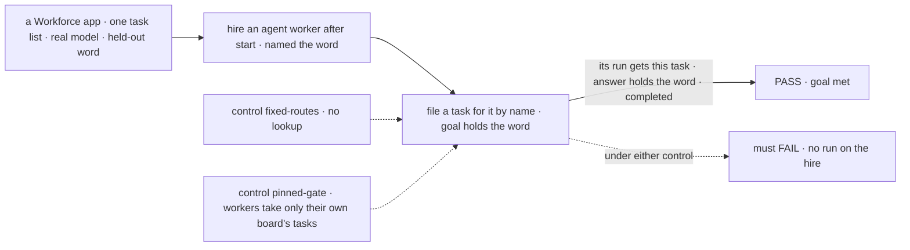
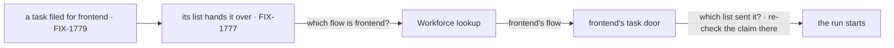

# FIX-1778 · A coordinator can assign a task to a named worker, including one it just hired

**Spec** · [Decisions](DECISIONS.md) · [Rules](BUSINESS-RULES.md) · [Plan](PLAN.md) · [Docs](DOCS.md) · [Evolution](EVOLUTION.md)

## Six people, before and after

| Someone who… | Today | After |
|---|---|---|
| **hires a worker for a skill nobody has, then files it a task** ("audit our dependencies' licenses") | The hire lands and idles. An `agent` worker can't take a task at all, and no task list can reach a worker hired after start | The task reaches the new worker, which runs it as one turn. Its answer is the task's result |
| **files a task for a worker the organization already has, on a list it was never wired to** | Only a worker the list's board names in code can be named. Any other name fails the task | That worker gets it, by name, once it works the list (D3 (ii), open) |
| **names a worker nobody has** | The task fails later, with a routing error | Refused when the task is filed, naming the worker |
| **names a worker another member hired for themselves** | n/a | Not found, as if nobody had it. A member's own worker is theirs |
| **names a worker that was fired after the task was filed** | n/a | The task fails, naming the worker. Nobody else runs it |
| **runs the DevTeam Lab, where `coder` is the feature board's own name for `eng.coder`** | `coder` reaches `eng.coder` | The same |

## The goal, and how we'll know it's met

**A task on any mailbox's task list can name any worker the organization has, by name, including
one hired a moment ago; when the task is handed over, that worker receives that task and runs
it.** Under D3 (ii), still [open](DECISIONS.md#open), the worker must be one the list names.

| Is it the right goal? | |
|---|---|
| **The real need** | Jake, on [FIX-1774](https://linear.app/fixpoint-labs/issue/FIX-1774): "If that means hiring and then routing a task to that new hire, thats what it should do." Then: "The coordinator has a responsibility to route work, hire the workforce as needed, setup mailboxes, and get the work flowing to the right places … Imagine other use cases." The issue's outcome: the worker "is handed the task and starts on it" ([FIX-1778](https://linear.app/fixpoint-labs/issue/FIX-1778)) |
| **Smaller, and rejected** | "The DevTeam feature board can hand a task to a hired coder." That serves one list and one kind. A hire for any other skill is an `agent` worker, which takes no task today, and every other list would still need its workers wired in code |
| **Where the boundary sits** | This issue makes a name on a task reach its worker, and makes every worker able to take a task. The coordinator's filing tool is [FIX-1779](https://linear.app/fixpoint-labs/issue/FIX-1779). Starting the hand-over when a task lands is [FIX-1777](https://linear.app/fixpoint-labs/issue/FIX-1777), which uses this issue's lookup. Whom the coordinator picks, and when it hires, is [FIX-1774](https://linear.app/fixpoint-labs/issue/FIX-1774) |
| **Bigger, and not this issue's** | Moving a filed task to another worker ([FIX-1659](https://linear.app/fixpoint-labs/issue/FIX-1659), [FIX-949](https://linear.app/fixpoint-labs/issue/FIX-949)). The coordinator hearing that a task settled ([FIX-1780](https://linear.app/fixpoint-labs/issue/FIX-1780)) |
| **Not done if** | The task names the hire but another worker runs it · the hire's run opens without this task's goal · the run opens and fails at once, and "a run exists" passes · only `coder`-kind workers, or only DevTeam's feature list, can take tasks · a hire works only after a restart, or only if hired before start · a worker kind must re-declare a list to take its tasks · Core or Engine learn the words worker, hire or roster |



The check reads the task list, the run records and the run's input through the app's routes. The
one model-word read is the held-out word in the task's result.

| How we verify | |
|---|---|
| **Goal check** | `goals/mailbox-boards/it-hands-a-task-to-a-fresh-hire/` · `openai/gpt-5.4-mini` for the worker · run by the implementer at completion · verdict in the implementation PR |
| **Signal** | Leg a: an `agent` worker hired after start, named the word, is handed a task filed for it by name. The run's input holds the task's goal; the run is on the hire's flow (its flow id is the hire's address); the task settles `completed` with the word in its result; no other flow has a run for it. Leg b: the same, after a restart, for a worker hired before it. Leg c: a worker the files declare, on a list no code wired it to. Under D3 (ii), legs a and c subscribe the worker to the list before filing. Leg d: a name nobody has is refused at filing and no row exists |
| **Input** | A fixture app with one mailbox, one task list (`boards: [work]`), and no worker wired to it. Goal: "Reply with the word `<word>` and nothing else." The word is random lowercase hex picked at run time. Run: `pnpm tsx goals/mailbox-boards/it-hands-a-task-to-a-fresh-hire/run.mts` with a model key |
| **Anti-game** | The check hires, files and runs the list through the blocks the coordinator's tools and FIX-1777's wake use, and nothing else. It never registers a flow, calls the lookup, or seeds a row. A run on any other flow, or a result without the word, fails |
| **Control that must fail** | `GOAL_CONTROL=fixed-routes` (no lookup) and `GOAL_CONTROL=pinned-gate` (a worker takes only its own declared board's tasks). Each FAILS leg a on *a run on the hire's flow*, while the hire and the row still pass, so the failure is the routing. Today's `main` fails the same way |

## What changes


Top is today: one route per list, fixed in code, and only kinds wired to that list can take its
tasks. Bottom is after: a lookup at hand-over, and a worker that takes a task from whichever list
sent it.

**A worker file, unchanged, now takes tasks:**

```diff
  ---
  description: Audits our dependencies' licenses and reports what needs a lawyer.
  flow: agent
  ---
+ (nothing to add: an agent worker takes a task as one turn, from any list)
```

**A worker kind with its own task door stops re-declaring the list** (DevTeam's coder, illustrative):

```diff
  defineFlow({
    kind: "coder",
-   actions: { drain: { block: recipientBoard(collection).drain } },   // only so a gate exists
-   task: { actions: { work: { block: manager } } },
+   task: { actions: { work: { block: manager, from: mailboxLists() } } },  // any list, read per task
  })
```

## How a task reaches its worker



Two generic questions, asked per task: which flow does this task go to, and which list did it come
from. Core and Orchestration carry the questions; Workforce answers both.

## What stays as it is

- **A list's own names win.** DevTeam's `coder` still reaches `eng.coder` without the lookup.
- **The hire tool**, and what it registers. Nothing is attached at hire.
- **A filed task's worker** stays fixed. Moving it is FIX-1659 and FIX-949.
- **The claim check.** The same attempt, row, status and assignee checks run; only where the row
  is read from changes.
- **Boards with no fallback** fail an unknown name, as today.

## Sign off

**[The goal](#the-goal-and-how-well-know-its-met), at that size:** any worker, by name, on any
list, including an `agent` hired a moment ago, receives the task and runs it. If wrong: the
coordinator hires, and the hire still idles for every skill but coding.

1. **[D1](DECISIONS.md#d1) · Which worker a name reaches is looked up when the task is handed
   over, through a generic hook Workforce fills.** If wrong: nobody can list every worker a list
   may reach, and a bad name fails a task, not the boot.
2. **[D2](DECISIONS.md#d2) · A task names its worker by the worker's name, refused at filing when
   nobody holds it.** If wrong: names are the routing key; a renamed worker's open tasks fail.
3. **[D3](DECISIONS.md#d3) · A worker takes tasks from any list that names it as one of its workers,
   its claim checked against the list the task came from.** **Open, for Jake:** may a task name a
   worker the list doesn't name? Recommended no (ii): a named worker must work the list, as
   FIX-1777 and FIX-1779 already read a list's workers. If wrong: a fresh hire must be subscribed
   to the list before it can be given a task there.

**Open: D3's fence**, (i) or (ii), in [DECISIONS.md](DECISIONS.md#open). Build proceeds on (ii). The calls made without asking, and what was dropped, are
in [DECISIONS.md](DECISIONS.md). The cases: [BUSINESS-RULES.md](BUSINESS-RULES.md).

Enhancement · `core` + `orchestration` + `workforce` + DevTeam Lab · large · 2 PRs, stacked · epic
[FIX-1763](https://linear.app/fixpoint-labs/issue/FIX-1763) · before
[FIX-1777](https://linear.app/fixpoint-labs/issue/FIX-1777) and
[FIX-1779](https://linear.app/fixpoint-labs/issue/FIX-1779) · blocks
[FIX-1774](https://linear.app/fixpoint-labs/issue/FIX-1774)
