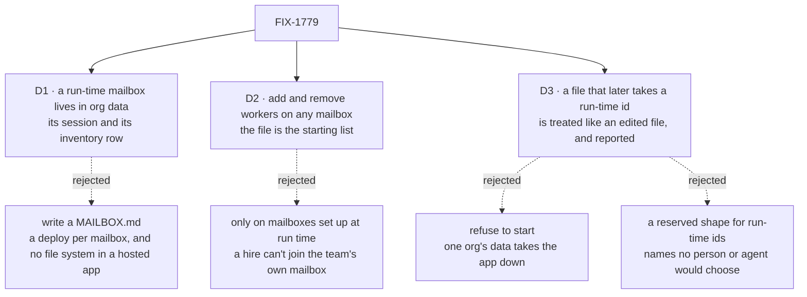

# FIX-1779 · Decisions

[Spec](SPEC.md) · **Decisions** · [Rules](BUSINESS-RULES.md) · [Plan](PLAN.md) · [Docs](DOCS.md) · [Evolution](EVOLUTION.md)

Three decisions are the sign-off surface. Everything else here is context for them.

## The tree

Solid edges are what you're signing. Dashed edges lost, and the label says why.

## D1 · A mailbox the coordinator sets up lives in the org's data: its session and its inventory row. Nothing is written to a file

| | |
|---|---|
| **Instead of** | Writing a `MAILBOX.md` into the team's folder and opening it the way a file mailbox opens |
| **Because** | A coordinator works while the app runs, often on a host with no writable source tree, and a file it wrote is a deploy nobody reviewed. The org's data already holds everything a mailbox is: the session holds its members and charter, and the inventory row is how it is found. A project already lives this way ([FIX-1650 D3](../../epics/FIX-1650/DECISIONS.md#d3)). Adding the task list and who works it to the session keeps one record per mailbox, not a second registry |
| **Locks in** | Mailboxes the coordinator set up are not in the repository. A code review never sees them, and a fresh environment starts without them. A team that wants one permanently writes the file, as today |

It comes down to a hosted app: the coordinator can't write a file there, and org data is already where projects live.

**What would change my mind:** a rule that every mailbox must pass code review before it
exists. Then the coordinator should propose a file in a pull request, and this issue becomes
a docs change.

## D2 · The coordinator can add and remove workers on any mailbox, including one from a file. The file is the starting list

| | |
|---|---|
| **Instead of** | Changing membership only on mailboxes set up at run time, leaving file mailboxes exactly as their files say ([FIX-1415](../FIX-1415/DECISIONS.md#recommended-still-open)'s lean) |
| **Because** | Jake's job for the coordinator is to get work flowing to the right places. The most common move is putting a fresh hire on the team mailbox that already exists, and that is a file mailbox. The file is already only the starting list: an edit to `members:` never reaches a mailbox that is open, so the session has been the record since its first open |
| **Locks in** | A `MAILBOX.md` stops being the whole truth about who is on a mailbox. `discover` and the inventory show the live list. A person who edits the file's members still has to open a fresh mailbox for that edit to apply, as today |

It comes down to a hire who must join `eng.feature`: the narrow rule forces a second, near-duplicate mailbox.

**What would change my mind:** a team that needs a file mailbox's members fixed for audit. A
per-file `lockMembers: true` would answer it without changing the default.

## D3 · A `MAILBOX.md` that arrives later with the id of a mailbox the coordinator set up is treated like an edited file, and reported

| | |
|---|---|
| **Instead of** | Refusing to start (the draft's rule), or giving run-time ids a shape no file can take |
| **Because** | A refusal lets one org's run-time data stop the app for everyone it serves, until someone renames a file. Treating it as an edit is what the binder already does: a bound mailbox at an id is left as it is, so its members, charter and tasks stay, and the file's task lists, which are built onto the kind at start, are added. The only new thing is a start-up report naming the clash. A reserved shape avoids the clash but puts a marker into every name a person or agent reads and types |
| **Locks in** | A deploy that adds a file with a taken id doesn't get the file's members on that mailbox. The report says so; the coordinator can subscribe them, or a person renames the file |

![D3, a file that later takes a run-time id. Chosen: treat it like an edited file, and report it. Instead of: refuse to start. It comes down to one org's data meeting a deploy: chosen starts and names the clash, refusing keeps the app down until someone renames the file. The price is that the file's members don't apply to that mailbox. The mailbox's tasks are kept either way. Locks in: a name clash is a warning, not an outage. Flips if: a file's members must always apply; then run-time ids get a shape no file can take.](figures/d3-name-clash.svg)

It comes down to one org's data meeting a deploy: an outage is the wrong price for a name clash.

**What would change my mind:** a team that needs a file's members to always apply, for audit.
Then run-time ids get a reserved shape, and the clash can't happen.

## Decided, not asked

- **The tools are named grants.** `setUpMailbox`, `subscribeWorkers`, `unsubscribeWorkers`, `fileTask` are catalog tools from one capability a host installs on a kind; a worker reaches them only by naming them in `tools:`, the way `hire` works. Any coordinator in any app, not a DevTeam special case.
- **Opening goes through the host.** The coordinator's turn runs as the person, and a mailbox belongs to the app. The host hands the capability an opener, as it hands `hire` a `register`. No core or engine change.
- **The wake asks the host who can be reached, on every post.** Member names still come from the mailbox; where to deliver comes from the host's live worker list, never from stored data (BP-031). This also fixes hires reloaded at restart, which today are never woken.
- **A run-time mailbox has exactly one task list, `tasks`, and records which workers work it.** Subscribing does not make a member a worker of the list: a member can be a reviewer or a person. `setUpMailbox` takes the same `worksTaskList` flag as `subscribeWorkers` for its initial members; nobody works the list by default.
- **Who works a list is one read for every mailbox:** the file's `workedBy` (FIX-1777's field), plus workers subscribed with `worksTaskList`, minus workers unsubscribed since. The removal is recorded on the mailbox, so a file can't keep a removed worker on its list. FIX-1777 and FIX-1774 both call this read, so it lives here.
- **The mailbox's session is the one record of members.** Its inventory row says it exists; `discover` reads members from the session, so a missed row write can't show a stale list.
- **A worker name must exist in the org** (declared or hired) or the call is refused by name. This closes the "no member name resolution" gap for these tools only.
- **Ids follow the file convention**, `<team>.<name>`, and the team must exist. An id already taken, by a file or by the coordinator, is refused.
- **Setting up does not attach to a project.** `setWorkstreams` already does that, and accepts the mailbox once its inventory row exists.
- **The org comes from the caller's identity**, never from tool input.
- **Custom mailbox kinds are out of D2.** A `MAILBOX.md` that picks a custom kind owns that kind's state and actions, so these tools refuse it by name. "Any mailbox" means any mailbox on the built-in kind.

## Considered and dropped

| Alternative | Why not |
|---|---|
| A mailbox-admin type, or a new org collection of mailboxes | A second registry beside the inventory. The session and its row already are the record |
| Delete, rename, and a client join or leave | Not asked. Delete is a retirement rule with its own open questions (what happens to the list's open tasks) |
| Routing and `boardActions` on a run-time mailbox | Both are built into the mailbox kind at start. A coordinator can post and file without them |
| Restart the app after a change so the boot lists pick it up | Turns every hire into downtime, and the reloaded hires aren't woken even then |
| A board per mailbox registered at run time | Task lists are resources fixed when the kind is built. One declared collection for all run-time lists, read by prefix, needs no re-registration |
| Hand the work over by posting it | The rule is to file it on the list, which is what Jake asked for |
| Drop the who-works-a-list read and leave it to FIX-1777 | FIX-1777's wake and FIX-1774's view both need it, and only this issue records the run-time side. Two copies would drift |

## Settled

- **A worker registered after start can be woken by a post, with no core or engine change** — **CONFIRMED**: the router's existing `validateRoute` hook accepts a wake built on first use, and a member written into the session after open is woken on the next post. The same run with today's start-up list did not wake it. ([POC](poc/live-membership/README.md))

## How it got here

- **Draft** — framed as two start-up lists (mailboxes with their task lists, and workers a post can wake) that must become run-time and durable. The mailbox's own session carries members, its task list and who works it; the wake asks the host per post. Two stacked PRs.
- **Scope widened before publishing** — Jake (2026-10-04) asked for the coordinator's whole job, not one flow. D2 moved from run-time mailboxes only to any mailbox, and removing a worker came in.

- **Review round 1** — two findings moved the design. A refusal at start became D3 (treat a clashing file like an edit, and report it). Who works a list now follows the file's `workedBy` with recorded removals, so unsubscribing a worker takes it off a file's list too. Codex narrowed D2 to the built-in mailbox kind and made a retried setup repair a missing inventory row. The rest went to the plan: one worker source per post, members read from the session, prefix-bounded list reads.

**Open: none.**
