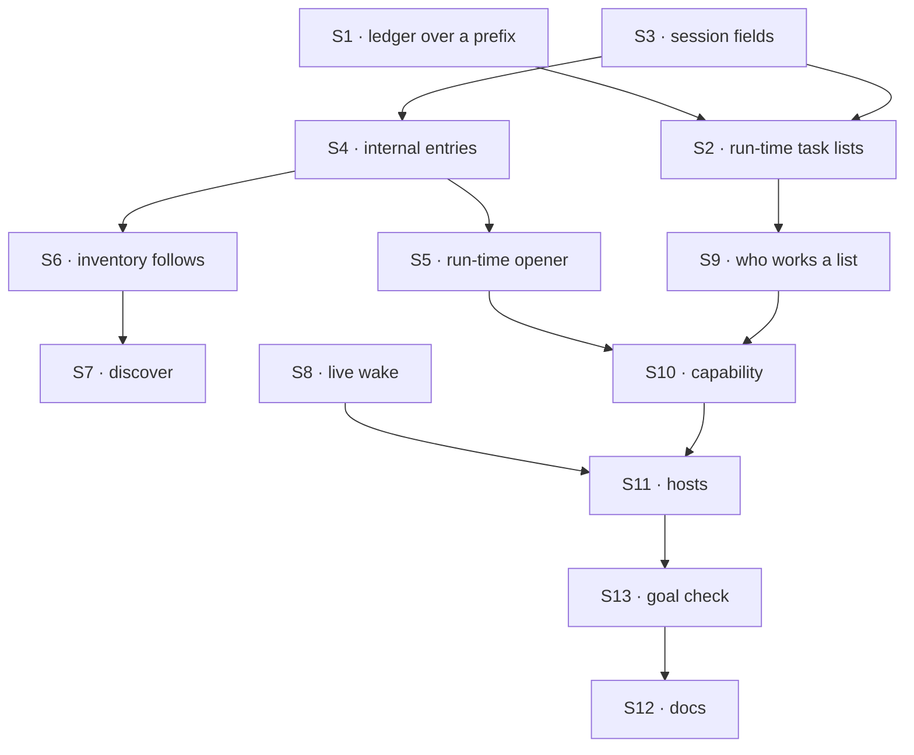

# FIX-1779 · Plan

[Spec](SPEC.md) · [Decisions](DECISIONS.md) · [Rules](BUSINESS-RULES.md) · **Plan** · [Docs](DOCS.md) · [Evolution](EVOLUTION.md)

Written for the implementing agent. IDs cross-reference [BUSINESS-RULES.md](BUSINESS-RULES.md)
(BR-n) and [DECISIONS.md](DECISIONS.md) (Dn). `tdd`. Two PRs, stacked as a GitHub stack.
The seam: PR-A makes mailboxes changeable at run time inside the package; PR-B gives a
coordinator the tools and wires the hosts.

## Surfaces

| ID | Package · role | Change | Rules |
|---|---|---|---|
| S1 | `orchestration` · task ledger | A ledger over one key prefix of a declared task collection, so many lists share one collection and never see each other's tasks. Generic: no mailbox or worker word | BR-17 |
| S2 | `workforce` · mailbox kind | Always declares one org-scoped collection for run-time task lists. `fileTask`, `readBoard` and the ledger lookup resolve a list name against the file lists built onto the kind, then against the session's own `taskLists`. The two actions exist even when no file declares a board | BR-15 BR-16 BR-17 |
| S3 | `workforce` · mailbox session state | New optional fields: `taskLists: [{ name, workedBy }]` and `origin: "runtime"`. Nullable with defaults; old sessions read as today (BP-023, BP-030) | BR-1 BR-5 BR-9 |
| S4 | `workforce` · mailbox internal entries | `setUp`, `subscribe`, `unsubscribe`: internal, never client actions. Each writes the session with a version check and retries, then re-registers the inventory row | BR-7 BR-10–BR-13 BR-23 |
| S5 | `workforce` · run-time opener | A host helper beside `openMailboxes` that opens one mailbox at run time with the same validation, refusals and id rules, and reaches S4's entries as the app. The capability gets it as an option, the way `hire` gets `register` | BR-1–BR-4 BR-6 |
| S6 | `workforce` · inventory | The mailbox row carries `origin` and the task lists. A removed member's membership row is deleted (today they are never pruned) | BR-7 BR-11 BR-19 |
| S7 | `workforce` · `discover` | Lists inventory rows marked `origin: "runtime"` beside the declared ones; declared rows keep today's join | BR-19 |
| S8 | `workforce` · the wake and the route | `wakeMemberSeats` and `routeByPurpose` accept a getter as well as a list, and read it on each post | BR-7 BR-8 BR-14 |
| S9 | `workforce` · who works a list | One read, for any mailbox: workers whose files declare the list, plus `workedBy`. FIX-1777's wake consumes it | BR-18 |
| S10 | `workforce` · capability | `createMailboxSetupCapability({ open, workers })`: catalog tools `setUpMailbox`, `subscribeWorkers`, `unsubscribeWorkers`, `fileTask`. Worker names, and `fileTask`'s assignee, are checked with FIX-1778's one name-to-flow lookup, over the same live list S8 reads. Org from the caller | BR-4 BR-15 BR-21 BR-22 |
| S11 | DevTeam Lab host, kitchen-sink | Install S10 on the agent kind; pass the registry getter to the wake. This also wakes hires reloaded at restart. The chief of staff's `tools:` line is FIX-1774's | BR-8 |
| S12 | Docs | Per [DOCS.md](DOCS.md). **Remove** "no join or leave verb yet" and its limits entries | — |
| S13 | `goals/` | The goal check, with `GOAL_CONTROL=boot-wake` | goal |

## Sequence



### PR plan

| id | deliverables | depends_on |
|---|---|---|
| A | S1–S9, their CI checks | — |
| B | S10–S13, the goal check | A |

## Checks

| ID | Runs after | Passes when |
|---|---|---|
| V1 | S1 | Two prefixes in one collection: each ledger lists, claims and completes only its own tasks (BR-17) |
| V2 | S2 S3 | A list in session state accepts `fileTask` and `readBoard` with no file board; a name in neither is refused naming the lists (BR-15, BR-16); a session with no new fields behaves byte for byte as today |
| V3 | S4 | Subscribe and unsubscribe change members; twice is a no-op; two concurrent subscribes both land; an empty mailbox stays open (BR-10–BR-13). A client call cannot reach any entry (BR-23) |
| V4 | S5 | Every BR-1–BR-4 refusal; a durable store reopened shows the mailbox unchanged, and opening the file mailboxes leaves it alone; a later file with its id is refused at start (BR-5, BR-6) |
| V5 | S8 | A worker registered after the wake is built is woken; one removed from the registry is not; under a plain list, today's behaviour holds (BR-8, BR-14). Shape: [POC](poc/live-membership/README.md) |
| V6 | S6 S7 | `discover` lists a run-time mailbox with live members; an unsubscribed worker's membership row is gone; `setWorkstreams` accepts it (BR-19, BR-20) |
| V7 | S9 | File-declared plus recorded workers, for a file list and a run-time list (BR-18) |
| V8 | S10 | Each tool's refusals; unnamed tools unreachable; tool-supplied org ignored (BR-21, BR-22) |
| VD1 | S5 | D1: no file is written anywhere in the source tree during any check |
| VD2 | S10 | D2: a hire subscribed to a file mailbox is woken; a file member unsubscribed is not, after restart too |
| VG | S13 | [The goal](SPEC.md#the-goal-and-how-well-know-its-met) PASSES, after the same run FAILED under `GOAL_CONTROL=boot-wake` |

Second path (BP-035): every rule above is also run after a restart on a durable store, and on a
session written before this change.

## Pinned names

| Where | Name | Why pinned |
|---|---|---|
| Tools | `setUpMailbox`, `subscribeWorkers`, `unsubscribeWorkers`, `fileTask` | A worker file names them; FIX-1774 writes them into the chief of staff's `tools:` |
| Tool flag | `worksTaskList` | FIX-1777 reads its effect |
| Read | `taskListWorkers(ctx, mailboxId, list)` | FIX-1777's wake and FIX-1774's view call it |
| Run-time list name | `tasks` | The coordinator files on it without asking |
| Inventory field | `origin: "runtime"` | Persisted, and `discover` reads it |

Everything else is yours to name.

## Guardrails

| Rule | Because |
|---|---|
| No worker, hire or mailbox word in `core`, `engine` or `orchestration` | Layer rule. S1 is a generic prefix; the wake uses the router's existing hook |
| Delivery addresses come from the host's live list, never from stored data (BP-031) | Members are stored and caller-adjacent; a stored address would let data choose where work runs |
| Every membership write goes through S4's entries (tenet 5) | Session and inventory must move together. A second writer is how the inventory goes stale |
| No second registry (D1) | The session and its inventory row are the record. A new mailbox collection is the invent-kill |
| A file mailbox's first open is unchanged | Apps with no coordinator must see no difference |
| Workforce terms in docs say "worker", never "seat" | Jake's vocabulary rule. Code identifiers stay |

## Docs

Reconcile and publish [DOCS.md](DOCS.md) in PR-B, after VG passes.

## Sketch · pseudocode, illustrative

```
setUpMailbox(input), as the coordinator:
    names ← resolve input.members against the org's workers    (refuse unknown)
    host opener: validate id like a file → open session as the app
        state: members, charter, origin runtime, taskLists [tasks, workedBy members]
    mailbox registers its own inventory row
subscribe(mailbox, workers, worksTaskList):
    internal entry on that mailbox: versioned patch of members (+ workedBy) → re-register row
a post: for each member in session state → wake(member)
wake(member): worker ← host's live list, by logical id, reachable by caller → dispatch
```

**POC:** [`poc/live-membership/`](poc/live-membership/README.md). It showed a worker
registered after start is woken through `validateRoute`, and a member written after open is
woken on the next post. The premise held; nothing changed.

## At implement time

- FIX-1778 owns the name-to-flow lookup, the `agent` kind's task door and the per-task claim gate. Whichever of the two PRs lands first builds the lookup in Workforce; the other reuses it. FIX-1777's wake reads S9.
- FIX-1762's stack touches `projects/project-writes.ts`. Merge `main` before PR-B.
- Re-check that `openMailboxes` still refuses an id held by another session; BR-6 relies on it.

## Follow-ups

- Delete or retire a mailbox, and what happens to its open tasks.
- Routing and `boardActions` on run-time mailboxes, if a coordinator needs them.
- `discover` returning charters and task lists (named on FIX-1774).
