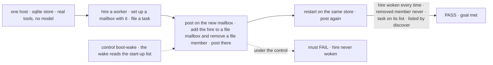
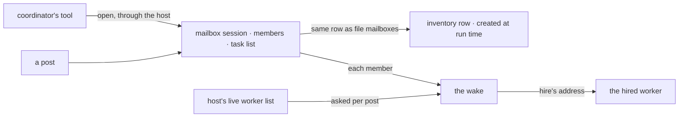

# FIX-1779 · A coordinator can set up a mailbox, subscribe workers to it, and file a task on its list

**Spec** · [Decisions](DECISIONS.md) · [Rules](BUSINESS-RULES.md) · [Plan](PLAN.md) · [Docs](DOCS.md) · [Evolution](EVOLUTION.md)

## Six people, before and after

| Someone who… | Today | After |
|---|---|---|
| **asks a coordinator for work no mailbox fits** ("build a login page in Platform") | The coordinator can only post where someone wrote a file, or hire and stop | The coordinator sets up `platform.login` with a task list, puts the right workers on it, and files the task there |
| **runs a support desk and gets an outage report** | A person writes a `MAILBOX.md` and restarts | The desk's coordinator opens `support.outage-1004`, pulls in the network and billing specialists, and files the first task |
| **is a worker the coordinator just hired** | Is on no mailbox, and a post never reaches it, even after a restart | Is put on an existing team mailbox or a new one, and hears its posts from the next post on |
| **is a worker moved off a piece of work** | Stays a member until someone edits a file and opens a fresh mailbox | The coordinator takes it off. The mailbox's next post doesn't wake it |
| **restarts the app, or asks "what mailboxes are there?"** | Only mailboxes with a file exist or are listed | Everything the coordinator set up or changed is still there, listed by `discover`, and can be a project's workstream |
| **runs a worker whose `tools:` doesn't name the new tools** | Can't change mailboxes | Still can't. Changing mailboxes is a grant a worker must name |

Jake, 2026-10-04: "The coordinator has a responsibility to route work, hire the workforce as
needed, setup mailboxes, and get the work flowing to the right places." Two things are fixed at
start today: which mailboxes and task lists exist, and which workers a post can wake. Both
become things a coordinator in any app changes while it runs.

## The goal, and how we'll know it's met

**A coordinator gets work to the right workers through mailboxes it can change while the app
runs: it sets one up with a task list when none fits, puts workers on any mailbox (one it just
hired included) or takes them off, and files the task there. The workers it added hear that
mailbox's posts, the ones it removed don't, and all of it is still there after a restart.**

| Is it the right goal? | |
|---|---|
| **The real need** | Jake's words above ([FIX-1774](https://linear.app/fixpoint-labs/issue/FIX-1774), 2026-10-04). FIX-1774's leg d needs exactly this: one new mailbox in the person's project, with a task list, the worker on it, and the task filed there |
| **Smaller, and rejected** | "A tool writes a mailbox session." It passes while the hire never wakes (the wake list is fixed at start), the task list can't exist (task lists are fixed at start), and the mailbox is invisible to `discover` |
| **Bigger, and not this issue's** | The task on the list starting its worker by name, hires included: [FIX-1778](https://linear.app/fixpoint-labs/issue/FIX-1778) and [FIX-1777](https://linear.app/fixpoint-labs/issue/FIX-1777). The coordinator choosing to do all this on its own: [FIX-1774](https://linear.app/fixpoint-labs/issue/FIX-1774) |
| **Not done if** | A removed worker is still woken · the hire is woken only because the check restarted the app with it in a boot list · the task list works only for a board name that was also in a file · the mailbox is gone, or forgets its members, after a restart · it shows in the store but not in `discover` |



The check reads what the hired worker actually ran and what the store holds after a restart,
not what a tool returned.

| How we verify | |
|---|---|
| **Goal check** | `goals/mailbox-setup/it-wakes-a-worker-hired-and-subscribed-at-run-time/` · model `n/a` (the property is what exists and who wakes, not what a model chooses) · run by the implementer at completion · verdict in the implementation PR |
| **Signal** | The hired worker's `onMailboxPost` ran once per post, on the new mailbox and on the file mailbox it was added to, before and after the restart. The member removed from the file mailbox ran on no post after its removal, before or after the restart. The task is on the mailbox's task list after the restart. `discover` lists the mailbox. `setWorkstreams` attaches it to a project |
| **Input** | A host whose workers have no mailbox in common, and a task the files never mention. A different mailbox name, or a declared worker instead of a hire, must pass too |
| **Anti-game** | No worker passed in a boot list after the hire. No board name in any file. No asserting on a tool's return value. No restart that re-runs setup |
| **Control that must fail** | `GOAL_CONTROL=boot-wake` (the wake reads the start-up list, as today): FAILS on *hire woken*. Today's `main` FAILS too: the tools don't exist |

## What changes


Left is today: everything a post needs is read at start. Right is after: the mailbox carries
its own members, its task list and who works that list, and the wake looks the worker up when
the post arrives.

**The coordinator's worker file** (in the DevTeam Lab, FIX-1774 adds this line):

```diff
  # WORKER.md · chief-of-staff
  flow: agent
- tools: [hire, fire, rehire, brokenSeats, post-to-mailbox, createProject, setWorkstreams]
+ tools: [hire, fire, rehire, brokenSeats, post-to-mailbox, createProject, setWorkstreams,
+         setUpMailbox, subscribeWorkers, unsubscribeWorkers, fileTask]
```

**What the coordinator calls, in order:**

```diff
+ setUpMailbox({ team: "platform", name: "login", description: "The login page.",
+                charter: "Build and ship the login page.", members: ["platform.ada"],
+                worksTaskList: true })
+ → { mailboxId: "platform.login", taskList: "tasks" }
+ subscribeWorkers({ mailboxId: "platform.login", workers: ["react-builder"],
+                    worksTaskList: true })                  // the fresh hire, who works its list
+ unsubscribeWorkers({ mailboxId: "eng.feature", workers: ["eng.ada"] })          // moved off
+ fileTask({ mailboxId: "platform.login", title: "Login page", goal: "…" })
+ setWorkstreams({ projectId: "platform", workstreams: [...current, "platform.login"] })
```

**The host, once:**

```diff
  const seatHire = createSeatHireCapability({ register, unregister, kindAt, ... })
+ const mailboxSetup = createMailboxSetupCapability({ open: openMailboxAtRunTime({ client, userId }) })
- notify: wakeMemberSeats(seats)
+ notify: wakeMemberSeats(() => registry.list())   // asked on every post, not at start
```

## How it reaches the worker



Neither the mailbox nor the wake reads a file or a start-up list.

## What stays as it is

- **Mailboxes from files.** Same files, same first open. The file is where a mailbox starts; the mailbox is the record from then on, which is already true today ([D2](DECISIONS.md#d2)).
- **Project rooms.** Still minted from the `mintFor: projects` template, never by these tools.
- **Who runs a task.** Assignment and the board handing a row to a named worker are FIX-1778's. This issue puts the task on the list; FIX-1777 and FIX-1778 start it.
- **Hire.** Unchanged, except that a hire can now be woken.
- **No delete, no rename, no routing or `boardActions` on a mailbox set up at run time, and no join or leave for a person's client.** Named non-goals.

## Sign off

**[The goal](#the-goal-and-how-well-know-its-met), at that size:** the hire is woken, the task
list is real, and both survive a restart. If wrong: we ship tools that return success while the
worker they added never hears anything, which is the "hired and stopped" bug again.

1. **[D1](DECISIONS.md#d1) · A mailbox the coordinator sets up lives in the org's data (its
   session and its inventory row), not in a written `MAILBOX.md`.** If wrong: these mailboxes
   are not in the repository, so a code review never sees them and a new environment does not
   have them.
2. **[D2](DECISIONS.md#d2) · The coordinator can add and remove workers on any mailbox,
   including one that came from a file. The file is the starting list, not a lock.** If
   wrong: a `MAILBOX.md` stops being the whole truth about who is on it, and a person reading
   the file can be surprised.
3. **[D3](DECISIONS.md#d3) · A `MAILBOX.md` that arrives later with the id of a mailbox the
   coordinator set up is treated like an edited file and reported. The app still starts.** If
   wrong: a deploy that adds that file doesn't get its members on that mailbox, and someone has
   to read the start-up report to notice.

**Open: none.** D1 is the one to weigh. Reasoning and what lost: [DECISIONS.md](DECISIONS.md).
The cases: [BUSINESS-RULES.md](BUSINESS-RULES.md).

Feature · `workforce` + `orchestration` + DevTeam Lab host · large · 2 PRs (stacked) · parent [FIX-1763](https://linear.app/fixpoint-labs/issue/FIX-1763) · blocks [FIX-1774](https://linear.app/fixpoint-labs/issue/FIX-1774)
