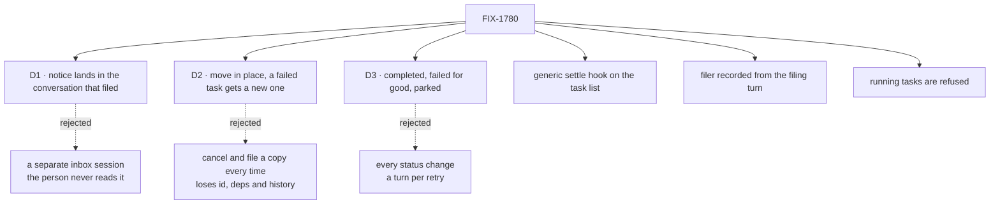

# FIX-1780 · Decisions

[Spec](SPEC.md) · **Decisions** · [Rules](BUSINESS-RULES.md) · [Plan](PLAN.md) · [Docs](DOCS.md)

Three calls shape what a person sees: where the coordinator speaks, what a reassigned task looks
like, and how often it is woken. The rest follows from the issue and the layer rule.

## The tree

Solid edges are this spec's calls. Dashed edges lost, and the label says why.

## D1 · The notice lands in the conversation the task was filed from

| | |
|---|---|
| **Instead of** | A separate session per worker for task notices, which the worker reads on its own |
| **Because** | The issue asks the coordinator to "tell the person". The person reads the conversation they asked in. A turn there has the ask in its history, so the coordinator knows what the task was for, and its answer is a line the person sees. A separate session would need a second hop to reach the person, and the coordinator would answer without the context of the ask |
| **Locks in** | A coordinator can speak in a person's conversation with no new message from that person. One turn per notice. The person sees the notice line and the answer |

It comes down to the person hearing it: a separate session needs a second hop to reach them.

## D2 · Reassigning moves a task that hasn't ended, in place; a failed task is carried on by a new one

| | |
|---|---|
| **Instead of** | Cancelling the task and filing a copy for every ending (this spec's first draft) |
| **Because** | A task that hasn't ended should keep its id, its dependencies and its history; cancel-and-recreate is the workaround [FIX-949](https://linear.app/fixpoint-labs/issue/FIX-949) exists to remove, and the board already has the verb, `assignTask` (tenet 1: one way to do a thing; [FIX-1659](https://linear.app/fixpoint-labs/issue/FIX-1659)'s fence: no second assign surface). The wall the draft routed around is that a list that hands tasks over freezes every task's assignee ([FIX-982](https://linear.app/fixpoint-labs/issue/FIX-982)). That freeze protects a hand-over in flight, and a *pending* task has none, so the fix is to narrow it at its owning layer (tenet 5): frozen while an attempt holds the task (*in progress* or *parked*), free otherwise. A parked task is unparked first, which ends its attempt. A failed task is final, so only a new task can carry it on |
| **Locks in** | On a list that hands tasks over, a waiting task can change hands; a running one still cannot. A reassigned *pending* or *parked* task keeps its id (a parked one goes back to *pending*). A reassigned *errored* task stays *errored*, and a new task names it |

It comes down to keeping the task: a copy loses its id, its dependencies and its history.

## D3 · Three endings wake the filer: completed, failed for good, parked

| | |
|---|---|
| **Instead of** | Waking the filer on every status change, retries and cancels included |
| **Because** | Those three are the moments a coordinator has a next step: report, reassign, or pass on a question. A retry has a next step already (the list runs it again), and a turn per retry costs model time for nothing. A cancel is usually the coordinator's own, so waking it would echo its own act |
| **Locks in** | One notice per attempt that completes, the last attempt that fails, and each park. A task somebody else cancels wakes nobody |

It comes down to having a next step: a retry already has one, so a turn spends money for nothing.

## Decided, not asked

- **The settle hook is generic and lives on the task list's run.** One option on the task board,
  run after an attempt's result is recorded, inline or handed off. It names no worker. Workforce
  passes the step that wakes the filer (Jake's layer rule; tenet 5: the hook sits where every
  attempt's end already passes).
- **Who filed is recorded from the filing turn.** `fileTask` answers in the same turn (FIX-1779
  returns its refusals as tool errors), so the turn that files knows its own session and lineage.
  They are recorded beside `filingWorker`, from the runtime context, never from tool input
  (BP-031). A task filed by a client has no filing turn and no filer. No engine change.
- **The filer is recorded on the task when it is filed**, as a coordination record: FIX-1779's
  `filingWorker` (the worker's name) and, added here, the conversation it filed from. It is not the
  task's owner, which FIX-1777 records for the claim and the bill; the notice never reads the owner. The delivery
  only lands when the session and the worker's flow agree, so a wrong name reaches nobody.
- **The notice is a turn of the worker's ordinary answer**, as a mailbox post is, through an
  internal entry the built-in `agent` kind declares. A kind of your own hears it by declaring the
  same entry.
- **A retry is run again.** Under FIX-1777 a task that goes back to *pending* waits for the next run
  of its list, so a failure with attempts left would never reach its last attempt and the filer
  would never hear. The same step that sends notices asks the list to run again on a retry. FIX-1777
  leaves a re-pend waiting, so this issue owns it. A refused hand-over spends an attempt
  (FIX-1778 BR-4) and re-runs the same way.
- **A refused filing is the tool's answer, not a notice.** FIX-1779 and FIX-1778 return every
  filing refusal as a tool error in the same turn, so the worker already hears it. No task exists,
  so there is nothing to follow.
- **Reassign and cancel act only on a task that is not running.** A running task is refused with
  its status; stopping one is FIX-1659's. Both go through the board's own `assignTask` and
  `cancelTask`, not a parallel write. The new worker passes the same check as a filing (FIX-1778
  BR-12a), so a move can't name a worker the list wouldn't take.
- **Reassign is capped at three moves for one piece of work.** The fourth is refused, so a
  coordinator that keeps failing must tell the person. A loop of paid runs is the failure a cap
  prevents.
- **No new noun.** The words are *task*, *list*, *filer* in prose. Code keeps the board's own names.

## Considered and dropped

- **The coordinator reads its tasks' status when the person asks.** No wake, so a failure waits
  for the person.
- **Watch the list's change items from the coordinator's session.** Each write is published only
  on the writer's session, so the coordinator would see nothing without a cross-session stream.
- **A timer that sweeps the lists.** Late, and a scheduler loop the framework does not run.
- **Notice by posting on the mailbox.** A post is talk, not a hand-over, and a worker's post wakes
  no other worker by design.

## Open

None.

## Settled

- **Every attempt's end passes through one place.** Inline and handed-off attempts both end in
  the same two recorders (`task-board/index.ts` worker body; `task-board/task-entry.ts` gate). A
  worker that parks through `awaitReview` and returns is seen there as `parked`. A run that stops on
  `ctx.suspend`, or the harness door's turn park, does not pass the recorders.
- **Task change items reach only the writer's session.** Read off `tasks/collection/get-or-create.ts`.
- **A notice can cross flows.** A `{ id }` dispatch into another flow's session is supported when
  user, tenant and organization agree (`engine/src/context/create-request-host.ts`).

## How it got here

- **Draft** — framed as the missing trip back from a task's end to whoever filed it; a generic
  settle hook on the task list, a Workforce step that wakes the filer in the conversation it filed
  from, and reassign as cancel-and-file. One PR after FIX-1778, FIX-1777 and FIX-1779.
- **D2 reversed** — reassign moves a task that hasn't ended in place through the board's
  `assignTask`, with the hand-over freeze narrowed to tasks under an attempt; only a failed task
  gets a copy. Because the FSD Architect showed cancel-and-recreate is what FIX-949 removes and the
  board already has the verb ([#2758](https://github.com/fixpoint-labs/flow-state-dev/pull/2758)).
- **Aligned with the siblings** — a refused filing is `fileTask`'s tool error, as FIX-1779 and
  FIX-1778 have it, so the `refused` notice and the engine read for the sender went; the filing
  turn records its own session. The re-run on a retry is this issue's outright, and a move passes
  FIX-1778's filing check. From the FSD Architect's sibling check on #2758.
