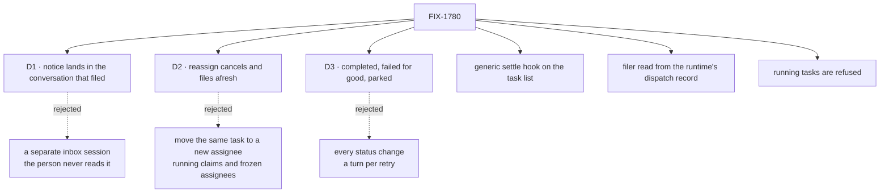

# FIX-1780 · Decisions

[Spec](SPEC.md) · **Decisions** · [Rules](BUSINESS-RULES.md) · [Plan](PLAN.md) · [Docs](DOCS.md)

Three calls shape what a person sees: where the coordinator speaks, what a reassigned task looks
like, and how often it is woken. The rest follows from the issue and the layer rule.

## The tree

Solid edges are this spec's calls. Dashed edges lost, and the label says why.

## D1 · The notice lands in the conversation the task was filed from

| | |
|---|---|
| **Instead of** | A separate session per worker for task notices, which the worker reads on its own |
| **Because** | The issue asks the coordinator to "tell the person". The person reads the conversation they asked in. A turn there has the ask in its history, so the coordinator knows what the task was for, and its answer is a line the person sees. A separate session would need a second hop to reach the person, and the coordinator would answer without the context of the ask |
| **Locks in** | A coordinator can speak in a person's conversation with no new message from that person. One turn per notice. The person sees the notice line and the answer |

It comes down to the person hearing it: a separate session needs a second hop to reach them.

## D2 · Reassigning cancels the task and files a new one

| | |
|---|---|
| **Instead of** | Changing the assignee on the same task and putting it back to *pending* |
| **Because** | One rule works for every ending. A failed task is final and cannot go back to *pending*; a mailbox list keeps its assignee fixed once filed, because the hand-over checks it; and a running task cannot be moved safely ([FIX-1659](https://linear.app/fixpoint-labs/issue/FIX-1659)). Cancel-and-file works for *pending*, *parked* and *errored* alike, and leaves the old row's history honest (tenet 1) |
| **Locks in** | A reassigned task has a new id. The old row is *cancelled* with the reason *reassigned to &lt;worker&gt;*, or stays *errored* if it had failed, and the new row names the old one. A list shows both. A running task is refused |

It comes down to a failed task: it is final, so only a new task can carry it on.

## D3 · Three endings wake the filer: completed, failed for good, parked

| | |
|---|---|
| **Instead of** | Waking the filer on every status change, retries and cancels included |
| **Because** | Those three are the moments a coordinator has a next step: report, reassign, or pass on a question. A retry has a next step already (the list runs it again), and a turn per retry costs model time for nothing. A cancel is usually the coordinator's own (D2), so waking it would echo its own act |
| **Locks in** | One notice per attempt that completes, the last attempt that fails, and each park. A task somebody else cancels wakes nobody |

It comes down to having a next step: a retry already has one, so a turn spends money for nothing.

## Decided, not asked

- **The settle hook is generic and lives on the task list's run.** One option on the task board,
  run after an attempt's result is recorded, inline or handed off. It names no worker. Workforce
  passes the step that wakes the filer (Jake's layer rule; tenet 5: the hook sits where every
  attempt's end already passes).
- **Who filed is read from the runtime's record of the dispatch.** The request host gains one
  read, the session that dispatched this request, taken from the stamp the runtime writes and
  never from a request body (BP-031). A task filed by a client has no such stamp and no filer.
- **The filer is recorded on the task when it is filed**, as a coordination record: FIX-1779's
  `filingWorker` (the worker's name) and, added here, the conversation it filed from. It is not the
  task's owner, which FIX-1777 records for the claim and the bill; the notice never reads the owner. The delivery
  only lands when the session and the worker's flow agree, so a wrong name reaches nobody.
- **The notice is a turn of the worker's ordinary answer**, as a mailbox post is, through an
  internal entry the built-in `agent` kind declares. A kind of your own hears it by declaring the
  same entry.
- **A retry is run again.** Under FIX-1777 a task that goes back to *pending* waits for the next run
  of its list, so a failure with attempts left would never reach its last attempt and the filer
  would never hear. The same step that sends notices asks the list to run again on a retry, unless
  FIX-1777 covers it first.
- **A refused filing is a notice too.** The issue's "a refusal isn't reported": when the mailbox
  refuses a worker's filing after the dispatch, the worker is told in the same way, with ending
  `refused`. No task exists, so nothing else changes.
- **Reassign and cancel act only on a task that is not running.** A running task is refused with
  its status; stopping one is FIX-1659's.
- **Reassign is capped at three moves for one piece of work.** The fourth is refused, so a
  coordinator that keeps failing must tell the person. A loop of paid runs is the failure a cap
  prevents.
- **No new noun.** The words are *task*, *list*, *filer* in prose. Code keeps the board's own names.

## Considered and dropped

- **The coordinator reads its tasks' status when the person asks.** No wake, so a failure waits
  for the person.
- **Watch the list's change items from the coordinator's session.** Each write is published only
  on the writer's session, so the coordinator would see nothing without a cross-session stream.
- **A timer that sweeps the lists.** Late, and a scheduler loop the framework does not run.
- **Notice by posting on the mailbox.** A post is talk, not a hand-over, and a worker's post wakes
  no other worker by design.

## Open

None.

## Settled

- **Every attempt's end passes through one place.** Inline and handed-off attempts both end in
  the same two recorders (`task-board/index.ts` worker body; `task-board/task-entry.ts` gate). A
  worker that parks through `awaitReview` and returns is seen there as `parked`. A run that stops on
  `ctx.suspend`, or the harness door's turn park, does not pass the recorders.
- **Task change items reach only the writer's session.** Read off `tasks/collection/get-or-create.ts`.
- **The runtime already keeps a trusted record of who dispatched a request**, used today only for
  `{ from: true }` replies (`engine/src/execution/dispatch-metadata.ts`). It holds the sender's
  session and lineage, not its flow.
- **A notice can cross flows.** A `{ id }` dispatch into another flow's session is supported when
  user, tenant and organization agree (`engine/src/context/create-request-host.ts`).

## How it got here

- **Draft** — framed as the missing trip back from a task's end to whoever filed it; a generic
  settle hook on the task list, a Workforce step that wakes the filer in the conversation it filed
  from, and reassign as cancel-and-file. One PR after FIX-1778, FIX-1777 and FIX-1779.
