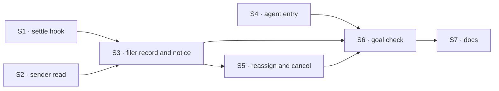

# FIX-1780 · Plan

[Spec](SPEC.md) · [Decisions](DECISIONS.md) · [Rules](BUSINESS-RULES.md) · **Plan** · [Docs](DOCS.md)

Written for the implementing agent. Directional: shape and sequence are fixed; names and local
structure are the implementer's except the pins. IDs cross-reference
[BUSINESS-RULES.md](BUSINESS-RULES.md) (BR-n) and [DECISIONS.md](DECISIONS.md) (Dn). `tdd`. One PR,
built after FIX-1778, FIX-1777 and FIX-1779; if FIX-1779's PR is still open, stack on it.

## Depends on

| Issue | Gives this issue |
|---|---|
| [FIX-1778](https://linear.app/fixpoint-labs/issue/FIX-1778) | The assignee lookup `reassignTask` checks a worker against, and the per-task hand-over every mailbox list uses |
| [FIX-1777](https://linear.app/fixpoint-labs/issue/FIX-1777) | The mailbox runs its own list when a task is added, so the reassigned task starts, and the run belongs to whoever filed |
| [FIX-1779](https://linear.app/fixpoint-labs/issue/FIX-1779) | The coordinator's `fileTask` tool, which dispatches from the coordinator's conversation, and `createMailboxSetupCapability` the two new verbs sit beside |

If one of them lands a different shape (in particular, if the list's run is not one Workforce-built
board per list), re-draft S3 here before building.

## Surfaces

| ID | Package · role | Change | Rules |
|---|---|---|---|
| S1 | `orchestration` · task board options and the two attempt recorders (worker body, hand-off gate) | A generic `onTaskSettled` option: a block run with the task id, the row as it now stands, and how the attempt ended (`completed`, `errored`, `parked`, `retrying`). The two recorders report that ending from a write that landed (they clear the claim, so a later step cannot rebuild it), and the hook runs off the report, in the inline worker body and in the hand-off gate. It runs on the path where the board rethrows a final failure too, and never when a write was declined (a displaced attempt) or the board deferred a recorder failure. No worker in the name or the input | BR-5–BR-11, BR-6a |
| S2 | `core` request host type + `engine` request host | One read: the session that dispatched this request and its lineage, from the trusted dispatch stamp, or `null`. The stamp does not carry the sender's flow; the worker comes from `filingWorker`. Generic, no Workforce term. Documented beside `parentTask()` | BR-1–BR-3 |
| S3 | `workforce` · mailbox `fileTask` and the list's board | On filing: FIX-1779 already records `filingWorker` (the calling worker's name, as the runtime knows it). Record the conversation it filed from beside it (`filingSession`, with its lineage): the filer's own session when its tool writes the list directly, or S2's sender when the tool dispatches into the mailbox. Pin which with FIX-1779's tool. On a `retrying` ending, ask the mailbox to run the list again, the request FIX-1777 makes on an add, unless FIX-1777 already does that for a re-pend (BR-6a). The owner FIX-1777 records is never read here: it is for the claim and the bill. When the mailbox refuses a filing that has a sender, send the same notice with ending `refused` (BR-4a). Pass S1's hook to the board Workforce builds per list: a router over the live worker list (one dispatcher per worker, as the mailbox wake does), that, when the row has a filer, dispatches the task-notice entry into its conversation and checks the lineage | BR-1 BR-2 BR-4 BR-4a BR-12 BR-14 BR-15 |
| S4 | `workforce` · the built-in `agent` kind | Declare the internal task-notice entry beside `onMailboxPost`; it runs the ordinary answer with the notice as the turn (`task <title> on <mailbox>/<list> ended: <status>` plus the error, question or output summary). Concurrency: the default, as `onMailboxPost` uses, because a queued request can be refused after the engine's wait and a notice must not be dropped. Drop a notice whose task id, attempt and ending it already answered | BR-8a BR-12 BR-13 |
| S5 | `workforce` · mailbox actions + coordinator tools | `reassignTask` and `cancelTask` as mailbox actions, and as dispatcher tools beside FIX-1779's in its capability. Reassign: mark the old row as reassigned through a revision-guarded write first, so a racing reassign or a race on the cap loses (an errored row cannot change status, so the cancel is no guard); refuse running/completed/cancelled and the fourth move; resolve the worker through FIX-1778's lookup first; cancel the old row if pending or parked (reason *reassigned to &lt;worker&gt;*), leave an errored one; file the copy for the new worker with the old id and the move count on its metadata and this filer recorded; then the list runs as on any filing | BR-16–BR-22 |
| S6 | `goals/workforce-conventions/a-filer-hears-how-its-task-ended/` | The goal check, `goal.md` + `run.mts`, per [SPEC.md](SPEC.md#the-goal-and-how-well-know-its-met), and its control | goal |
| S7 | Docs, per [DOCS.md](DOCS.md) | Mailboxes, task board, built-in worker pages; workforce and orchestration READMEs | — |

**Removed:** nothing. **Not touched:** the task collection's change items and backings; the mailbox
`post` path; the harness manager.

## Sequence



One PR. The control goes red before the legs go green.

## Checks

| ID | After | Passes when |
|---|---|---|
| VG | S6 | Legs a to f green; `GOAL_CONTROL=no-follow-up` red on legs a to d and f's hand-over half; red against `origin/main` at the first filing |
| V1 | S1 | Orchestration tests: the hook runs once for completed, once for the last failure, once per park, never for a retry or a recorder failure, inline and handed off (D3, BR-6, BR-11) |
| V2 | S2 | Engine test: a request with a caller-written `metadata.dispatch` reads `null`; a dispatched one reads its sender (BR-3) |
| V3 | S3 S4 | Workforce tests: BR-2, BR-4, BR-4a, BR-8a, BR-13, BR-14, BR-15 |
| V4 | S5 | Workforce tests: BR-16 to BR-22, including the parked-task cancel (D2) and the race |
| V5 | all | `goals/workforce-conventions/a-mailbox-holds-the-work-a-seat-drains`, FIX-1777's board check and FIX-1779's check stay green; `pnpm typecheck`; `pnpm --filter @flow-state-dev/orchestration test`, `workforce`, `engine` |

## Pinned

- `onTaskSettled`: the board option and the `agent` kind's internal entry. The coordinator design
  and FIX-1774's preset name the wake by it.
- `reassignTask`, `cancelTask`: the coordinator's tools. FIX-1774's spec and preset name them.
- `GOAL_CONTROL=no-follow-up` and the check's folder name.
- The reassign cap: three moves.

## Guardrails

| Rule | Because |
|---|---|
| The hook runs where the recorders run, both of them | Tenet 5: every attempt ends there, inline or handed off. A hook at one call site is the missing-writer bug |
| Core, engine and orchestration name no worker, hire or mailbox | Jake's layer rule. S1 is "a block after an attempt ends", S2 is "who dispatched this request" |
| The filer comes from the dispatch stamp, never a body field | BP-031. A forged filer would aim turns at someone's conversation |
| A notice is one turn per ending, never per retry | D3; each turn spends model time |
| Reassign never touches a running task | FIX-1659 is the claim problem; a moved running task forks the run |
| Write "worker", never "seat", in any sentence added | Jake is retiring the word. Code names stay |

## Sketch

```text
task list run, after an attempt's result is recorded:
  ending = completed | errored (no attempts left) | parked | none
  if ending and the board has onTaskSettled: run it with (row, ending)

Workforce's onTaskSettled:
  worker, conversation = row.filingWorker, row.filingSession   // either missing → done
  dispatch task notice to { flow: worker, session: conversation }

reassignTask(task, worker):
  refuse unless status in pending, parked, errored; refuse at the move cap
  check worker through the assignee lookup
  cancel task as "reassigned to worker" unless errored
  file copy for worker, noting the old task and this filer   // the list runs it
```

## POC

None. The three premises it rests on were read off the code ([DECISIONS.md → Settled](DECISIONS.md#settled)).

## At implement time

- **Delivery across owners.** A notice is dispatched from the session that settled the task (the
  worker's run) into the filer's conversation. Confirm that dispatch is addressable when the run's
  owner (FIX-1777's stamp) and the conversation's owner are the same person, in the DevTeam Lab's
  real arrangement. If it is refused for ownership, raise it before working around it.
- Check whether the dispatch stamp carries the sender's flow. If it does, S2 returns it and the
  filer's worker name is a cross-check rather than the address.
- **The org check.** A notice crosses from the worker's run into the coordinator's conversation. The likely refusal is the organization binding, not ownership, since the coordinator's turn runs as the person and the list is the organization's. Prove the delivery in the goal check's real arrangement.
- Read FIX-1778's final name for the lookup and FIX-1779's capability name before wiring S5.
- What a completed notice carries as "output summary": the row's output, cut to a short line, with
  the run's link.

## Follow-ups

- Stopping a running task ([FIX-1659](https://linear.app/fixpoint-labs/issue/FIX-1659)).
- A person hearing about a task they filed by hand, in their own inbox.
- A run that stops on `ctx.suspend` (an approval) or on the harness door's turn park wakes nobody here.
- FIX-1774's check gains a U7 leg: a filed task fails and the coordinator reassigns it or tells the
  person.
