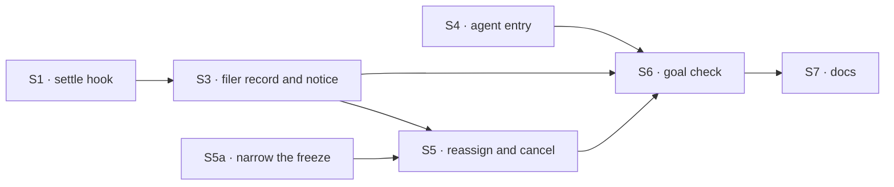

# FIX-1780 · Plan

[Spec](SPEC.md) · [Decisions](DECISIONS.md) · [Rules](BUSINESS-RULES.md) · **Plan** · [Docs](DOCS.md)

Written for the implementing agent. Directional: shape and sequence are fixed; names and local
structure are the implementer's except the pins. IDs cross-reference
[BUSINESS-RULES.md](BUSINESS-RULES.md) (BR-n) and [DECISIONS.md](DECISIONS.md) (Dn). `tdd`. One PR,
built after FIX-1778, FIX-1777 and FIX-1779; if FIX-1779's PR is still open, stack on it. S5a
depends on none of them and ships first as its own small PR (see S5a).

## Depends on

| Issue | Gives this issue |
|---|---|
| [FIX-1778](https://linear.app/fixpoint-labs/issue/FIX-1778) | The assignee lookup `reassignTask` checks a worker against, and the per-task hand-over every mailbox list uses |
| [FIX-1777](https://linear.app/fixpoint-labs/issue/FIX-1777) | The mailbox runs its own list when a task is added, so the reassigned task starts, and the run belongs to whoever filed |
| [FIX-1779](https://linear.app/fixpoint-labs/issue/FIX-1779) | The coordinator's `fileTask` tool, which answers in the filing turn and records `filingWorker`, and `createMailboxSetupCapability` the two new verbs sit beside |

If one of them lands a different shape (in particular, if the list's run is not one Workforce-built
board per list), re-draft S3 here before building.

## Surfaces

| ID | Package · role | Change | Rules |
|---|---|---|---|
| S1 | `orchestration` · task board options and the two attempt recorders (worker body, hand-off gate) | A generic `onTaskSettled` option: a block run with the task id, the row as it now stands, and how the attempt ended (`completed`, `errored`, `parked`, `retrying`). The two recorders report that ending from a write that landed (they clear the claim, so a later step cannot rebuild it), and the hook runs off the report, in the inline worker body and in the hand-off gate. It runs on the path where the board rethrows a final failure too, and never when a write was declined (a displaced attempt) or the board deferred a recorder failure. No worker in the name or the input | BR-5–BR-11, BR-6a |
| S3 | `workforce` · mailbox `fileTask` and the list's board | On filing: FIX-1779 records `filingWorker` (the calling worker's name, as the runtime knows it). Record `filingSession` beside it, at the same point and from the same runtime context: the filing turn's own session and its lineage, never tool input. `fileTask` answers in the same turn (FIX-1779's refusals are tool errors), so the filing turn is where both are known and no engine read is needed. If FIX-1779 lands a filing that leaves the turn first, re-draft this row. The owner FIX-1777 records is never read here: it is for the claim and the bill. On a `retrying` ending, ask the mailbox to run the list again, the request FIX-1777 makes on an add (BR-6a). Pass S1's hook to the board Workforce builds per list: dispatchers built once when the board is built, over the live worker list as the mailbox wake does, and per notice one dispatch, to the row's `filingWorker` into its `filingSession`, after checking the session's lineage | BR-1–BR-4 BR-6a BR-12 BR-14 BR-15 |
| S4 | `workforce` · the built-in `agent` kind | Declare the internal task-notice entry beside `onMailboxPost`; it runs the ordinary answer with the notice as the turn (`task <title> on <mailbox>/<list> ended: <status>` plus the error, question or output summary). Concurrency: the default, as `onMailboxPost` uses, because a queued request can be refused after the engine's wait and a notice must not be dropped. Drop a notice whose task id, attempt and ending it already answered | BR-8a BR-12 BR-13 |
| S5 | `workforce` · mailbox actions + coordinator tools | `reassignTask` and `cancelTask` as mailbox actions, and as dispatcher tools beside FIX-1779's in its capability, both writing through the board's existing verbs (`assignTask`, `cancelTask`), never a parallel write. Reassign: refuse running/completed/cancelled and the fourth move; check the worker through FIX-1778's filing check first (its BR-12a: the lookup, plus the list's workers under its D3 option (ii)). Each move is one guarded write that re-checks the status. *Pending*: `assignTask`. *Parked*: the fenced unpark to *pending* (withdrawing its question and ending its attempt), then `assignTask`. *Errored*: mark the old row reassigned through a revision-guarded write, file the copy for the new worker with the old id, the move count and this filer. Then the list runs as on any filing | BR-16–BR-22 |
| S5a | `orchestration` · the hand-over assignee freeze ([FIX-982](https://linear.app/fixpoint-labs/issue/FIX-982)) | Narrow it: `setAssignee` on a frozen ledger declines only while an attempt holds the task (*in progress* or *parked*); *pending* and *blocked* tasks may change hands. Update the module's doc comment and `docs/architecture` where it states the freeze. Today the freeze declines every `setAssignee`, an empty assignee included (`tasks/collection/resource-backed.ts`), so FIX-1777's "assign it" for an unnamed task on a hand-over list works only once this lands. It depends on nothing else here, so it goes first, as its own PR, ahead of FIX-1777's if that one needs it | BR-16b |
| S6 | `goals/workforce-conventions/a-filer-hears-how-its-task-ended/` | The goal check, `goal.md` + `run.mts`, per [SPEC.md](SPEC.md#the-goal-and-how-well-know-its-met), and its control | goal |
| S7 | Docs, per [DOCS.md](DOCS.md) | Mailboxes, task board, built-in worker pages; workforce and orchestration READMEs | — |

**Removed:** nothing. **Not touched:** the task collection's change items and backings; the mailbox
`post` path; the harness manager.

## Sequence



S5a first as its own PR; the rest in one PR. The control goes red before the legs go green.

## Checks

| ID | After | Passes when |
|---|---|---|
| VG | S6 | Legs a to f green; `GOAL_CONTROL=no-follow-up` red on legs a to d and f's hand-over half; red against `origin/main` at the first filing |
| V1 | S1 | Orchestration tests: the hook runs once for completed, once for the last failure, once per park, once per retry as `retrying` with no notice sent and the list run again, never for a recorder failure, inline and handed off (D3, BR-6, BR-6a, BR-11) |
| V3 | S3 S4 | Workforce tests: BR-2, BR-3, BR-4, BR-6a, BR-8a, BR-13, BR-14, BR-15 |
| V4 | S5 S5a | Workforce tests: BR-16 to BR-22, including a parked task moved in place (D2) and both races. Orchestration test: BR-16b, and the existing FIX-982 tests still decline on an *in progress* task |
| V5 | all | `goals/workforce-conventions/a-mailbox-holds-the-work-a-seat-drains`, FIX-1777's board check and FIX-1779's check stay green; `pnpm typecheck`; `pnpm --filter @flow-state-dev/orchestration test`, `workforce` |

## Pinned

- `onTaskSettled`: the board option and the `agent` kind's internal entry. The coordinator design
  and FIX-1774's preset name the wake by it.
- `reassignTask`, `cancelTask`: the coordinator's tools. FIX-1774's spec and preset name them.
- `GOAL_CONTROL=no-follow-up` and the check's folder name.
- The reassign cap: three moves.

## Guardrails

| Rule | Because |
|---|---|
| The hook runs where the recorders run, both of them | Tenet 5: every attempt ends there, inline or handed off. A hook at one call site is the missing-writer bug |
| Core, engine and orchestration name no worker, hire or mailbox | Jake's layer rule. S1 is "a block after an attempt ends"; S5a is "an assignee is fixed while an attempt holds the task" |
| The filer comes from the filing turn's runtime context, never tool input or a body field | BP-031. A forged filer would aim turns at someone's conversation |
| A notice is one turn per ending, never per retry | D3; each turn spends model time |
| Reassign never touches a running task | FIX-1659 is the claim problem; a moved running task forks the run |
| Move and cancel through the board's verbs | FIX-1659's fence: no second assign surface. FIX-949 is the in-place direction this follows |
| Write "worker", never "seat", in any sentence added | Jake is retiring the word. Code names stay |

## Sketch

```text
task list run, after an attempt's result is recorded:
  ending = completed | errored (no attempts left) | parked | retrying | none
  if ending and the board has onTaskSettled: run it with (row, ending)

Workforce's onTaskSettled:
  retrying → ask the mailbox to run the list again; done
  worker, conversation = row.filingWorker, row.filingSession   // either missing → done
  dispatch task notice to { flow: worker, session: conversation }

reassignTask(task, worker):
  refuse unless status in pending, parked, errored; refuse at the move cap
  check worker through the assignee lookup
  pending, parked: unpark if parked; board assignTask(task, worker)   // same id
  errored: mark task reassigned (guarded); file copy for worker       // new id
  the list runs
```

## POC

None. The three premises it rests on were read off the code ([DECISIONS.md → Settled](DECISIONS.md#settled)).

## At implement time

- **Delivery across owners.** A notice is dispatched from the session that settled the task (the
  worker's run) into the filer's conversation. Confirm that dispatch is addressable when the run's
  owner (FIX-1777's stamp) and the conversation's owner are the same person, in the DevTeam Lab's
  real arrangement. If it is refused for ownership, raise it before working around it.
- **The org check.** A notice crosses from the worker's run into the coordinator's conversation. The likely refusal is the organization binding, not ownership, since the coordinator's turn runs as the person and the list is the organization's. Prove the delivery in the goal check's real arrangement.
- `handedOffTaskPredicate` (`task-board/hand-off.ts`) decides which tasks a drain handed off from the assignee, and its doc comment relies on the freeze. Under S5a a waiting task's assignee can move, so it may move between lists of handed-off workers; confirm the predicate is read at claim time, and update the comment.
- Read FIX-1778's final name for the lookup and FIX-1779's capability name before wiring S5.
- What a completed notice carries as "output summary": the row's output, cut to a short line, with
  the run's link.

## Notes from review

Recorded for the implementer, not folded into the design:

- (Cursor) `onTaskSettled` names both the board option and the `agent` kind's entry. Kept as one pinned name because FIX-1774 names the wake by it and both mean the same event; if two exports collide in code, the entry may take another internal name as long as FIX-1774's preset still reads.
- (Cursor) The SPEC's Signal cell repeats the checks; the goal folder's `goal.md` may carry the leg-level timing instead.
- (Cursor) The move cap (BR-20), the race rule (BR-22) and the redelivery drop (BR-8a) are optional trims for v1 if they cost more than a test each. Keep the behaviour, not the machinery.
- (Codex) Keep the move count where a worker's `updateTask` metadata patch can't reset it, if the board has such a place. The cap guards a looping coordinator; it is not a security boundary.
- (Codex, on #2761) A parked task's attempt can still settle it (`parked → completed` with the old claim), so moving a parked row in place would let the old worker settle work now addressed to a new one. The freeze therefore keeps *parked* with *in progress*, and `reassignTask` unparks before it assigns. BR-16's outcome is unchanged.
- (Codex) A filing session deleted and recreated between the lineage check and the dispatch can still receive the notice. If the dispatcher can carry an expected lineage cheaply, use it; otherwise the window is the check-to-dispatch gap and stays as is.

## Follow-ups

- [FIX-949](https://linear.app/fixpoint-labs/issue/FIX-949) (clear an assignee) shares S5a's narrowed freeze; link the two so it isn't built twice.
- FIX-1777's BR-12 ("nothing retries it on its own") is out of date once BR-6a ships.
- Stopping a running task ([FIX-1659](https://linear.app/fixpoint-labs/issue/FIX-1659)).
- A person hearing about a task they filed by hand, in their own inbox.
- A run that stops on `ctx.suspend` (an approval) or on the harness door's turn park wakes nobody here.
- FIX-1774's check gains a U7 leg: a filed task fails and the coordinator reassigns it or tells the
  person.
