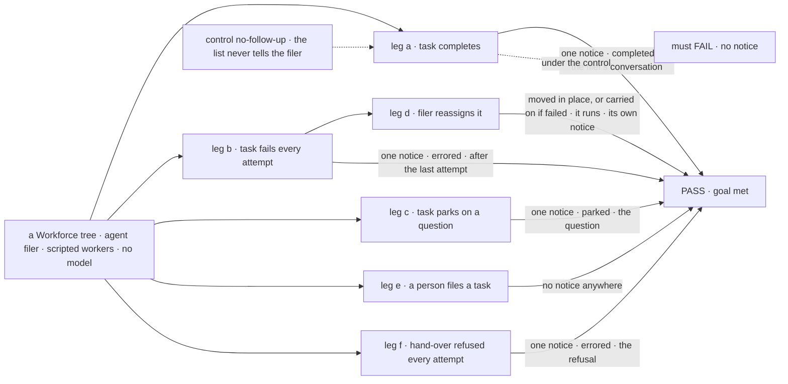
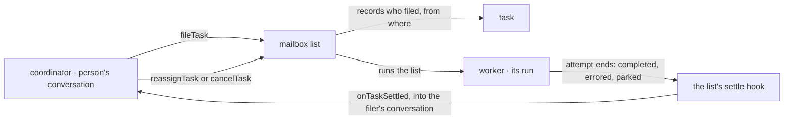

# FIX-1780 · A coordinator hears when a task it filed finishes, fails or blocks, and can reassign it

**Spec** · [Decisions](DECISIONS.md) · [Rules](BUSINESS-RULES.md) · [Plan](PLAN.md) · [Docs](DOCS.md)

## Five people, before and after

| Someone who… | Today | After |
|---|---|---|
| **asks the coordinator for work, then waits** | The task finishes on a list and nobody tells them. They find out by opening the list | The coordinator is told in their conversation and says the work is done, with what came back |
| **has work fail for good** | The task sits *errored* on a list. The coordinator never hears | The coordinator is told why it failed and either gives it to another worker or tells them what is stuck |
| **has work stop on a question** | The task sits *parked*. Nobody is told unless they look | The coordinator is told the question and can pass it on |
| **is a coordinator that reassigns a task** | Has no tool for it | Gives the task to another worker in one call. A task that hasn't ended keeps its id and moves; a failed one is carried on by a new task |
| **files a task by hand on a list** | Nobody is told | The same: only a worker that filed a task hears about it |

## The goal, and how we'll know it's met

**When a task a worker filed finishes, fails for good or stops waiting on someone, that worker is
woken in the conversation it filed from, with the task and how it
ended; and it can give the task to another worker or cancel it.**

| Is it the right goal? | |
|---|---|
| **The real need** | "A coordinator is woken when a task it filed finishes, fails or blocks, with the task and its outcome. It can reassign the task to another worker or cancel it, and tell the person" ([FIX-1780](https://linear.app/fixpoint-labs/issue/FIX-1780)). Jake: the coordinator's job is to "route work, hire the workforce as needed, setup mailboxes, and get the work flowing to the right places" ([FIX-1774](https://linear.app/fixpoint-labs/issue/FIX-1774)). Use case U7 of the coordinator design |
| **Smaller, and rejected** | "The coordinator can read the status of its tasks." It would have to poll, and a turn only runs when somebody speaks, so a failed task waits until the person asks. The goal is graded on the coordinator being *woken*, not on a read |
| **Where the boundary sits** | This issue is the signal and the two verbs. *What* the coordinator says or does when woken (reassign, re-staff, tell the person) is its instructions, which [FIX-1774](https://linear.app/fixpoint-labs/issue/FIX-1774)'s coordinator preset owns, with a U7 leg in its own check. "Tell the person" is met here by where the notice lands: in the person's conversation, so the coordinator's answer is a line they read |
| **Bigger, and not this issue's** | A post on a mailbox: it is talk, not a task, and has no ending to report. Stopping a task that is running ([FIX-1659](https://linear.app/fixpoint-labs/issue/FIX-1659)'s claim problem). A person hearing about a task they filed by hand. Retrying a failed task on its own |
| **Not done if** | The filer hears nothing on any one of the three endings · it hears once per retry instead of once at the end · a task a person filed wakes some worker · the notice lands in a session the person never reads · reassigning leaves two live tasks for the same work, or a parked one still waiting, or gives a task that hasn't ended a new id · reassigning a running task forks the run · a notice arrives twice for one ending, or late after the check stopped looking · a fired filer or a closed conversation makes the task fail |



The check files through the filer's own tool, lets the list run, and then only reads the filer's
conversation and the list. Under the control the same run must leave the conversation silent.
Every leg counts notices twice, the second time after a grace period.

| How we verify | |
|---|---|
| **Goal check** | `goals/workforce-conventions/a-filer-hears-how-its-task-ended/` · no model: the filer is a built-in `agent` worker on a scripted model, the workers are scripted · run by the implementer · verdict in the implementation PR |
| **Signal** | A *notice* is a request on the filer's conversation for its `onTaskSettled` entry, carrying the task id and the ending. Each leg waits up to 60 seconds for the task to settle, then reads again 5 seconds later, so a late duplicate is caught. Every notice in legs a to d must also have its scripted reply in that conversation. Leg a: exactly one notice, `completed`. Leg b: a worker that throws on every attempt of a two-attempt task gives exactly one notice, `errored`, after attempt 2, carrying the error; none after attempt 1. Leg c: a worker that parks on a question gives exactly one notice, `parked`, carrying the question. Leg d: `reassignTask` on leg b's failed task leaves it `errored`, files one new task for the second worker naming the old one, that task completes, and the filer gets exactly one notice for it; `reassignTask` on leg c's parked task keeps its id, names the second worker, goes back to *pending*, runs there and completes, with one notice and no second row; `cancelTask` on a third parked task cancels it with no notice. Leg e: a task filed by a client on the same list completes and no session in the tree holds a notice. Leg f: a two-attempt task whose hand-over is refused on every attempt reaches attempt 2 and gives one `errored` notice naming the refusal |
| **Input** | A goal-local tree: one mailbox with one list, an `agent` filer, two scripted workers. Run: `pnpm tsx goals/workforce-conventions/a-filer-hears-how-its-task-ended/run.mts` |
| **Anti-game** | No notice written by the check. The filer files through its tool, not a direct ledger write. Nothing drained by the check. "No notice" in leg e is read after the task settles, not after a bare sleep |
| **Control that must fail** | `GOAL_CONTROL=no-follow-up` removes the list's settle hook and nothing else: legs a to d and f FAIL with no notice. Against `origin/main` the check FAILS at its first filing (no tool, no notice) |

## What changes


Top is today: the task ends and the trail stops at the list. Bottom is after: the ending goes back to the conversation that asked.

**A coordinator's turn when a task ends.** Nothing new to write in a worker file. The notice is a
turn, like a mailbox post is:

```diff
  person:       build a hello-world page
  coordinator:  Filed "hello-world" for eng.coder on eng.feature.
+ ⟶ task hello-world on eng.feature/work ended: errored after 2 attempts.
+    eng.coder: "npm install failed: no network"
+ coordinator:  The coder couldn't install packages. I gave it to eng.builder,
+               which has network access. I'll tell you when it lands.
```

**A coordinator's tools** gain two verbs beside FIX-1779's `fileTask`:

```diff
  tools: [discover, hire, setUpMailbox, subscribeWorkers, fileTask,
+         reassignTask, cancelTask]
```

## How a notice travels



The task list's run already records how each attempt ended. After that record, one generic hook
runs. Workforce plugs in the step that wakes the filer. Who filed is recorded by the filing turn
itself, from the runtime, never from what the tool was given.

## What stays as it is

- **Core and engine are not touched.** The task list gains a generic settle hook, and a list that
  hands tasks over lets a task change hands while no attempt holds it. Neither names a worker.
  Workforce decides that the filer is a worker and wakes it.
- **A refused filing.** It is `fileTask`'s tool error in the same turn, as FIX-1779 has it. No
  notice.
- **A task filed by a person, a post, or a host.** Files as today, and nobody is woken.
- **Retries.** A failed attempt with attempts left goes back to *pending* and nobody is woken. The
  list runs again so the next attempt happens.
- **Running tasks.** Nobody can reassign or cancel one through these tools.
- **The board's own verbs.** Moving a task goes through the board's `assignTask`, and cancelling
  through its `cancelTask`. No second write path.
- **The mailbox's other actions and a worker's own board tools.** Unchanged.

## Sign off

**[The goal](#the-goal-and-how-well-know-its-met), at that size:** the filer is woken on all three
endings, and can move or stop the task. What it decides to do is FIX-1774's.

1. **[D1](DECISIONS.md#d1) · The notice lands in the conversation the task was filed from.** If
   wrong: a coordinator speaks up in a person's conversation without being asked, when that person
   wanted a quiet list.
2. **[D2](DECISIONS.md#d2) · Reassigning moves a task that hasn't ended, in place; a failed task is
   carried on by a new one.** If wrong: a list that hands tasks over lets a waiting task change
   hands, which it refuses today, and that rule now holds only while a task runs.
3. **[D3](DECISIONS.md#d3) · Three endings wake the filer: completed, failed for good, parked.**
   If wrong: a filer misses a task somebody else cancelled, or is woken too often.

**Open: none.** The calls made without asking are in [DECISIONS.md](DECISIONS.md); the cases in
[BUSINESS-RULES.md](BUSINESS-RULES.md).

Enhancement · `@flow-state-dev/orchestration` (settle hook) ·
`@flow-state-dev/workforce` (filer record, notice, two verbs) · orchestration also lets a
waiting task on a hand-over list change hands · medium · 1 PR, after FIX-1778,
FIX-1777 and FIX-1779 · epic [FIX-1763](https://linear.app/fixpoint-labs/issue/FIX-1763) · blocks
[FIX-1774](https://linear.app/fixpoint-labs/issue/FIX-1774)
