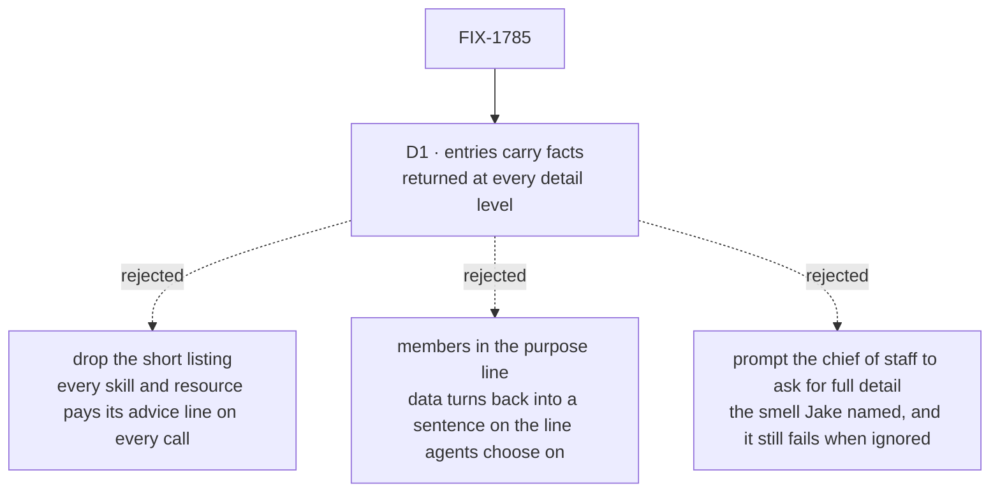

# FIX-1785 · Decisions

[Spec](SPEC.md) · **Decisions** · [Rules](BUSINESS-RULES.md) · [Plan](PLAN.md) · [Docs](DOCS.md) · [Evolution](EVOLUTION.md)

One decision is the sign-off surface. Everything else here is context for it.

## The tree

Solid edges are what you're signing. Dashed edges lost, and the label says why.

## D1 · A discovery entry gains `facts`, stored data the door returns on every call whatever detail was asked; core passes it through and never names a key, and Workforce fills it

| | |
|---|---|
| **Instead of** | Dropping the short listing so `contract` always comes back; or writing the members into the mailbox's `purpose` line, a Workforce-only change |
| **Because** | Who is on a mailbox and what kind a worker is are records, not advice. A record that comes back as an array can be read without parsing and cannot be skipped by picking the wrong detail level. The door already splits *what it is for* (`purpose`, always) from *how to work with it* (`contract`, on request); data is a third thing and gets its own place. Keeping core blind to the keys is Jake's layer rule: Layer 1 offers the slot, Workforce decides it means members (tenet 2, tenet 5) |
| **Locks in** | Every domain now has a sanctioned place for data a model must not miss, and the door returns it on every call. A source that stuffs a long payload there makes every short listing of that domain expensive, and only review stops it |

![D1, where a mailbox's members go so a short listing can't miss them. Chosen: facts, returned at every detail. Instead of: drop the short listing, or members in the purpose line. Decides it: data a reader can rely on without parsing; facts is an array, the others are sentences. Cost row: a short listing of skills and resources stays cheap with facts and with purpose, but not when the short listing is dropped. Price: the shared entry shape grows a field, where the other two leave it unchanged. Locks in: data a model must not miss goes in facts. Flips if: a source needs large or nested data there](figures/d1-facts.svg)

It comes down to whether the data can be read as data: both alternatives hand the model a sentence.

**What would change my mind:** a source that needs nested data, or more than about 1 KB of
`facts` on one entry. Then `facts` is the wrong shape, and that data should be a resource the
model reads by uri. The DevTeam tree's largest entry is well under that (PLAN V7 records it).

## Decided, not asked

- **The contract stops repeating the data.** A mailbox's contract keeps "Addressed by its id. Listed here means registered, not open."; a worker's keeps "Hand it work by its id." The member list and kind live in `facts` only, so there is one place to read them. Anything that parsed the old sentence (the #2768 grader) reads `facts` instead.
- **Key names are `members`, `openedAt`, `workerKind`.** Model-facing, so pinned ([PLAN](PLAN.md#pinned-names)). `workerKind`, not `seatKind`, because new names say worker; the entry's own `kind: "seat"` stays until the Architect's rename.
- **Values are flat:** a string, number, boolean or array of strings. No nesting. One `facts` schema in core checks each entry before it is returned (PLAN S2, S3).
- **An unknown kind is left out, not guessed.** A seat row with no kind gets no `workerKind`; today's contract printed `"agent"` for it, which is a guess the issue exists to stop.
- **No `facts` key at all when a source sets none**, so skills and resources entries stay byte for byte.
- **What counts as a fact.** A value read from a stored record that someone could ask the agent to report as it is: who is on a mailbox, what kind a worker is, when a mailbox opened. Advice on how to act stays in `contract`. The docs state this rule so a source author has it without this spec.
- **Membership is not who works a list.** `facts.members` is who is on the mailbox. FIX-1774's per-turn view lists who works each task list (`taskListWorkers`), a different set by design (FIX-1777 BR-18). The view does not repeat membership and points at `discover` for it, so each fact has one source and the two never sit side by side under the same word.
- **No cap on `facts.members`, unlike the view.** The view is paid on every turn whether or not anyone asked, so FIX-1774 caps it. `discover` is paid only when the model asks, and the question it answers is exactly *who is on this*: a capped list would bring back the guessing this issue removes.
- **A hire's `description` (FIX-1774 S4) goes in `purpose`**, the line agents choose on, not in `facts`.
- **No new tool.** A `mailboxMembers` tool beside `discover` would be a second path to the same data, and the model could still take the first one.

## Considered and dropped

| Option | Why it lost |
|---|---|
| **Drop `detail`; always return `contract`** | The subtraction, and the closest second. It fixes this case, but `contract` is advice ("load it with `loadSkill`…") and every skill and resource would pay for it on every call, which is the cost the short listing exists to avoid ([FIX-817 Open-1](../FIX-817/DECISIONS.md#open-1)). The members would still be a sentence |
| **Members in the mailbox's `purpose` line** | No core change at all. But `purpose` is the line an agent chooses on, a check would parse prose, and the worker's kind would need the same trick on every worker entry |
| **A per-source "always full" flag** | Generic, and a small domain would get its whole contract. It moves advice into every call to deliver data, and the data is still a sentence |
| **Prompt the chief of staff to ask with `detail: "full"`** | The fix Jake called a smell. #2768's 12-run log shows a model still taking the short listing |
| **Make `full` the default** | The model can still pass `thin`, and every caller pays for advice it didn't ask for |

**Open: none.**

## How it got here

- **Draft** — framed as data hidden behind a detail level the model picks; chose a generic `facts` slot on the entry that the door always returns, filled by Workforce; one PR across `contracts`, `core` and `workforce`, with a no-model goal check and a control that withholds facts on a short listing.
