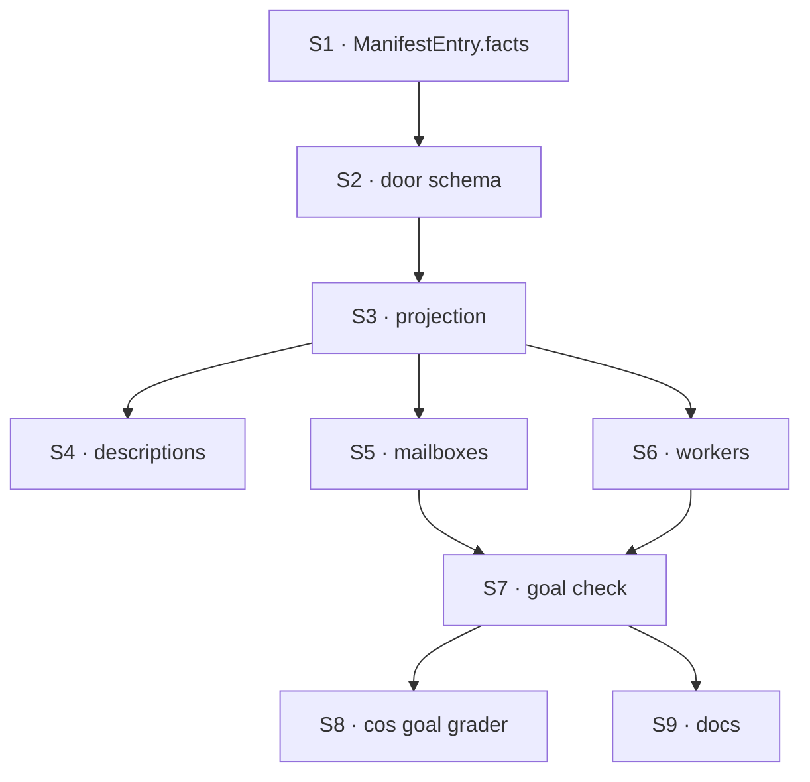

# FIX-1785 · Plan

[Spec](SPEC.md) · [Decisions](DECISIONS.md) · [Rules](BUSINESS-RULES.md) · **Plan** · [Docs](DOCS.md) · [Evolution](EVOLUTION.md)

Written for the implementing agent. IDs cross-reference [BUSINESS-RULES.md](BUSINESS-RULES.md)
(BR-n) and [DECISIONS.md](DECISIONS.md) (D1). `tdd`. One PR.

## Surfaces

| ID | Package · role | Change | Rules |
|---|---|---|---|
| S1 | `contracts` · `ManifestEntry` | Optional `facts`: a flat record of string, number, boolean or string-array values. Doc comment: stored data a model must not miss, returned at every detail level; `contract` stays advice | BR-1 BR-6 |
| S2 | `core` · one `facts` schema | A single flat-values schema is the authority for "flat". The wire schema reuses it. Without `facts` on the wire schema the zod object silently strips it: the `satisfies` check only catches required fields | BR-1–BR-5 |
| S3 | `core` · `readDomain` projection | Run S2's schema per entry (safe parse) before projecting: a bad value makes that domain's `problem`, so nothing invalid reaches the tool's output check and the call never throws for it. Pass `facts` through at every detail; omit the key when absent or empty; `contract` only on `full` | BR-1–BR-5 |
| S4 | `core` · the tool's descriptions | The `detail` description says it adds the advice hint, and that `facts` always comes back | BR-1 |
| S5 | `workforce` · mailboxes source | `facts: { members, openedAt? }`; contract drops members and open time. Applies to run-time mailboxes too once FIX-1779 PR-A (#2760) is on `main`. `test/manifest-sources.test.ts` asserts the old contract strings and changes with it; that red is expected | BR-7–BR-12 |
| S6 | `workforce` · seats source | `facts: { workerKind }`; contract drops the kind and the `"agent"` fallback. Same test file | BR-13–BR-15 BR-17 |
| S7 | `goals/agent-discovery/a-short-listing-says-who-is-on-a-mailbox/` | The goal check, no model, with `GOAL_CONTROL=thin-withholds-facts` | goal |
| S8 | `goals/org-seats/cos-changes-the-roster` | If #2768 is on `main`: point its discover grader at `facts.members` / `facts.workerKind` instead of the contract sentence, and rerun 12 times. If not, this thread owns the rerun: it lands as a follow-up PR from `main` after #2768 merges, and FIX-1785 stays In Review until it has run | acceptance |
| S9 | Docs, READMEs, changeset | Per [DOCS.md](DOCS.md). Changeset: `contracts`, `core`, `workforce` minor (a new optional field on a published type, and a changed contract string) | — |

**Removed:** the member list, open time and worker kind from the two Workforce `contract`
strings; the `"agent"` fallback kind.

## Sequence



## Checks

| ID | Runs after | Passes when |
|---|---|---|
| V1 | S2 S3 | A stub source with `facts`: thin, default and no-domain calls return it without `contract`; full returns both (BR-1–BR-3). Red first: today's door drops it |
| V2 | S3 | No `facts` or `{}` gives no key; the existing skills and resources suites pass unchanged (BR-4) |
| V3 | S3 | A nested object in `facts` makes that domain a `problem`; another domain's answer is intact, and the call returns rather than throws (BR-5) |
| V4 | S1–S3 | `grep -rwE 'members\|workerKind\|openedAt' packages/contracts/src/types/manifest.ts packages/core/src/manifest` prints nothing (BR-6) |
| V5 | S5 | Thin listing of a declared mailbox, an empty one, a legacy row, and (after rebase) a run-time one (BR-7–BR-11) |
| V6 | S6 | Thin listing of a file worker, a runtime hire, and a row with no kind (BR-13–BR-15) |
| V7 | S5 S6 | Bytes of a thin `{}` call on the DevTeam tree, before and after, recorded in the PR. The largest entry's `facts` is under the ~1 KB guide in D1 |
| VD1 | S5 S6 | D1: through `createWorkforceCapability`'s real `discover` tool, a thin call carries members and kinds; the same test against `main` fails |
| VG | S7 | [The goal](SPEC.md#the-goal-and-how-well-know-its-met) PASSES, after the same run FAILED under `GOAL_CONTROL=thin-withholds-facts` |

Second path (BP-035): legacy rows (BR-9, BR-14); cancellation still propagates out of the door.

## Pinned names

| Where | Name | Why pinned |
|---|---|---|
| `ManifestEntry` | `facts` | Public type and model-facing key |
| Mailbox facts | `members`, `openedAt` | Model-facing; checks read them |
| Worker facts | `workerKind` | Model-facing; says worker, not seat |
| Goal control | `thin-withholds-facts` | Named in the spec |

## Guardrails

- **Core never names a key** (V4), because Jake's layer rule puts Workforce words in Workforce only.
- **Add the field to the zod schema, not only the type**, because the wire schema strips unknown keys and the type check cannot see an optional field missing.
- **One home for each fact**: don't leave the member list in the contract "for compatibility", because two copies are what a reader then has to reconcile.
- **Grade the goal on the door's output, never on `contract` text**, because the sentence is exactly what this change removes.
- **Docs say worker, never seat** (Jake, 2026-10-04). Code spans like `kind: "seat"` stay.

## Goal check sketch

Pseudocode, not real code:

```
boot the DevTeam tree host on a temp store, no model
hire coder-<hex> through the host's hire path
door = the chief of staff kind's discover tool, run through the engine
for call in [mailboxes·thin, mailboxes·full, all·thin]:
  for mailbox in tree.mailboxes (not templates):
    expect set(entry.facts.members) == set(file.members)
for call in [seats·thin, all·thin]:
  for worker in tree.workers + hire:
    expect entry.facts.workerKind == file.flow (or hired kind)
control thin-withholds-facts: wrap the door to drop facts on thin → thin legs FAIL
```

**POC:** none. The behaviour is read straight off `readDomain` in
`packages/core/src/manifest/discovery-tools.ts`; no premise needs running code.

## At implement time

- Rebase on `main` first. #2760 (FIX-1779 PR-A) and #2763 change `mailboxesSource`; take theirs and add `facts` where the entry is built. If that leaves two construction sites (file and run-time mailboxes), extract the one builder so `facts` is added once.
- FIX-1774 S4 (#2747) adds a hire `description` to the worker entry: it feeds `purpose`, not `facts` (BR-17). Whichever PR lands second adds its field to the other's builder, not a second restructure.
- Don't touch #2768's branch. S8 runs only against `main`.

## Follow-ups

- The resources source's "you may read and write" is data too (a permission). Moving it to `facts` is a separate call; not in scope.

## Notes from review

Round 1 (Claude second look, FSD Architect, 2026-10-05). Folded: size policy and the view split (DECISIONS, BR-12), one `facts` schema (S2, S3, V3), the fact rule (DECISIONS), FIX-1774 S4 (BR-17), S8 ownership. Recorded for the implementer:

- "An entry will read `kind: \"seat\"` next to `facts.workerKind: \"agent\"`. This is deliberate and pinned, but a model reading both could confuse them. When the Architect's rename lands, `kind` and `workerKind` should be reviewed together."
- "BR-14 is almost dead code. The seat inventory schema has `kind: z.string().min(1)`, required." (BR-14 now says so.)
- Cursor (round 1, optional): "VD1 and the S7 goal both prove thin listings carry `facts` through the real `discover` tool… VG alone might suffice once the goal lands." Kept both: VD1 runs in CI, VG does not.
- Resources' "you may read and write" is a fact by the rule in DECISIONS. Kept out to hold skills and resources byte for byte (BR-4); a follow-up issue.
