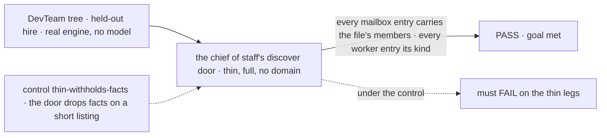
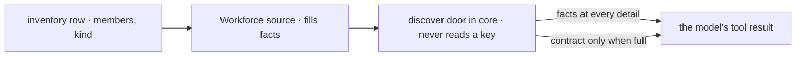

# FIX-1785 · A short `discover` listing hides who is on a mailbox, so a worker guesses the members

**Spec** · [Decisions](DECISIONS.md) · [Rules](BUSINESS-RULES.md) · [Plan](PLAN.md) · [Docs](DOCS.md) · [Evolution](EVOLUTION.md)

## Five people, before and after

| Someone who… | Today | After |
|---|---|---|
| **asks the chief of staff who is on `eng.feature`** | Gets the stored list only when the model asked `discover` for full detail. Otherwise it guesses: 1 run in 12 left out a member and gave another the wrong kind | The member list comes back on every `discover` call that lists the mailbox, so the answer is read, not guessed |
| **asks which workers the org has, and what kind each is** | The kind a worker was hired into is in a sentence that a short listing drops | Every listing of a worker carries its kind |
| **writes a goal check or a test against `discover`** | Parses "3 members: eng.em, …" out of a sentence, and only when the call asked for full detail | Reads `facts.members`, an array, from any call |
| **builds a discovery source for their own domain** | Can put data a model must not miss only in `purpose` (abusing it) or in `contract` (withheld by default) | Puts it in `facts`, which the door always returns. Core never learns what the keys mean |
| **uses `discover` for skills or resources** | Short entries, `contract` on request | Exactly the same, byte for byte. No source there sets `facts` |

Jake, 2026-10-05: prompting the chief of staff to list itself is a smell, and membership must be
deterministic. Today the door hides that data behind a detail level the model picks. Labelled a
bug, but the fix changes the discovery door's entry shape (FIX-817), so it gets a spec.

## The goal, and how we'll know it's met

**Whatever listing a worker asks `discover` for, a mailbox comes back with its stored member
list and a worker comes back with the kind it was hired into, so "who is on this mailbox, and
what are they" is answered from data, never from the model's recollection.**

| Is it the right goal? | |
|---|---|
| **The real need** | Jake's words above, on [FIX-1781](https://linear.app/fixpoint-labs/issue/FIX-1781) / #2768 run 12: `discover({domain:"mailboxes",detail:"thin"})` and `discover({domain:"seats",detail:"thin"})`, then an answer missing `chief-of-staff` with `eng.reviewer` on the wrong kind |
| **Smaller, and rejected** | "Tell the chief of staff to ask with `detail: "full"`." That is the prompt fix Jake called a smell, and it still fails whenever the model doesn't follow it. Making `full` the default is the same: the model can still pass `thin` |
| **Bigger, and not this issue's** | The model reciting the list perfectly: #2768 grades tool output, not wording. Renaming `seat` in model-facing strings: the Architect's terms |
| **Not done if** | The member list comes back short but worker kinds don't · it passes in a unit test but the door's output schema strips the new field · a mailbox set up while the app runs (FIX-1779) lists without members · a no-domain call (everything in scope) drops it |



The check reads what the door returned to the chief of staff, not what a model said about it.

| How we verify | |
|---|---|
| **Goal check** | `goals/agent-discovery/a-short-listing-says-who-is-on-a-mailbox/` · model `n/a` for the property (what the door returns is not a model's choice) · plus the existing `goals/org-seats/cos-changes-the-roster` **discover** leg, 12 runs on a real model · run by the implementer · verdict in the implementation PR |
| **Signal** | For `{domain:"mailboxes",detail:"thin"}`, `{domain:"mailboxes",detail:"full"}` and `{}`: each declared mailbox's `facts.members` holds exactly its `MAILBOX.md` members (as a set). For `{domain:"seats",detail:"thin"}` and `{}`: every member's `facts.workerKind` equals its file's `flow:`, and the held-out hire's equals the kind it was hired into |
| **Input** | The DevTeam tree, read off the files, never spelled in the check. One worker hired at run time under `coder-<random hex>`. Another tree must pass too |
| **Anti-game** | The door is called through the engine on the chief of staff's own kind, never a source's `entries()` directly. Nothing asserts on the `contract` string |
| **Control that must fail** | `GOAL_CONTROL=thin-withholds-facts` (the door returns on a short listing what `main` returns today): FAILS on the thin legs, passes the full leg. Today's `main` FAILS too: there is no `facts` |

## What changes


Left is today: the data rides in a sentence the short listing drops. Right is after: data and
advice are two fields, and only the advice waits for `detail: "full"`.

**What a short listing returns** (`discover({ domain: "mailboxes" })`):

```diff
  { id: "eng.feature", kind: "mailbox",
    purpose: "Where this team talks about the feature it is building.",
+   facts: { members: ["eng.em", "eng.coder", "eng.reviewer", "chief-of-staff"],
+            openedAt: "2026-10-05T09:12:00.000Z" } }
```

**What a source author writes** (any domain, any package):

```diff
  entries.push({
    id, kind: "mailbox", purpose,
-   contract: `4 members: eng.em, …. Opened …. Addressed by its id. …`,
+   facts: { members, openedAt },
+   contract: "Addressed by its id. Listed here means registered, not open.",
  });
```

## How the data reaches the model



Core passes `facts` through untouched. Only Workforce knows the words `members` and `workerKind`.

## What stays as it is

- **`detail` and its default.** Still `thin`, still governs `contract` only.
- **Skills and resources entries.** Unchanged; their sources set no facts.
- **Which mailboxes and workers are listed.** Today's rules, FIX-1779's included.
- **Entry `kind: "seat"` and the domain name `seats`.** Pinned model-facing strings; renaming them is the Architect's vocabulary work.
- **The chief of staff's `WORKER.md`.** No new prompt lines. That is the point.

## Sign off

**[The goal](#the-goal-and-how-well-know-its-met), at that size:** every listing carries members
and worker kinds, proved through the door with a control that drops them. If wrong: a model can
still reach a listing without the data, and we are back to prompting it to ask properly.

1. **[D1](DECISIONS.md#d1) · A discovery entry gains `facts`: stored data the door returns on
   every call, whatever detail was asked. Core passes it through and never names a key;
   Workforce fills it.** If wrong: the shared entry shape every domain uses grows a field, and a
   careless source could put a long payload there that every short listing then pays for.

**Open: none.** D1 is the one to weigh. Reasoning and what lost: [DECISIONS.md](DECISIONS.md).
The cases: [BUSINESS-RULES.md](BUSINESS-RULES.md).

Bug, specced as a contract change · `contracts` + `core` + `workforce` · small · 1 PR · parent [FIX-1650](https://linear.app/fixpoint-labs/issue/FIX-1650) · amends [FIX-817](../FIX-817/DECISIONS.md#open-1)
