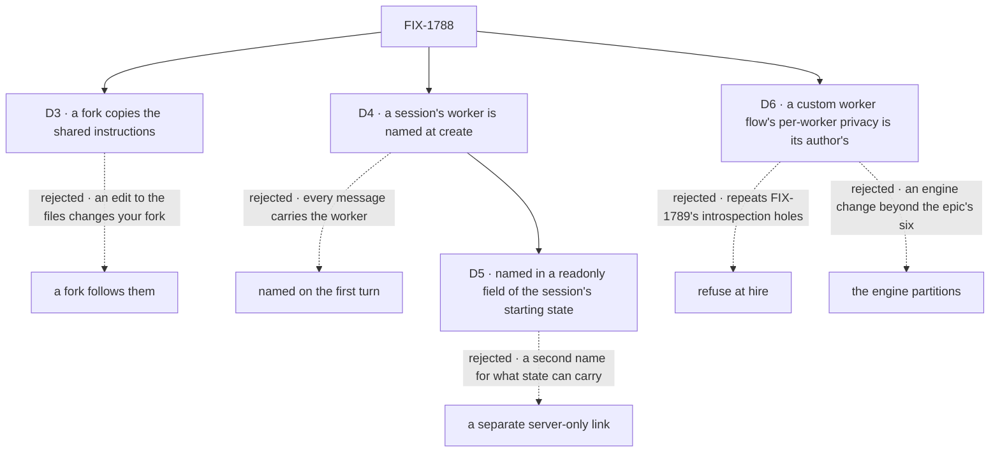

# FIX-1788 · Decisions

[Spec](SPEC.md) · **Decisions** · [Rules](BUSINESS-RULES.md) · [Plan](PLAN.md) · [Docs](DOCS.md) · [Evolution](EVOLUTION.md)

What the model already decided is the epic's ([ER-1](../../epics/FIX-1786/BUSINESS-RULES.md#what-a-team-gets-and-what-it-doesnt),
[D3](../../epics/FIX-1786/DECISIONS.md#d3)) and is not reopened here. These are the calls this
issue makes about forks, about where a session learns its worker, and about how private a
custom worker flow is. D1 and D2, on hires made before this release, were withdrawn by
[epic D9](../../epics/FIX-1786/DECISIONS.md#d9).

## The tree

Solid edges are what was chosen. D3 and D4 are decided. D5 and D6 were approved by the product
owner on 2026-10-07 and recorded after merge ([EVOLUTION.md](EVOLUTION.md#amendment-binding)).
D1 and D2 were signed, then withdrawn by [epic D9](../../epics/FIX-1786/DECISIONS.md#d9), so the
tree leaves them out.

## D1 · Removed by epic D9 · old hires, their memory and their conversations moved by one operator step

Signed by Jake on 2026-10-06; withdrawn on 2026-10-07 by [epic D9](../../epics/FIX-1786/DECISIONS.md#d9): "No consumers yet. No need for
backwards support of any kind." Nothing reads or moves a hire made before this release, its
private cells or its sessions: they are dropped. The card as signed is at
[the commit before the sweep](https://github.com/fixpoint-labs/flow-state-dev/blob/2ab5e6b0bd77c798142a48922131aa52f45f737d/specs/issues/FIX-1788/DECISIONS.md#d1).

## D2 · Removed by epic D9 · a worker hired for the whole org went, as a private copy, to each member who talked to it

Signed by Jake on 2026-10-06; withdrawn with D1, by the same call. It decided where the operator
step put an org-wide hire, and the step is gone. The card as signed is at
[the commit before the sweep](https://github.com/fixpoint-labs/flow-state-dev/blob/2ab5e6b0bd77c798142a48922131aa52f45f737d/specs/issues/FIX-1788/DECISIONS.md#d2).

## D3 · A fork copies a standard worker's shared instructions; it doesn't follow them

Formerly Q1. Decided by Jake on 2026-10-06 ("I agree with the recommendations").

| | |
|---|---|
| **Instead of** | Following them: a fork picks up the installation's later edits, with its owner's changes kept on top |
| **Because** | Standard workers in model variants (a Codex, a Claude and a Cursor researcher) share core instructions, per the 2026-10-04 lock. A copy is what a library copy does (ER-10): nothing changes under its owner. One rule for every copy a user holds, fork or library. A fork is the user saying they want something different |
| **Locks in** | Alice forks the researcher to change its model. Next month the installation improves the researcher's instructions; her fork keeps last month's text until she forks again. Following later edits may come later as an opt-in on a fork. Taking it away later would change running workers, so it doesn't ship first |

What lost: follow keeps forks current, at the cost of a layered configuration (the file, then the
user's changes, merged on every turn), and an edit to the files would change what runs with every
forker's access.

It comes down to the library's rule: nothing changes under its owner, so forks go stale.

**What would change my mind:** users who fork mostly to change one setting, while the core
instructions change every week. Then forks stale at once, and the opt-in earns its layering.

## D4 · A session's worker is named once, when the session is created

Jake, on #2812's review (SPEC.md, the app example): the worker belongs to the session, not to a
message. The epic records this as D3 change 3's session-record form (#2813).

*Amended after merge (2026-10-07):* where the session holds its worker is now [D5](#d5), a
readonly field of the session's starting state, not a server-only field beside it. The call
itself, named once at create, stands. The card as signed is at
[the commit before the amendment](https://github.com/fixpoint-labs/flow-state-dev/blob/fcfefd47ec0cbb04687e98b1844e97e0ef58ae73/specs/issues/FIX-1788/DECISIONS.md#d4).

| | |
|---|---|
| **Instead of** | The worker flow naming the session's worker on its first turn, from a `worker` field in that turn's input (this spec as merged in #2812) |
| **Because** | A session can't change its worker, so a message is the wrong place to name one. Naming it on the first turn was an implementation convenience (create ran no flow code), and it leaked into every app call. At create, the server checks the worker once, and nothing after it can change it |
| **Locks in** | The engine runs a flow-declared check on every path that writes a new session (S1), and Workforce declares it for every worker flow. No session on a worker flow exists without a worker. An app names the worker in the create's starting state and lists by it ([D5](#d5)), and Workforce gains `findWorkerSession` and `ensureWorkerSession` |

It comes down to what carries the worker: the session, once, at create, so messages never name one.

**What would change my mind:** an app that must open a session before it knows which worker will
run it, such as a triage chat that hands off later. That is a new session per worker today, and
would stay one.

## D5 · A session holds its worker in a readonly field of its starting state; there is no separate link

Approved by the product owner on 2026-10-07, who rejected a separate link concept, after P1
([#2850](https://github.com/fixpoint-labs/flow-state-dev/pull/2850)) built the mechanism. Recorded
after merge. It replaces D4's mechanism and reverses the reasoning of the *considered and dropped*
row on plain session state.

| | |
|---|---|
| **Instead of** | D4 as signed: a server-only field on the session record, outside its state, set from a `worker` option on `createSession` and filtered by one on `listSessions` |
| **Because** | A link is a second name for a value the session's state can already carry. D4 dropped plain state for three reasons, and each now has an answer in the engine. It was writable: a top-level `.readonly()` field is refused on any later change, on every path. It was set by the caller with nothing checking it: the create check sees the parsed state and the caller before anything is written. It wasn't listable: the listing filters on readonly fields inside the store's query. The engine stays generic: it knows readonly fields, not workers |
| **Locks in** | Every worker flow declares `workerId` readonly on its session `stateSchema`, with Workforce's create check. An app names the worker with `createSession({ state: { workerId } })` and lists by it with `listSessions({ state: { workerId } })`. `createWorkforceClient` keeps `worker` as its criteria key. `session.createCheck` stays optional: a flow declares one only for a rule that depends on the caller or the store, such as "this project is yours or shared with you". A flow that binds its sessions (a readonly field or a create check) refuses at create a starting state its schema rejects. Three engine changes beyond the epic's D3 item (3) as written ([EVOLUTION.md](EVOLUTION.md#amendment-binding)) |

It comes down to names: a link is a second place for a value state already holds.

**What would change my mind:** a binding the flow's own blocks must not read. State is visible to
every block of the flow, and a server-only field is not.

## D6 · On a custom worker flow, keeping one user's workers apart is the flow's author's job

Formerly Q6, asked on P2 ([#2856](https://github.com/fixpoint-labs/flow-state-dev/pull/2856)).
Answered A by the product owner on 2026-10-07. Recorded after merge.

| | |
|---|---|
| **Instead of** | B: refuse at hire a custom worker flow that keeps data per user without keying it by worker · C: the engine keeps every flow-isolated resource on a worker flow apart per worker, by itself |
| **Because** | The risk stays inside one user. Two of Alice's workers on one custom flow can read what it stores for her; nothing reaches Bob, whose data is keyed apart ([FIX-1790](https://linear.app/fixpoint-labs/issue/FIX-1790)). The epic already says a custom worker flow's privacy is its author's, not a registration check ([epic SPEC](../../epics/FIX-1786/SPEC.md), [ER-2](../../epics/FIX-1786/BUSINESS-RULES.md#what-a-team-gets-and-what-it-doesnt)). B repeats [FIX-1789](https://linear.app/fixpoint-labs/issue/FIX-1789)'s schema-introspection holes: a check that reads a flow's declarations can't see what its code writes. C is an engine change beyond the epic's six ([epic D3](../../epics/FIX-1786/DECISIONS.md#d3)) |
| **Locks in** | BR-23 covers the built-in worker flows: `agent`'s skills drawer is kept per worker from P4, through the skills library's per-run key (S7), which fails closed when a run names no worker. Data a custom worker flow keeps per user is shared by that user's workers on it, and never crosses users. The docs show an author how to keep it per worker ([DOCS.md](DOCS.md)) |

![D6: on a custom worker flow, who keeps one user's workers apart. The flow's author, chosen, beside refusing at hire and the engine partitioning. Decides it: what it costs to build, a docs section, against a check with FIX-1789's holes, and an engine change beyond the epic's six. Price: two of one user's workers share what the flow stores, unless its author keys it. Tie: another user is never reached. Locks in BR-23 on the built-in flows; flips if one user's workers must never mix and authors won't key it themselves](figures/d6-custom-flow-privacy.svg)

It comes down to cost: the other two each buy a check the epic already declined.

**What would change my mind:** custom worker flows whose workers of one user must never see each
other, such as one worker per client of a consultant, built by authors who won't key it
themselves. Then B or C earns its cost.

## Decided, not asked

The mechanism lives in [PLAN.md](PLAN.md#surfaces) and is not restated here. S1 covers the one
session-birth function, readonly fields, the create check and the server-written state. S5
covers the worker's create check and the derived id, and S5a the app helpers and racing calls.
BR-10 to BR-19c rule the sessions. What PLAN doesn't hold:

- **Only a flow that binds its sessions refuses a starting state its schema rejects.** A flow
  binds them when it declares a readonly field or a create check. Every other flow keeps today's
  create, which stores a failing starting state as sent. Refusing on every flow would break the
  mailbox and the project rooms, which create half-filled sessions on purpose and fill them on
  their first turn. Follow-up: widen the refusal to every flow once
  [FIX-1792](https://linear.app/fixpoint-labs/issue/FIX-1792) removes the mailbox.

- **Server-written session state ships here, not with FIX-1791.** Epic D3 *Locks in* (3) has
  FIX-1788 pick and build the mechanism and FIX-1791 consume it. The create must also refuse those
  fields before any app can seed them. FIX-1791's delegates ([#2815](https://github.com/fixpoint-labs/flow-state-dev/pull/2815))
  are the consumer.
- **The app-facing API is today's client plus two helpers** (Jake, #2812). They are methods on a
  bound `createWorkforceClient({ userId, baseUrl })`, with the session client's transport options,
  so they need no ambient state and no new endpoint (Codex on #2818). Their criteria object
  grows later: [FIX-1794](https://linear.app/fixpoint-labs/issue/FIX-1794) adds `taskId`,
  [FIX-1793](https://linear.app/fixpoint-labs/issue/FIX-1793) adds `workstreamId`, and FIX-1791
  adds a key for the coordinator conversation a delegate's session belongs to. The engine knows no
  worker.
- **Ids.** A worker's id is unique on its owner's roster and can't be a standard worker's id. A
  fork gets a new one.
- **Fork and the library's copy share one write path.** FIX-1788 owns it; FIX-1795 calls it
  for a template (the epic's coordination seams). No library work is pulled in here.

## Considered and dropped

| Alternative | Why not |
|---|---|
| Keep a copy per worker and narrow the pins | Keeps registration per process: a hire or fire waits for a restart elsewhere, and FIX-1798 can never remove pins |
| The worker in plain session state, checked on read | A caller seeds their own other worker through the session create ([epic POC](../../epics/FIX-1786/poc/singleton-worker-link/README.md), O1). Still dropped as stated: [D5](#d5) keeps the worker in state, but checked at create and readonly after, which answers O1 |
| The worker in a row only flow code writes, keyed by session id | Outlives a deleted session: a new session at the same id inherits it (POC, R1). State lives on the session record and goes with it |
| The worker set by flow code on the first turn | Puts the worker in a message ([D4](#d4)) |
| A server-only field on the session record, beside its state | [D5](#d5): a second name for a value state can carry. It was D4's mechanism as signed |
| A `getWorkerSession` helper returning a session-bound handle | Today's client already creates, lists and sends; two lookup helpers are all an app needs (Jake, #2812) |
| A worker noun in the engine | No consumer outside Workforce (epic [D3](../../epics/FIX-1786/DECISIONS.md#d3)); the worker is a readonly state field, which the engine knows only as readonly |
| On a custom worker flow, refuse at hire · or partition in the engine | [D6](#d6): the first repeats FIX-1789's introspection holes, the second is an engine change beyond the epic's six |

## Settled

- **Which flows a worker names, and where each is defined:** 23 flows over 94 `WORKER.md`
  files, every file classified, the control failing. [`poc/flow-inventory/`](poc/flow-inventory/README.md).

## How it got here

- **Draft** — framed as the epic's privacy spine: workers as user-scoped rows, one copy per flow,
  a server-owned link set once on the first turn; old hires carried by one operator step, an
  org-wide hire copied to the members who used it; four PRs, engine first.
- **Merged** in #2812 before round two was folded; this amendment carries it.
- **Round two, amendment 1** — D1 and D2 signed; Q1 decided as copy, now D3. The worker moved from
  the first turn to session create (D4), on the review of the app example, with the whole app path
  on today's client plus `findWorkerSession` and `ensureWorkerSession`. The same mechanism holds a
  coordinator's delegates. A worker's later edit, fork or fire is ruled for its sessions.
- **Review of #2818** — S1 became one session-birth function every path reaches, `fsdev run`
  included (second look). FIX-1791's coordinator-conversation key was reserved in the criteria
  object (architect). "Decided, not asked" was cut to what PLAN doesn't hold.
- **Amendment 2, with the epic's gate answers** — the app example passes the same `baseUrl` to
  `createClient` as to `createWorkforceClient`, as FIX-1791's example does; nothing else moved.
- **Amended after merge, the D9 sweep (2026-10-07)** — [epic D9](../../epics/FIX-1786/DECISIONS.md#d9) took out backwards support: D1 and
  D2, the upgrade step (S13, P3), reading an older stored configuration (BR-21), the upgrade
  rules (BR-28 to BR-33a), leg c and V10, the upgrade docs, and the deprecation markers (S2, V2,
  BR-27). [EVOLUTION.md](EVOLUTION.md#amendment-d9) has each.
- **Amended after merge (cross-spec alignment, 2026-10-07)** — reading the epic's child specs
  against each other ([epic](../../epics/FIX-1786/DECISIONS.md#how-it-got-here)): BR-8 and S9
  reload the view after every turn instead of naming written collections; S7's per-run key is a
  function the composing layer supplies, and the epic's D3 counts it; the Layer 1 guardrail names
  orchestration; BR-22a stands without BP-030. ([EVOLUTION.md](EVOLUTION.md#amendment-cross-spec))
- **Amended after merge, binding through readonly state (2026-10-07)** — the product owner
  rejected a separate link: a session holds its worker in a readonly field of its starting state,
  checked at create ([D5](#d5)). The product owner answered Q6 as A: on a custom worker flow,
  keeping one user's workers apart is its author's job ([D6](#d6)). P1 shipped three engine changes
  beyond the epic's D3 item (3) as written. ([EVOLUTION.md](EVOLUTION.md#amendment-binding))

**Open:** none.
