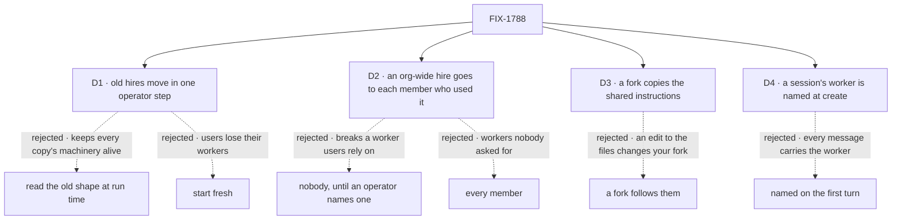

# FIX-1788 · Decisions

[Spec](SPEC.md) · **Decisions** · [Rules](BUSINESS-RULES.md) · [Plan](PLAN.md) · [Docs](DOCS.md) · [Evolution](EVOLUTION.md)

What the model already decided is the epic's ([ER-1](../../epics/FIX-1786/BUSINESS-RULES.md#what-a-team-gets-and-what-it-doesnt),
[D3](../../epics/FIX-1786/DECISIONS.md#d3)) and is not reopened here. These are the calls this
issue makes about the users already using hired workers, about forks, and about where a session
learns its worker.

## The tree

Solid edges are what was chosen. D1 and D2 are signed, D3 is decided, and D4 is this amendment's
ask.

## D1 · Old hires, their memory and their conversations move to the new shape in one operator step

| | |
|---|---|
| **Instead of** | Reading the old rows, cells and sessions at run time beside the new path · or starting fresh |
| **Because** | A hire's memory sits in its own copy's private cell, and its conversations are recorded against its own copy's address. The shared copy can reach neither unless the per-copy machinery stays alive, and that machinery is what [FIX-1798](https://linear.app/fixpoint-labs/issue/FIX-1798) removes. The same upgrade already has an operator step ([FIX-1790](https://linear.app/fixpoint-labs/issue/FIX-1790)), and [FIX-1538 D2](../FIX-1538/DECISIONS.md#d2) moved pinned cells the same way |
| **Locks in** | Between the deploy and the step, a user's old hires don't run, and the boot says how many wait for it. Every deployment with hires runs one documented step, beside FIX-1790's. Nothing is deleted, and running the step twice changes nothing |

It comes down to the old copies: reading them at run time keeps them alive forever.

**What would change my mind:** a hosted deployment with no operator to run a step. Then the move
runs on a user's first load instead, with the old machinery kept until every user has loaded.

**Signed** by Jake, 2026-10-06.

## D2 · A worker hired for the whole org goes, as a private copy, to each member who talked to it

| | |
|---|---|
| **Instead of** | Nobody's, until an operator names an owner · or a copy for every member of the org |
| **Because** | An org-wide hire is the hole this epic closes, so it can't stay shared. Each member who talked to it already has conversations and memory with it that only they can read. A private copy each keeps exactly what each user had and gives nobody anything new. Nobody's breaks a worker a team uses daily; every member's adds workers users never asked for |
| **Locks in** | One worker becomes several independent ones: a change one member makes reaches no other. What the worker remembered for the whole org is copied into each, and every one of them could already read it. A copy whose id the member already uses takes a derived id, reported. The old row stays, reported, so it can become a library template once [FIX-1795](https://linear.app/fixpoint-labs/issue/FIX-1795) ships |

It comes down to what each user already had: nobody loses a worker, nobody gains one.

**What would change my mind:** teams that rely on one org-wide worker's memory changing for
everyone at once. Then the right home is the library or a shared resource, and the step should
hold the hire for the operator instead. Or: no deployment uses an org-wide hire today beyond the
chief-of-staff worker. Then nobody's costs no one a worker, and the step only reports them.

**Signed** by Jake, 2026-10-06.

## D3 · A fork copies a standard worker's shared instructions; it doesn't follow them

Formerly Q1. Decided by Jake on 2026-10-06 ("I agree with the recommendations").

| | |
|---|---|
| **Instead of** | Following them: a fork picks up the installation's later edits, with its owner's changes kept on top |
| **Because** | Standard workers in model variants (a Codex, a Claude and a Cursor researcher) share core instructions, per the 2026-10-04 lock. A copy is what a library copy does (ER-10): nothing changes under its owner. One rule for every copy a user holds, fork or library. A fork is the user saying they want something different |
| **Locks in** | Alice forks the researcher to change its model. Next month the installation improves the researcher's instructions; her fork keeps last month's text until she forks again. Following later edits may come later as an opt-in on a fork. Taking it away later would change running workers, so it doesn't ship first |

What lost: follow keeps forks current, at the cost of a layered configuration (the file, then the
user's changes, merged on every turn), and an edit to the files would change what runs with every
forker's access.

It comes down to the library's rule: nothing changes under its owner, so forks go stale.

**What would change my mind:** users who fork mostly to change one setting, while the core
instructions change every week. Then forks stale at once, and the opt-in earns its layering.

## D4 · A session's worker is named once, when the session is created

Jake, on #2812's review (SPEC.md, the app example): the worker belongs to the session, not to a
message. The epic records this as D3 change 3's session-record form (#2813).

| | |
|---|---|
| **Instead of** | The worker flow linking the session on its first turn, from a `worker` field in that turn's input (this spec as merged in #2812) |
| **Because** | A session can't change its worker, so a message is the wrong place to name one. First-turn linking was an implementation convenience (create ran no flow code), and it leaked into every app call. At create, the server checks the worker once and nothing after it can touch the link |
| **Locks in** | The engine runs a flow-declared check on every path that writes a new session (S1), and Workforce declares it for every worker flow. No session on a worker flow exists without a worker. The client gains `worker` on `createSession` and on `listSessions`, and Workforce gains `findWorkerSession` and `ensureWorkerSession` |

It comes down to what carries the worker: on the first turn, every message shape carries it.

**What would change my mind:** an app that must open a session before it knows which worker will
run it, such as a triage chat that hands off later. That is a new session per worker today, and
would stay one.

## Decided, not asked

- **Where create runs the check.** The engine calls the flow's declared create check before the
  session record is written. Every path that writes a new record calls it: the create route, the
  record an action writes for a session id that doesn't exist yet, and a transport's session
  resolver. With no worker named, a worker flow refuses: a session without a worker is refused at
  the door. The check reads the worker at the principal's own scope, else the standard
  projection, and requires that it names this flow. Then the engine stores `workerId` on the
  record, outside `state`. No route writes that field after create; only the upgrade step sets it
  on a session made before it. Every path names the worker at create: a user's app, a task, a
  mailbox post. Actions never carry `worker`.
- **One mechanism holds the fixed link and what changes later.** S1 declares server data in two
  parts: the create field above, fixed for the session's life, and server-written session-state
  fields that the create refuses from a caller and only flow code writes. A coordinator's delegates
  change after create, so they live in the second; [FIX-1791](https://linear.app/fixpoint-labs/issue/FIX-1791)
  consumes them.
- **The app-facing API is today's client plus two helpers** (Jake, #2812). Roster rows carry
  `flow`; `createSessionClient().listSessions` takes a `worker` filter and `createSession` a
  `worker` option; `createClient({ flowKind }).sendAction(action, input, { sessionId })` is
  unchanged. `findWorkerSession(criteria)` and `ensureWorkerSession(criteria)` are Workforce
  exports over one lookup path and one criteria object. FIX-1788 ships `worker`;
  [FIX-1794](https://linear.app/fixpoint-labs/issue/FIX-1794) and
  [FIX-1793](https://linear.app/fixpoint-labs/issue/FIX-1793) add keys later. The engine knows no
  worker: the client maps both options onto the generic create field and list filter.
- **Racing `ensureWorkerSession` calls make one session.** When none is found, it creates at an id
  derived from the caller's user, org and criteria. The create's insert-if-absent write already
  answers the loser with 409 (on SQLite and Postgres, and within one filesystem store instance, as
documented); the loser reads that id and returns the winner's session. The create
  check refuses a derived id that isn't the caller's, so nobody takes another user's id first.
- **When a worker changes under its sessions.** Edited to name a different flow: the link holds,
  and the per-turn load refuses the turn because the worker no longer names this session's flow.
  Forked: the fork is a new worker, and old sessions stay with the original. Fired, or its flow
  removed: BR-19 and BR-19a.
- **A worker's configuration is read on every turn**, from its row or its file, with names
  resolved against what the installation registers ([ER-2](../../epics/FIX-1786/BUSINESS-RULES.md#what-a-team-gets-and-what-it-doesnt)).
  A non-standard one is checked when it is saved and again when it loads.
- **A worker's private state is keyed by the worker** on every worker flow, the skills drawer
  first. The skills library takes its key per run, a Layer 2 change; if a capability can't, it
  goes back to the epic (ER-22).
- **A worker's document and reference grants hold on every turn**, over what its model can
  reach: tools and context. The flow's own code is the app's and is not narrowed per worker.
- **Ids.** A worker's id is unique on its owner's roster and can't be a standard worker's id. A
  fork gets a new one.
- **The upgrade step ships as code the operator runs**, not a SQL procedure like FIX-1538's: it
  relinks sessions and copies rows per member, which a hand procedure gets wrong. FIX-1538's own
  *what would change my mind* named this.
- **Fork and the library's copy share one write path.** FIX-1788 owns it; FIX-1795 calls it
  for a template (the epic's coordination seams). No library work is pulled in here.
- **A fire deletes the row.** Sessions linked to it stay readable and refuse new turns.
- **A standard worker has no write path.** It is a read-only collection projected from the files.
- **Every deprecation marker** on collection cardinality and owner pins names FIX-1798.
- **The org-wide worker inventory stops listing hired workers**, which it showed to every member.
- **Four PRs, a stack:** server-owned session data; the worker model beside today's; the
  upgrade step; then the switch, every flow at once. Nothing existing changes shape before the
  step is on `main`, so no single PR strands a hire ([PLAN.md](PLAN.md#sequence--the-pr-plan)).
- **No worker-flow declaration shape is named here.** The epic's [Q1](../../epics/FIX-1786/DECISIONS.md#q1)
  chose the list at FIX-1789's gate; the hire's option is `workerFlows` (FIX-1789).

## Considered and dropped

| Alternative | Why not |
|---|---|
| Keep a copy per worker and narrow the pins | Keeps registration per process: a hire or fire waits for a restart elsewhere, and FIX-1798 can never remove pins |
| The link in plain session state, checked on read | A caller seeds a link to their own other worker through the session create ([epic POC](../../epics/FIX-1786/poc/singleton-worker-link/README.md), O1) |
| The link in a row only flow code writes, keyed by session id | Outlives a deleted session: a new session at the same id inherits it (POC, R1) |
| The link set by flow code on the first turn | Puts the worker in a message ([D4](#d4)) |
| A `getWorkerSession` helper returning a session-bound handle | Today's client already creates, lists and sends; two lookup helpers are all an app needs (Jake, #2812) |
| A worker noun in the engine | No consumer outside Workforce (epic [D3](../../epics/FIX-1786/DECISIONS.md#d3)); the client's `worker` maps onto a generic field |

## Settled

- **Which flows a worker names, and where each is defined:** 23 flows over 94 `WORKER.md`
  files, every file classified, the control failing. [`poc/flow-inventory/`](poc/flow-inventory/README.md).

## How it got here

- **Draft** — framed as the epic's privacy spine: workers as user-scoped rows, one copy per flow,
  a server-owned link set once on the first turn; old hires carried by one operator step, an
  org-wide hire copied to the members who used it; four PRs, engine first.
- **Merged** in #2812 before round two was folded; this amendment carries it.
- **Round two, amendment 1** — D1 and D2 signed; Q1 decided as copy, now D3. The worker moved from
  the first turn to session create (D4), on the review of the app example, with the whole app path
  on today's client plus `findWorkerSession` and `ensureWorkerSession`. The same mechanism holds a
  coordinator's delegates. A worker's later edit, fork or fire is ruled for its sessions.

**Open:** none.
