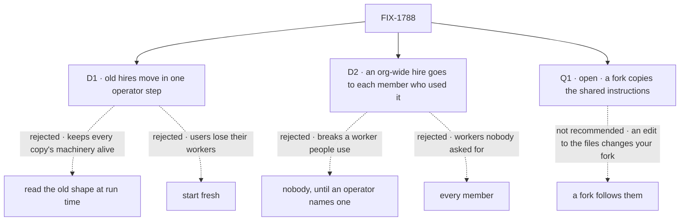

# FIX-1788 · Decisions

[Spec](SPEC.md) · **Decisions** · [Rules](BUSINESS-RULES.md) · [Plan](PLAN.md) · [Docs](DOCS.md) · [Evolution](EVOLUTION.md)

What the model already decided is the epic's ([ER-1](../../epics/FIX-1786/BUSINESS-RULES.md#what-a-team-gets-and-what-it-doesnt),
[D3](../../epics/FIX-1786/DECISIONS.md#d3)) and is not reopened here. These are the calls this
issue makes about the people already using hired workers, and one it asks.

## The tree

Solid edges are what you're signing. Q1 is the one open ask.

## D1 · Old hires, their memory and their conversations move to the new shape in one operator step

| | |
|---|---|
| **Instead of** | Reading the old rows, cells and sessions at run time beside the new path · or starting fresh |
| **Because** | A hire's memory sits in its own copy's private cell, and its conversations are recorded against its own copy's address. The shared copy can reach neither unless the per-copy machinery stays alive, and that machinery is what [FIX-1798](https://linear.app/fixpoint-labs/issue/FIX-1798) removes. The same upgrade already has an operator step ([FIX-1790](https://linear.app/fixpoint-labs/issue/FIX-1790)), and [FIX-1538 D2](../FIX-1538/DECISIONS.md#d2) moved pinned cells the same way |
| **Locks in** | Between the deploy and the step, a user's old hires don't run, and the boot says how many wait for it. Every deployment with hires runs one documented step, beside FIX-1790's. Nothing is deleted, and running the step twice changes nothing |

It comes down to the old copies: reading them at run time keeps them alive forever.

**What would change my mind:** a hosted deployment with no operator to run a step. Then the move
runs on a user's first load instead, with the old machinery kept until every user has loaded.

## D2 · A worker hired for the whole org goes, as a private copy, to each member who talked to it

| | |
|---|---|
| **Instead of** | Nobody's, until an operator names an owner · or a copy for every member of the org |
| **Because** | An org-wide hire is the hole this epic closes, so it can't stay shared. Each member who talked to it already has conversations and memory with it that only they can read. A private copy each keeps exactly what each person had and gives nobody anything new. Nobody's breaks a worker a team uses daily; every member's adds workers people never asked for |
| **Locks in** | One worker becomes several independent ones: a change one member makes reaches no other. What the worker remembered for the whole org is copied into each, and every one of them could already read it. The old row stays, reported, so it can become a library template once [FIX-1795](https://linear.app/fixpoint-labs/issue/FIX-1795) ships |

It comes down to what each person already had: nobody loses a worker, nobody gains one.

**What would change my mind:** teams that rely on one org-wide worker's memory changing for
everyone at once. Then the right home is the library or a shared resource, and the step should
hold the hire for the operator instead.

## Decided, not asked

- **The link lives in server-owned session state** (the epic's D3, change 3), set by the worker
  flow on a session's first turn after one check: the worker is the session user's own or a
  standard one, it names this flow, and the session has no link yet. Every path that opens a
  session passes that check: a person's turn, a task, a mailbox post. It never changes.
- **The link is set on the first turn, not at create.** Create runs no flow code; the epic's D3
  names admission only if flow code can't do it. The door refuses a turn with no link.
- **A worker's configuration is read on every turn**, from its row or its file, with names
  resolved against what the installation registers ([ER-2](../../epics/FIX-1786/BUSINESS-RULES.md#what-a-team-gets-and-what-it-doesnt)).
  A non-standard one is checked when it is saved and again when it loads.
- **A worker's private state is keyed by the worker** on every worker flow, the skills drawer
  first. The skills library takes its key per run, a Layer 2 change; if a capability can't, it
  goes back to the epic (ER-22).
- **A worker's document and reference grants hold on every turn**, over what its model can
  reach: tools and context. The flow's own code is the app's and is not narrowed per worker.
- **Ids.** A worker's id is unique on its owner's roster and can't be a standard worker's id. A
  fork gets a new one.
- **The upgrade step ships as code the operator runs**, not a SQL procedure like FIX-1538's: it
  relinks sessions and copies rows per member, which a hand procedure gets wrong. FIX-1538's own
  *what would change my mind* named this.
- **Fork and the library's copy share one write path.** FIX-1788 owns it; FIX-1795 calls it
  for a template (the epic's coordination seams). No library work is pulled in here.
- **A fire deletes the row.** Sessions linked to it stay readable and refuse new turns.
- **A standard worker has no write path.** It is a read-only collection projected from the files.
- **Every deprecation marker** on collection cardinality and owner pins names FIX-1798.
- **The org-wide seat inventory stops listing hired workers**, which it showed to every member.
- **Four PRs, a stack:** server-owned session state; the worker model beside today's; the
  upgrade step; then the switch, every flow at once. Nothing existing changes shape before the
  step is on `main`, so no single PR strands a hire ([PLAN.md](PLAN.md#sequence--the-pr-plan)).
- **No worker-flow declaration shape is named.** The epic's [Q1](../../epics/FIX-1786/DECISIONS.md#q1)
  is chosen at FIX-1789's gate. The `agent` flow change takes either.

## Considered and dropped

| Alternative | Why not |
|---|---|
| Keep a copy per worker and narrow the pins | Keeps registration per process: a hire or fire waits for a restart elsewhere, and FIX-1798 can never remove pins |
| The link in plain session state, checked on read | A caller seeds a link to their own other worker through the session create ([epic POC](../../epics/FIX-1786/poc/singleton-worker-link/README.md), O1) |
| The link in a row only flow code writes, keyed by session id | Outlives a deleted session: a new session at the same id inherits it (POC, R1) |
| A worker noun in the engine | No consumer outside Workforce (epic [D3](../../epics/FIX-1786/DECISIONS.md#d3)) |

## Q1 · open · When a user forks a standard worker, does the fork copy its shared instructions, or keep following them?

**The fork.** Standard workers in model variants (a Codex, a Claude and a Cursor researcher)
share core instructions, per the 2026-10-04 lock. A fork can **copy** them, so it never changes
unless its owner edits it, or **follow** them, so it picks up the installation's later edits.

**In plain terms.** Alice forks the researcher to change its model. Next month the installation
improves the researcher's instructions. Under copy, Alice's fork keeps last month's text until
she forks again. Under follow, it gets the new text, with her model change kept.

**The trade-off.** Copy is what a library copy does (ER-10): nothing changes under its owner.
Its cost is forks that go stale. Follow keeps forks current, at the cost of a layered
configuration: the file, then the user's changes on top, merged on every turn. An edit to the
files then changes what runs with every forker's access.

**My recommendation: copy.** One rule for every copy a user holds, fork or library. A fork is
the user saying they want something different. Follow can be added later as an option on a
fork; taking it away later would change running workers.

**What would change my mind:** users who fork mostly to change one setting, while the core
instructions change every week. Then forks stale at once, and follow earns its layering.

**If wrong:** forks drift until users re-fork, which costs their edits. Small to reverse:
follow is additive.

It comes down to the library's rule: nothing changes under its owner, so forks go stale.

## Settled

- **Which flows a worker names, and where each is defined:** 23 flows over 94 `WORKER.md`
  files, every file classified, the control failing. [`poc/flow-inventory/`](poc/flow-inventory/README.md).

## How it got here

- **Draft** — framed as the epic's privacy spine: workers as user-scoped rows, one copy per flow,
  a server-owned link set once on the first turn; old hires carried by one operator step, an
  org-wide hire copied to the members who used it; four PRs, engine first.

**Open:** Q1.
