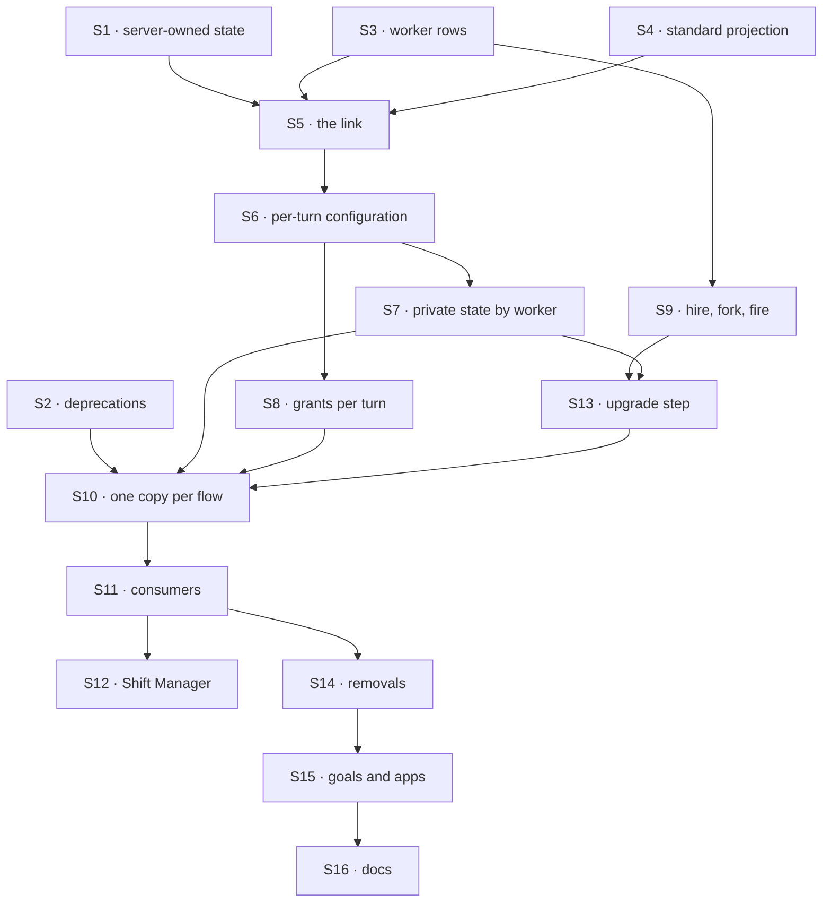

# FIX-1788 · Plan

[Spec](SPEC.md) · [Decisions](DECISIONS.md) · [Rules](BUSINESS-RULES.md) · **Plan** · [Docs](DOCS.md) · [Evolution](EVOLUTION.md)

Written for the implementing agent. IDs cross-reference [BUSINESS-RULES.md](BUSINESS-RULES.md)
(BR-n) and [DECISIONS.md](DECISIONS.md). `tdd`. Four PRs, a GitHub stack (epic ER-26). Builds
start only after FIX-1789 and FIX-1790 merge and FIX-1787's merge-first rows land (epic D4, ER-23).

## Surfaces

| ID | Package · role | Change | Rules |
|---|---|---|---|
| S1 | `engine` + `core` · session state declaration, the session create route | A flow can declare session-state fields server-owned. The create route refuses caller state for them with 400, naming the field; only flow code writes them. Unset means today. FIX-1791 keeps delegates here too | BR-15 BR-16 |
| S2 | `core` + `engine` · collection cardinality, `register(flow, { pin })` | Deprecation markers (JSDoc and one boot note per process), each naming FIX-1798. Behaviour unchanged | BR-27 |
| S3 | `workforce` · the worker collection | User scope (per org, FIX-1790), one row per worker: `flow`, `description`, the configuration as names (ER-2), flow-owned settings. Checked by the flow's schema and FIX-1789's standard-only flag when saved; old shapes read (BP-030) | BR-1 BR-4–6a BR-21 |
| S4 | `workforce` · standard workers | A read-only collection projected from the loaded files, the same for every user; no write path | BR-3 BR-9 |
| S5 | `workforce` · the link, one module | The check (the session user's own worker or a standard one · names this flow · no link yet) and the server-owned write, atomic per session: two racing first turns link one worker. The door's per-session concurrency or a versioned write, your pick; no Layer 1 change. The door, the task entry and the mailbox wake all call it | BR-10–14 BR-13a BR-18 BR-19 BR-19a |
| S6 | `workforce` · per-turn configuration | Load the linked worker each turn; resolve tool, skill, package, capability and worker-folder names against what the installation registers; refuse a turn whose names don't resolve, or whose flow is now standard-only. Every read of a worker setting moves off `ctx.flow.config` to it | BR-20–22a |
| S7 | `orchestration` + `workforce` · private state by worker | The skills library takes its key per run; every flow-isolated resource on a worker flow is keyed by the worker. The `agent` drawer first | BR-23 BR-25 |
| S8 | `workforce` · grants per turn | A worker's document grants and reference wall narrow what its model reaches on each turn: tools and context. Replaces the per-copy narrowed resource map | BR-24 |
| S9 | `workforce` · hire, fork, fire | Writes to S3, through the existing hire blocks and tool; fork is new beside them. Each turn names the collection it wrote | BR-1 BR-2 BR-4 BR-7 BR-8 |
| S10 | `workforce` · registration | The hire registers one copy per flow, `agent` and every flow handed to it, with no per-worker copy and no pin. The `agent` flow becomes a singleton, in whichever declaration shape the epic recorded | BR-26 |
| S11 | `workforce` · consumers | Worker lookup, task hand-off and the mailbox wake address (flow, worker) through S5. The shared-write stamp (FIX-1789 BR-20) takes its worker from the link. The org-wide seat inventory stops listing hired workers | BR-18 BR-25a |
| S12 | `shift-manager` · Roster and talk | Lists S3 and S4 for the signed-in user; sends with the worker named; reloads on BR-8 | BR-9 |
| S13 | `workforce` · the upgrade step | An operator command: owned rows to workers, per-copy cells to worker keys, sessions relinked onto the shared copy; org-wide rows per D2, memory copied to each member; a taken id gets a derived one; a report. Old rows stay | BR-28–33a |
| S14 | `workforce` · **removals** | The boot reload of hired seats, per-worker minting, `registerHiredSeat`, every owner pin Workforce sets, `brokenSeats`/`rehire` (a broken worker now refuses at load, BR-19 BR-22). The old roster collections stay defined for S13 only | — |
| S15 | goals, apps | Every goal asserting a copy per worker is rewritten to the new shape or retired with a line saying which rule replaces it; kitchen-sink and Shift Manager labs move | BR-26 |
| S16 | Docs | [DOCS.md](DOCS.md); README entries; `minor` changesets for `engine`, `core`, `workforce`, `orchestration` | — |

## Sequence · the PR plan

| PR | Delivers | Depends on |
|---|---|---|
| P1 · server-owned session state | S1 S2 | — |
| P2 · the worker model, beside today's | S3–S9, proved on a fixture worker flow registered once; every existing flow, `agent` included, still mints per worker | P1 |
| P3 · the upgrade step | S13 | P2 |
| P4 · the switch | S10 for every flow, `agent` first; S7 on `agent`'s drawer; S11, S12, S14, S15, S16, VG | P2, P3 |



Nothing existing changes shape until P4, and the step it needs is already on `main` by then,
so no deploy of any one PR strands a hire.

## Checks

| ID | Runs after | Passes when |
|---|---|---|
| V0 | before P4 | Rerun [`poc/flow-inventory/`](poc/flow-inventory/README.md) and list every flow handed to a `hireWorkforce` call (kitchen-sink, Shift Manager labs, `goals/*`). Each is in the PR as converted, or a refusal fixture that stays one |
| V1 | S1 | BR-15, BR-16; a create without the field, and a flow that declares none, behave as today; flow code writes the field |
| V2 | S2 | BR-27: markers present, existing instance and pin tests unchanged |
| V3 | S3 S4 | BR-1, BR-3–6a (BR-6 on a standard-only flow too), BR-9, BR-21 on the real engine; BR-5 with two users |
| V4 | S5 | BR-10–14 through the door; BR-13a with two first turns in flight at once; BR-18 through the task entry and the mailbox wake; BR-19, BR-19a |
| V5 | S6 | BR-20, BR-22 and BR-22a (a flag flipped after the row was saved) across two hosts on one store |
| V6 | S7 S11 | BR-23 on `agent` and on one app flow; BR-25; BR-25a, two workers on one flow stamping two ids |
| V7 | S8 | BR-24: `goals/workforce-seats/a-seat-reaches-the-documents-its-file-names/` rewritten to grade what the model reaches |
| V8 | S9 | BR-2 (fork content per Q1's answer), BR-7 across two hosts, BR-8 |
| V9 | S10 | BR-26: the registry holds one entry per flow, none per worker, no pin set by Workforce |
| V10 | S13 | BR-28–33a on a store written by today's `main` (a fixture writer committed beside the check, run at `fbecfe6f2` or later); BR-30 asserts each member's copied memory; BR-31 with an owned and an org-wide `researcher` on one member |
| VG | P4 | [The goal](SPEC.md#the-goal-and-how-well-know-its-met): `goals/workers-as-resources/keeps-each-users-workers-their-own/run.mts` PASSES, after the same run FAILED leg b under `GOAL_CONTROL=org-scoped-workers` and `GOAL_CONTROL=caller-link`, and legs a and b on today's `main` |

One check per decision: D1 and D2 by V10, Q1 by V8. The second path (BP-035): a second host
(V5, V8), stored rows from today (V10), the off state of S1 (V1), a fired or broken worker (V4).

## Pinned names · the only three

| Where | Name | Why pinned |
|---|---|---|
| The door's input | `worker` | Public; an app sends it |
| The worker collection | `workforce/workers/*`, user scope | Persisted; FIX-1791 and FIX-1795 read and write it |
| The session's link | `workerId`, server-owned session state | Persisted; S13 writes it into old sessions |

Everything else is yours to name, in the new terms (worker, worker flow; not seat or kind).

## Guardrails

| Rule | Because |
|---|---|
| Every path that opens a session for a worker goes through S5's one check | A link checked at the door alone is open at the task entry (tenet 5) |
| Access is read at the session user's own scope, never from the link or the input (ER-17, BP-031) | That is why pins aren't needed: a forged link reads nothing |
| No worker setting is read from `ctx.flow.config` (ER-2) | The shared copy holds one bag for every worker |
| The worker collection is the one worker store; standard workers project the loaded files (ER-14) | A second registry is the drift the WorkerConfig lock forbids |
| No worker read without an org; the user key is FIX-1790's (ER-13) | A user in two orgs has two rosters |
| S13 never rewrites or deletes an old row; it reports what it can't move (BP-030) | An upgrade must not lose a user's worker |
| No Layer 1 change beyond S1 (ER-22) | If S7 or S8 needs one, stop and take it to the epic |
| No `seat*` renames | FIX-1796 sweeps them with the docs |

## Docs

Reconcile and publish [DOCS.md](DOCS.md) in P4, after V4 to V10 pass, against the shipped
refusal wording and the upgrade command's real name.

## Sketch · pseudocode, illustrative, react to the shape

```
on a turn at a worker flow's door, task entry or mailbox entry:
    if the session has no link:
        name ← the turn's worker (door) or the dispatcher's (task, mailbox)
        w ← read name at the session user's scope, else the standard projection   ← the whole check
        refuse unless w, w.flow = this flow
        write link to server-owned session state                                  ← once
    else refuse if the turn names a different worker
    w ← load the linked worker; resolve its names; refuse if any don't
    run the turn with w's configuration, private state keyed by w
```

**POC:** the epic's [`singleton-worker-link`](../../epics/FIX-1786/poc/singleton-worker-link/README.md)
proved the premise and why S1 is needed (O1, R1, I1). This spec's
[`poc/flow-inventory/`](poc/flow-inventory/README.md) re-derives which flows S10 converts: 23
flows over 94 files, PASS, the control failing. No new premise needed a POC.

## At implement time

- **Read the epic's Q1 on `main`.** If a shape is recorded, the `agent` flow moves onto it. If
  not, build to ER-2 and name neither.
- FIX-1789 S6 may have moved the `agent` drawer to user scope; S7 keys it by worker on top.
- S7: if the skills library can't take a per-run key without a `core` or `engine` change, stop
  and take it to the epic. The same for S8.
- The real `agent` flow reads `ctx.flow.config` at 16 code sites on `fbecfe6f2` (`grep -n "ctx\.flow\.config" packages/workforce/src/agent-worker-flow.ts`, less one comment); S6 reaches each, and the other worker flows' reads too.
- Old-term exports left for FIX-1796: `hireWorkforce`, `HireOptions.kinds`, `seatDoorOf`,
  `SeatDoor`, `createSeatHireBlocks`, `createSeatHireCapability`, the `seat*` keys of
  `workerConfigSchema()`, `HIRED_ROSTER_*` (read by S13 only).

## Notes from review

Recorded verbatim for the implementer to weigh against real code; not folded into the design.

- **S5 + S6 as one module** (PR #2812, review comment): "Make S5 + S6 one deep module with one interface. [...] Callers (the door, the task entry, the mailbox wake, and each setting read inside a turn) should reach one narrow interface, roughly `resolveWorker(ctx) → { worker, resolved config }` plus `link(...)`. They should not touch the worker row, the name resolution, or the refusal rules. [...] add one line to S5/S6 so the implementer treats it as one module, and keep the `ctx.flow.config` migration behind it."
- **S6–S8 as one surface** (Cursor, PLAN.md): "S6–S8 are three rows for one idea (“per-worker execution slice on the shared copy”). A single surface with sub-bullets (config load · worker-keyed resources · grants) might read cleaner without changing the four-PR stack."
- **Parallel prose** (Cursor, DECISIONS.md): "This block largely restates `PLAN.md` surfaces, guardrails, and sequence. Consider keeping only what is *not* elsewhere (D1/D2 consequences, fork/library seam) and linking to Plan §Surfaces / §Sketch for the procedural contract — reduces five-way drift when link semantics change."
- **Shipped names in DOCS.md** (Cursor, DOCS.md): "Draft still uses `createSeatHireBlocks` / `roster-admin` while Plan defers `seat*` to FIX-1796 and pins only `worker`, `workforce/workers/*`, `workerId`. Worth a one-line “shipped names” box at the top of this file so P4 docs work does not re-litigate exports."
- **V0's second half** (Cursor, PLAN.md): "V0’s second clause (`hireWorkforce` enumeration) is still manual `rg` — not wrong, but unlike the `WORKER.md` totality proof. *Optional follow-up:* small census sibling under `poc/` if you want symmetric evidence before P4."
- **One owner for the check mapping** (Cursor review): "BR “Proved by” and PLAN V-ids duplicate the same mapping (pick one owner)."
- **Reuse, don't re-derive** (Cursor review): "Production implementation should reuse existing workforce/orchestration paths (`readDeclaredFlow`, `discoverWorkforceCode` per root) rather than re-deriving heuristics from the POC."

## Follow-ups

- FIX-1798 removes collection cardinality and owner pins once P4 lands.
- If a host ever needs a session linked before any flow code runs, a server-only field on the
  session record (the epic's D3, *what would change my mind*).
