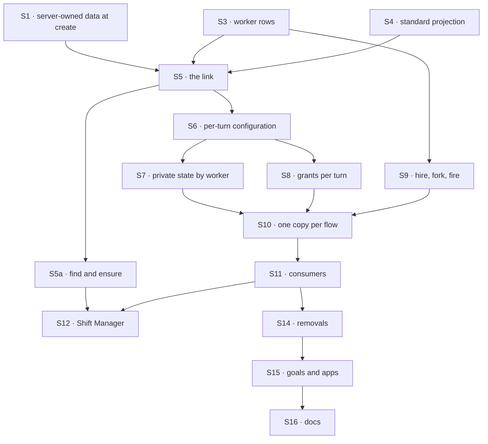

# FIX-1788 · Plan

[Spec](SPEC.md) · [Decisions](DECISIONS.md) · [Rules](BUSINESS-RULES.md) · **Plan** · [Docs](DOCS.md) · [Evolution](EVOLUTION.md)

Written for the implementing agent. IDs cross-reference [BUSINESS-RULES.md](BUSINESS-RULES.md)
(BR-n) and [DECISIONS.md](DECISIONS.md). `tdd`. Three PRs, a GitHub stack (epic ER-26). Builds
start only after FIX-1789 and FIX-1790 merge and FIX-1787's merge-first rows land (epic D4, ER-23).

## Surfaces

| ID | Package · role | Change | Rules |
|---|---|---|---|
| S1 | `engine` + `core` + `client` + `react` · server-owned session data, at create | One declaration, two parts, behind **one session-birth function**. **Birth:** it owns the stale-state purge, the flow's create check and the insert-if-absent write. `handleCreateSession`, `ensureSessionRecord` and the dispatched-child writer become thin callers, so every `SessionRecord` insert goes through it by construction. There are five paths today: the create route, an action's write for a missing session id (`createExecutionContext`), the webhook session resolver, `fsdev run` (`packages/cli/src/commands/run.ts`, through the exported `ensureSessionRecord`), and a task dispatched to another flow (`engine/src/context/create-request-host.ts`, which writes the child record before the target's task entry runs, so it carries the worker from the dispatching flow's code into the birth). Each caller keeps its choice over a lost race: the route answers 409, and the action and dispatch paths adopt the winner's record without re-checking the loser's input, as intended. **A create field:** the check gets the verified principal and the create's input. It refuses, or returns a value the engine stores under a generic key on the record, outside `state`. No route writes the field afterwards. A birth with no input is refused. The async check runs on a miss only, never on a turn of an existing session. **Server-written state:** session-state fields the birth refuses from a caller (400, naming the field) and only flow code writes. They ship here because epic D3 *Locks in* (3) has FIX-1788 build the mechanism and FIX-1791 consume it, and the refusal must exist before any app can seed those fields. FIX-1791's delegates ([#2815](https://github.com/fixpoint-labs/flow-state-dev/pull/2815)) are the consumer; BR-18a and V4 drive it until FIX-1791's goal covers it. The list route filters on the create field. `fsdev run` takes `--worker <id>` for a new session on a worker flow, and refuses a new one without it; `--seed-session` refuses server-written fields. The client's `createSession` takes `worker` and `listSessions` a `worker` filter, mapped onto that field; `useFlow` passes `worker` to both. The engine knows no worker. Undeclared means today | BR-13 BR-14 BR-15 BR-16 BR-18a |
| ~~S2~~ | `core` + `engine` · collection cardinality, `register(flow, { pin })` | Removed by [epic D9](../../epics/FIX-1786/DECISIONS.md#d9): no deprecation markers. Both stay untouched until FIX-1798 deletes them | — |
| S3 | `workforce` · the worker collection | User scope (per org, FIX-1790), one row per worker: `flow`, `description`, the configuration as names (ER-2), flow-owned settings. Checked by the flow's schema and FIX-1789's standard-only flag when saved | BR-1 BR-4–6a |
| S4 | `workforce` · standard workers | A read-only collection projected from the loaded files, the same for every user; no write path | BR-3 BR-9 |
| S5 | `workforce` · the link, one module | The create check every worker flow declares through S1: a worker is named; it is the principal's own (read at their scope) or a standard one; it names this flow; a derived worker-session id is the caller's. It returns `workerId`, the value Workforce stores in S1's generic key. The id derivation is one exported function, used by both this check and `ensureWorkerSession`, and it runs on the tenant-resolved key. The task entry and the mailbox wake open sessions through it, naming the worker from the dispatching flow's code. No turn sets or changes a link. **S5 and S6 are one module**, with one interface: `resolveWorker` returns the worker plus its resolved configuration, beside the create check. The PR stack is the same | BR-10–14 BR-13b BR-18 |
| S5a | `workforce` · `createWorkforceClient`, with `findWorkerSession` and `ensureWorkerSession` | A bound client: `createWorkforceClient({ userId, baseUrl?, apiPath?, fetcher? })`, the same transport options as `createSessionClient`, with the two helpers as its methods. React gets them from a hook over the same client. No ambient state and no new endpoint: the methods use the roster read and the session client. One lookup path over `listSessions({ …, worker })`, taking one criteria object. FIX-1788 ships `worker`; leave the object open for later keys and define none: FIX-1794's `taskId`, FIX-1793's `workstreamId`, and FIX-1791's key for the coordinator conversation a delegate's session belongs to (FIX-1791 names it), so `ensureWorkerSession({ worker, <that key> })` gives one delegate session per coordinator conversation. A coordinator's delivery opens the delegate's session through `ensureWorkerSession` with the worker named: an action on a missing id names no worker and is refused (BR-14). Both resolve the worker's current flow from the roster first. The lookup and the derived id both include that resolved flow, not just the criteria. `find` returns the caller's most recent matching session on that flow, or none. **A match is on the key set, not only on values:** a criteria key the lookup does not name matches only sessions that do not carry that key, so `{ worker }` never returns a delegate, task or workstream session, and `{ worker, <coordinator key> }` never returns a task session. Every later key inherits this rule; no consumer restates it (epic amendment #2831). `ensure` returns what `find` returns, so with several matching sessions it is the most recent, not necessarily the derived one. Only when there is none does it create, on that flow, at an id derived (S5's function) from the caller's user, org, resolved flow and criteria. So after BR-19b's edit, `ensure` finds nothing on the new flow and creates a fresh session at a new id, and the old sessions keep refusing. It creates through the create route, which owns the 409 contract: a 409 means a racing call won, so it reads that id and returns it (the store's own create guarantee: SQLite, Postgres, one filesystem store instance) | BR-13a BR-14a BR-19b |
| S6 | `workforce` · per-turn configuration | Load the linked worker each turn; resolve tool, skill, package, capability and worker-folder names against what the installation registers; refuse a turn whose worker is fired, now names another flow, has names that don't resolve, or runs on a flow now standard-only. Every read of a worker setting moves off `ctx.flow.config` to it | BR-19–22a |
| S7 | `orchestration` + `workforce` · private state by worker | The skills library takes its key per run; every flow-isolated resource on a worker flow is keyed by the worker. The `agent` drawer first | BR-23 BR-25 |
| S8 | `workforce` · grants per turn | A worker's document grants and reference wall narrow what its model reaches on each turn: tools and context. Replaces the per-copy narrowed resource map | BR-24 |
| S9 | `workforce` · hire, fork, fire | Writes to S3, through the hire blocks and tool; fork is new beside them and copies per D3. The hire blocks take `workerFlows` (FIX-1789) and, since they change here, take a worker name (the docs draft `createWorkerHireBlocks`; not pinned). Each turn names the collection it wrote | BR-1 BR-2 BR-4 BR-7 BR-8 BR-19c |
| S10 | `workforce` · registration | The hire registers one copy per flow, `agent` and every flow handed to it, with no per-worker copy and no pin. The `agent` flow becomes a singleton and registers on the installation's `workerFlows` list (epic Q1) | BR-26 |
| S11 | `workforce` · consumers | Worker lookup, task hand-off and the mailbox wake open sessions naming (flow, worker) at create, through S5. The shared-write stamp's `writtenBy.workerId` (FIX-1789 BR-20) comes from the link. The org-wide worker inventory stops listing hired workers | BR-18 BR-25a |
| S12 | `shift-manager` · Roster and talk | Lists S3 and S4 for the signed-in user, each with its `flow`; opens sessions with `ensureWorkerSession`; reloads on BR-8 | BR-9 |
| ~~S13~~ | `workforce` · the upgrade step | Removed by [epic D9](../../epics/FIX-1786/DECISIONS.md#d9): no operator command. Old hires, their cells and their sessions are dropped | — |
| S14 | `workforce` · **removals** | The boot reload of hired workers, per-worker minting, `registerHiredSeat`, every owner pin Workforce sets, `brokenSeats`/`rehire` (a broken worker now refuses at load, BR-19 BR-22), and the old roster collections: nothing reads their rows ([epic D9](../../epics/FIX-1786/DECISIONS.md#d9)) | — |
| S15 | goals, apps | Every goal asserting a copy per worker is rewritten to the new shape or retired with a line saying which rule replaces it; kitchen-sink and Shift Manager labs move | BR-26 |
| S16 | Docs | [DOCS.md](DOCS.md); README entries; `minor` changesets for `engine`, `core`, `client`, `react`, `workforce`, `orchestration` | — |

## Sequence · the PR plan

| PR | Delivers | Depends on |
|---|---|---|
| P1 · server-owned session data, at create | S1 | — |
| P2 · the worker model, beside today's | S3–S9 with S5a, proved on a fixture worker flow registered once; every existing flow, `agent` included, still mints per worker | P1 |
| ~~P3~~ | Removed by [epic D9](../../epics/FIX-1786/DECISIONS.md#d9), with S13 | — |
| P4 · the switch | S10 for every flow, `agent` first; S7 on `agent`'s drawer; S11, S12, S14, S15, S16, VG | P2 |



Nothing existing changes shape until P4. P4 drops the hires made before it: nothing reads them
([epic D9](../../epics/FIX-1786/DECISIONS.md#d9)).

## Checks

| ID | Runs after | Passes when |
|---|---|---|
| V0 | before P4 | Rerun [`poc/flow-inventory/`](poc/flow-inventory/README.md) and list every flow handed to a `hireWorkforce` call (kitchen-sink, Shift Manager labs, `goals/*`). Each is in the PR as converted, or a refusal fixture that stays one |
| V1 | S1 | BR-15, BR-16; the create check runs, through the one birth function, on the create route, an action's write for a missing session id, the webhook resolver, `fsdev run` (with `--worker`, and refused without it on a worker flow) and a task dispatched to a worker flow (the child is born linked to the named worker), and each refuses with no input; a grep for `session.set(…, "absent")` on session records finds no writer outside the birth function; a turn on an existing session makes no check call; a lost race answers 409 on the route and adopts on the action path; no route (state patch, metadata patch, action) writes the create field after create; flow code writes server-written state; the list filters on the create field; a flow that declares none behaves as today |
| ~~V2~~ | ~~S2~~ | Removed by [epic D9](../../epics/FIX-1786/DECISIONS.md#d9), with S2 |
| V3 | S3 S4 | BR-1, BR-3–6a (BR-6 on a standard-only flow too), BR-9 on the real engine; BR-5 with two users |
| V4 | S5 S5a | BR-10–14a through `createSession` and the helpers; BR-13a with two `ensureWorkerSession` calls in flight at once; BR-13b with Bob creating at Alice's derived id first; BR-16 through the helper: delete the derived session, `ensureWorkerSession` again, and the new session's link is set fresh by its own create, nothing inherited; BR-19b through the helper: edit the worker to another flow, `ensureWorkerSession` returns a new session on the new flow at a new id, and the old session still refuses; BR-18 through the task entry, a task dispatched to a worker flow (the child is born linked) and the mailbox wake; BR-18a on a fixture coordinator flow; BR-14a's key-set match: with a more recent session of that worker carrying an extra fixture criteria key, `ensureWorkerSession({ worker })` (S12's plain talk) still returns the plain session, and with a more recent session carrying two fixture keys, a lookup naming only one of them returns the session carrying exactly that one (the strict-subset case: a coordinator's `{ worker, filingSessionId }` never lands in a task session; *amended after merge*, #2839) |
| V5 | S6 | BR-19–19b; BR-20, BR-22 and BR-22a (a flag flipped after the row was saved) across two hosts on one store |
| V6 | S7 S11 | BR-23 on `agent` and on one app flow; BR-25; BR-25a, two workers on one flow stamping two ids |
| V7 | S8 | BR-24: `goals/workforce-seats/a-seat-reaches-the-documents-its-file-names/` rewritten to grade what the model reaches |
| V8 | S9 | BR-2 (a fork keeps its copy after the file changes, D3), BR-7 across two hosts, BR-8, BR-19c |
| V9 | S10 | BR-26: the registry holds one entry per flow, none per worker, no pin set by Workforce |
| ~~V10~~ | ~~S13~~ | Removed by [epic D9](../../epics/FIX-1786/DECISIONS.md#d9), with S13 |
| VG | P4 | [The goal](SPEC.md#the-goal-and-how-well-know-its-met): `goals/workers-as-resources/keeps-each-users-workers-their-own/run.mts` PASSES, after the same run FAILED leg b under `GOAL_CONTROL=org-scoped-workers` and `GOAL_CONTROL=caller-link`, and legs a and b on today's `main` |

One check per decision: D3 by V8, D4 by V1 and V4. The second path (BP-035): a second host (V5,
V8), the off state of S1 (V1), racing creates (V4), a fired, moved or broken worker (V5).

## Pinned names

| Where | Name | Why pinned |
|---|---|---|
| Session create | `worker`, an option on `createSessionClient().createSession` | Public; an app sends it |
| Session list | `worker`, a filter on `createSessionClient().listSessions` | Public |
| The roster read | each worker's `flow` | Public; an app creates the session on it |
| Workforce | `createWorkforceClient(options)` and its methods `findWorkerSession(criteria)`, `ensureWorkerSession(criteria)` | Public; FIX-1794, FIX-1793 and FIX-1791 add criteria keys, each pinned by its own issue |
| The worker collection | `workforce/workers/*`, user scope | Persisted; FIX-1791 and FIX-1795 read and write it |
| The session's link | `workerId`, the value Workforce stores in the record's generic server-only create field (the engine's key is yours to name) | Persisted; FIX-1789's `writtenBy.workerId` reads it |

Everything else is yours to name, in the new terms (worker, worker flow, user; not seat, kind or
person). The engine container for the create field and the create check's name are yours.

## Guardrails

| Rule | Because |
|---|---|
| Every `SessionRecord` insert goes through S1's one birth function, which runs S5's check; V1's grep finds no other `"absent"` writer | A check wired per call site is open at the next path someone adds, as `fsdev run` and the dispatched-child writer already are (tenet 5) |
| No action input names a worker; no route but create writes the link | The worker belongs to the session ([D4](DECISIONS.md#d4)) |
| Access is read at the principal's own scope, never from the link or the input (ER-17, BP-031) | That is why pins aren't needed: a forged link reads nothing |
| No worker setting is read from `ctx.flow.config` (ER-2) | The shared copy holds one bag for every worker |
| The worker collection is the one worker store; standard workers project the loaded files (ER-14) | A second registry is the drift the WorkerConfig lock forbids |
| No worker read without an org; the user key is FIX-1790's (ER-13) | A user in two orgs has two rosters |
| No Layer 1 change beyond S1 (ER-22) | If S7 or S8 needs one, stop and take it to the epic |
| Rename only the hire blocks this issue changes; FIX-1789 renames `kinds` to `workerFlows` | FIX-1796 sweeps the other `seat*` names with the docs |

## Docs

Reconcile and publish [DOCS.md](DOCS.md) in P4, after V4 to V9 pass, against the shipped
refusal wording.

## Sketch · pseudocode, illustrative, react to the shape

```
birth(record, input), the one function every new record goes through; misses only:
    name ← the create's worker (createSession / ensureWorkerSession / fsdev run --worker) or the dispatcher's (task, dispatched child, mailbox)
    refuse if no name                                                            ← no session without a worker
    w ← read name at the principal's scope, else the standard projection          ← the whole check
    refuse unless w, w.flow = this flow
    refuse if the id is a derived worker-session id that isn't this caller's
    purge stale state; write the record insert-if-absent, workerId under the generic key   ← once
    on a lost race: the route answers 409, the action path adopts the winner

workforce.ensureWorkerSession(criteria):          ← workforce = createWorkforceClient({ userId, baseUrl })
    flow ← the worker's flow, from the roster read
    s ← findWorkerSession(criteria) on flow; return s if found              ← the most recent match
    create via the route at derive(user, org, flow, criteria); on 409 return the session at that id

on every turn:
    refuse if the input carries worker
    w ← load the linked worker; refuse if fired, if w.flow ≠ this flow, or if its names don't resolve
    run the turn with w's configuration, private state keyed by w
```

**POC:** the epic's [`singleton-worker-link`](../../epics/FIX-1786/poc/singleton-worker-link/README.md)
proved the premise and why S1 is needed (O1, R1, I1). This spec's
[`poc/flow-inventory/`](poc/flow-inventory/README.md) re-derives which flows S10 converts: 23
flows over 94 files, PASS, the control failing. No new premise needed a POC.

## At implement time

- **The epic's Q1 is the list** (FIX-1789's gate). The `agent` flow is one entry of the
  installation's `workerFlows`.
- S1's birth function absorbs what `handleCreateSession` (`engine/src/routes/session-routes.ts`)
  and `ensureSessionRecord` (`engine/src/context/ensure-session-record.ts`, exported) each do
  today: `purgeStaleResourceState`, then the insert-if-absent write. Today's `build` callback is
  synchronous and runs on a miss only; the async check sits on that same miss path.
- FIX-1789 S6 may have moved the `agent` drawer to user scope; S7 keys it by worker on top.
- S7: if the skills library can't take a per-run key without a `core` or `engine` change, stop
  and take it to the epic. The same for S8.
- The real `agent` flow reads `ctx.flow.config` at 16 code sites on `fbecfe6f2` (`grep -n "ctx\.flow\.config" packages/workforce/src/agent-worker-flow.ts`, less one comment); S6 reaches each, and the other worker flows' reads too.
- Old-term exports left for FIX-1796: `hireWorkforce`, `seatDoorOf`, `SeatDoor`,
  `createSeatHireCapability`, the `seat*` keys of `workerConfigSchema()`. `HIRED_ROSTER_*` goes
  with the old roster collections in S14. `HireOptions.kinds` is already `workerFlows` (FIX-1789); the hire blocks are
  renamed here (S9).

## Notes from review

Recorded verbatim for the implementer to weigh against real code; not folded into the design.

- **S5 + S6 as one module** (PR #2812, review comment): "Make S5 + S6 one deep module with one interface. [...] Callers (the door, the task entry, the mailbox wake, and each setting read inside a turn) should reach one narrow interface, roughly `resolveWorker(ctx) → { worker, resolved config }` plus `link(...)`. They should not touch the worker row, the name resolution, or the refusal rules. [...] add one line to S5/S6 so the implementer treats it as one module, and keep the `ctx.flow.config` migration behind it."
- **S6–S8 as one surface** (Cursor, PLAN.md): "S6–S8 are three rows for one idea (“per-worker execution slice on the shared copy”). A single surface with sub-bullets (config load · worker-keyed resources · grants) might read cleaner without changing the four-PR stack."
- **Parallel prose** (Cursor, DECISIONS.md): "This block largely restates `PLAN.md` surfaces, guardrails, and sequence. Consider keeping only what is *not* elsewhere (D1/D2 consequences, fork/library seam) and linking to Plan §Surfaces / §Sketch for the procedural contract — reduces five-way drift when link semantics change."
- **Shipped names in DOCS.md** (Cursor, DOCS.md): "Draft still uses `createSeatHireBlocks` / `roster-admin` while Plan defers `seat*` to FIX-1796 and pins only `worker`, `workforce/workers/*`, `workerId`. Worth a one-line “shipped names” box at the top of this file so P4 docs work does not re-litigate exports."
- **V0's second half** (Cursor, PLAN.md): "V0’s second clause (`hireWorkforce` enumeration) is still manual `rg` — not wrong, but unlike the `WORKER.md` totality proof. *Optional follow-up:* small census sibling under `poc/` if you want symmetric evidence before P4."
- **One owner for the check mapping** (Cursor review): "BR “Proved by” and PLAN V-ids duplicate the same mapping (pick one owner)."
- **Reuse, don't re-derive** (Cursor review): "Production implementation should reuse existing workforce/orchestration paths (`readDeclaredFlow`, `discoverWorkforceCode` per root) rather than re-deriving heuristics from the POC."

## Follow-ups

- FIX-1798 removes collection cardinality and owner pins once P4 lands.
- FIX-1794 adds `taskId`, FIX-1793 adds `workstreamId`, and FIX-1791 adds and names its
  filing session's key (`filingSessionId`, amended by #2839) to the helpers' criteria (S5a).
- FIX-1791 writes a coordinator's delegates into S1's server-written state (BR-18a).
