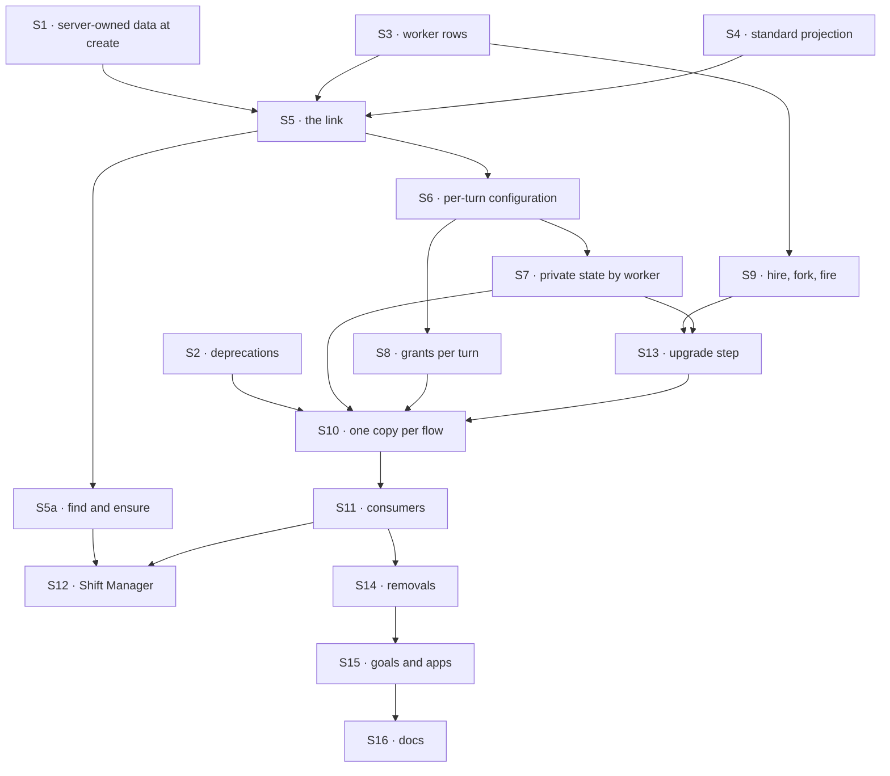

# FIX-1788 · Plan

[Spec](SPEC.md) · [Decisions](DECISIONS.md) · [Rules](BUSINESS-RULES.md) · **Plan** · [Docs](DOCS.md) · [Evolution](EVOLUTION.md)

Written for the implementing agent. IDs cross-reference [BUSINESS-RULES.md](BUSINESS-RULES.md)
(BR-n) and [DECISIONS.md](DECISIONS.md). `tdd`. Four PRs, a GitHub stack (epic ER-26). Builds
start only after FIX-1789 and FIX-1790 merge and FIX-1787's merge-first rows land (epic D4, ER-23).

## Surfaces

| ID | Package · role | Change | Rules |
|---|---|---|---|
| S1 | `engine` + `core` + `client` + `react` · server-owned session data, at create | One declaration, two parts. **A create field:** the flow declares a create check; every path that writes a new session record for it (the create route, the record an action writes for a missing session id, a transport's session resolver) calls it with the verified principal and the create's input before the insert-if-absent write. It refuses, or returns a value the engine stores on the record outside `state`; no route writes it afterwards. A path with no input is refused. **Server-written state:** session-state fields the create refuses from a caller (400, naming the field) and only flow code writes; FIX-1791's delegates live here. The list route filters on the create field. The client's `createSession` takes `worker` and `listSessions` a `worker` filter, mapped onto that field; `useFlow` passes `worker` to both. The engine knows no worker. Undeclared means today | BR-13 BR-14 BR-15 BR-16 BR-18a |
| S2 | `core` + `engine` · collection cardinality, `register(flow, { pin })` | Deprecation markers (JSDoc and one boot note per process), each naming FIX-1798. Behaviour unchanged | BR-27 |
| S3 | `workforce` · the worker collection | User scope (per org, FIX-1790), one row per worker: `flow`, `description`, the configuration as names (ER-2), flow-owned settings. Checked by the flow's schema and FIX-1789's standard-only flag when saved; old shapes read (BP-030) | BR-1 BR-4–6a BR-21 |
| S4 | `workforce` · standard workers | A read-only collection projected from the loaded files, the same for every user; no write path | BR-3 BR-9 |
| S5 | `workforce` · the link, one module | The create check every worker flow declares through S1: a worker is named; it is the principal's own (read at their scope) or a standard one; it names this flow; a derived worker-session id is the caller's. It returns `workerId`. The task entry and the mailbox wake open sessions through it, naming the worker from the dispatching flow's code. No turn sets or changes a link | BR-10–14 BR-13b BR-18 |
| S5a | `workforce` · `findWorkerSession`, `ensureWorkerSession` | One lookup path over `listSessions({ …, worker })`, taking one criteria object. FIX-1788 ships `worker`; leave the object open for FIX-1794's and FIX-1793's keys, and define neither. `find` returns the caller's most recent matching session, or none. `ensure` finds, or creates on the flow the worker's roster row names, at an id derived from the caller's user, org and criteria; a 409 from the create means a racing call won, so it reads that id and returns it (the store's own create guarantee: SQLite, Postgres, one filesystem store instance). Where the helpers get the caller and transport is yours | BR-13a BR-14a |
| S6 | `workforce` · per-turn configuration | Load the linked worker each turn; resolve tool, skill, package, capability and worker-folder names against what the installation registers; refuse a turn whose worker is fired, now names another flow, has names that don't resolve, or runs on a flow now standard-only. Every read of a worker setting moves off `ctx.flow.config` to it | BR-19–22a |
| S7 | `orchestration` + `workforce` · private state by worker | The skills library takes its key per run; every flow-isolated resource on a worker flow is keyed by the worker. The `agent` drawer first | BR-23 BR-25 |
| S8 | `workforce` · grants per turn | A worker's document grants and reference wall narrow what its model reaches on each turn: tools and context. Replaces the per-copy narrowed resource map | BR-24 |
| S9 | `workforce` · hire, fork, fire | Writes to S3, through the hire blocks and tool; fork is new beside them and copies per D3. The hire blocks take `workerFlows` (FIX-1789) and, since they change here, take a worker name (the docs draft `createWorkerHireBlocks`; not pinned). Each turn names the collection it wrote | BR-1 BR-2 BR-4 BR-7 BR-8 BR-19c |
| S10 | `workforce` · registration | The hire registers one copy per flow, `agent` and every flow handed to it, with no per-worker copy and no pin. The `agent` flow becomes a singleton, in whichever declaration shape the epic recorded | BR-26 |
| S11 | `workforce` · consumers | Worker lookup, task hand-off and the mailbox wake open sessions naming (flow, worker) at create, through S5. The shared-write stamp's `writtenBy.workerId` (FIX-1789 BR-20) comes from the link. The org-wide worker inventory stops listing hired workers | BR-18 BR-25a |
| S12 | `shift-manager` · Roster and talk | Lists S3 and S4 for the signed-in user, each with its `flow`; opens sessions with `ensureWorkerSession`; reloads on BR-8 | BR-9 |
| S13 | `workforce` · the upgrade step | An operator command: owned rows to workers, per-copy cells to worker keys, sessions moved onto the shared copy with their link set; org-wide rows per D2, memory copied to each member; a taken id gets a derived one; a report. Old rows stay | BR-28–33a |
| S14 | `workforce` · **removals** | The boot reload of hired workers, per-worker minting, `registerHiredSeat`, every owner pin Workforce sets, `brokenSeats`/`rehire` (a broken worker now refuses at load, BR-19 BR-22). The old roster collections stay defined for S13 only | — |
| S15 | goals, apps | Every goal asserting a copy per worker is rewritten to the new shape or retired with a line saying which rule replaces it; kitchen-sink and Shift Manager labs move | BR-26 |
| S16 | Docs | [DOCS.md](DOCS.md); README entries; `minor` changesets for `engine`, `core`, `client`, `react`, `workforce`, `orchestration` | — |

## Sequence · the PR plan

| PR | Delivers | Depends on |
|---|---|---|
| P1 · server-owned session data, at create | S1 S2 | — |
| P2 · the worker model, beside today's | S3–S9 with S5a, proved on a fixture worker flow registered once; every existing flow, `agent` included, still mints per worker | P1 |
| P3 · the upgrade step | S13 | P2 |
| P4 · the switch | S10 for every flow, `agent` first; S7 on `agent`'s drawer; S11, S12, S14, S15, S16, VG | P2, P3 |



Nothing existing changes shape until P4, and the step it needs is already on `main` by then,
so no deploy of any one PR strands a hire.

## Checks

| ID | Runs after | Passes when |
|---|---|---|
| V0 | before P4 | Rerun [`poc/flow-inventory/`](poc/flow-inventory/README.md) and list every flow handed to a `hireWorkforce` call (kitchen-sink, Shift Manager labs, `goals/*`). Each is in the PR as converted, or a refusal fixture that stays one |
| V1 | S1 | BR-15, BR-16; the create check runs on the create route, an action's write for a missing session id and a resolver, and each refuses with no input; no route (state patch, metadata patch, action) writes the create field after create; flow code writes server-written state; the list filters on the create field; a flow that declares none behaves as today |
| V2 | S2 | BR-27: markers present, existing instance and pin tests unchanged |
| V3 | S3 S4 | BR-1, BR-3–6a (BR-6 on a standard-only flow too), BR-9, BR-21 on the real engine; BR-5 with two users |
| V4 | S5 S5a | BR-10–14a through `createSession` and the helpers; BR-13a with two `ensureWorkerSession` calls in flight at once; BR-13b with Bob creating at Alice's derived id first; BR-18 through the task entry and the mailbox wake; BR-18a on a fixture coordinator flow |
| V5 | S6 | BR-19–19b; BR-20, BR-22 and BR-22a (a flag flipped after the row was saved) across two hosts on one store |
| V6 | S7 S11 | BR-23 on `agent` and on one app flow; BR-25; BR-25a, two workers on one flow stamping two ids |
| V7 | S8 | BR-24: `goals/workforce-seats/a-seat-reaches-the-documents-its-file-names/` rewritten to grade what the model reaches |
| V8 | S9 | BR-2 (a fork keeps its copy after the file changes, D3), BR-7 across two hosts, BR-8, BR-19c |
| V9 | S10 | BR-26: the registry holds one entry per flow, none per worker, no pin set by Workforce |
| V10 | S13 | BR-28–33a on a store written by today's `main` (a fixture writer committed beside the check, run at `fbecfe6f2` or later); BR-30 asserts each member's copied memory; BR-31 with an owned and an org-wide `researcher` on one member |
| VG | P4 | [The goal](SPEC.md#the-goal-and-how-well-know-its-met): `goals/workers-as-resources/keeps-each-users-workers-their-own/run.mts` PASSES, after the same run FAILED leg b under `GOAL_CONTROL=org-scoped-workers` and `GOAL_CONTROL=caller-link`, and legs a and b on today's `main` |

One check per decision: D1 and D2 by V10, D3 by V8, D4 by V1 and V4. The second path (BP-035):
a second host (V5, V8), stored rows from today (V10), the off state of S1 (V1), racing creates
(V4), a fired, moved or broken worker (V5).

## Pinned names

| Where | Name | Why pinned |
|---|---|---|
| Session create | `worker`, an option on `createSessionClient().createSession` | Public; an app sends it |
| Session list | `worker`, a filter on `createSessionClient().listSessions` | Public |
| The roster read | each worker's `flow` | Public; an app creates the session on it |
| Workforce | `findWorkerSession(criteria)`, `ensureWorkerSession(criteria)` | Public; FIX-1794 and FIX-1793 add criteria keys |
| The worker collection | `workforce/workers/*`, user scope | Persisted; FIX-1791 and FIX-1795 read and write it |
| The session's link | `workerId`, in the record's server-only create field | Persisted; S13 writes it into old sessions; FIX-1789's `writtenBy.workerId` reads it |

Everything else is yours to name, in the new terms (worker, worker flow, user; not seat, kind or
person). The engine container for the create field and the create check's name are yours.

## Guardrails

| Rule | Because |
|---|---|
| Every path that writes a new session record on a worker flow runs S5's one check, in S1's engine hook | A check on the create route alone is open at an action's implicit create and at the task entry (tenet 5) |
| No action input names a worker; no route but create (and S13) writes the link | The worker belongs to the session ([D4](DECISIONS.md#d4)) |
| Access is read at the principal's own scope, never from the link or the input (ER-17, BP-031) | That is why pins aren't needed: a forged link reads nothing |
| No worker setting is read from `ctx.flow.config` (ER-2) | The shared copy holds one bag for every worker |
| The worker collection is the one worker store; standard workers project the loaded files (ER-14) | A second registry is the drift the WorkerConfig lock forbids |
| No worker read without an org; the user key is FIX-1790's (ER-13) | A user in two orgs has two rosters |
| S13 never rewrites or deletes an old row; it reports what it can't move (BP-030) | An upgrade must not lose a user's worker |
| No Layer 1 change beyond S1 (ER-22) | If S7 or S8 needs one, stop and take it to the epic |
| Rename only the hire blocks this issue changes; FIX-1789 renames `kinds` to `workerFlows` | FIX-1796 sweeps the other `seat*` names with the docs |

## Docs

Reconcile and publish [DOCS.md](DOCS.md) in P4, after V4 to V10 pass, against the shipped
refusal wording and the upgrade command's real name.

## Sketch · pseudocode, illustrative, react to the shape

```
on any write of a new session record for a worker flow (create route, action on a missing id, resolver):
    name ← the create's worker (an app's createSession / ensureWorkerSession) or the dispatcher's (task, mailbox)
    refuse if no name                                                            ← no session without a worker
    w ← read name at the principal's scope, else the standard projection          ← the whole check
    refuse unless w, w.flow = this flow
    refuse if the id is a derived worker-session id that isn't this caller's
    write the record insert-if-absent, workerId in its server-only field         ← once, never again

ensureWorkerSession(criteria):
    s ← findWorkerSession(criteria); return s if found
    create at derive(user, org, criteria); on 409 return the session at that id   ← racing calls, one session

on every turn:
    refuse if the input carries worker
    w ← load the linked worker; refuse if fired, if w.flow ≠ this flow, or if its names don't resolve
    run the turn with w's configuration, private state keyed by w
```

**POC:** the epic's [`singleton-worker-link`](../../epics/FIX-1786/poc/singleton-worker-link/README.md)
proved the premise and why S1 is needed (O1, R1, I1). This spec's
[`poc/flow-inventory/`](poc/flow-inventory/README.md) re-derives which flows S10 converts: 23
flows over 94 files, PASS, the control failing. No new premise needed a POC.

## At implement time

- **The epic's Q1 is the list** (FIX-1789's gate). The `agent` flow is one entry of the
  installation's `workerFlows`.
- S1's create check must run before `purgeStaleResourceState` and the insert-if-absent write in
  `handleCreateSession`, and inside `ensureSessionRecord`'s create callers
  (`createExecutionContext`, the webhook session resolver); grep for others before you start.
- FIX-1789 S6 may have moved the `agent` drawer to user scope; S7 keys it by worker on top.
- S7: if the skills library can't take a per-run key without a `core` or `engine` change, stop
  and take it to the epic. The same for S8.
- The real `agent` flow reads `ctx.flow.config` at 16 code sites on `fbecfe6f2` (`grep -n "ctx\.flow\.config" packages/workforce/src/agent-worker-flow.ts`, less one comment); S6 reaches each, and the other worker flows' reads too.
- Old-term exports left for FIX-1796: `hireWorkforce`, `seatDoorOf`, `SeatDoor`,
  `createSeatHireCapability`, the `seat*` keys of `workerConfigSchema()`, `HIRED_ROSTER_*` (read
  by S13 only). `HireOptions.kinds` is already `workerFlows` (FIX-1789); the hire blocks are
  renamed here (S9).

## Notes from review

Recorded verbatim for the implementer to weigh against real code; not folded into the design.

- **S5 + S6 as one module** (PR #2812, review comment): "Make S5 + S6 one deep module with one interface. [...] Callers (the door, the task entry, the mailbox wake, and each setting read inside a turn) should reach one narrow interface, roughly `resolveWorker(ctx) → { worker, resolved config }` plus `link(...)`. They should not touch the worker row, the name resolution, or the refusal rules. [...] add one line to S5/S6 so the implementer treats it as one module, and keep the `ctx.flow.config` migration behind it."
- **S6–S8 as one surface** (Cursor, PLAN.md): "S6–S8 are three rows for one idea (“per-worker execution slice on the shared copy”). A single surface with sub-bullets (config load · worker-keyed resources · grants) might read cleaner without changing the four-PR stack."
- **Parallel prose** (Cursor, DECISIONS.md): "This block largely restates `PLAN.md` surfaces, guardrails, and sequence. Consider keeping only what is *not* elsewhere (D1/D2 consequences, fork/library seam) and linking to Plan §Surfaces / §Sketch for the procedural contract — reduces five-way drift when link semantics change."
- **Shipped names in DOCS.md** (Cursor, DOCS.md): "Draft still uses `createSeatHireBlocks` / `roster-admin` while Plan defers `seat*` to FIX-1796 and pins only `worker`, `workforce/workers/*`, `workerId`. Worth a one-line “shipped names” box at the top of this file so P4 docs work does not re-litigate exports."
- **V0's second half** (Cursor, PLAN.md): "V0’s second clause (`hireWorkforce` enumeration) is still manual `rg` — not wrong, but unlike the `WORKER.md` totality proof. *Optional follow-up:* small census sibling under `poc/` if you want symmetric evidence before P4."
- **One owner for the check mapping** (Cursor review): "BR “Proved by” and PLAN V-ids duplicate the same mapping (pick one owner)."
- **Reuse, don't re-derive** (Cursor review): "Production implementation should reuse existing workforce/orchestration paths (`readDeclaredFlow`, `discoverWorkforceCode` per root) rather than re-deriving heuristics from the POC."

## Follow-ups

- FIX-1798 removes collection cardinality and owner pins once P4 lands.
- FIX-1794 adds `taskId` and FIX-1793 adds `workstreamId` to the helpers' criteria (S5a).
- FIX-1791 writes a coordinator's delegates into S1's server-written state (BR-18a).
